## BoP Execution

### Lean Spec

#### `General Details`

**Technical (data + Excel-focused)**  
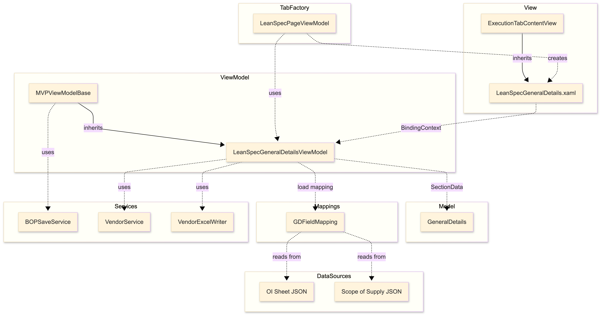

- Load source: `BOP.GeneralDetails`
- Save target: `BOP_Execution.json` → `GeneralDetails`
- Workbook: `TPE_Lean_Specification_R9_1.xlsm`
- Sheet: `ProjectData_A`
- Output: updated Lean Spec workbook.

#### `Required Docs` (P&ID docs)

**Technical (data + output-focused)**  
**[TODO: insert Required Docs technical image]**

- Creates `.../BOPExecution/LeanSpecs/Required Docs/`
- Copies PID folders (`PID301`, `PID303`, `PID310`, `PID314`) to output structure.

#### `Technical Requirements and Recommendations (TRR_M)`

**Technical (data + Excel/macro-focused)**  
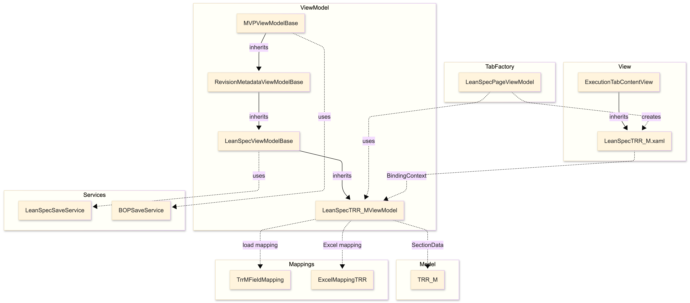

- Load: `BOP.LeanSpec.TRR_M`
- Save: `BOP_Execution.json` → `LeanSpec.TRR_M`
- Workbook: `TPE_Lean_Specification_R9_1.xlsm`
- Sheet/Macro: `TRR_M` / `TRR`

#### `Customer Input`

**Technical (data + Excel/macro-focused)**  
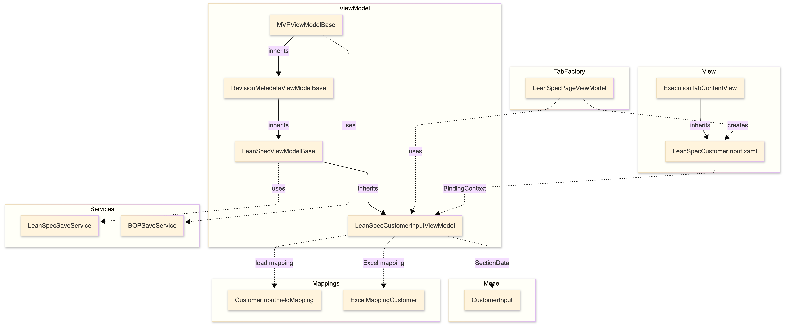

- Load: `BOP.LeanSpec.CustomerInput`
- Save: `BOP_Execution.json` → `LeanSpec.CustomerInput`
- Workbook: `TPE_Lean_Specification_R9_1.xlsm`
- Sheet/Macro: `Customer Input` / `CustomerInput`

#### `DOR of TG Train` (DOR)

**Technical (data + Excel/macro-focused)**  
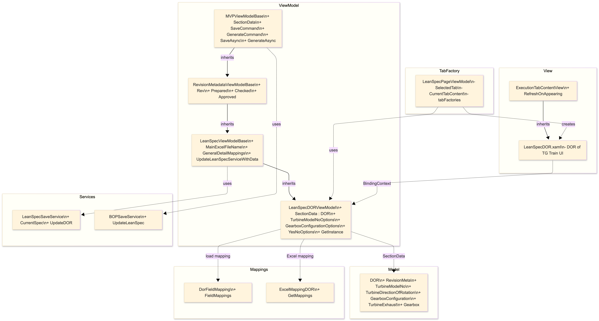

- Load: `BOP.LeanSpec.DOR`
- Save: `BOP_Execution.json` → `LeanSpec.DOR`
- Workbook: `TPE_Lean_Specification_R9_1.xlsm`
- Sheet/Macro: `DOR_F` / `DOR`

#### `Utility Requirments`

**Technical (data + Excel/macro-focused)**  
**[TODO: insert UTILITY-tech.png]**

- Load: `BOP.LeanSpec.UtilityRequirments`
- Save: `BOP_Execution.json` → `LeanSpec.UtilityRequirments`
- Workbook: `TPE_Lean_Specification_R9_1.xlsm`
- Sheet/Macro: `Utility Requirements` / `Print_Utility`

#### `Gearbox & Coupling` (PSCoupling)

**Technical (data + Excel/macro-focused)**  
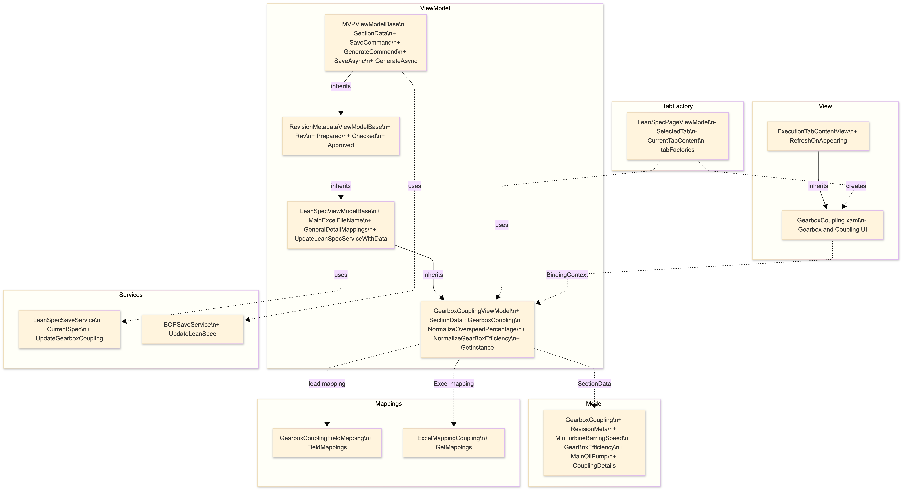

- Load: `BOP.LeanSpec.GearboxCoupling`
- Save: `BOP_Execution.json` → `LeanSpec.GearboxCoupling`
- Workbook: `TPE_Lean_Specification_R9_1.xlsm`
- Sheet/Macro:
  - `Coupling_E_Type1` / `Print_Couplings`
  - `Gearbox_G` / `GB`

#### `Gland Steam Condenser` (PSGSC)

**Technical (data + Excel/macro-focused)**  
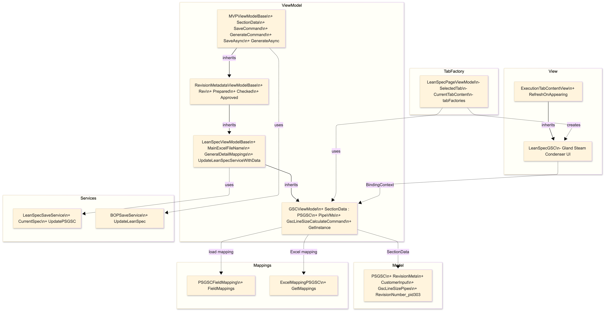

- Load: `BOP.LeanSpec.PSGSC`
- Save: `BOP_Execution.json` → `LeanSpec.PSGSC`
- Workbook: `TPE_Lean_Specification_R9_1.xlsm`
- Sheet/Macro: `GSC_C` / `GSC`

#### `LOS MVP` (PSLOS)

**Technical (data + Excel/macro-focused)**  
**[TODO: insert LOS-tech.png]**

- Load: `BOP.LeanSpec.PSLOS`
- Save: `BOP_Execution.json` → `LeanSpec.PSLOS`
- Workbook: `Lube_Oil_BoP-Exec_v7.xlsm`
- Sheet/Macro: `App_Input` / `GENERATE`
- Conditional mapping logic differs for `PHE` vs `Shell&Tube`.

#### `Line Sizing` (HMBD line sizing)

**Technical (Excel + AutoCAD output-focused)**  
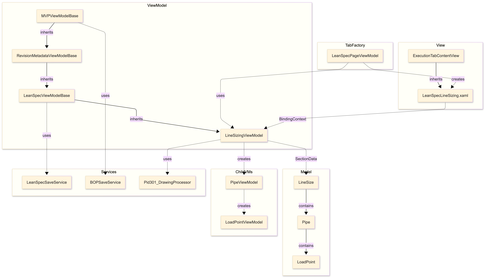

- Load: `BOP_Execution.json` → `LeanSpec.LineSize` (fallback to `linesize.json`)
- Save: `BOP_Execution.json` → `LeanSpec.LineSize`
- Workbook: `TPE_Lean_Specification_R9_1.xlsm`
- Sheets: `Line size_Input`, `Line size_Output`
- Generate output:
  - DWG via AutoCAD automation
  - PDF generated in background after DWG save

### Electric

#### `Alternator` 

**Technical**  
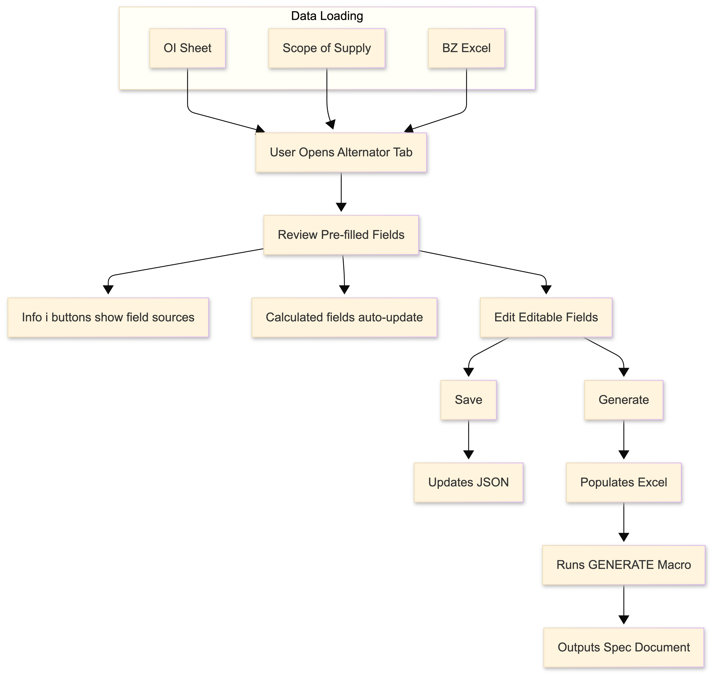

- Load: `BOP.Electric.Alternator`
- Save: `BOP_Execution.json` → `Electric.Alternator`
- Workbook/Sheet/Macro: `PS_Alternator_v5_2.xlsm` / `Input Sheet` / `GENERATE`

---

#### `AVR` (Automatic Voltage Regulator)

**Technical**  
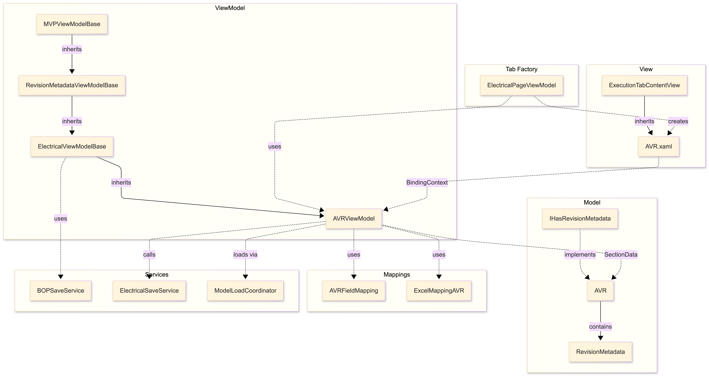

- Load: `BOP.Electric.AVR`
- Save: `BOP_Execution.json` → `Electric.AVR`
- Workbook/Sheet/Macro: `AVR_Spec_Automation_Tool_v3.xlsm` / `Input Sheet` / `Button6_Click`

#### `LT Motor`

**Technical**  
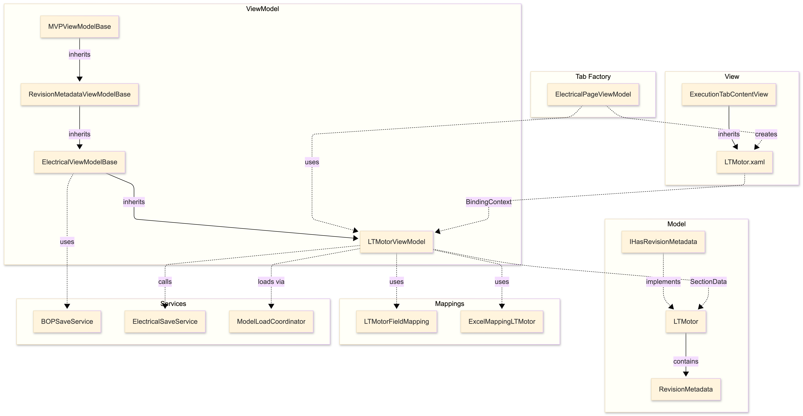

- Load: `BOP.Electric.LTMotor`
- Save: `BOP_Execution.json` → `Electric.LTMotor`
- Workbook/Sheet/Macro: `LT_Motor_Spec_v5_1.xlsm` / `Input Sheet` / `GENERATE`

#### `SLD Calculators` (CT / PT / NGR / NGT)

**Technical**  
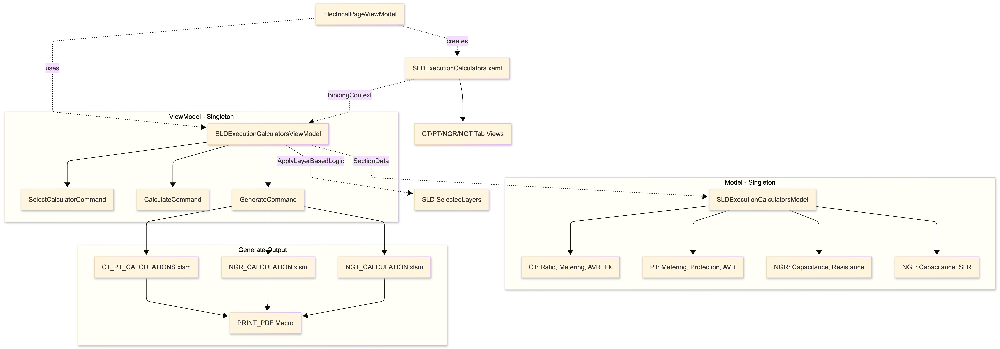

- Intermediate save: `.../Auxiliaries/AuxilaryInputs/SLDCalculators.json`
- Outputs generated from calculator templates using Excel macros:
  - `CT_PT_CALCULATIONS.xlsm` (`PRINT_PDF`)
  - `NGR_CALCULATION.xlsm` (`Print_PDF`) when applicable
  - `NGT_CALCULATION.xlsm` (`Button2_Click`) when applicable

#### `SLD Execution`

**Technical**  
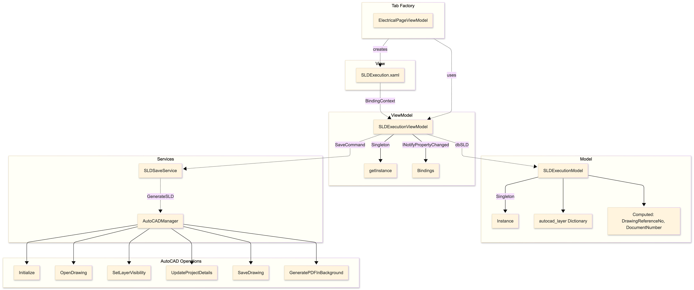

- Intermediate save: `Auxiliaries/AuxilaryInputs/Sld.json`
- Generate via AutoCAD automation with layer visibility logic
- Output: SLD DWG + PDF in SLD destination folder

#### `Control Panel Layout` (CPL)

**Technical**  
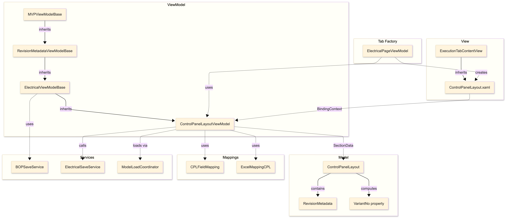

- Load: `BOP.Electric.ControlPanelLayout`
- Save: `BOP_Execution.json` → `Electric.ControlPanelLayout`
- Workbook/Sheet/Macro: `Control Panel Layout v2.xlsm` / `CPL` / `Run_all_CPL`

#### `Local Push Button System` (LPBS)

**Technical**  
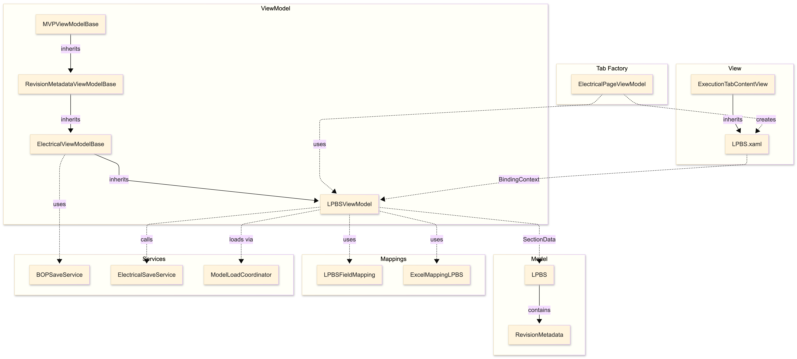

- Load: `BOP.Electric.LPBS`
- Save: `BOP_Execution.json` → `Electric.LPBS`
- Workbook/Sheet/Macro: `Local Push Button System v1.xlsm` / `LPBS` / `Run_all_LPBS`

#### `Power Cable Schedule` (Power Cable)

**Technical**  
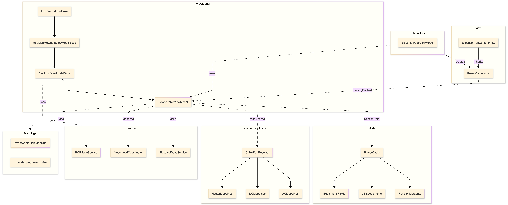

- Load: `BOP.Electric.PowerCable`
- Save: `BOP_Execution.json` → `Electric.PowerCable`
- Workbook/Sheet/Macro: `POWER CABLE SCHEDULE_23-01-2026.xlsm` / `Ip Sheet` / `GENERATE`
- Uses resolver services (e.g., cable run + barring gear mappings).

#### `Control cable`

**Technical**  
**[TODO: insert ControlCable-tech.png]**

- Load: `BOP.Electric.ControlCable`
- Save: `BOP_Execution.json` → `Electric.ControlCable`
- Current code caveat: `MainExcelFileName` and `SheetMacroPairs` are empty in `ControlCableViewModel` (template/macro wiring should be finalized).

### MECH

#### `Valve Schedule` (ValveSchedule)

**Technical (data + Excel/macro-focused)**  
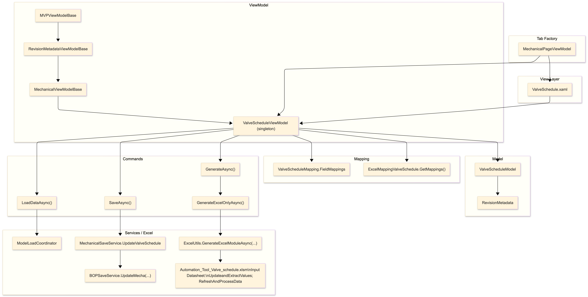

- Load: `BOP.Mecha.ValveScheduleModel`
- Save: `BOP_Execution.json` → `Mecha.ValveScheduleModel`
- Workbook: `Automation_Tool_Valve_schedule.xlsm`
- Sheet: `Input Datasheet`
- Macros:
  - `UpdateandExtractValues.UpdateandExtractValues`
  - `RefreshAndProcessData`
- Output folder: `.../BOPExecution/Mechanical/ValveSchedule/`

#### `Specialty Schedule` (SpecialtySchedule)

**Technical (data + Excel/macro-focused)**  
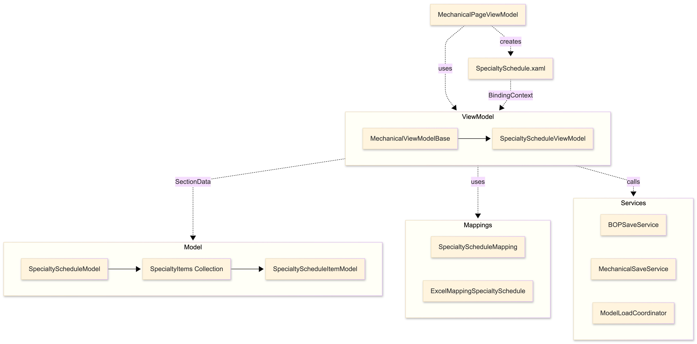

- Load: `BOP.Mecha.SpecialtyScheduleModel`
- Save: `BOP_Execution.json` → `Mecha.SpecialtyScheduleModel`
- Workbook: `Automation_tool_Specialty_Schedule_v2.xlsm`
- Sheet: `Input Datasheet`
- Macro: `Button11_Click`
- Dynamic table export logic:
  - starts at row `46`
  - skips rows `47, 52, 58, 62`
  - maps item columns to sheet columns (`C` body material, `D` medium, `E` scope, `F` size)
- Output folder: `.../BOPExecution/Mechanical/SpecialtySchedule/`