<div align="center">

<br/>


<br/><br/>

<p>
  
  &nbsp;
  
</p>

<h3><em> Documentation & Design Automation for SST-200 Back-Pressure Turbines</em></h3>

<br/>

<p>
  <a href="https://microsoft.com">
    
  </a>&nbsp;
  <a href="https://dotnet.microsoft.com/en-us/apps/maui">
    
  </a>&nbsp;
  <a href="https://visualstudio.microsoft.com/">
    
  </a>&nbsp;
  
</p>

<br/>

> **Ignite-X** unifies all stakeholders on a single platform, automating the complete SST-200 turbine value chain — from proposal creation to full engineering execution — at the click of a button.

<br/>

</div>

---

## Table of Contents

<details open>
<summary><strong> Expand / Collapse Navigation</strong></summary>

| # | Section |
|---|---------|
| 1 | [Overview](#-overview) |
| 2 | [What Problem It Solves](#-what-problem-it-solves) |
| 3 | [Key Components](#-key-components) |
| 4 | [Module Descriptions](#-module-descriptions) |
| 5 | [Documentation Structure](#-documentation-structure-engineer-focused) |
| 6 | [User Manual](#-user-manual) |
| 7 | [Advanced Features](#-advanced-features) |
| 8 | [Network Server & Admin Panel](#-network-server--admin-panel) |
| 9 | [Getting Started — Developers](#-getting-started--developers) |
| 10 | [Architecture — Navigation Through Code](#-architecture) |
| 11 | [Architecture — MVVM Deep-Dive & Dashboard](#mvvm-deep-dive--dashboard-homepage-breakdown) |
| 12 | [Thermal Calculation Documentation](#thermal-calculation-documentation--turbine-design) |

</details>

---

## Overview

### 1.1 Purpose and Scope

**Ignite-X** is a robust, reliable application designed to streamline the end-to-end value chain for **SST-200 back-pressure turbine units**. It enables rapid, consistent creation of HMBD documentation, technical annexures, drawings, specifications, and related deliverables — improving efficiency and speed across both proposal and execution phases.

---

---

## What Problem It Solves

The SST-200 turbine documentation and design process has traditionally been fragmented, time-consuming, and error-prone. Engineers across proposal, thermal design, auxiliaries, and execution teams work in isolated tools and documents, manually copying data between files and coordinating through emails and shared drives. A single project can require dozens of interdependent documents — HMBD diagrams, Turba files, Kreisl templates, P&IDs, SLDs, technical annexures, and execution packages — all of which must stay consistent with each other throughout the project lifecycle.

Ignite-X brings all stakeholders onto a single platform, allowing them to perform their tasks in one place. By automating repetitive manual activities — such as copying data across documents and triggering follow-on tasks — it eliminates mundane work, reduces effort, and accelerates delivery. Users can generate complete turbine and execution documentation at the click of a button, significantly reducing turnaround time (TAT) for customers while enabling teams to focus on higher-value activities.

**Core problems Ignite-X addresses:**

- **Manual data copying** — Steam parameters, scope values, and vendor data entered once in the Scope of Supply are automatically propagated to all downstream documents including P&IDs, SLDs, TG Hall layouts, Turba files, and Technical Annexures.
- **Inconsistent revisions** — Revision tracking and automatic change highlighting are built directly into the document generation workflow, making it easy to identify what changed between versions.
- **Delayed proposals** — The full turbine proposal package, including BZ Thermal, BZ Auxiliary, and all engineering annexures, is generated in minutes rather than days.
- **Coordination overhead** — The Handover feature transfers projects from the Proposal team to the Execution team within the same platform, eliminating email hand-offs and version confusion.
- **Version mismatch risk** — A centralised Scope of Supply acts as the single source of truth, automatically propagating values to all linked sections so no document falls out of sync.
- **Siloed workflows** — All departments — Thermal Design, Auxiliaries, Steam Path, Casing & Valves, and Execution — work inside the same system, with real-time visibility of project status and progress.

---

---

## Key Components

```
⚡ Ignite-X
│
├── 📁 Proposal
│   ├── Thermal – Turbine Design
│   ├── Auxiliary
│   └── BZ File
│
├── 📁 Engineering Execution
│   ├── Calculations
│   │   ├── Interdepartmental Files
│   │   └── Thermal Toolchain
│   ├── Steam Path
│   │   ├── Balancing Datasheet
│   │   ├── Turbine Nameplate
│   │   ├── HP/LP Radial Flow
│   │   ├── Flow Path Clearance
│   │   └── Assembly Protocol
│   └── Casing and Valves
│       ├── Cross-Section
│       ├── General Arrangement
│       ├── Control Book
│       ├── Hydrotest Protocol
│       ├── Loose Supply
│       ├── Control Valve
│       └── Sectional Drawing
│
└── 📁 BoP Execution
    ├── Lean Spec
    │   ├── General Details
    │   ├── Required Docs
    │   ├── Technical Requirements and Recommendations (TRR_M)
    │   ├── Customer Input
    │   ├── DOR of TG Train
    │   ├── Utility Requirments
    │   ├── Gearbox & Coupling
    │   ├── Gland Steam Condenser (PSGSC)
    │   ├── LOS MVP (PSLOS)
    │   └── Line Sizing
    │
    ├── Electric
    │   ├── Alternator
    │   ├── AVR
    │   ├── LT motor spec
    │   ├── SLD Calculators
    │   ├── SLD
    │   ├── Control Panel Layout (CPL)
    │   ├── LPBS
    │   ├── Power cable schedule
    │   └── Control cable
    │
    └── MECH
        ├── Valve Schedule
        └── Specialty Schedule
```

---

## Module Descriptions

### Thermal Proposal

> **Input:** Steam parameters
> **Output:** HMBD, Turba files, Kreisl files, BZ thermal data, log files

- Provides the ability to create revisions for each project with updated steam parameters, ensuring flexibility, easy tracking, and efficient version management.
- Proposals can be generated for multiple steam parameter sets.
- Supports creation of proposals for SST-200 1GBC Back Pressure variants including Standard, Executed, and Custom Flow Paths.
- **Advanced Design Mode** — Enhanced admin controls and specialised functionality for higher efficiency.
- **File Accessibility Features** — Integrated web view for file previews and direct File Explorer access.
- Provides functionality to hand over the project to the Execution team.

---

### Calculation

> **Input:** Turba files, BZ File
> **Output:** Interdepartmental files, Thermal Toolchain results

- Facilitates generation of interdepartmental files and the Thermal Toolchain.
- Displays both input and output files for easy reference.
- Provides visibility of project specifications.
- Includes functionality to edit steam parameters, create revisions, and generate turbine proposals.
- Provides functionality to release the project to the Steam Path, Casing, and Valves teams.

---

### Steam Path

> **Input:** Interdepartmental files, Turba files, BZ File
> **Output:** Assembly protocol, balancing datasheet, flow path clearance, HP/LP drawings, nameplate files

- Automates the creation of AutoCAD files and engineering documents.
- Provides visibility of project documentation and specifications.
- Provision to generate documents individually using custom inputs, or all at once using default parameters.

---

### Casing and Valves

> **Input:** Interdepartmental files, Turba files, BZ File
> **Output:** Cross-Section, General Arrangement, Control Book, Hydrotest Protocol, Loose Supply, Control Valve, Sectional Drawing

- Automates the creation of AutoCAD files and engineering documents.
- Provides visibility of project documentation and specifications.
- Flexible individual or batch document generation.

---

### BOP Proposal

> **Input:** User-provided data
> **Output:** Technical Annexure, SLD, P&ID (301, 303, 310, 314), TG Hall Layout, Control Oil Piping Layout, BZ Auxiliary documents

- Facilitates the creation of comprehensive offer packages with the following capabilities:
- Supports generation of proposals for auxiliaries in both Standard and Custom cases.
- Allows creation of revisions for each project, ensuring easy updates and version tracking.
- Provides integrated output options with both AutoCAD drawings and PDF documents.
- Includes a **Save Intermediate** functionality, enabling users to seamlessly resume work from where they left off.
- Offers auto-suggestions to improve accuracy, speed, and overall user experience.

---

## Documentation Structure (Engineer-Focused)

<details>
<summary><strong>1. Overview</strong></summary>

- **1.1 Purpose and Scope** — Define the goals, limitations, and extent of the Ignite-X system.
- **1.2 Audience and Reading Guide** — Specify the intended readers: engineers, developers, testers, and managers, and provide guidance on how to navigate the document.
- **1.3 High-Level Features and Non-Goals** — Summarise key system capabilities and explicitly state what is out of scope to avoid confusion.

</details>

<details>
<summary><strong>2. Getting Started (Developers)</strong></summary>

- **2.1 Prerequisites and Tooling** — Development environment setup: required IDEs, SDKs, libraries, and versions.
- **2.2 Clone, Build, Run** — Step-by-step instructions to get the system running locally.
- **2.3 Debugging Tips and Common Build Issues** — Troubleshooting guides and typical problem resolutions.

</details>

<details>
<summary><strong>3. Architecture</strong></summary>

- **3.1 MVVM Overview and Rationale** — Explain why the MVVM pattern is used and its benefits in this context.
- **3.2 Layered Architecture (UI, ViewModels, Data)** — Describe separation of concerns and the responsibilities of each layer.
- **3.3 Navigation Through Code** *(Priority 1)*
- **3.4 Dependency Injection and Configuration (`MauiProgram.cs`)** — Describe DI patterns and modular configuration.

</details>

<details>
<summary><strong>4. Project Structure</strong></summary>

- **4.1 Solution Layout and Naming Conventions** — Define folder structures and coding standards to maintain consistency.
- **4.2 Folders**
  - `Pages/` — Views (XAML)
  - `ViewModels/` — Business logic and data binding
  - `Models/` — Business entities
  - `Services/` — Application services
  - `Repositories/` — Data access layer
  - `Components/` — Reusable UI controls
  - `Resources/` — Styles, themes, images, fonts
  - `Platforms/` — Platform-specific code
- **4.3 Resource Management** — Guidelines for managing UI resources and assets.

</details>

<details>
<summary><strong>5. Data and State</strong></summary>

- **5.1 Data Flow in MVVM (Bindings, Commands)** *(Priority 2)* — Illustrate how data propagates through the app using MVVM binding techniques.
- **5.2 Local Storage (CSV Files, Folders)** — Handling local data persistence, file formats, and organisation.
- **5.3 Model Dispose Rules** — Memory and resource management practices.

</details>

<details>
<summary><strong>6. UI/UX and Accessibility</strong></summary>

- **6.1 Navigation Map (Screens and Flows)** *(Priority 1)* — Visual diagrams and descriptions of user flows.
- **6.2 Reusable Controls/Components and Styling Guidelines** — Design principles, component catalogue, and theming conventions.

</details>

<details>
<summary><strong>7. Error Handling, Logging, and Telemetry</strong></summary>

- **7.1 Global Exception Handling Approach** — Strategy for catching and managing exceptions gracefully.
- **7.2 Logging Categories and Correlation IDs** — Log organisation for monitoring and debugging.
- **7.3 Metrics/Events and Dashboards** — Telemetry practices and usage of observability tools.

</details>

<details>
<summary><strong>8. Testing Strategy</strong></summary>

- **8.1 Test Data, Fixtures, and Coverage Targets** — Testing methodologies, test suite organisation, and quality metrics.

</details>

---

<details>
<summary><strong> Module Section Template (Dashboard Format)</strong></summary>

Each module should be documented using the following structure:

**Key Functionality**

- Inputs: User data entry points and external data feeds.
- Prerequisites: Dependencies and initial setup required.
- Database (DB): Schemas used and key tables relevant to the module.
- External Libraries Used: Third-party tools and libraries integrated.
- Logic:
  - **Frontend:** UI behaviours and interaction logic.
  - **ViewModels and Bindings:** Binding logic managing presentation and data synchronisation.
  - **Data Models:** Structures representing business entities.
  - **Business Logic:** Rules and data transformations executed.

*This structure is defined using the Dashboard module as the reference. All subsequent modules — Sales, Thermal Proposal, Calculation, Steam Path, Casing and Valves, BOP Proposal — should follow the same format.*

</details>

---

## User Manual

### Step 1 — How to Run the Ignite-X Executable

| Step | Action |
|------|--------|
| **1** | **Locate the Shared Drive** — Access the shared drive containing `Ignite-X_Release_5_01_2026.zip`. |
| **2** | **Download the Application** — Download and extract the folder. |
| **3** | **Create the testDir Folder** — Create the directory `C:\testDir` on your C drive. |
| **4** | **Run Ignite-X.exe** — Locate `Ignite-X.exe` in the downloaded directory and double-click to launch. |
| **5** | **Landing Page** — The Dashboard will open automatically after the application launches. |


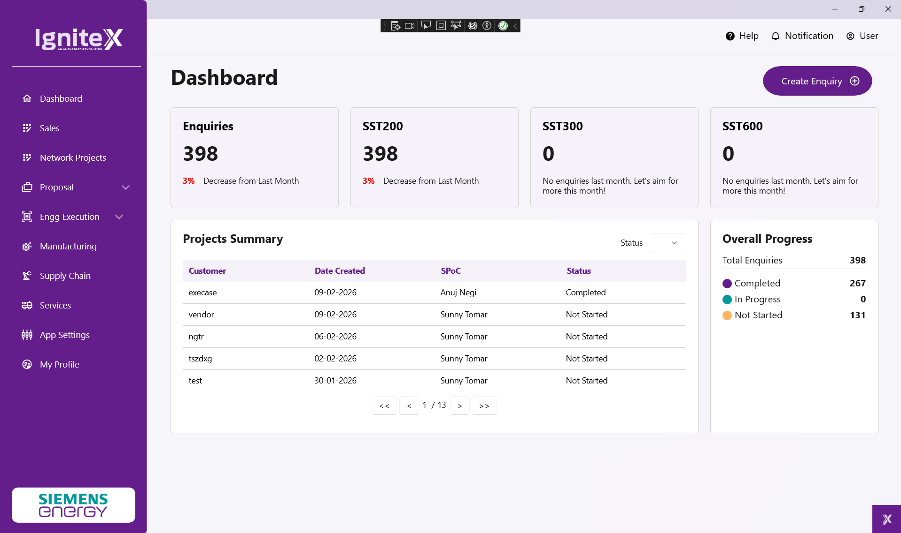

---

### Step 2 — Create an Enquiry

- Locate the **Create Enquiry** button on the Dashboard.
- Click the button to proceed.
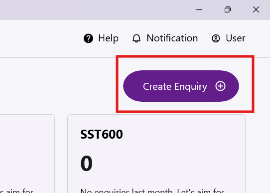
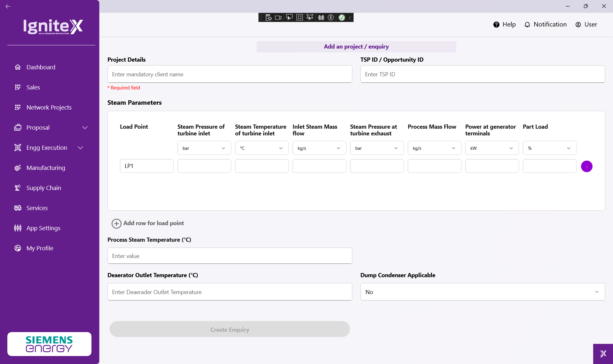

**Sample Input Values**

| Project | Steam Pressure | Steam Temperature | Steam Mass Flow | Exhaust Pressure |
|---------|---------------|-------------------|-----------------|------------------|
| Project Name 1 | 42.981 | 440 | 8.93 | 4.59 |
| Project Name 2 | 62.743 | 480 | 10.579 | 4.59 |
| Project Name 3 | 41.910 | 495.01 | 6.83 | 4.903 |

---

### Step 3 — Navigate to Turbine Design

- Access the **left sidebar**.
- Click the **dropdown arrow** next to **Proposal** to expand the submenu.
	
- From the expanded submenu, click **Turbine Design**.
	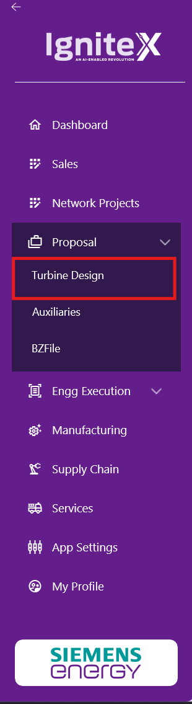

---

### Step 4 — Turbine Design Page

Once the Turbine Design page is open:

1. Click the **Load Enquiry** button to load your previously created enquiry.
	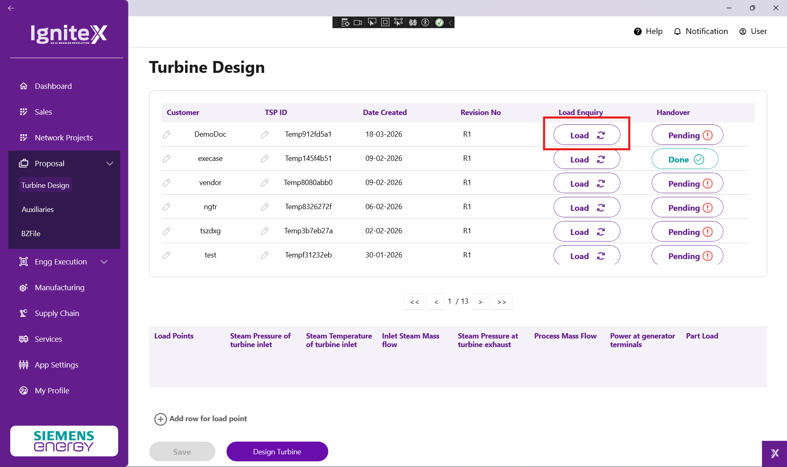
	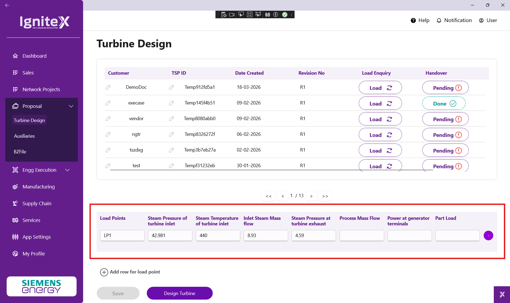
2. After the enquiry loads, click the **Design Turbine** button.
	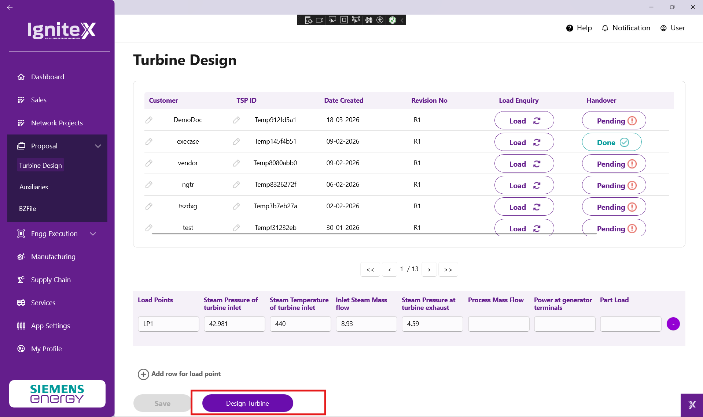

3. On the next screen, click the **Start** button to begin the turbine design process.
	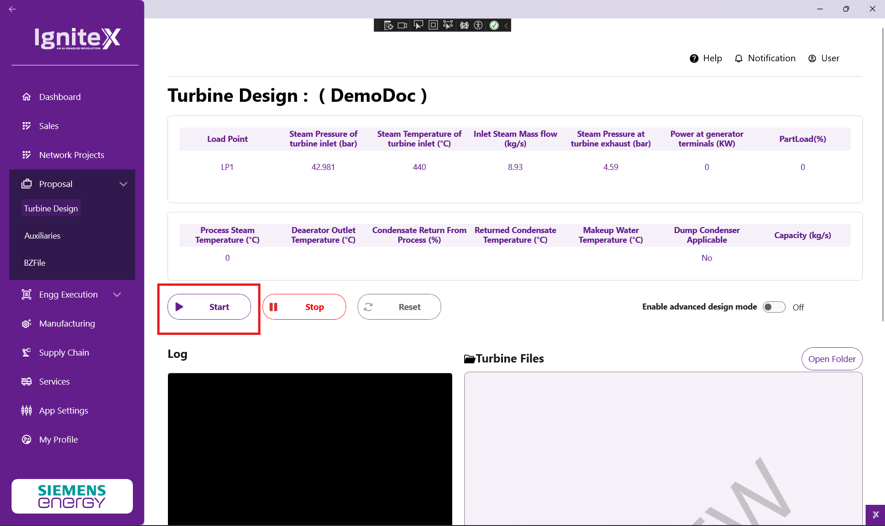
4. Once the process completes, the generated files will appear in the **Turbine Files** section below.
	


---

### Step 5 — Navigate to Auxiliary

- Access the **left sidebar**.
- Expand the **Proposal** submenu.
- Click **Auxiliaries**.
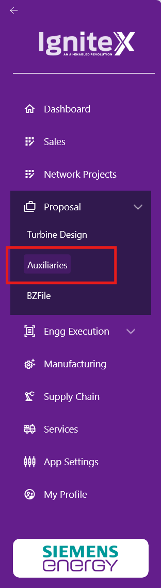

---

### Step 6 — Load the Project

In the **Auxiliaries** section:

- A list of available projects will be displayed.
- Locate your desired project and click the **Load** button before running the Balance of Plant (BOP).
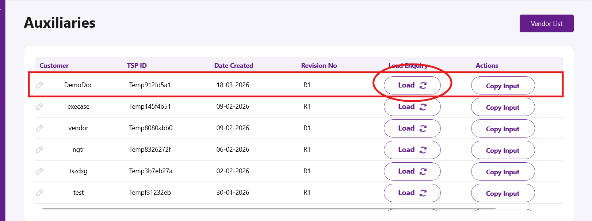

---

### Step 7 — Access the Scope of Supply Page

- You will see input and output folders for the project.
- Click on **Scope of Supply** under *Select Project Detail* to open the Scope of Supply interface.
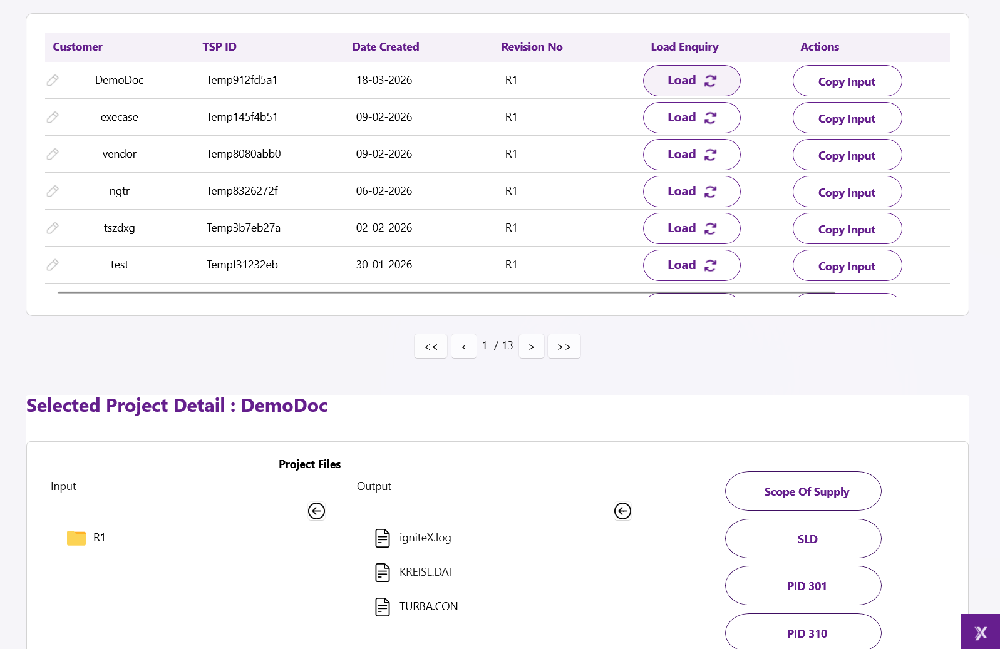
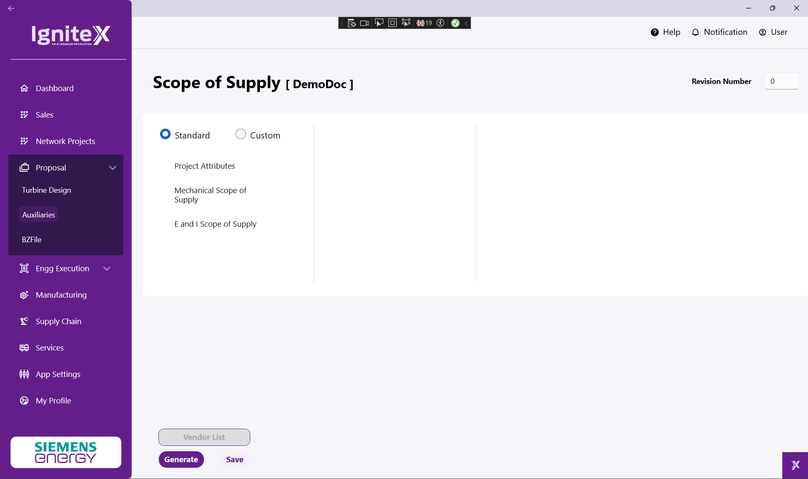

---

### Step 8 — Choose Supply Type: Standard or Custom

| Mode | Description |
|------|-------------|
| **Standard** | Some values are pre-set by default (hidden from the user). Fields that are not default must be filled in manually. |
| **Custom** | All values must be filled in by the user. |

---

### Step 9 — Working with Standard Scope of Supply

1. Select the **Revision Number**.
2. Choose the **Project Attributes** and fill in the necessary project details.

---

### Step 10 — Fill Scope Details (Sequentially)

Complete the following sections one after the other:

1. **Mechanical Scope of Supply**
2. **Electrical & Instrumentation (E&I) Scope of Supply**

>  **Note:** Some scopes will already have default values set. In such cases, a pop-up will appear informing you of these defaults.

---

### Step 11 — Generate the Document

Once all mandatory fields are filled:

- Click **Generate** to create the Scope of Supply document.

>  **Output Location:**
> ```
> C:\testDir\TurbineNumber_ProjectName\R1\Auxiliaries
> ```

---

### Step 12 — Working with Custom Scope of Supply

The process is similar to Standard, with the following additional considerations:

- Certain sections (e.g., *Piping Valves and Accessories*) will display a pop-up when you select **YES** for specific fields.
- In these pop-ups, replace **Size**, **Class**, and **Material** with the appropriate values.
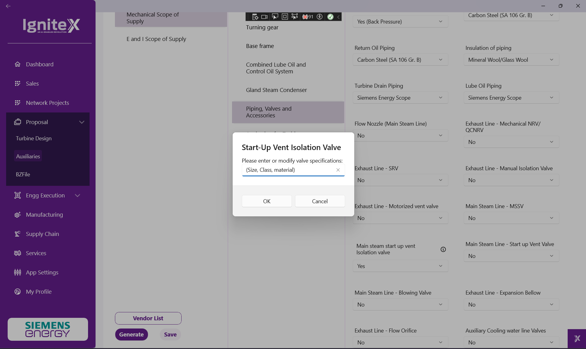
---

### Step 13 — Handling Specific Pop-Ups

For specific items such as HT/LT Power Cable:

- Selecting an option will trigger a pop-up window.
- Fill in the values carefully using the specified format as per the guidelines.
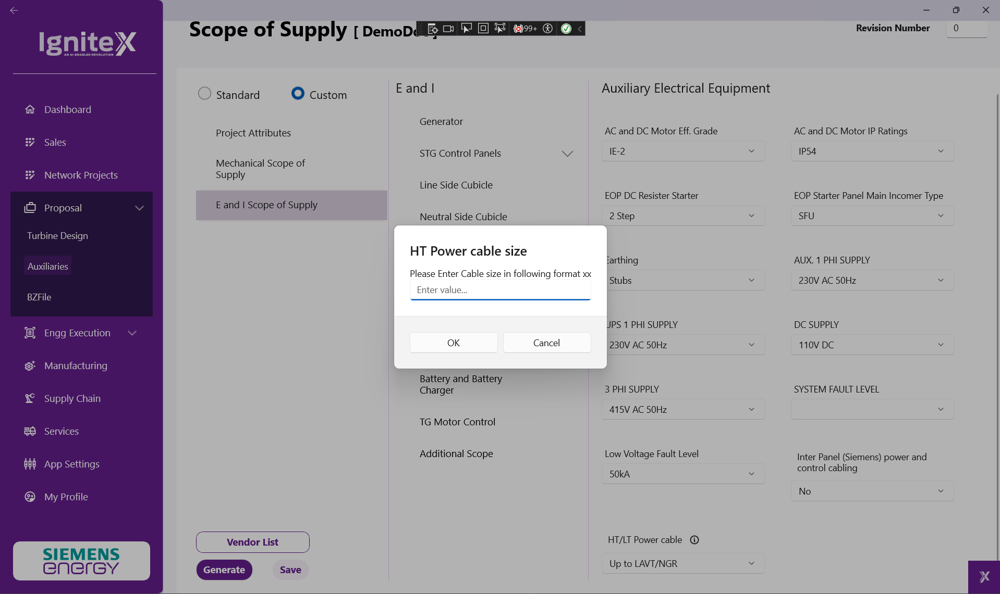


---

### Step 14 — Save Your Progress

- Use the **Save** feature to store your progress.
- If you reload the project later, all previously filled fields will be retained.

---

### Step 15 — Sharing BoP Saved Input Files

1. Navigate to `testDir`, then open the desired project folder — you will see the **Auxiliaries** folder.
	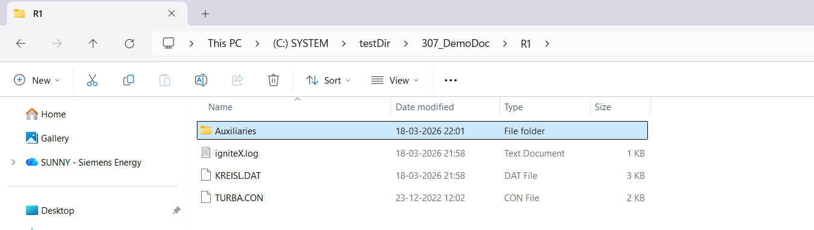
2. Copy the folder and share it with another machine or desktop.
3. On the receiving machine, create a new enquiry using the **same project name** as in the copied data.
4. Paste the shared folder into the newly created folder at the corresponding location.
	
5. Load the project via **IgniteX → Proposal → Auxiliary**.

---

### Step 16 — Interlinkages from Scope of Supply

- The Scope of Supply is the primary location where important project details are entered first.
- Values entered here will automatically populate all related sections — such as P&IDs and Auxiliaries — after clicking the **Save Intermediate** button.
	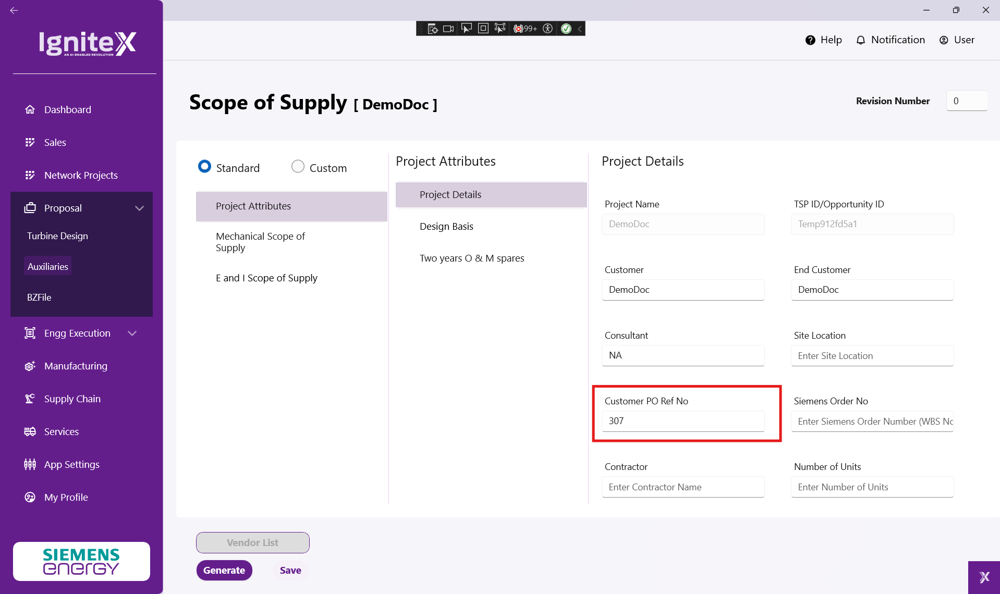 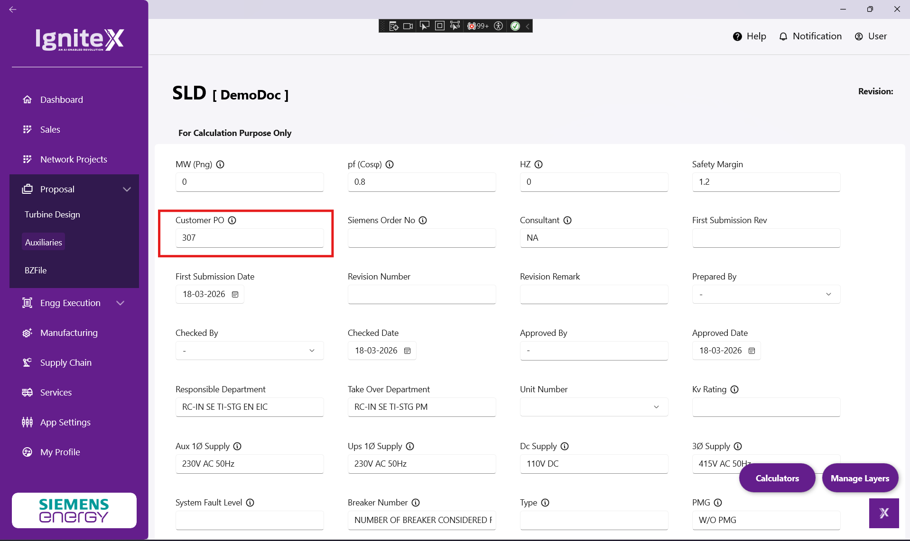

**Default Values**

- In the Standard flow, some fields are pre-filled by default.
- Default values only appear after the **first Intermediate Save** in the Scope of Supply.
- Before saving, no default values will appear in the P&IDs or other sections.
- These default values are set by the system but can be changed as needed to match your project requirements.

> ℹ **Note:** Values that flow from the Scope of Supply can only be edited from the Scope of Supply page itself.

**Page Linking from Scope of Supply**

Certain fields in the **PID**, **SLD**, and **TG Hall Layout** sections are linked directly to values in the Scope of Supply page. To make editing these linked fields easier, an  information icon (i) now appears next to each of these fields, providing quick access to their source location.

**Identifying Linked Fields**

Look for the information icon (i) icon next to field names in the following sections:

- PID fields
- SLD (Single Line Diagram) fields
- TG Hall Layout fields

**How to Edit Linked Fields**

| Step | Action                                                                       |
| ---- | ---------------------------------------------------------------------------- |
| 1    | Click the (i) icon next to the field you want to modify.                     |
| 2    | A pop-up will appear showing the field's location in the Scope of Supply.    |
| 3    | Click **Open Scope Page** to navigate directly to that field.                |
| 4    | Edit the field value as needed.                                              |
| 5    | Click **Save** to save your changes.                                         |
| 6    | Click **Back** to return to the previous page (PID, SLD, or TG Hall Layout). |
| 7    | The updated value will now be automatically reflected in the linked field.   |

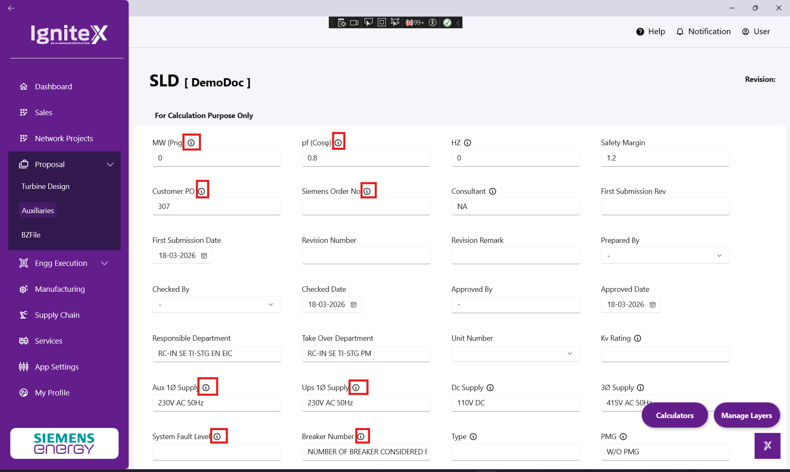
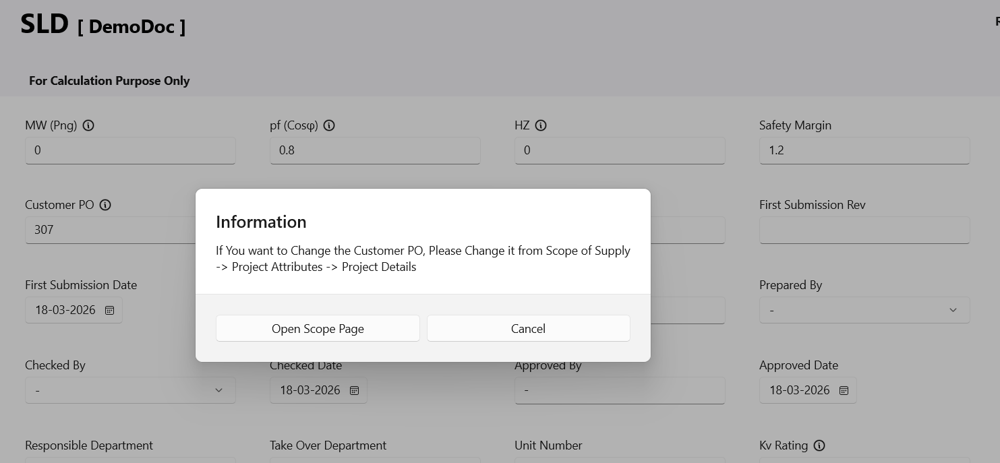

**Benefits**

- No need to manually navigate between pages to edit linked fields.
- Changes are immediately reflected across all linked locations.
- Reduces errors from manual updates by keeping values synchronized.

---

---

## Advanced Features

### 17 — PDF Generation Feature

The Auxiliary module now automatically generates PDF versions of all output files alongside standard formats, providing better compatibility and flexibility without any extra effort required from users.

**How It Works**

| File Type | Behaviour |
|-----------|-----------|
| **TA Files** | Both the Word document and PDF are created simultaneously. You can access either format as soon as generation completes. |
| **PID Files** | The `.dwg` file becomes available immediately. You can begin working while the PDF is generated automatically in the background. |

>  **Important Precaution:** When generating PID files, do not close AutoCAD or interrupt the process while the PDF is being plotted. Closing the application or interrupting the operation may prevent the PDF from being created successfully. Allow the background process to complete uninterrupted.

---

### 18 — Generate All Button

Previously, each module in the Auxiliary section had separate **Generate** and **Save** buttons. Now, a single **Generate All** button allows you to generate all documents from all modules in one action, streamlining your workflow.

**Requirements Before Use**

- Ensure the **Scope of Supply** input fields are fully completed and saved. Without completing this step, the generated documents may be incomplete, as the Scope of Supply feeds into all module outputs.

**Important Notes During Generation**

- Do not interrupt AutoCAD or Word while the generation process is running.
- If you encounter any issues, simply click **Generate All** again to retry.
- Allow the entire process to complete uninterrupted for best results.
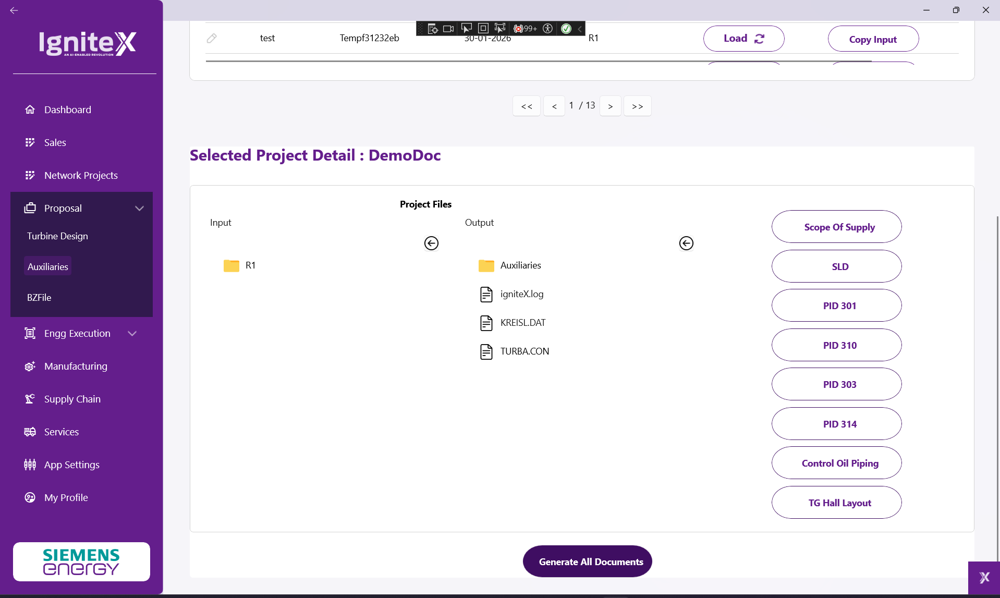
---

### 19 — Copy Project Feature

The **Copy Project** feature allows you to quickly replicate proposal inputs from an existing project to a new one, eliminating the need to re-enter all information from scratch. This is especially useful when creating similar proposals based on previous projects.

**What Gets Copied**

- Only Auxiliary module files (proposal inputs) are copied to ensure data accuracy.
- The Vendor List is **not** copied due to potential modifications — it will be automatically fetched from the network drive when you click **Load**.

**What Does NOT Get Copied**

- Output files (TA, PID documents) cannot be copied as they contain references to the previous project name. You will need to regenerate them or use the **Generate All** button to create fresh output files for the new project.

**How to Use**

| Step | Action |
|------|--------|
| 1 | Create a fresh enquiry from the Sales page. |
| 2 | Navigate to the Auxiliary page, scroll right, and click **Copy Input**. |
| 3 | A modal window displays available projects. Only projects with a `ScopeOfSupply.json` file are selectable. |
| 4 | Select the source project and click **Confirm Copy**. |
| 5 | Modify inputs as needed, then click **Generate All** to produce new output files. |


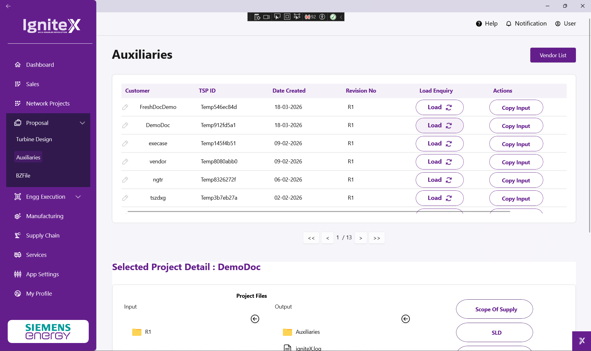
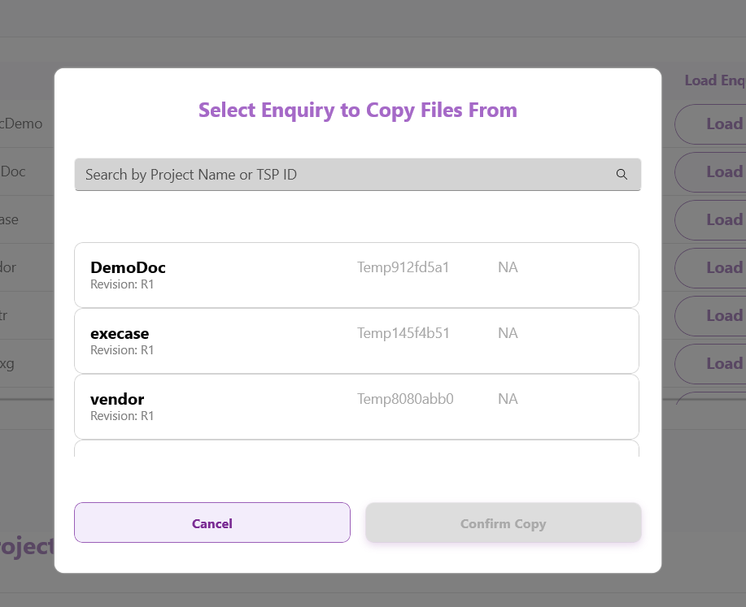
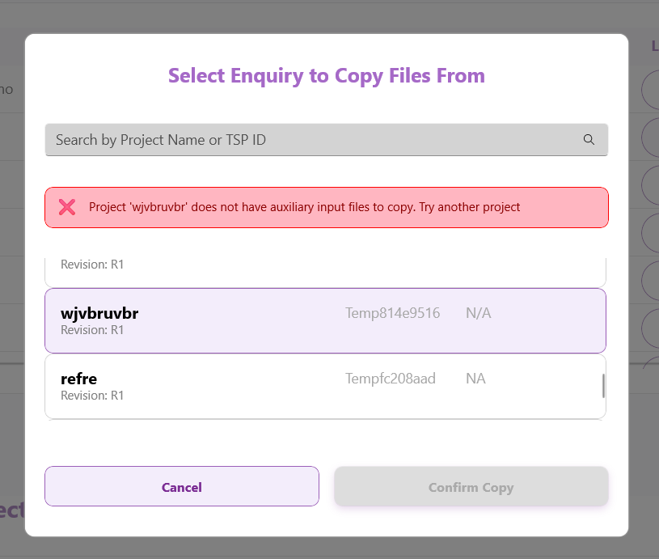
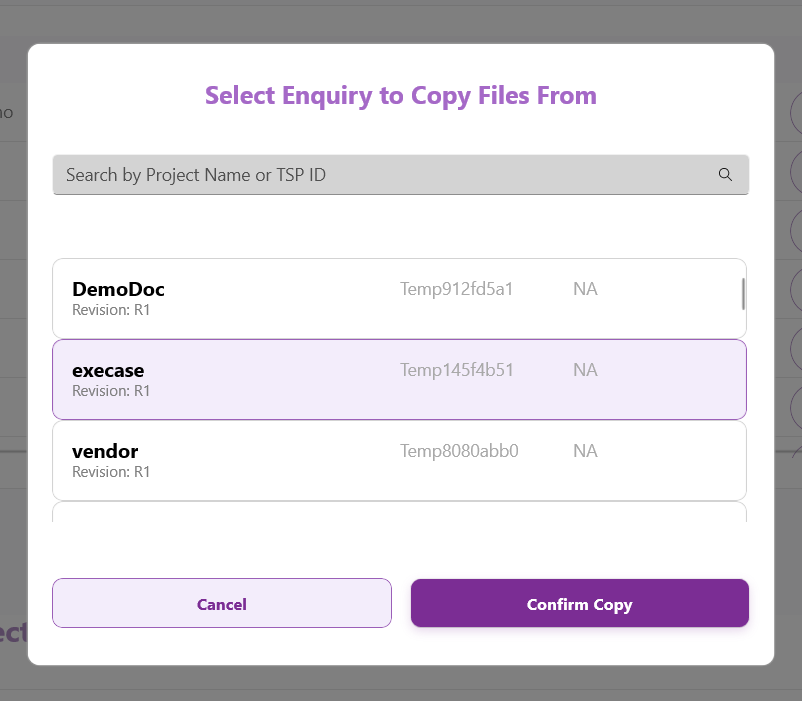


> ℹ **Important Notes:**
> - Only projects with `ScopeOfSupply.json` are selectable as source projects.
> - The Vendor List will be refreshed from the network drive when you click Load.
> - Always regenerate output files after copying to ensure they reflect your new project details.

---

### 20 — Additional Scope Option

The **Additional Scope** feature allows you to add custom sections to the Technical Annexure (TA) document.

> **Availability:** This feature is only available in **Custom Mode** for both Mechanical and E&I modules. It is not available in Standard Mode.

**Navigation**

| Project Type | Path |
|--------------|------|
| Mechanical | Mechanical Scope of Supply → Additional Scope |
| Electrical | E&I Scope of Supply → Additional Scope |

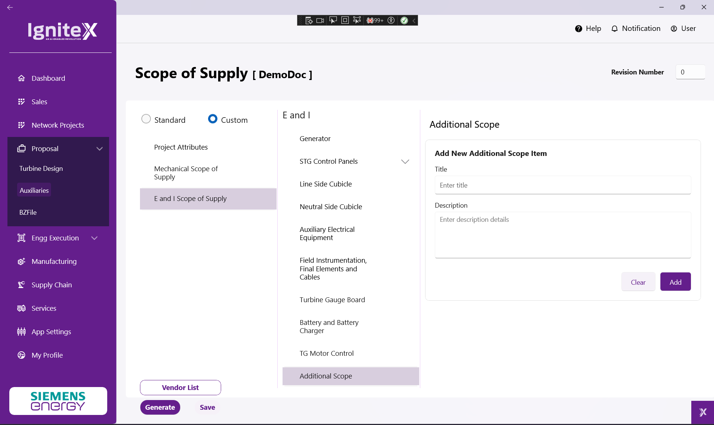

**Adding New Sections**

| Step | Action |
|------|--------|
| 1 | Enter a **Title** and a **Description** for the new section. |
| 2 | Click **Add** to include the item in your Technical Annexure. |
| 3 | Repeat Steps 1–2 for any additional sections required. |
| 4 | To modify an existing entry, click **Edit** and update the fields. |
| 5 | Generate the Technical Annexure — your new sections will appear automatically. |


> ℹ **Notes:** You can add as many sections as required. All custom sections will be reflected in the generated TA document.

---

### 21 — Text Highlighting in Technical Annexure with Revisions

The Technical Annexure (TA) now includes **automatic text highlighting** to track changes between document revisions, making it easy to identify modifications immediately.

**How It Works**

| Revision | Behaviour |
|----------|-----------|
| **First Revision** | Generated without any highlighting, as there is no previous version to compare against. |
| **Subsequent Revisions** | The system automatically compares the new version against the previous revision and highlights all changed text in the Word document. |

**Automatic Comparison**

- No extra effort is required — comparison and highlighting happen automatically.
- Simply change the revision number and generate the TA; the system detects and highlights all modifications.
- The document is automatically compared against the Revision 1 version.

>  **Notes:**
> - Text highlighting is processed in the background — wait a moment after generating before opening the document to ensure all highlights have been applied.
> - All changes from the previous revision will be clearly marked in the generated Word document.

---

### 22 — Project Reset Functionality

Your application supports two project modes: **Standard Mode** (limited fields) and **Custom Mode** (expanded options). The Project Reset feature allows you to switch between these modes.

**Mode Differences**

| Mode | Description |
|------|-------------|
| **Standard Mode** | A limited set of input fields for simpler project setup. |
| **Custom Mode** | Extended options and additional fields for more detailed project configuration. |

**Switching from Custom to Standard Mode**

| Step | Action |
|------|--------|
| 1 | A confirmation pop-up will appear warning you about data loss. |
| 2 | Review the warning carefully — switching to Standard Mode will permanently delete all custom project input data. |
| 3 | Confirm to proceed; the project will be reset to Standard Mode. |
| 4 | Only the standard fields will remain available in your project. |

**Switching from Standard to Custom Mode**

| Step | Action |
|------|--------|
| 1 | Your project switches to Custom Mode immediately. |
| 2 | All existing Standard Mode data is preserved and remains unchanged. |
| 3 | You can now access and fill in the additional Custom Mode fields. |
| 4 | Your Standard Mode data will remain intact until you click **Save** in Custom Mode. |
| 5 | Once saved in Custom Mode, your data configuration is finalised in the new mode. |

>  **Important Notes:**
> - Switching to Standard Mode **permanently deletes** all Custom Mode data. A confirmation pop-up will appear before this action.
> - Switching to Custom Mode preserves all existing Standard Mode data until you save.
> - Always save your work before switching modes to avoid losing unsaved changes.

---

### 23 — Vendor Management

Vendor management operates at two levels: **Master Level** (organisation-wide vendor database) and **Project Level** (project-specific vendor configurations). This two-tier approach allows you to maintain a centralised vendor list while customising vendors for individual projects.

**Master Vendor File**

>  **Location:**
> ```
> \\invadi7fla.ad101.siemens-energy.net\ai@stg\VendorListMasterfile\MasterVendorList.json
> ```

A purple button located at the top right of the screen — adjacent to the Auxiliary heading — provides access to Master Vendor management. This button is independent of project selection.
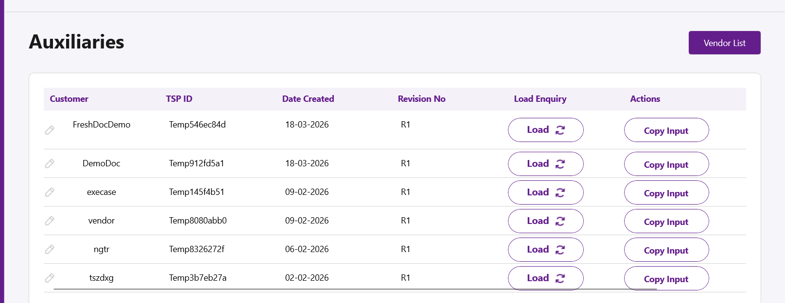

**Access Control**

| Role | Permissions |
|------|-------------|
| Unauthorised User | Receives a pop-up alert on access attempt. |
| Read-Only | Can view the current vendor list but cannot make changes. |
| Read/Write | Can edit and modify the vendor list. |

**Available Operations**

| Button | Function |
|--------|----------|
| **Refresh** | Updates the vendor list with the latest changes from the server. |
| **Save** | Saves your local changes to the server. |
| **Add Equipment** | Adds new equipment to the master list by entering a name and selecting a category. |
| **Add Vendor** | Adds a new vendor to a selected equipment entry. |
| **Remove** | Removes equipment entries or vendors from the list. |

**Data Management & History**

- The network drive maintains a complete backup history of all changes.
- The latest `MasterVendor.json` file records the name of the most recent modifier.
- New vendors and equipment can be added through the UI, or developers can directly modify the JSON file.

>  **Requirements:** You must be connected to the internet and have the appropriate access rights (read or read/write) to view or modify the master vendor list.

---

**Project Vendor File**

>  **Location:**
> ```
> testDir/{project_folder}/R1/Auxillaries/AuxiliaryInput/VendorList.json
> ```


> **Availability:** This feature is only available for **Custom Mode** projects. Standard Mode projects use the Master Vendor File directly.

**How It Works**

| Step | Action |
|------|--------|
| 1 | When you load a project from the Auxiliary page, a copy of the Master Vendor File is automatically saved to your project's local path (one-time operation). |
| 2 | Modify the local vendor list to suit your project requirements. |
| 3 | Make changes using **Add Equipment**, **Add Vendor**, or **Remove**. |
| 4 | Click **Save** to save changes to the local project vendor file. |
| 5 | Your project-specific changes will not affect the Master Vendor File on the network drive. |

**How to Add a New Vendor**

1. Open the **Vendor Page** and select the equipment for which you want to add a vendor.
2. Click the dropdown to view existing vendors.
3. Enter the name of the new vendor in the text box below the dropdown.
4. Click **Add**, then click **Save** to confirm.
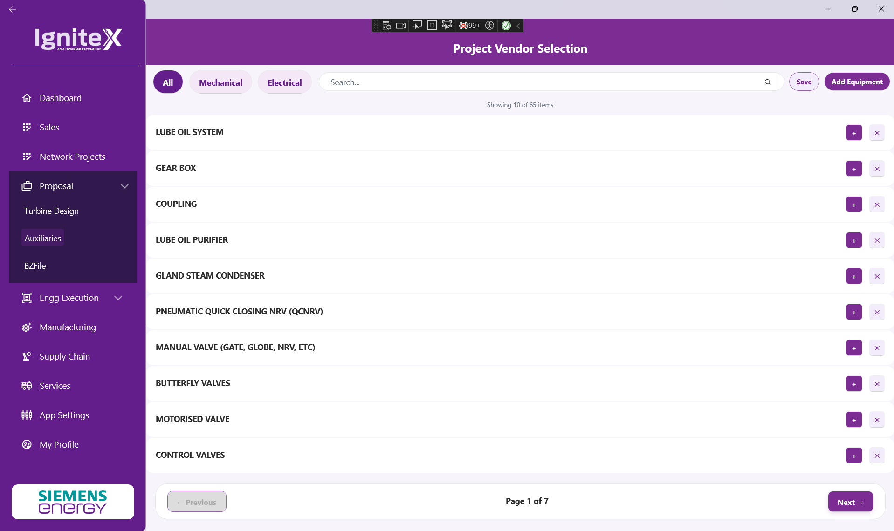

**How to Remove a Vendor**

1. Follow the same steps above to access the vendor list for that equipment.
2. Deselect the vendor from the list.
3. Click **Save**, then regenerate the TA.

**How to Add New Equipment**

1. Click the **Add Equipment** button in the top-right corner.
2. Select the **Category** from the dropdown.
3. Enter the equipment name and click **Add**.
4. Click **Save** to confirm the changes.
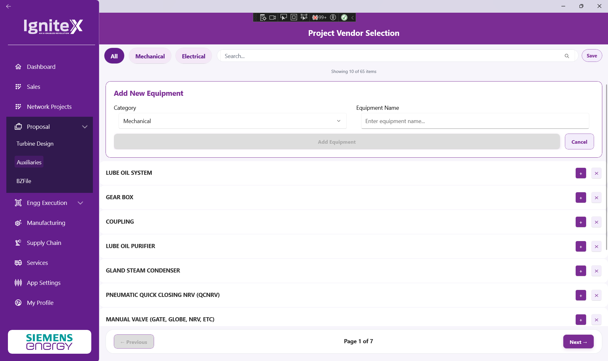
**How to Remove Equipment**

1. Click the **X** icon to the right of the equipment entry.
2. Click **Save** to confirm.

**Standard Mode Projects**

Standard Mode projects do not have a local vendor file. The Master Vendor File is used directly without any local modifications.

>  **Requirements for Project Vendor:**
> - You must be connected to the internet when loading a project, so the Master Vendor File can be downloaded and copied to your local project folder.
> - You must have at least read access to the Master Vendor File location.

> ℹ **Important Notes:**
> - Local project vendor changes are **isolated to your project** and do not affect the organization-wide Master Vendor File.
> - Each project maintains its own copy of the vendor list, allowing for project-specific customization.
> - Changes to the local vendor file persist only for that specific project and revision.

---

### 24 — SLD Layer Modification

The **Manage Layer** feature provides an improved interface for Single Line Diagram (SLD) layer selection, with organized layer grouping and simplified selection controls.
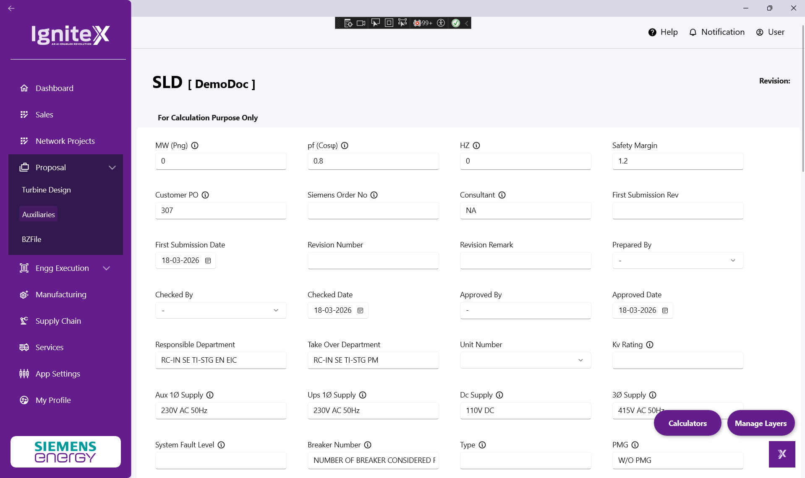
> **Access:** Click the **Manage Layer** button located in the bottom-right corner of the screen. An overlay panel will appear displaying all available layers organized into groups.

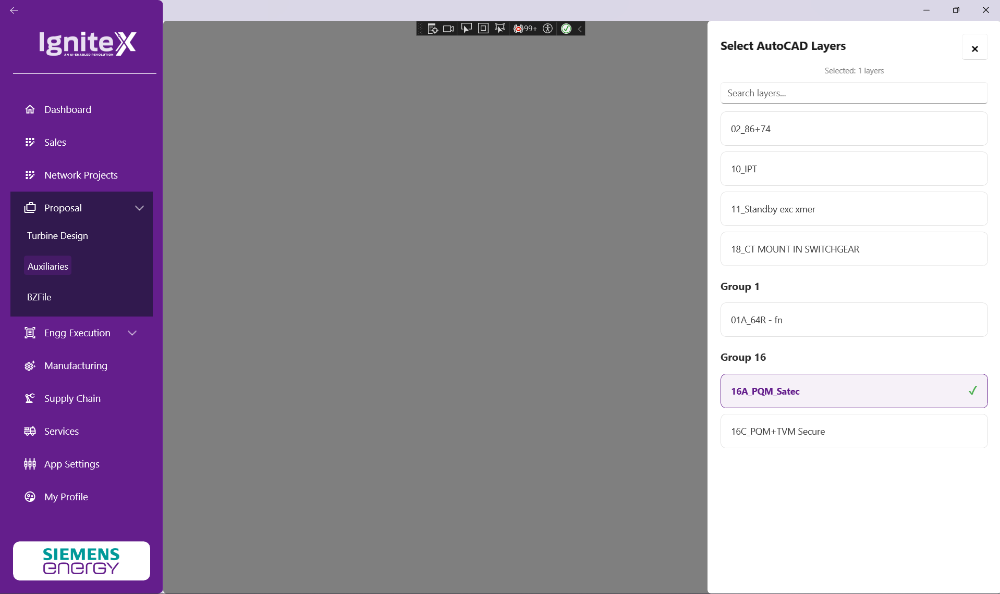

**How Layer Selection Works**

Layers are organized into logical groups based on their functionality. Each group displays related layers together for easy navigation.

**Selection Rules**

- Only **one layer per group** can be active at any time.
- One layer in each group is active by default.
- Clicking a different layer in the same group will automatically deselect the previous one.
- You cannot deselect all layers within a group — at least one must always remain active. If you attempt to deselect the last active layer, the system will automatically select the next available layer in that group.

**Editing Custom kV Rating Values**

For custom rating configurations, the following values can be manually edited:
- LA (Lightning Arrester) values
- SC (Surge Capacitor) values
- Ohms values
- With Main Exc. Transformer values

Simply click on the editable field and enter your desired value.
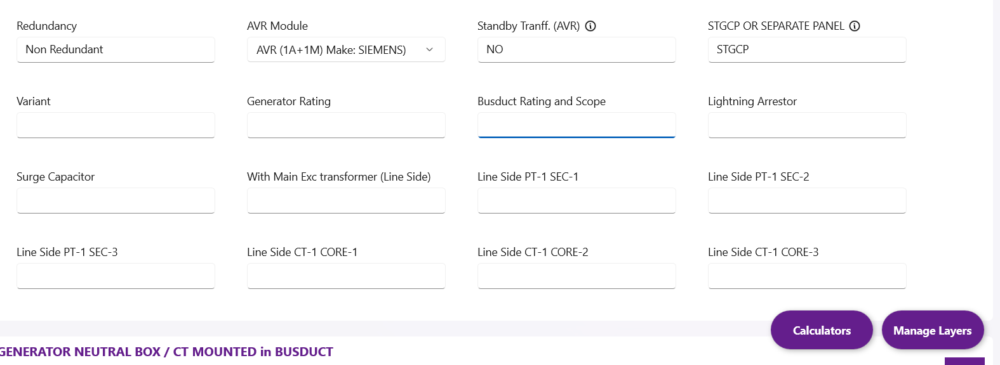
**Fixed kV Rating Values**

For fixed or standard rating configurations, values are automatically filled by the system and cannot be manually edited.

> ℹ **Important Notes:**
> - At least one layer must always be selected in each group.
> - Custom rating values can be manually adjusted; fixed values are system-generated.
> - Changes to layer selection are applied immediately to your SLD.
> - The overlay panel can be closed by clicking outside the panel or using the close button.

---

### 25 — Generate BZ Thermal and BZ Auxiliary

- Access the **left sidebar**.
- Expand the **Proposal** submenu.
	
- Click **BZ File** to navigate to the BZ File section.
	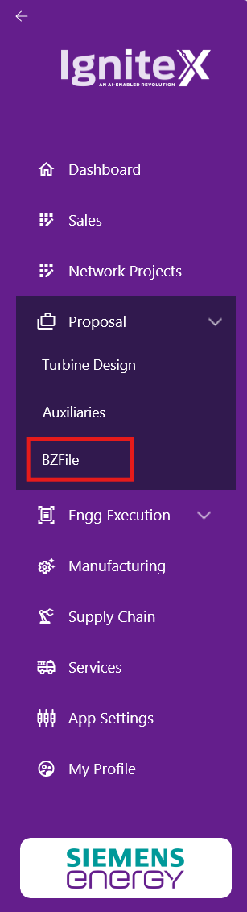

---

### 26 — BZ Screen

- Load the enquiry for which you want to generate the BZ file.
	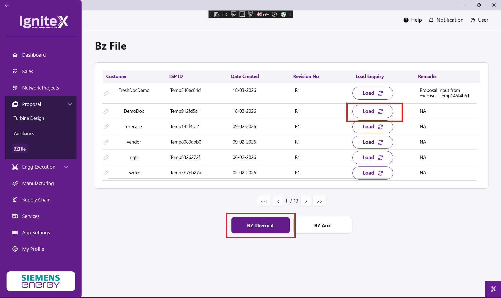
- Click **BZ Thermal** to generate the BZ Thermal file, or **BZ Auxiliary** for the BZ Auxiliary file.
	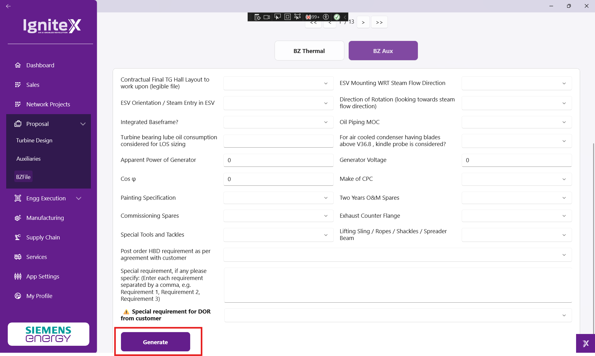
- A UI will open where you can verify all fields and generate the final BZ file.


>  **Note:** If you navigate to the BZ section without first generating the **Turbine Design** and **Proposal Auxiliary**, the fields will be empty. Always complete those steps first.

**BZ Thermal**
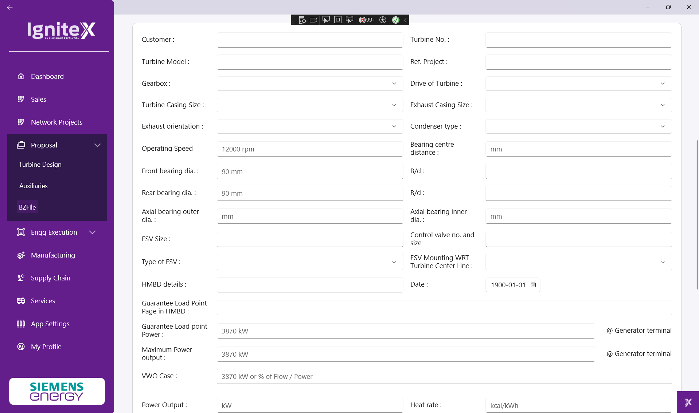

**BZ Auxiliary**
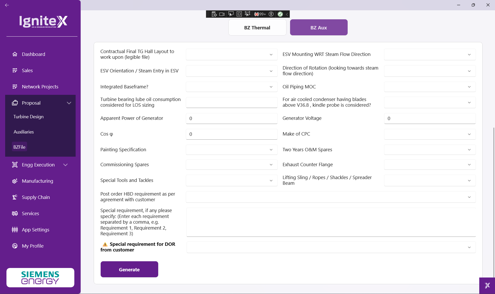

>  **Output Location:**
> ```
> C:\testDir\TurbineNumber_ProjectName\R1\
> ```
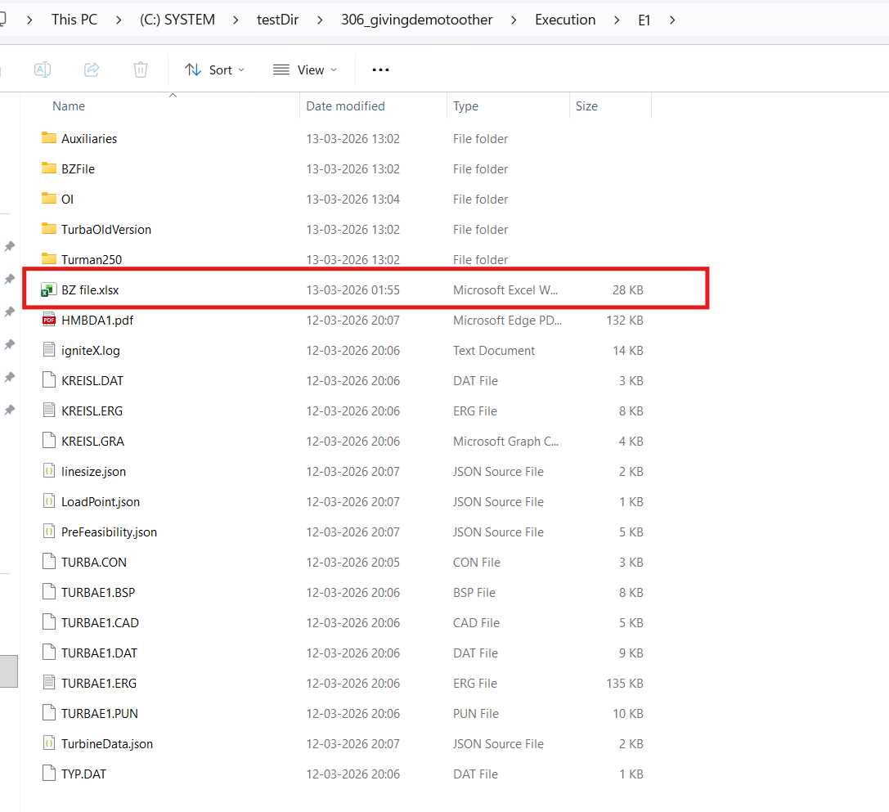
---

### 27 — Handover to Execution

Once the Proposal is complete, navigate to **Turbine Design** and click the **Handover** button to transfer the project to the Execution team.
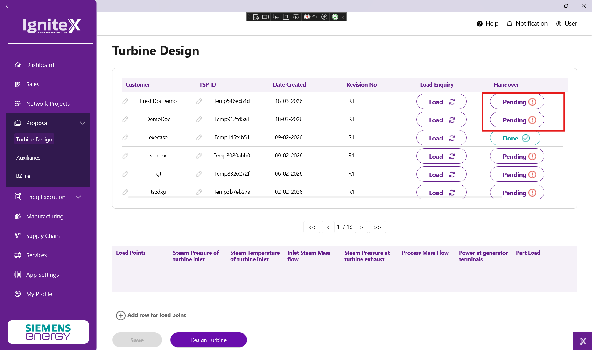
**Handover Functionality**

**Case 1 — SE and SZ Changed (Bending Failure)**

When SE and SZ are changed for cases B and F, these are treated as non-standard flow paths. No additional action is required; the standard process applies.

**Case 2 — No Changes to SE and SZ**

| Step | Action |
|------|--------|
| 1 | Remove Varicard 114 from the `Turba.dat` file. |
| 2 | Re-run Turba using version **1.3.36**. |
| 3 | Verify that the latest `turba.bsp` matches the existing `turba.bsp` — specifically, check the last value: `ABSTAND`. |
| 4 | Use the latest verified files for handover. |

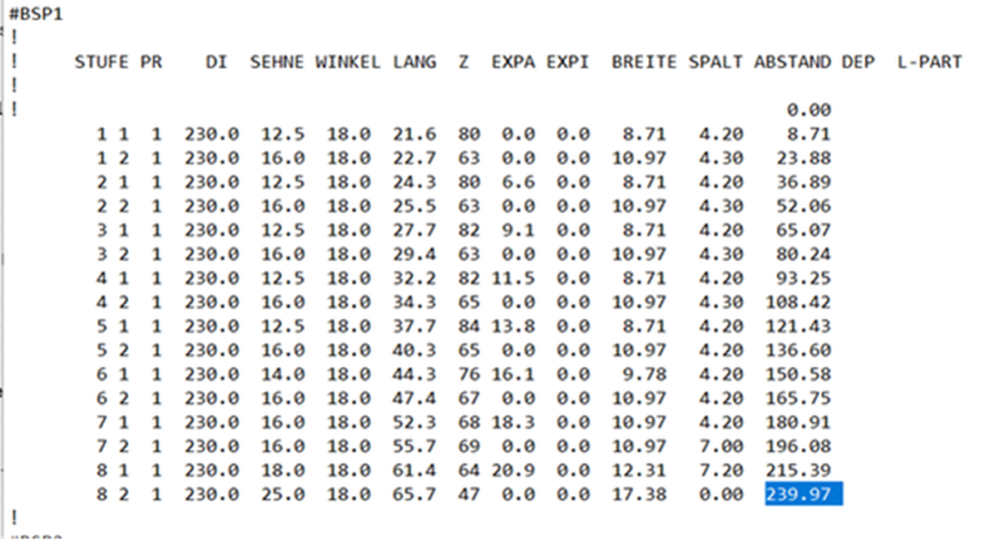

Additional notes:
- For the standard case, the `.bsp` file is stored in Ignite-X.
- For the executed case, `.bsp` files are fetched directly from the server.
- Create a folder named `TurbaOldVersion` to store all files processed with Turba v1.3.36.
- A `TurbaNewVersion` folder is created automatically when using Turba v2.5.0.


**Calculation Requirements for Thermal Documentation**

- Mention the Turba version in the internal kick-off file.
- In the Swallow folder, run the Turba `.dat` file with `var 14` using Turba v1.3.36 (if using TurbaOldVersion) or Turba v2.5.0 (if using TurbaNewVersion).

**For Welle and Rsmin Files in Thermal Toolchain**

- Use the latest version of Turman (v2.5.0).
- Finally, copy the Turba `.dat` file and run it with Turba v1.3.36.

---

### 28 — Generate the Thermal Toolchain

- Access the **left sidebar**.
- Expand **Engg Execution**.
	
- Click **Core-Calculation**.
	
	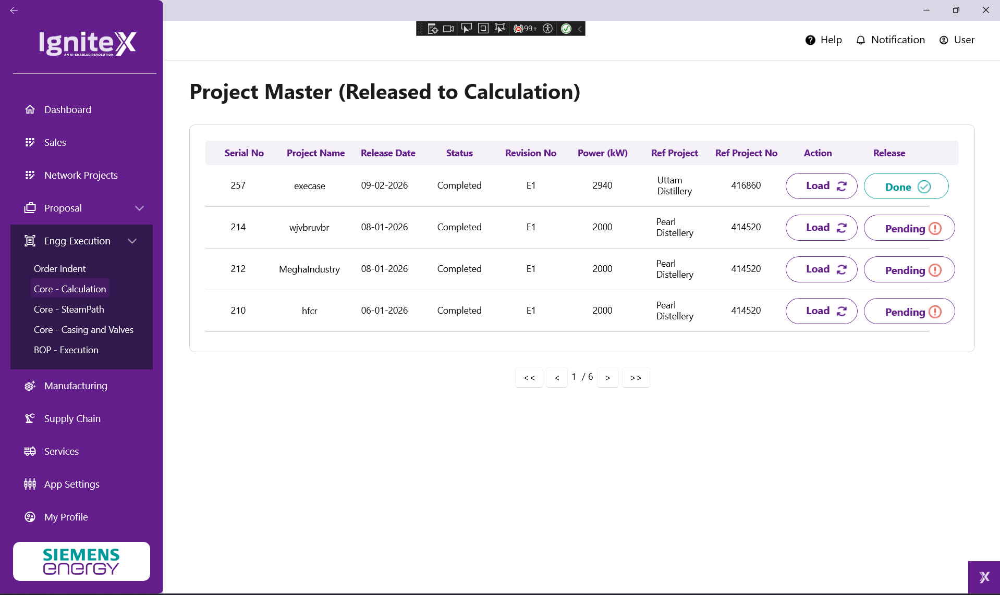
- Load the project on which you want to run the Thermal Toolchain.
	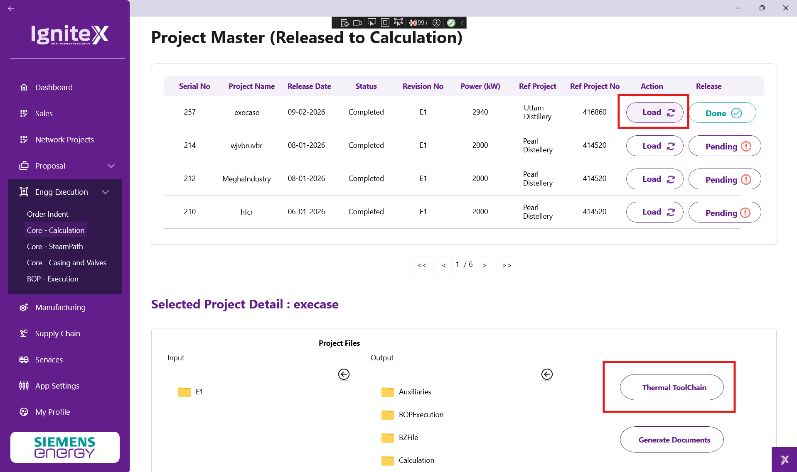
- Click **Thermal Toolchain** to generate the toolchain documents.
- Click **Generate Document** to produce the Thermal Documentation.

>  **Output Location:**
> ```
> C:\testDir\TurbineNumber_ProjectName\Execution\E1\Calculation
> ```
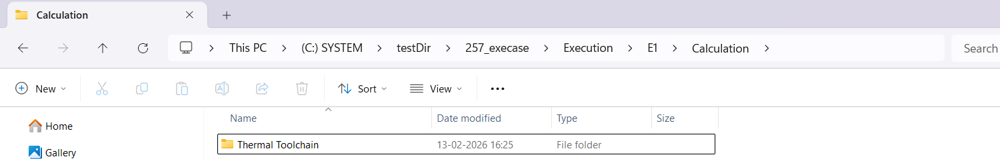

All generated Thermal Toolchain files will be found in the **Thermal Toolchain** folder, and all Thermal Documentation output files will be in the **Calculation** folder.
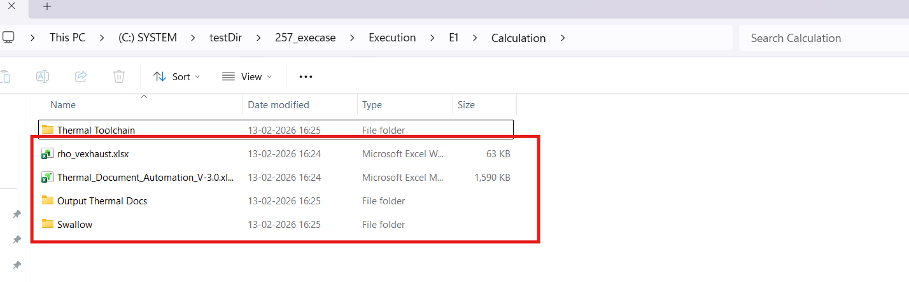

---

---

## Network Server & Admin Panel

### Network Server

1. Any user can create an enquiry and complete the turbine design process.
2. Only users with the appropriate **access rights** can upload a project to the server.
3. To upload a local project, click **Load Local Projects**, then click the **Upload** button next to the relevant project.
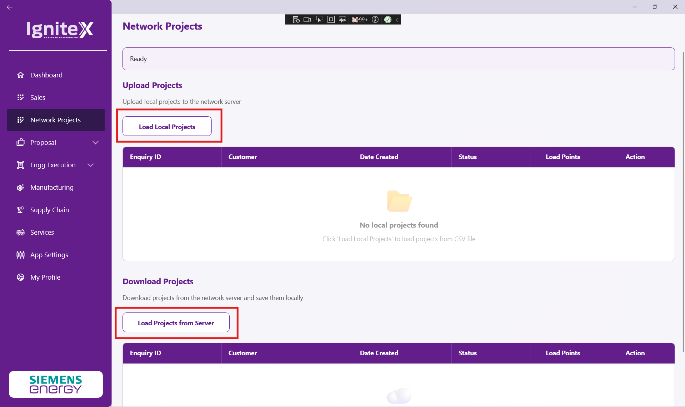
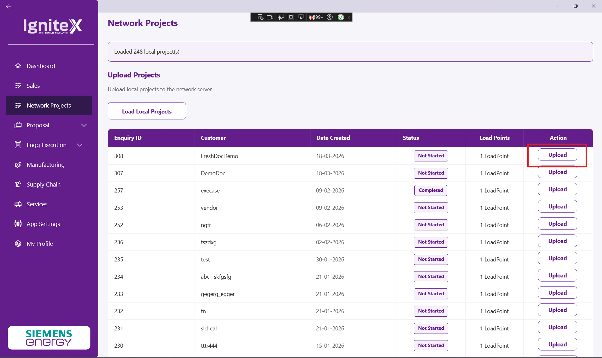

4. To download a project from the server, click **Load Project from Server**. Projects assigned to you by the Admin will be displayed for download.
	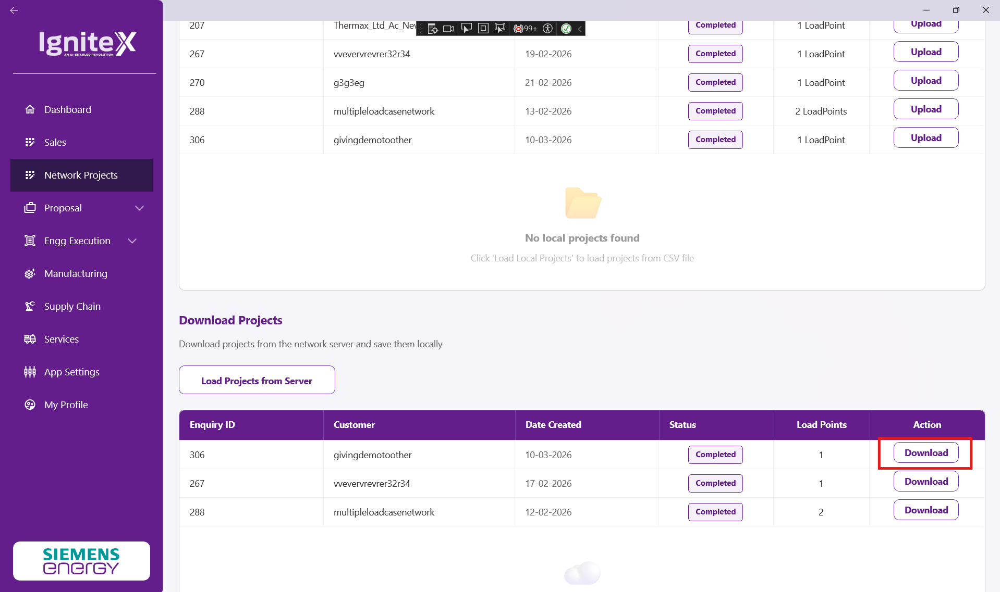

---

### Admin Panel

> **Temporary Admin Credentials:**
> ```
> Username: adminhello1
> Password: adminhello1
> ```


**Project Access & Ownership Model**

- Projects are stored on the network server and are visible in the application based on user assignment.
- A project can be assigned to multiple users, but only **one user can own/download it** at a time.

**Admin Actions**

| Action | Description |
|--------|-------------|
| **View Available Projects** | On login, the admin sees a list of all projects on the network server. |
| **Open a Project** | Select a project from the list to view its details and manage assignments. |
| **Assign to Users** | Only assigned users will be able to see the project in their local application. |
| **Admin Unlock** | If the current owner has not uploaded the project back, the admin can manually unlock it so another assigned user can take ownership. |

**User Actions**

| Action | Description |
|--------|-------------|
| **View Projects** | Users see only projects that have been assigned to them by the Admin. |
| **Download = Ownership (Lock)** | The first assigned user who downloads the project becomes the owner. Other assigned users can see the project but cannot download it while it is owned. |
| **Upload = Release Lock** | To release ownership, the current owner must upload the project back to the server. Until this happens, the project remains locked. |


**Admin Project Management Page**

After selecting a project, the admin management page displays the following sections:

**Inquiry Information**


Basic enquiry details for the selected project. Use this to confirm you are working on the correct project.

**Working Status**


Shows the current user actively working on the project.

**Lock Status**


Displays who has locked/owns the project, including the exact lock timestamp.

**Access Management**


Add users via Microsoft email, view the access list, or revoke access using the Remove action.

**Activity Log**


Full audit history — who downloaded, who uploaded, and all other captured events.

---


---

## Getting Started — Developers

### 2.1 Prerequisites and Tooling

To develop and run the Ignite-X MAUI application on Windows, ensure the following development environment is set up:

| Requirement | Details |
|-------------|---------|
| **Operating System** | Windows |
| **IDE** | Visual Studio 2022 (v17.12 or later) |
| **VS Workload** | .NET Multi-platform App UI (MAUI) development |
| **.NET SDK** | .NET 8 — verify with `dotnet --version` |
| **MAUI Workload** | Included with VS; or install manually: `dotnet workload install maui` |

**Sharing Visual Studio Configuration**

The most efficient way to configure Visual Studio consistently across machines is to export and share a `.vsconfig` file.

**Exporting the Configuration**

1. Open **Visual Studio Installer** from the Start menu.
2. Click **More → Export Configuration**.
	
	
3. Review the currently selected options and click **Export**.
	
	
4. Share the exported `.vsconfig` file with your team.
	
	
**Importing the Configuration**

1. Open **Visual Studio Installer** on the target machine.
2. Click **More → Import Configuration**.
	
3. Select the `.vsconfig` file path provided by a colleague.
	
	
4. The pop-up will display all libraries to be installed — confirm to proceed.

---

### 2.2 Clone, Build, and Run
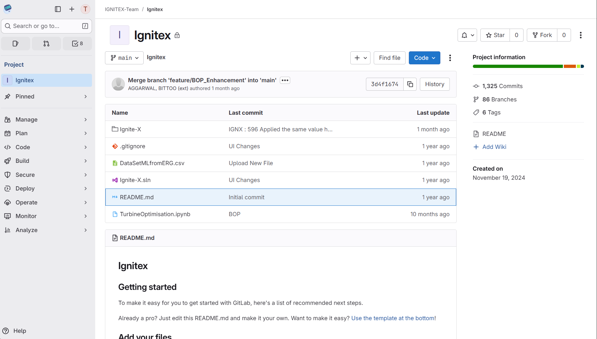
```bash
# Step 1 — Clone the Repository
git clone https://code.siemens-energy.com/Ignitex-Team/Ignitex.git
git checkout main

# Step 2 — Open Project in Visual Studio
# Open Ignite-X.sln in Visual Studio 2022
# Allow NuGet package restore to complete

# Step 3 — Build the Solution
# Visual Studio: Build > Rebuild Solution

# Step 4 — Run the Application
# Select "Windows Machine" as the target platform
# Run with debugging:     F5
# Run without debugging:  Ctrl+F5
# CLI alternative:
dotnet run -f net8.0-windows10.0.19041.0
```


**Step 5 — Debug the Application**

Set a breakpoint on any line you want to inspect. When the application executes that line, it will pause and allow you to step through the code.

**Example:** To debug the **Create Enquiry** button, place a breakpoint on the `OnCreateEnquiryClicked` method and click the button in the UI — the breakpoint will be hit.

Use **Step Into**, **Step Over**, and **Step Out** to navigate through code execution.

---

**Inspecting UI Elements (Inspect Element on Desktop)**

When running the application in debug mode, a **MAUI Hot Reload / Debug toolbar** will appear at the top of your screen. Here is a summary of each tool:
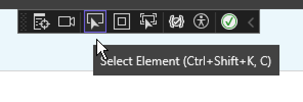

| #   | Tool                                                | Shortcut          | Purpose                                                                                                                                       |
| --- | --------------------------------------------------- | ----------------- | --------------------------------------------------------------------------------------------------------------------------------------------- |
| 1   | **Go to Live Visual Tree**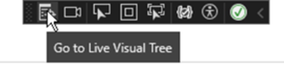        | —                 | Opens the runtime UI element hierarchy. Use it to find which control corresponds to a visible element and inspect its parent/child structure. |
| 2   | **Show in XAML Live Preview**     | —                 | Highlights the selected element's XAML definition. Use this to jump from a runtime element to the XAML that created it.                       |
| 3   | **Select Element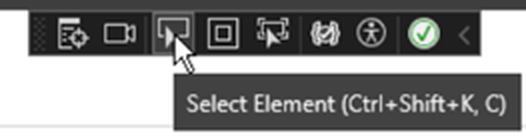**                | `Ctrl+Shift+K, C` | Click a UI element in the running app to select it in the Live Visual Tree/Preview.                                                           |
| 4   | **Display Layout Adorners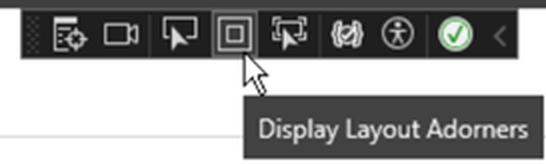**       | —                 | Draws overlays showing margins, padding, and layout bounds. Helpful for debugging spacing and alignment issues.                               |
| 5   | **Track Focused Element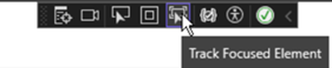**         | —                 | Follows the element with keyboard focus. Use when debugging focus order and keyboard navigation.                                              |
| 6   | **Binding Failures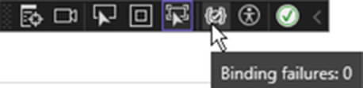**              | —                 | Shows the count of binding failures (wrong path, null source). Use when a label appears blank or a binding is not resolving.                  |
| 7   | **Scan for Accessibility Issues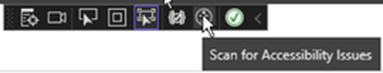** | —                 | Runs accessibility checks on the selected element. Use before shipping to catch screen-reader and contrast issues.                            |
| 8   | **XAML Hot Reload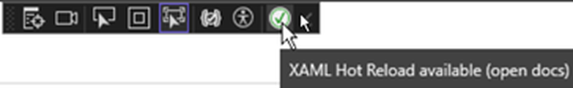**               | —                 | Push XAML/C# changes into the running app without restarting.                                                                                 |

**Quick Workflow Example**

```
1. Click "Select Element"             →  tap a UI control in the running app
2. VS auto-selects it in Live Visual Tree
3. Click "Show in XAML Live Preview"  →  reveals the exact XAML definition
4. Toggle "Display Layout Adorners"   →  inspect spacing and alignment
5. Edit XAML                          →  use XAML Hot Reload to apply changes immediately
6. If something is blank              →  check "Binding Failures: N" for errors
7. Run "Scan for Accessibility"       →  before finalising the UI
```

**Inspecting the "Create Enquiry" Button**

1. Click **Show in XAML Live Preview** from the debug toolbar.
	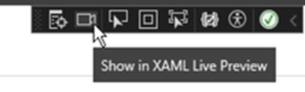
	
2. Hover over the **Create Enquiry** button — you will see its styles, properties, and the parent file (`HomePage.xaml`) displayed at the top.
	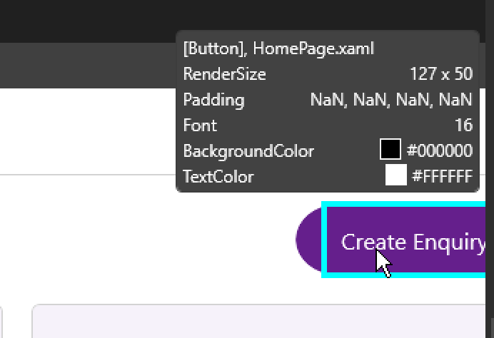
3. Click the element to jump directly to its XAML definition.
	
---

---

## Architecture

### 3.3 Navigation Through Code

Ignite-X uses the **.NET MAUI Shell navigation model** combined with custom logic in `AppShell.xaml` and `AppShell.xaml.cs` to manage navigation. This approach provides a centralised, consistent way to handle navigation, menu interactions, and UI states, supporting a clean MVVM pattern by abstracting navigation logic outside of individual ViewModels.

**Key Components**

| File | Responsibility |
|------|----------------|
| `AppShell.xaml` | Defines the overall UI navigation structure — flyout menu, header, footer, and Shell items (Home, Sales, Proposal, Engg Execution, etc.), including all submenu structures. |
| `AppShell.xaml.cs` | Contains the core navigation logic, event handlers for menu button clicks, submenu management, and route registration. |
| Routing | Routes are registered programmatically using `Routing.RegisterRoute`, mapping route names to page types. |

**Route Registration Example**

```csharp
Routing.RegisterRoute(nameof(HomePage), typeof(HomePage));
Routing.RegisterRoute(nameof(SalesPage), typeof(SalesPage));
Routing.RegisterRoute(nameof(TurbineDesign), typeof(TurbineDesign));
// Additional routes registered similarly...
```

**Navigation Flow**

Menu button clicks trigger event handlers in `AppShell.xaml.cs` that:
- Update UI states by setting active button and stack background colours.
- Toggle submenu visibility (e.g., the Proposal submenu).
- Call `NavigateSafelyAsync(routeName)` → `Shell.Current.GoToAsync(routeName)`.

`NavigateSafelyAsync` ensures navigation occurs on the main UI thread with a slight delay to maintain UI responsiveness and avoid navigation conflicts.

**UI State Management**

| Method | Behaviour |
|--------|-----------|
| `SetActiveButton` | Resets all button backgrounds to transparent, then highlights the selected button using colour `#31194E`. |
| `SetActiveSubmenuButton` | Applies highlight colour `#60641E8C` to the active submenu button, clearing the previously active one. |

**Extending Navigation**

- Register new pages in `Routing.RegisterRoute`.
- Add corresponding menu buttons and event handlers following the existing pattern in `AppShell.xaml` and `AppShell.xaml.cs`.
- Update `SetActiveButton` and `SetActiveSubmenuButton` to include visual feedback for new navigation targets.
	
---

### MVVM Deep-Dive — Dashboard (HomePage) Breakdown

This section walks through the **Dashboard (HomePage)** as a worked example to explain how the MVVM architecture is applied throughout Ignite-X.

**Purpose of the Dashboard**

- Single-screen summary for the user after login.
- Quick visibility into: total enquiries, counts by category (SST200, SST300, SST600), project list, and overall progress.
- Primary actions: Create Enquiry, filter by status, and select a project row to open its details.

**Visual Areas & Components**

| #   | Component                                    | Description                                                                                                                                    |
| --- | -------------------------------------------- | ---------------------------------------------------------------------------------------------------------------------------------------------- |
| 1   | **Top Heading**                              | "Dashboard" title                                                                                                                              |
| 2   | **Action Button**          | Create Enquiry (top-right, primary call-to-action)                                                                                             |
| 3   | **Summary / KPI Tiles**    | Row of 4 cards — total Enquiries, SST200 count, SST300 count, SST600 count. Each card shows a title, a large numeric value, and a description. |
| 4   | **Projects Summary Panel**                   | Table with columns: Customer, Date Created, SPOC, Status. Includes an optional status filter dropdown. Rows are clickable/selectable.          |
| 5   | **Overall Progress Panel**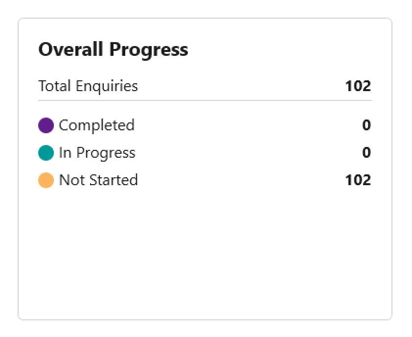 | Right-side card showing counts by status and a visual legend/pie or donut chart.                                                               |

---

**Component-by-Component Breakdown**

**1) Create Enquiry Button**

- **UI:** `<Button Text="Create Enquiry" ... Clicked="OnCreateEnquiryClicked" />`
- **What controls it:** Code-behind `OnCreateEnquiryClicked` calls `Navigation.PushAsync(ProjectDetailsPage.getInstance())`.
- **Why coded that way:** Simple navigation flow implemented directly in the page for quick behaviour. This is code-behind event wiring, not an `ICommand` on the ViewModel — meaning the action lives in the View rather than the ViewModel.
- **How the UI changes:** User tap → runtime calls the `Clicked` handler synchronously → navigation happens.

**2) Enquiries KPI Tile**

- **UI:** `Label Text="{Binding EnquiryCountText}"`, `Label Text="{Binding PercentageText}"`, `Label Text="{Binding ChangeDescriptionText}"`
- **VM props:** `EnquiryCountText`, `PercentageText`, `ChangeDescriptionText` in `HomePageViewModel`.
- **Why coded that way:** The ViewModel computes counts/strings from CSV/`MainViewModel` and exposes them as simple strings — keeping XAML simple (no formatting logic in the View).
- **How the UI updates:** VM sets a property (from `LoadDataFromCsv`/`LoadPieChart`) → setter calls `OnPropertyChanged()` → binding engine sees the notification and updates the Label text.

**3) Overall Progress Card**

- **UI:** Labels bound to `TotalEnquiries`, `Completed`, `InProgress`, `NotStarted`.
- **VM props:** Those exact string properties in `HomePageViewModel`.
- **Why coded that way:** Aggregated counts live in the ViewModel (from CSV or `MainViewModel`) and are exposed as properties. Colouring and legend are done in XAML for consistent visuals.
- **How the UI updates:** `LoadPieChart()` populates data and sets the `_completed`/`_inProgress`/`_notStarted`/`_totalEnquiries` fields → each property setter calls `OnPropertyChanged()` → the UI updates.

**4) Project Summary Header + ListView**

- **UI:**
  - Header: `Label Text="Projects Summary"`
  - Picker: `ItemsSource="{Binding StatusOptions}"`, `SelectedItem="{Binding SelectedStatus}"`
  - List: `<ListView ItemsSource="{Binding EnquiryData}">` with a `DataTemplate` using `Customer`, `DateCreated`, `PoC`, `Status`.
- **VM props:** `StatusOptions` (collection), `SelectedStatus` (string), `EnquiryData` (`ObservableCollection<Enquiry>`), `_allEnquiryData` (internal full dataset).
- **Why coded that way:** `EnquiryData` is the displayed collection; the ViewModel fills it from `MainViewModel`/CSV. Filtering is implemented in the View (`OnStatusPickerSelectedIndexChanged`) using a `_allEnquiries` snapshot for simplicity — avoiding extra ViewModel command code.
- **How the UI updates:** `EnquiryData` is an `ObservableCollection<Enquiry>` — adding/removing items fires collection events → the ListView updates automatically. If `EnquiryData` is replaced (set), the setter calls `OnPropertyChanged(nameof(EnquiryData))` so `ItemsSource` rebinds.

**5) Watermark Visibility (Empty State)**

- **UI:** `Label IsVisible="{Binding IsWatermarkVisible}"` with the message *"No Projects in Ignite-X"*
- **VM prop:** `IsWatermarkVisible` (bool) set by `UpdateVisibility()` in the ViewModel.
- **Why coded that way:** The ViewModel computes the empty state once data loads; the View simply binds to a boolean to show/hide the watermark.
- **How the UI updates:** VM sets `IsWatermarkVisible = IsEnquiryDataEmpty` → calls `OnPropertyChanged` → binding engine toggles `IsVisible`.

**6) INotify / Bindable Behaviour — Why and How**

- `HomePageViewModel` exposes `OnPropertyChanged()` via `BindableObject` + the `PropertyChanged` event.
- `Enquiry` model also implements `INotifyPropertyChanged`.
- **Why it exists:** So the UI (bindings) automatically refreshes when data changes — with no manual UI code required.
- **What triggers it:** VM setters (e.g., `EnquiryCountText = "10"`) call `OnPropertyChanged()` → the binding engine updates the UI. When a property on an `Enquiry` instance changes (e.g., `Status` updated), `Enquiry.OnPropertyChanged()` fires → the ListView item template updates for that row only.
- `PropertyChanged` is an **event** that listeners (the binding engine) subscribe to. `OnPropertyChanged()` is the **method** you call inside setters to raise that event.

**7) Where Logic Lives (and Why)**

- **ViewModel:** Parses CSV, builds `EnquiryData`, computes counts → keeps the View dumb and focused solely on display.
- **Model (`Enquiry`):** Has `INotifyPropertyChanged` so item-level changes reflect in the UI.
- **View (code-behind):** Handles navigation and quick filtering — chosen for simplicity and faster implementation, though not strictly pure MVVM.

---

**MVVM Patterns Used in This Codebase**

| # | Pattern | How It Is Applied |
|---|---------|-------------------|
| 1 | **Observable Properties** | ViewModels use `OnPropertyChanged()` in setters. When a property changes, the UI label/control bound to it auto-refreshes. |
| 2 | **ObservableCollection for List Data** | `EnquiryData` is `ObservableCollection<Enquiry>`. Adding/removing items triggers UI refresh automatically — no manual `Refresh()` call needed. |
| 3 | **Code-Behind Event Wiring** | Create Enquiry button uses `OnCreateEnquiryClicked` in code-behind. Status Picker triggers `OnStatusPickerSelectedIndexChanged` in the View, which swaps the `ItemsSource`. Simple, but puts logic in the View instead of the ViewModel. |
| 4 | **Model with Notifications (Per-Row Updates)** | `Enquiry` implements `INotifyPropertyChanged`. If one `Enquiry.Status` changes → only that row's UI updates. |
| 5 | **Events vs Commands** | Normally, user actions go through the ViewModel via `ICommand`. Here a mixed approach is used — Create Enquiry uses a code-behind handler; this is simpler but puts logic in the View. |
| 6 | **Visibility Controlled by ViewModel Flags** | The ViewModel provides booleans; the View binds them to `IsVisible`. `IsWatermarkVisible` toggles the watermark label via `UpdateVisibility()`. |
| 7 | **Singleton ViewModel** | `HomePageViewModel.getInstance()` provides one global instance. State is shared across pages; avoids reloading — but it couples pages and reduces testability. |

**Story Flow (for Reference)**

```
User presses "Create Enquiry"
  → MAUI calls OnCreateEnquiryClicked (framework wiring)
  → Handler navigates to the next page

User opens Dashboard
  → Page sets BindingContext
  → XAML bindings fetch VM property values (EnquiryCountText, TotalEnquiries, etc.) and display them

VM sets a property (e.g., EnquiryCountText = "10")
  → setter calls OnPropertyChanged("EnquiryCountText")
  → Framework hears event → reloads the Label bound to it → UI shows "10"

VM adds to EnquiryData (ObservableCollection)
  → collection notifies change
  → Framework re-draws the ListView → new row appears

VM changes one Enquiry.Status
  → that model's OnPropertyChanged("Status") fires
  → Framework updates only that cell in the list
```

---

**Code and Flow Details**

**`OnCreateEnquiryClicked` Event Handler**

- Located in `HomePage.xaml.cs`.
- Acts as a controller to clean/reset view state and trigger navigation.
- Ensures static singleton fields related to the enquiry page and ViewModel are reset to `null` for a fresh experience.

**`ProjectDetailsPage.getInstance()`**

- Typically employs a lazy singleton pattern or factory to return an existing or new page instance.
- Encapsulates creation logic to prevent multiple instances or stale state on repeated navigation.

**`Navigation.PushAsync(Page page)`**

- Part of the `INavigation` interface, defined in `Microsoft.Maui.Controls`.
- Stack-based navigation model: pages are managed in a stack that enables forward and backward navigation.
- `PushAsync` adds the new page instance to the top of the stack and transitions the UI to this page asynchronously.

**Stack-Based Navigation Concept**

- The navigation stack is a **Last-In-First-Out (LIFO)** data structure.
- **Push** adds a page; **Pop** removes the top page.
- The framework maintains `ModalStack` (modal pages) and `NavigationStack` (normal pages).
- Using this stack model, users can navigate back using device hardware/software back buttons or UI back buttons.

**XAML Page Lifecycle and Rendering**

- When the page instance is pushed, its constructor and XAML parsing occur.
- `BindingContext` (usually the ViewModel) is assigned and bindings are initialised.
- Lifecycle events such as `OnAppearing` trigger.
- Rendering converts the XAML visual tree via platform-specific renderers (handlers in MAUI) to native UI controls visible on the device screen.

---

**Step-by-Step Execution Flow — "Create Enquiry" Button**

The table below provides a complete trace of every step that executes when a user clicks the **Create Enquiry** button, from the UI event all the way through to the rendered page on screen.

| Step | Code Location / Class | What Happens / How It Works | Purpose & Concept |
|------|----------------------|-----------------------------|-------------------|
| **1.** User clicks **"Create Enquiry"** button | `HomePage.xaml` (XAML), `HomePage.xaml.cs` (code-behind) | The button `Clicked` event is invoked and routed to the `OnCreateEnquiryClicked` handler in `HomePage.xaml.cs`. | Connects UI user input with event handler logic. |
| **2.** Clear existing instances | `HomePage.xaml.cs` | Sets `ProjectDetailsViewModel.projectDetailsViewModel = null` and `ProjectDetailsPage.projectDetailsPage = null` to reset all static/singleton instances. | Ensures a fresh, clean state when creating a new enquiry. |
| **3.** Get Page instance | `ProjectDetailsPage.getInstance()` method | Returns a singleton/factory-managed instance of `ProjectDetailsPage`. Creates a new instance if none exists or after nulling. | Controls the lifecycle of the details page to avoid stale data. |
| **4.** Call `Navigation.PushAsync` | `HomePage.xaml.cs` | Calls `Navigation.PushAsync(ProjectDetailsPage.getInstance())` to add the enquiry details page to the navigation stack. | Navigates to the next page by pushing it onto the navigation stack. |
| **5.** `INavigation.PushAsync` method call | `Microsoft.Maui.Controls.INavigation` (interface) | The interface method `PushAsync(Page page, bool animated)` is triggered. The actual implementation lives in `NavigationPage`, which maintains the stack. | Adds the new page to `NavigationStack`; the stack model supports backward navigation. |
| **6.** Page Stack updated | `NavigationPage` (underlying MAUI class) | Adds the new `ProjectDetailsPage` instance to the top of the navigation stack collection. The UI is notified of the navigation update. | Keeps the stack consistent for forward and back navigation support. |
| **7.** XAML Page Initialisation | `ProjectDetailsPage.xaml` + code-behind | On creation/retrieval, XAML elements are parsed and instantiated, lifecycle events fire, and ViewModel data binding begins. | Sets up UI elements visually and binds the data context. |
| **8.** Render Page | MAUI Renderer / Handlers (platform-specific) | MAUI renders the XAML visual tree to native UI elements per platform. The UI updates to show the new page. | Draws the page visually on the device screen for user interaction. |

**High-Level Idea**

The entire flow is designed to **separate UI concerns** (XAML layout) from **logic** (C# event handlers, ViewModels) and **navigation management** (stack interface). When an action like "Create Enquiry" is triggered, the app clears stale state, constructs the next screen instance, and pushes it onto the navigation stack. This stack mechanism lets users move forward and backward seamlessly, while the framework manages view lifecycles and rendering behind the scenes.

---

### Thermal Calculation Documentation — Turbine Design

On opening the Ignite-X application, you will see the **Dashboard Page**, which shows how many enquiries have been created. To create a new enquiry, click the **Create Enquiry** button.

**Thermal Proposal — HMBD Diagram**

When creating an enquiry, you must fill in the project details, the TSP ID (if provided), and the **Load Point** configuration for which you want to create the HMBD Diagram of the SST-200 Turbine.

The HMBD Diagram is divided into two types:

| Type | Description |
|------|-------------|
| **Open HMBD** | Uses an open steam cycle. Selected when the user provides the 4 standard inlet parameters. |
| **Closed HMBD** | Uses a closed steam cycle. |

The Load Point configurations are also divided into two types:

| Type | Description |
|------|-------------|
| **Single Load Point** | One set of inlet parameters for the load point. |
| **Multiple Load Points** | Multiple sets of inlet parameters across different load points. |

**Open HMBD with Single Load Point**

For the Open HMBD Diagram, the user must provide exactly **4 input parameters** in the load point:

```
Inlet Pressure  →  Inlet Temperature  →  Inlet Mass Flow  →  Inlet Back Pressure
```

When these 4 parameters are supplied, the program automatically selects the Open HMBD Diagram.

**Open HMBD Logic — Template Selection**

When the user provides input, the program checks which template to use based on the input values. The selection logic is:

```
If user provides Process Steam Temperature (PST) along with the 4 standard parameters:
  → Select: Open Cycle WITH PST template

Otherwise:
  → Select: Open Cycle WITHOUT PST template
```

**Kreisl Tool and Templates**

Ignite-X uses the **Kreisl Tool**, which is a Siemens internal tool used to calculate internal turbine fields including:
- Power output
- Volumetric flow
- Any missing fields: temperature, mass flow, pressure, back pressure

The Kreisl template is pre-populated with the user's input parameters. The system uses the **Kreisl Template for Open Cycle without PST** as the base for standard open-cycle calculations.

---

**SST200 Steam Flow Path Categories**

The SST-200 steam turbine is designed for a wide range of industrial applications. The SST-200 model is categorised into three distinct steam flow paths:

**2.1 Standard Flow Path**

The Standard Flow Path category includes **six predefined standard templates** of steam paths. These templates are designed to meet common industrial requirements and ensure efficient steam flow through the turbine. Each template is optimised for specific operational conditions and can be selected based on the application's needs.

**2.2 Executed Flow Path**

The Executed Flow Path category comprises steam paths that have been designed and implemented in **previous projects** but are not standardised. These paths are tailored to specific customer requirements and operational conditions. While they are not part of the standard templates, they have been successfully executed and can be adapted for similar applications.

**2.3 Customised Flow Path**

The Customised Flow Path category is for **entirely new steam paths** that have never been designed or implemented before. These paths are developed from scratch based on unique customer specifications and operational requirements. Customised flow paths offer the highest level of flexibility and are ideal for specialised applications.

**2.4 General Procedure for Flow Path Selection**

When a new turbine design requirement arises, the following steps are taken:

**Pre-Feasibility Check:** Search through all three categories — Standard Flow Path, Executed Flow Path, and Customised Flow Path — based on specific pre-feasibility criteria.

For example, the standard flow path for a 1GBC straight back-pressure machine is selected once all parameters meet the defined criteria (Criteria 1). The system evaluates the incoming steam parameters against the feasibility table, and the first matching category is selected as the basis for the turbine design.

---

---

---

<div align="center">

<br/>


<br/><br/>

> *Put screenshots in the `images/` folder and replace the placeholder filenames with your actual screenshot files.*

<br/>

</div>
---

## BoP Execution

### Lean Spec

The **Lean Spec** step is part of **BoP Execution**. It is where you fill Lean Specification inputs in dedicated tabs, then use **Save** and **Generate** to persist section data into `BOP_Execution.json` and produce/update downstream deliverables (primarily Excel, plus AutoCAD/PDF for Line Sizing).

---

#### Common screen behavior (applies to most Lean Spec tabs)

| Screen element | What it does |
|---|---|
| Left tab navigation (`LeanSpec.xaml`) | Clicking a tab recreates right-side content using `LeanSpecPageViewModel` tab factories. |
| Tab toolbar (`Save` / `Generate`) | `Save` writes tab data into `BOP_Execution.json`; `Generate` runs section-specific output generation. |
| Revision banner | Shows revision metadata for active component tabs using `RevisionBanner`. |
| Info icon `(i)` | Guides user to upstream source values (mostly OI/SOS). |

---

#### Lean Spec tab order (as shown in UI)

1. `General Details`  
2. `Required Docs`  
3. `Technical Requirements and Recommendations (TRR_M)`  
4. `Customer Input`  
5. `DOR of TG Train`  
6. `Utility Requirments`  
7. `Gearbox & Coupling`  
8. `Gland Steam Condenser (PSGSC)`  
9. `LOS MVP (PSLOS)`  
10. `Line Sizing`

---

#### `General Details`

**Functional (screen-focused)**  
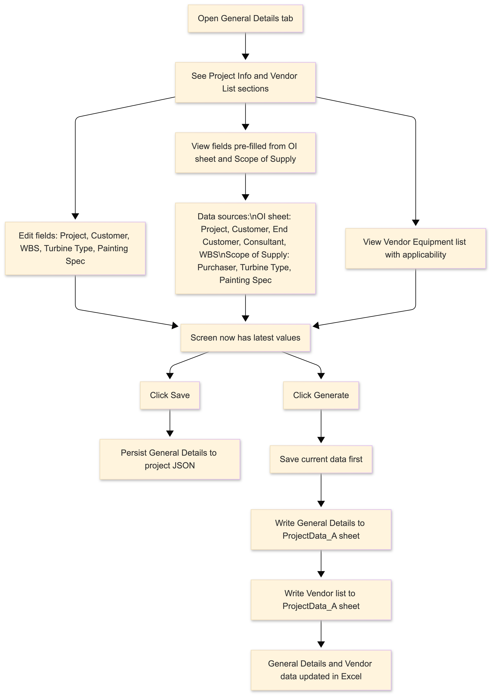

- Save/Generate toolbar.
- Project identity + vendor applicability UI.
- Upstream-linked fields shown with info cues.

**General Details** — where each field comes from (Order Indent upload vs Scope of Supply) and whether you can change it on this screen:

| Field (what the user sees) | Comes from upload | Editable in this tab? |
|---|---|---|
| Project Name | **OI** | Locked (read-only) |
| Purchaser | **SOS** | Editable |
| Customer | **OI** | Locked |
| End Customer | **OI** | Locked |
| Consultant | **OI** | Locked |
| Turbine Type | **SOS** | Editable (picker) |
| WBS Type | **OI** | Locked |
| WBS Number | **OI** | Locked |
| Specification For | **SOS** | Editable (picker) |
| Painting Specification | **SOS** | Locked (read-only) |

## Applicable Vendor List (Lean Spec → General Details)

- **What it is**: Read-only summary of selected vendors per equipment.
- **Source**: Project file `Auxiliaries/AuxilaryInputs/VendorList.json` (only selected/ticked vendors are shown).

| Equipment (as shown) |
|---|
| AIR FILTER REGULATORS |
| STRAINER |
| ACTUATOR MOV - (IF APPLICABLE) |
| DC MOTORS |
| LT AC MOTORS |
| BUTTERFLY VALVES |
| SOLENOID VALVES |
| MANUAL VALVE (GATE, GLOBE, NRV, ETC) |
| STEAM TRAP |
| SAFETY RELIEF VALVE |

- **How to edit**: Click the **info** icon → opens **Vendor List** screen → select vendors → **Save**.
- **Generate**: On Lean Spec **Generate**, selected vendors are written into the Lean Spec Excel (`ProjectData_A`) in predefined rows.


---

#### `Required Docs` (P&ID docs)

**Functional (screen-focused)**  
**[TODO: insert Required Docs functional image]**

- Save-only tab (no Generate).
- Package/status checklist style UI.

---

#### `Technical Requirements and Recommendations (TRR_M)`

**Functional (screen-focused)**  
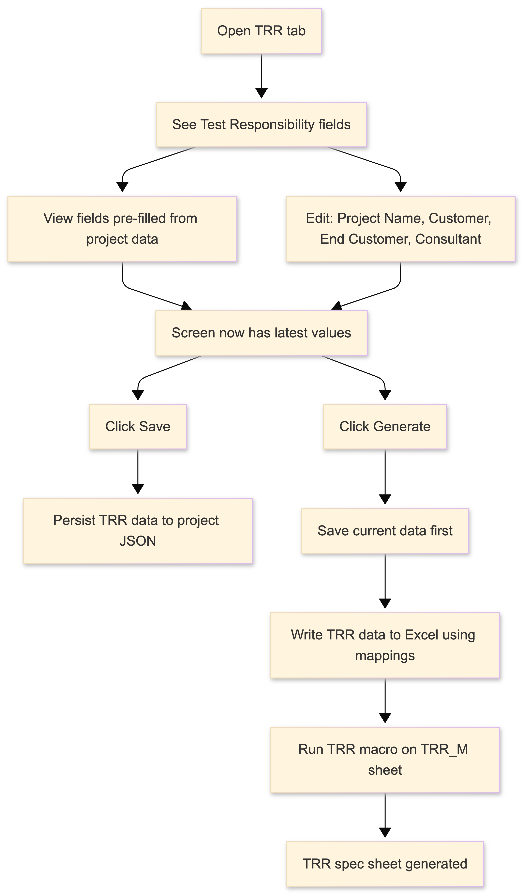
- **Save / Generate toolbar**: `Save` stores TRR data for this tab; `Generate` updates the TRR output in the Lean Spec Excel. While running, buttons are disabled and a loading spinner is shown.
- **Revision banner**: set `Rev`, `Prepared`, `Checked`, `Approved`, and `Rev Date` for the TRR output.
- **Project/Customer identity (read-only)**: shows `Project Name`, `EndCustomer Name`, `Customer Name`, and `Consultant Name`.
- **Info icons (i)**: click to open **Order Indent (OI) → General Details** to change upstream values (these fields are locked here).

---

#### `Customer Input`

**Functional (screen-focused)**  
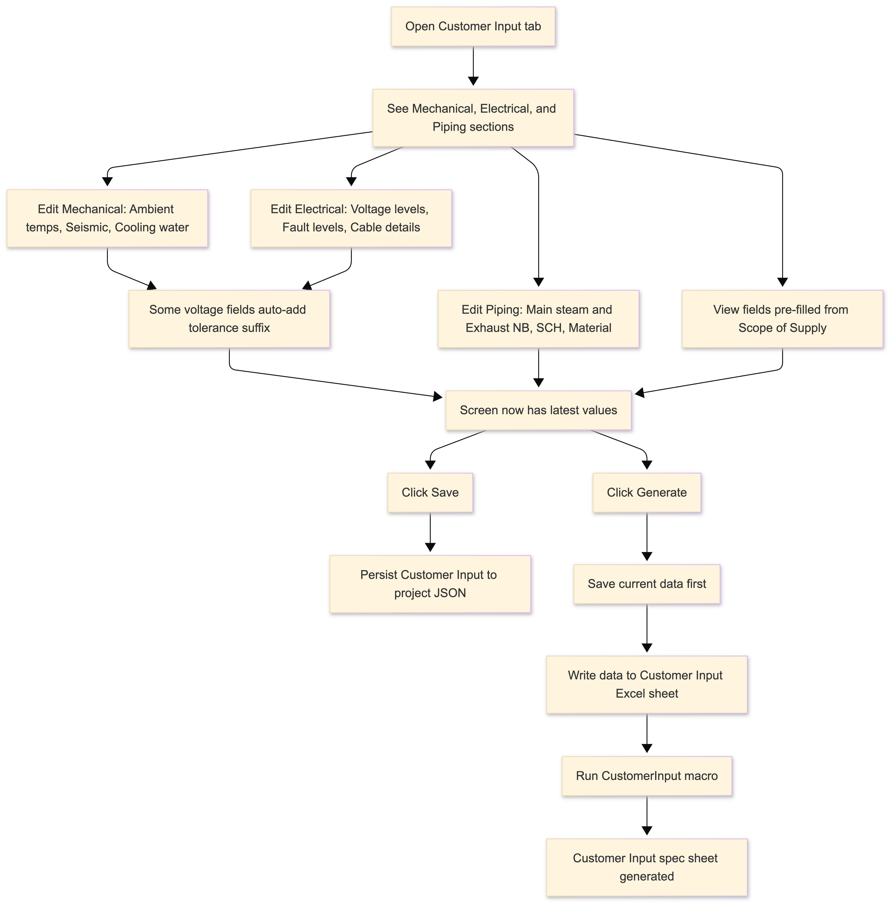

- **Save / Generate toolbar**: `Save` stores Customer Input values for this tab; `Generate` updates the Customer Input output in the Lean Spec Excel. While running, buttons are disabled and a loading spinner is shown.
- **Revision banner**: set `Rev`, `Prepared`, `Checked`, `Approved`, and `Rev Date` for the output.

- **Mechanical** (you fill these on this screen):
  - **Site ambient conditions**: min/avg/max ambient temperature, location above mean sea level, wind velocity, seismic design, relative humidity.
  - **Auxiliary cooling water parameters**: you enter pressures/design pressure; temperatures shown here are locked when they come from Scope of Supply.
  - **Piping**: main steam size/material and turbine exhaust size/material.

- **Electrical**
  - **Voltage levels**: the supply voltage fields are shown as read-only when they come from Scope of Supply.
  - **Voltage auto-format**: when you finish typing and leave the field, these fields automatically append `V +/-10%` if missing:
    - **3–phase AC (LT)**
    - **1–phase AC (Non–UPS)**
    - **1–phase AC UPS**
  - **System fault level**: **HT system fault level** is read-only (from Scope of Supply); **LT system fault level** is entered here.
  - **Other voltage / bus details**: busduct rating, HT cable size, cable entry preferences, MCC feeder type, and GPR quantity (GPR is read-only when coming from Scope of Supply).
  - **Motorised valve**: actuator type (integral / non-integral).
  - **Others**: electrical equipment design temperature is read-only when coming from Scope of Supply.

- **Info icons (i)**: wherever a field is locked, the info icon tells you *exactly where in Scope of Supply* to change the upstream value.

---

#### `DOR of TG Train` (DOR)

**Functional (screen-focused)**  
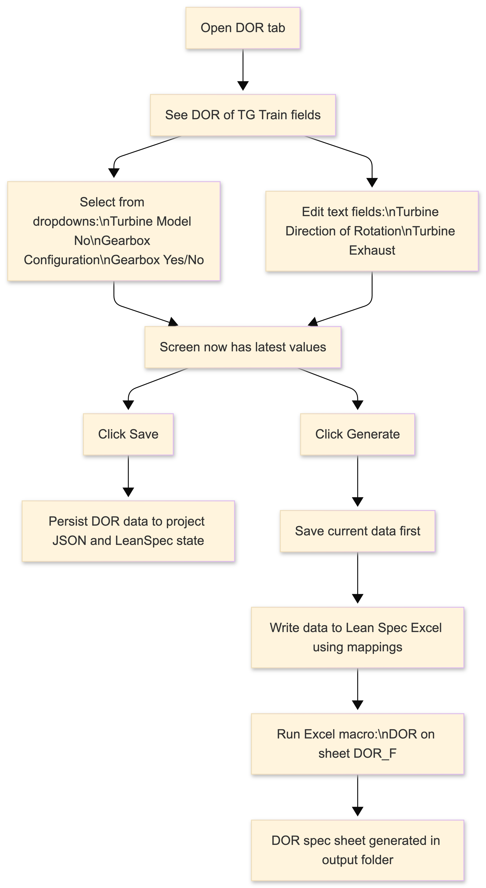

- **Save / Generate toolbar**: `Save` stores DOR inputs for this tab; `Generate` updates the DOR output in the Lean Spec Excel. While running, buttons are disabled and a loading spinner is shown.
- **Revision banner**: set `Rev`, `Prepared`, `Checked`, `Approved`, and `Rev Date` for the DOR output.
- **Turbine & gearbox inputs**
  - **Turbine Model No.** (picker)
  - **Turbine Direction of Rotation** (text entry)
  - **Gearbox Configuration** (picker: `L-R` / `R-L`)
  - **Gearbox** (picker: `Yes` / `No`)
- **Turbine Exhaust (read-only)**
  - **Turbine Exhaust** is shown as **locked/read-only**.
  - Click the **info (i) icon** next to **Turbine Exhaust** to jump to **Scope of Supply (Mechanical) → Steam Turbine → Turbine Exhaust Type** to change it upstream.

---

#### `Utility Requirments`

**Functional (screen-focused)**  
**[TODO: insert UTILITY-func.png]**

- **Save / Generate toolbar**: `Save` stores Utility Requirements values for this tab; `Generate` updates the Utility Requirements output in the Lean Spec Excel. While running, buttons are disabled and a loading spinner is shown.
- **Revision banner**: set `Rev`, `Prepared`, `Checked`, `Approved`, and `Rev Date` for the Utility Requirements output.
- **Input sections (all editable entries on this screen)**:
  - **Lube Oil Coolers**: Flow, Tube Side Design Pressure, Tube Side Pressure Drop.
  - **Alternator Oil Coolers**: Flow, Tube Side Design Pressure, Tube Side Pressure Drop.
  - **Gland Steam Condenser**: Flow, Tube Side Design Pressure, Tube Side Pressure Drop.

- **Save / Generate toolbar**: `Save` stores Utility Requirements values for this tab; `Generate` updates the Utility Requirements output in the Lean Spec Excel. While running, buttons are disabled and a loading spinner is shown.
- **Revision banner**: set `Rev`, `Prepared`, `Checked`, `Approved`, and `Rev Date` for the Utility Requirements output.
- **Input sections (all editable entries on this screen)**:
  - **Lube Oil Coolers**: Flow, Tube Side Design Pressure, Tube Side Pressure Drop.
  - **Alternator Oil Coolers**: Flow, Tube Side Design Pressure, Tube Side Pressure Drop.
  - **Gland Steam Condenser**: Flow, Tube Side Design Pressure, Tube Side Pressure Drop.

---

#### `Gearbox & Coupling` (PSCoupling)

**Functional (screen-focused)**  
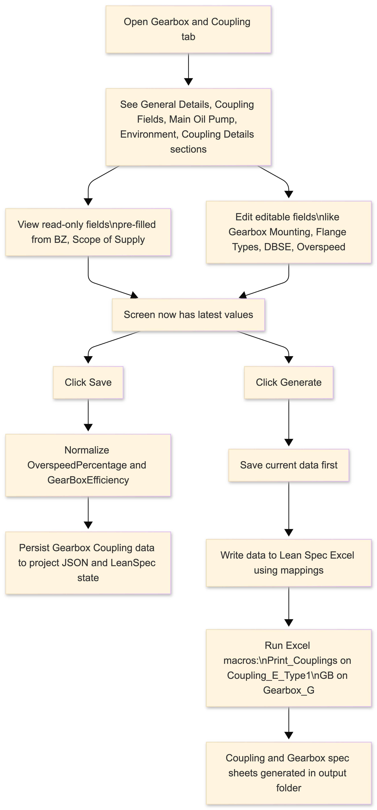

- **Save / Generate toolbar**: `Save` stores Gearbox & Coupling inputs for this tab; `Generate` updates the output in the Lean Spec Excel. While running, buttons are disabled and a loading spinner is shown.
- **Revision banner**: set `Rev`, `Prepared`, `Checked`, `Approved`, and `Rev Date` for the Gearbox & Coupling output.
- **General Details**: **Max. Allowable Noise level (@ 1m)** is editable.
- **Coupling section (editable inputs)**:
  - **Gearbox Mounting on** (picker)
  - **Turbine Side HS Flange Type** (picker) and **HS Side DBSE** (entry)
  - **LS Side DBSE** (entry), **Max. Overspeed time** (entry), **Flange E1** (entry)
  - **Min. Turbine Barring Speed** (entry)
  - **HS Coupling Joint with Turbine** (picker)
  - **Gearbox Side HS Flange Type** (picker) and **Gear Box LS Flange Type** (picker)
  - **Overspeed Percentage (%)** (entry), **Thermal growth towards pinion (mm)** (entry), **Flange E2** (entry)
- **Main oil pump (editable inputs)**:
  - **Main Oil Pump** (Yes/No picker)
  - **Discharge Pressure**, **System Pressure**, **Suction strainer**, **Vertical suction head**, **Horizontal pipe length**, **90 deg Bends**, **Wafer Check valve** (entries)
  - **Flow Required (LPM)** is shown locked/read-only on this screen.
- **Installation Environment**: **Machine Building**, **Outside – covered**, **Outside – not covered** (Yes/No pickers).
- **Atmosphere**: **Dry**, **Wet**, **Wet and Saline**, **Dusty industrial environment** (Yes/No pickers).
- **Turbine Housing Details**: entries **A**, **B**, **C**, **D**.
- **Coupling Details (Vendor to Fill)**: the table is visible on-screen for entering values (Weights, Center of gravity, Torsional stiffness, Short circuit torque, Moment of inertia, plus remarks).
- **Info (i) pointers**: where upstream Scope-of-Supply values are driving locked fields (e.g., alternator rated speed/frequency, gearbox service factor, gear box efficiency), the **info icon** tells you where to change them in **Scope of Supply (Generator / frequency / efficiency/service factor)**.

| Field on UI | Source | Formula / logic (1 line) |
|---|---|---|
| Max. Alternator Output (KW) | **BZ** | No formula (auto-filled from BZ) |
| Alternator Efficiency (%) | **BZ** | If `AlternatorEfficiencyRaw` is numeric → display `0.00%`, else display stored value |
| Alternator Rated Speed (4 poles) (rpm) | **SOS** | If input like `50 Hz` → store `50*30` rpm; else store as-is |
| Calculated Turbine Rated Output (KW) | Calculated | `round0( RatedAlternatorOutput / (GearBoxEfficiency%/100) / (AlternatorEfficiency%/100) )` |
| Turbine Max. Speed (rpm) | **BZ** | No formula (auto-filled from BZ) |
| Alternator Max. Speed (rpm) | Calculated | `round0( AlternatorRatedSpeed * 1.05 )` |
| Gearbox Service Factor | **SOS** | No formula (auto-filled from SOS) |
| Turbine Break away torque (N-m) | **BZ** | On edit: enforce numeric `0.00` (2 decimals) |
| Turbine Co-efficient of friction | **BZ** | No formula (auto-filled from BZ) |
| Alternator Break away torque (N-m) | Lookup | Lookup by `ceil(MaxAlternatorOutput/1000)` → `ElectricalDatasheet[..].BreakawayTorqueOfRotor_kgm` |
| Alternator Co-efficient of friction | Lookup | Lookup by `ceil(MaxAlternatorOutput/1000)` → `ElectricalDatasheet[..].FrictionCoefficient` |
| Low Speed Side P/n | Calculated | `MaxAlternatorOutput / AlternatorRatedSpeed` (formatted `0.##`) |
| Rated Alternator Output (KW) | **BZ** | No formula (auto-filled from BZ) |
| Gear Box Efficiency (%) | **SOS** | On save: normalize to `0.00%` (strip `%`, round 2 decimals, add `%`) |
| Turbine Rated Speed (rpm) | **BZ** | No formula (auto-filled from BZ) |
| Turbine Design Max Coupling Power (KW) | **BZ** | No formula (auto-filled from BZ) |
| Calculated Turbine Max Output (KW) | Calculated | `round0( MaxAlternatorOutput / (GearBoxEfficiency%/100) / (AlternatorEfficiency%/100) )` |
| Turbine Trip Speed (rpm) | Calculated | `round0( TurbineRatedSpeed * 1.10 )` |
| Gearbox Speed ratio | Calculated | `round2( TurbineRatedSpeed / AlternatorRatedSpeed )` |
| Min. Turbine Barring Speed (rpm) | **BZ** | No formula (auto-filled from BZ) |
| Turbine Moment of inertia (Mr2) | **BZ** | On edit: if numeric → `0.00` (2 decimals), else empty |
| Min. Alternator Barring Speed (rpm) | Lookup | Lookup by `ceil(MaxAlternatorOutput/1000)` → `ElectricalDatasheet[..].MinBarringSpeed_RPM` |
| Alternator Moment of inertia (GD2) (kg-m²) | Lookup | Lookup by `ceil(MaxAlternatorOutput/1000)` → `ElectricalDatasheet[..].MomentOfInertia_GD2_kgm2` |
| High Speed Side P/n | Calculated | `MaxAlternatorOutput / TurbineRatedSpeed` (formatted `0.##`) |
| Overspeed Percentage (%) | Manual | On save: normalize to `0.00%` |
| Thermal growth towards pinion (mm) | Manual | If left empty while null → defaults to `12.5` if type is `Axial`, else `NA` |
| Main Oil Pump | **SOS** | If stored value exists use it; else if SOS says `Shaft Driven` → `Yes`, otherwise `No` |
| Flow Required (LPM) | Calculated | If Main Oil Pump ≠ `Yes` → empty; else `round(axial)+round(rear)+round(front)+altRear+altFront` then shown as `0.##+xx` |
| Discharge Pressure (bar(g)) | Manual | If Main Oil Pump = `No` → empty; else default `12` until user edits (then as-is) |
| System Pressure (bar(g)) | Manual | If Main Oil Pump = `No` → empty; else default `4` until user edits (then as-is) |
| Suction strainer (nos) | Manual | If Main Oil Pump = `No` → empty; else default `1` until user edits (then as-is) |
| Vertical Suction head (m) | Manual | If Main Oil Pump = `No` → empty; else default `5` until user edits (then as-is) |
| Horizontal pipe length (m) | Manual | If Main Oil Pump = `No` → empty; else default `20` until user edits (then as-is) |
| 90 deg Bends (nos) | Manual | If Main Oil Pump = `No` → empty; else default `4` until user edits (then as-is) |
| Wafer Check valve (nos) | Manual | If Main Oil Pump = `No` → empty; else default `1` until user edits (then as-is) |

---

#### `Gland Steam Condenser` (PSGSC)

**Functional (screen-focused)**  
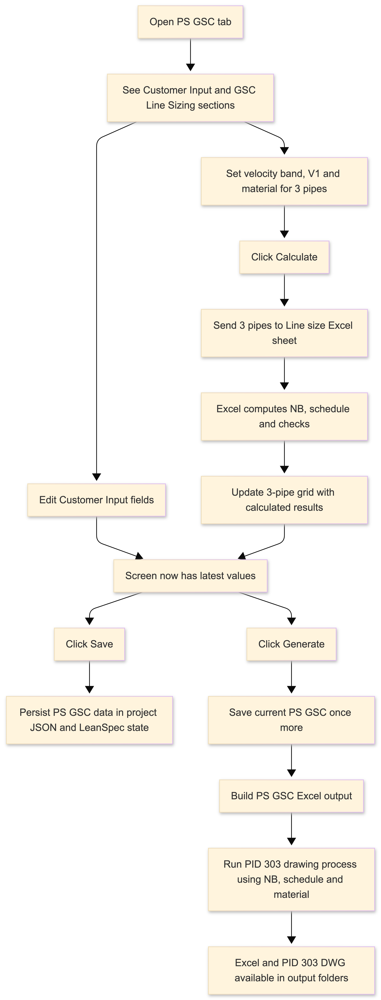

This tab has **2 parts**:

1) **Normal GSC inputs (top form)**  
- Pick **Design Standard**, then set **Corrosion Allowance**, **Factor Type** (Cleanliness vs Fouling), and **Plugging Margin**.  
- Some values are **locked/read-only** (design temps/material thicknesses, blower count, water inlet). If a field is locked, use the **info (i)** icon to jump to the upstream **Scope of Supply** page.

1) **Normal GSC inputs (top form)**  
- You fill basic **GSC design inputs** here. Some values are **locked** because they come from **Scope of Supply (SOS)** (use the **info (i)** icon to open the SOS location and change it there).

1) **Normal GSC inputs (top form)**  
- You fill basic **GSC design inputs** here. Some values are **locked** because they come from **Scope of Supply (SOS)** (use the **info (i)** icon to open the SOS location and change it there).

| Field on UI | Source | UX / Formula (simple) |
|---|---|---|
| Design Standard | Manual | Picker; value used as selected. |
| Tube thickness | SOS | Locked; info (i) → SOS (Gland Steam Condenser → Shell Thickness). If SOS value has units (e.g., `10 BWG`), app keeps only `10`. |
| Tube material | SOS | Locked; info (i) → SOS (Gland Steam Condenser → Tube MOC). |
| Shell material | SOS | Locked; info (i) → SOS (Gland Steam Condenser → Shell MOC). |
| Tube sheet material | Manual | Picker; value used as selected. |
| Water box material | Manual | Picker; value used as selected. |
| Cooling water outlet | SOS | Locked; info (i) → SOS (Project Attributes → Design Basis → Cooler Outlet Temperature). |
| Corrosion Allowance (except tube) | Manual | Picker; value used as selected. |
| Factor Type | Manual | Picker; controls whether you select **Cleanliness Factor** or **Fouling Factor**. |
| Fouling/Cleanliness Factor | Calculated | If Factor Type = **Cleanliness** → value = `85`. If Factor Type = **Fouling** → value = the selected Fouling Factor (`0.001/0.002/0.003`). |
| Plugging Margin | Manual | Picker; value used as selected. |
| No of Blowers | SOS | Locked; info (i) → SOS (Mechanical → Gland Steam Condenser → No of Blower). |
| Cooling water inlet | SOS | Locked; info (i) → SOS (Project Attributes → Design Basis → Cooler Inlet Temperature). |

- Some additional GSC values are **auto-read from the project’s `wlaby.JSON` file** and written into the **generated GSC Excel/output**, even though they are **not shown on the GSC UI screen**.

| Output field (used by GSC) | Comes from | Simple formula (plain text) |
|---|---|---|
| Air inlet flow (Normal) | `wlaby.JSON` | 3600 × MAX( (MaxLoadAirInlet + MaxLoadAirOutlet), (NoLoadAirInlet + NoLoadAirOutlet) ) |
| Air inlet flow (Maximum) | `wlaby.JSON` | 1.5 × Air inlet flow (Normal) |
| Steam inlet flow (Normal) | `wlaby.JSON` | 3600 × MAX( (MaxLoadSteamInlet + MaxLoadSteamOutlet), (NoLoadSteamInlet + NoLoadSteamOutlet) ) |
| Steam inlet flow (Maximum) | `wlaby.JSON` | 1.5 × Steam inlet flow (Normal) |
| Steam/Air inlet temperature (Normal) | `wlaby.JSON` | (MaxLoadMassFlow1 × MaxLoadTemperature1 + MaxLoadMassFlow2 × MaxLoadTemperature2) / (MaxLoadMassFlow1 + MaxLoadMassFlow2) |
| Steam/Air inlet temperature (Maximum) | `wlaby.JSON` | (NoLoadMassFlow1 × NoLoadTemperature1 + NoLoadMassFlow2 × NoLoadTemperature2) / (NoLoadMassFlow1 + NoLoadMassFlow2) |
| Design temperature | `wlaby.JSON` | Steam/Air inlet temperature (Maximum) + 10 |

2) **GSC Line Sizing (below)**  
- Click **Calculate**.  
- You get **cards per GSC line**; for each card set **Velocity band**, **V1**, and **Material**.  
- Use **Show Full Table / Hide Full Table** to switch between summary vs detailed sizing/check table.


---

#### `LOS MVP` (PSLOS)

**Functional (screen-focused)**  
**[TODO: insert LOS-func.png]**


---

#### `Line Sizing` (HMBD line sizing)

**Functional (screen-focused)**  
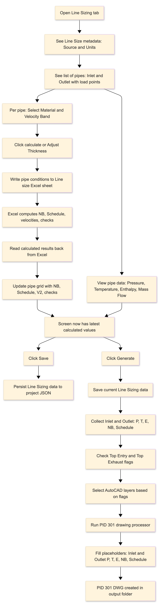

---

### 1) Quick mental model (how to think about the screen)

| Step | What you do (UI) | What the app does (behind the scenes) | What you should see |
|---|---|---|---|
| 1 | Open the tab | Loads `LeanSpec.LineSize` from `BOP_Execution.json` (fallback to `linesize.json`) | Pipe cards + tables appear (pressure/temperature/mass flow already filled) |
| 2 | Pick `Velocity band` + `Velocity V1` | App updates the in-memory model and prepares the Excel input mapping | Your chosen velocity values are reflected in the table inputs |
| 3 | Click **Calculate** | App writes your velocity input into the Excel working sheet, forces an Excel full calculation, then reads back the sizing results | “Selected NB / Schedule / OD / Thickness” and check statuses update in the grid |
| 4 | (Optional) Click **Adjust thickness** | App upgrades to the “next higher” thickness/schedule using internal lookup logic, then repeats the Excel write → calculate → read cycle | Required sizing is satisfied with the upgraded thickness/schedule |
| 5 | Click **Save** / **Generate** | Save persists final values; Generate runs the PID 301 AutoCAD workflow (DWG + PDF background flow) | Outputs are produced/updated |

> Pointer: the grid’s “calculated sizing outputs” are **not** meant to change just by selecting values—you must run **Calculate**.

---

### 2) What each UI control does

| UI element | What it controls | User intent | Back-end behavior |
|---|---|---|---|
| `Velocity band` (picker) | The allowed V1 range for that pipe | Choose the operating band | The app computes the band options based on the pipe’s pressure/temperature (velocity lookup), and selecting a band updates `Velocity V1` using the band midpoint |
| `Velocity V1` (entry) | The main numeric input for sizing | Set the final velocity used for sizing | That V1 value is later written to Excel when you press **Calculate** |
| `Material` (picker) | Pipe material choice | Choose the material used for the sizing context | Stored per pipe in the model; the Excel write/read flow is driven by the sizing inputs/outputs mapping used by the section |
| Per-pipe **Calculate** button | Re-runs sizing for that pipe card | “Recompute sizing with my current inputs” | Write your V1 input into `TPE_Lean_Specification_R9_1.xlsm` → force Excel full calculation → read output cells → update the grid for that pipe |
| Per-pipe **Adjust thickness** | Upgrades thickness/schedule | “Get the next higher option if required thickness isn’t met” | App decides the next thickness/schedule using the pipe schedule lookup, writes thickness/schedule into Excel, then repeats the Excel read-back refresh |
| `Show Full Table / Hide Full Table` | Table density | See more (checks/detailed values) or less | Toggles visibility of extra grid columns in the same data model |

---

### 3) Excel flow (what Excel is doing for Line Sizing)

| Part | Excel workbook / sheet | What the app writes | What the app reads back |
|---|---|---|---|
| Initial setup (when tab opens) | `TPE_Lean_Specification_R9_1.xlsm` → `Line size_Input` | Header + the pipe/load-point identity inputs | (Initial calculated outputs are typically visible in the UI table model after load) |
| Per-pipe **Calculate** | `TPE_Lean_Specification_R9_1.xlsm` → `Line size_Output` | The selected velocity input (per pipe block) | Sizing result cells such as: `Selected NB`, `Selected Schedule`, `Selected OD`, `Selected Thk`, `Actual V2`, and check statuses |
| Per-pipe **Adjust thickness** | `TPE_Lean_Specification_R9_1.xlsm` → `Line size_Output` | Writes updated thickness + schedule cells for the current pipe’s load points | Same set of sizing/check outputs is read back and the grid refreshes |

**Important pointer:**  
The app does **not** rely on a “Generate-only macro” to update sizing for this section. The refresh uses Excel calculation (the app forces Excel full calculation when it reads output cells), then it reads the outputs from the workbook.

---

### 4) Data flow inside the app (save/generate expectations)

| Action | What gets updated | Where it’s persisted | Downstream impact |
|---|---|---|---|
| Open tab | Creates pipe cards + loads the current saved state | In-memory model | You can immediately see current sizing context |
| **Calculate** | Updates the in-memory outputs for that pipe card | (Not persisted yet) | Grid updates; you can visually verify check columns |
| **Adjust thickness** | Updates selected thickness/schedule and refreshed computed outputs | (Not persisted yet) | Grid updates again with the upgraded option |
| **Save** | Persists the final selected values (and the latest Excel-derived outputs) | `BOP_Execution.json` → `LeanSpec.LineSize` | Next steps use these saved values |
| **Generate** | Runs PID 301 drawing automation using saved line sizing selections | AutoCAD/PDF output folders | Produces/updates DWG and triggers PDF generation in background |

---

### 5) Troubleshooting (if results don’t update after Calculate)

| Symptom | Likely cause | What to try |
|---|---|---|
| Table values don’t change after **Calculate** | Excel calculation not recomputing (environment/add-in/workbook state) or output cells not being recalculated | Confirm you’re clicking the per-pipe **Calculate** button (not only changing inputs); re-open the tab and try again |
| Values fill on open but never change | Inputs-only write succeeded, but Excel didn’t recompute the output cells on that machine | Have a user manually open the workbook and confirm `Line size_Output` recalculates; also check Excel calculation settings and add-in availability |
| Only one pipe updates | Reading/writing mapping for pipe block is tied to the selected pipe card | Ensure you are pressing **Calculate** inside the specific pipe card you expect to update |

---

### Electric

The **Electric** step is part of **BoP Execution**. It includes tab-wise electrical spec capture and downstream automation (Excel macros and SLD AutoCAD outputs).

---

#### Common screen behavior (applies to most Electric tabs)

| Screen element | What it does |
|---|---|
| Left tab navigation (`ElectricalPage.xaml`) | `ElectricalPageViewModel` recreates tab content through factories/singletons. |
| `Save` / `Generate` | Save writes to `BOP_Execution.json`; Generate runs Excel module generation and tab-specific automation. |
| Revision banner | Appears on tabs with revision metadata integration. |
| Info icon `(i)` | Points to upstream OI/SOS sources. |

---

#### Electric tab order (as shown in UI)

1. `Alternator`  
2. `AVR`  
3. `LT motor spec`  
4. `SLD Calculators`  
5. `SLD`  
6. `Control Panel Layout (CPL)`  
7. `LPBS`  
8. `Power cable schedule`  
9. `Control cable`

---

#### `Alternator`

**Functional (screen-focused)**  
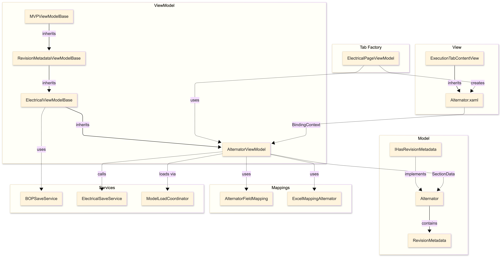

---

### 1) Quick mental model (what this tab is doing)

| What you see | What it means | What you should do |
|---|---|---|
| Most fields are grey/locked | They come from **OI / SOS** (upstream selection). This tab is mainly “display + context” for alternator spec inputs. | Use the **(i)** icons to fix upstream values if something looks wrong. |
| A few fields are editable (highlighted by being enabled) | These are “allowed overrides” that the app forwards into the alternator Excel template before generating outputs. | Edit these only if the project requires an override (example: `Max. kW during VWO condition`, `Color Shade`, `Coat Thickness`, `SCR`, etc.). |
| `MVA (calculated)` and `Rating (calculated)` | These are calculated in the app from the two core inputs: `Power Output (MW)` and `Power Factor (lag)`. | Don’t try to edit them. If they look wrong, check MW / PF upstream. |
| `Save` / `Generate` toolbar | `Save` persists your section data into `BOP_Execution.json`. `Generate` fills the Excel “Input Sheet” and runs the alternator macro automation. | Use `Save` after edits; then use `Generate` to create deliverables. |

---

### 2) What the user does (step-by-step flow)

1. Open the **Alternator** tab  
   - The app loads `Electric.Alternator` from `BOP_Execution.json` (fallback to upstream json if needed).
   - The UI shows upstream values as read-only fields and sets conditional pickers based on model state.

2. Review upstream values (locked fields)
   - Anything shown with an **(i)** icon is “controlled upstream”.
   - If a locked value is incorrect, click the **(i)** and follow the pointer to the correct place in **OI/SOS**.

3. Make allowed overrides (editable fields only)
   Typical examples in this UI include:
   - `Max. kW during VWO condition`
   - `Color Shade` + `Coat Thickness (Microns)` (Painting section)
   - `Cooling Redundancy (%)`
   - `SCR` + `Reactance Xd (unsat/sat)`
   - Some pickers unlock only when the underlying model indicates they should (examples: terminal box types based on busduct; bearing mounting based on bearing type).

4. Click **Save**
   - Persists changes into `BOP_Execution.json` under `Electric.Alternator`.

5. Click **Generate**
   - The app prepares the Excel module and runs the alternator macro automation.
   - The Excel macro outputs the alternator deliverables for the project.

---

### 3) Key interactive logic the UI uses

| UI behavior | What triggers it | What happens |
|---|---|---|
| `MVA (calculated)` updates | `Power Output (MW)` or `Power Factor (lag)` changes | Computes `MVA = MW / PF(lag)` and formats to 2 decimals |
| `Rating (calculated)` updates | same inputs as MVA (and phase/frequency/voltage) | Builds a readable summary string for display |
| Some pickers become editable/readonly | based on upstream text patterns (busduct/bearing type/etc.) | Options are constrained to valid sets; invalid stored values are corrected to defaults |
| `Cooling Redundancy (%)` special behavior | depends on cooler config flange selection | The UI may lock a default (or force a special value) unless user sets it |

---

### 4) What happens behind the scenes (Application → Excel)

#### Load
- On open, the app loads `Alternator` model using `AlternatorFieldMapping.FieldMappings`.
- Sources mix upstream files:
  - **OI**: WBS/Project/Customer/Consultant
  - **SOS**: generator electrical/mechanical/cooler/bearing/insulation inputs
  - **BZ / DataToBOP & HEX**: selected derived inputs (example: efficiency values)

#### Generate (Excel automation)
- Workbook: `PS_Alternator_v5_2.xlsm`
- Sheet: `Input Sheet`
- Macro executed: `GENERATE`
- Before running the macro, the app writes a set of alternator fields into fixed Excel cells using `ExcelMappingAlternator`.
  - Example categories: packing advice, max kW during VWO, direction of rotation, painting, cooler inputs, oil/bearing, SCR/reactance, efficiency values, noise/vibration, and excitation system.
- Note: `MvaCalculated` and `Rating` are **UI calculated display fields** and are **not mapped** into the Excel template in `ExcelMappingAlternator` (they are intentionally commented out).

---

### 5) Field naming pointer (so the reader doesn’t get lost)

- Pointer: If a field is locked, you should not “fix” it inside this tab—use the `(i)` icon and correct the upstream OI/SOS value.
- Pointer: If `MVA` or `Rating` doesn’t look correct, it’s because MW or PF inputs are wrong upstream; the app recalculates them automatically.

---

### 6) Calculated / business-logic fields table

| UI field (as shown in Alternator tab) | Field source (where it comes from) | How it is evaluated (business logic / formula) |
|---|---|---|
| `MVA (calculated)` | SOS: `Power Output (MW)` + SOS: `Power Factor (lag)` | Computes `MVA = MW / PF(lag)`, rounded to **2 decimals** and formatted as `F2`. UI display only; Excel mapping for `MvaCalculated` is commented out. |
| `Rating (calculated)` | Phase + SOS: `Power Output (MW)`, `Power Factor (lag)`, `Voltage (kV)`, `Frequency (Hz)` (and computed MVA) | Builds a readable summary string by concatenating available pieces: `Phase`, `MW`, `MVA`, `kV`, `PF (Lag)`, `Hz`. UI display only; Excel mapping for `Rating` is commented out. |
| `Active Power (kW)` | SOS: `Power Output (MW)` | Computes `ActivePowerKW = MW * 1000`, rounded to **3 decimals**. UI display only; Excel mapping for `ActivePowerKW` is commented out. |
| `Voltage (kV)` | SOS: `VoltageKV` | If user-provided value contains extra tokens, keeps the **first token**. If it doesn’t include `kV`, it appends `kV`. (The textbox is locked in UI, but the normalization logic still exists.) |
| `Frequency (Hz)` | SOS: `FrequencyHz` | If the stored string has extra tokens (space-separated), keeps the **first token** only. |
| `DC Voltage (V)` | SOS: `DCVoltageV` | If the stored value has units/text, keeps the **first token** and removes `"V"`. |
| `Aux AC Voltage (V)` | SOS: `AuxACVoltageV` | Same normalization as DC: keep first token and remove `"V"`. |
| `UPS AC Voltage (V)` | SOS: `UPSACVoltageV` | Same normalization as DC: keep first token and remove `"V"`. |
| `3-Ph AC Voltage (V)` | SOS: `ThreePhACVoltageV` | Same normalization as DC: keep first token and remove `"V"`. |
| `A. DC` (Voltage Levels block) | Derived from `DC Voltage (V)` | Displays `A. DC : {DCVoltageV} DC, 2 - Wire` when DC voltage exists. |
| `B. AUX AC` (Voltage Levels block) | Derived from `Aux AC Voltage (V)` + `Aux AC Frequency (Hz)` | Displays `B. AUX AC : 1-Ph, {AuxVoltage}V AC, {AuxFreq}Hz (For Space Heaters as well as Other Aux Ckt)` when both voltage and frequency exist. |
| `C. UPS` (Voltage Levels block) | Derived from `UPS AC Voltage (V)` + `UPS Frequency (Hz)` | Displays `C. UPS : 1-Ph, {UPSVoltage}V AC, {UPSFreq}Hz (For Water Leakage Detector)` when both exist; also builds `LocalGaugeLeakage` string (minimum 1 tray + newline + this UPS string). |
| `D. 3-Ph AC` (Voltage Levels block) | Derived from `3-Ph AC Voltage (V)` + `3-Ph Frequency (Hz)` | Displays `D. 3-PH AC : 3-Ph, {Voltage}V AC, {Freq}Hz` when both exist. |
| `Packing Type` | SOS: `DesignBasisPacking` | Keyword normalization: contains `Domestic` → `Domestic`; contains `Export` → `Export sea worthy`; otherwise → `As per Customer's Specification`. |
| `Packing Guideline` | SOS: `DesignBasisPacking` | Keyword normalization: contains `Domestic`/`Export` → `Siemens packaging guidline`; otherwise → `Customer packaging guidline`. |
| `Insulation Class` (entries: Main Stator / Rotor / Exciter Armature / Exciter Field / PMG Stator) | SOS insulation temp class fields | **Last-character rule**: getter returns only `value[^1]` (last character) and setter stores only the last character. |
| `Temperature Rise Class` (entries: Rated Main Stator / Vf Main Stator / Main Rotor / Exciter Armature / Exciter Field / PMG Stator) | SOS temp rise class fields | **Last-character rule**: same `value[^1]` behavior for all temperature rise class entries. |
| `Cooling Redundancy (%)` | Derived from `Cooler Config / Flange` (C83) and optional manual override | Getter returns `"66%"` only when `CoolerConfigFlange` contains both `2` and `66%`; otherwise returns empty string. Setting the value stores manual value. |
| `Cooling Temp Rise (°C)` | Derived from `CoolingTempRiseRaw` − `CoolingInletTemp` | If `CoolingTempRiseRaw` parses to a number and inlet temp parses too: `delta = rawX - inlet`, rounded to **3 decimals**. If inlet can’t parse: returns rounded raw value. If raw is empty: returns null. |
| `Cooler Tube Material` | SOS: `Cooler Tube Material` | Normalizes by keyword: contains `304` → `SS 304 Seamless`; contains `316` → `SS 316L`; contains `Brass` → `ADMIRALTY BRASS`; contains `CuNi` → `CuNi`. |
| `Cooler Tube Test Pressure (bar)` | Derived from `Cooler Tube Design Pressure` | If design pressure is exactly `"5"` → test pressure `"10"`. Else if design pressure is numeric → `test = design * 1.5`. Else → `NA`. |
| `Altitude above sea level (MSL)` | SOS: `Site Altitude` | Bucketizes + controls visibility: if input contains `<` OR numeric <= 1000 → shows `"< 1000 above MSL"` and hides the “if Altitude > 1000” line. Else → shows `"> 1000 above MSL"` and shows the conditional line. |
| `if Altitude > 1000` | Derived from the altitude bucket | The conditional line is displayed only when altitude is above 1000 (`IfAltitudeAboveSeaLevelvisible=true`). |
| `Type of Main terminal box` | SOS: `Generator Line Side Connection` | Checks if the source contains `busduct` (case-insensitive). If busduct → options are `Phase Segregated` / `Phase Segregated FRP Barrier`, else → `NON-Phase-Separated`. If current value is invalid, it defaults to the first option. |
| `Type of Neutral terminal box` | SOS: `Neutral Side Cubicle Neutral CT` | Same busduct-based rule as main terminal box. |
| `Arrangement / mounting form` | SOS: `Bearing Type` | If bearing type is `Sleeve` → options: `End shield mounted`, `Pedestal mounted` (picker enabled). If `Anti-friction` → options: `As per OEM`. Otherwise → includes common options + `As per OEM`. If invalid, defaults to first option. |
| `Piping material for lub. oil outlet` | SOS: `Return Oil Piping` | Keyword normalization: contains `106` → `Piping of SA106GrB with ANSI Flange`; contains `312` → `Piping of Stainless Steel with ANSI Flange (Piping of SA312TP304 with ANSI Flange)`. |
| `Type of flange (LS standard / Hybrid / EP)` + `No of Key` | Derived from `Type of coupling (Key or flange)` | When coupling type changes: `Flange` → `FlangeType="LS/Hybrid"`, `NoOfKey="False"`; `Key` → `FlangeType="NA"`, `NoOfKey="2"`; `EP flange` → `FlangeType="LS310-mk2-Ref doc-0-02479-90310-11"`, `NoOfKey="False"`. |
| `Noise limit (dB(A)) (Calculated)` | SOS: `Noise level of STG set at 1m distance` | If the input contains `+` tolerances, truncates to the part before `+` and appends `"(without poisitive tolerence)"`. |
| `Winding temperature (RTD) (Calculated)` | Derived from `Power Output (MW)` | If `PowerOutputMW > 5` → `15 Nos duplex` else → `6 Nos duplex`. |
| `Core temperature (RTD) (Calculated)` | Derived from `Power Output (MW)` | If `PowerOutputMW > 5` → `6 Nos duplex` else → `NA`. |
| `Exciter field temperature (RTD) (Calculated)` | Derived from `Power Output (MW)` | If `PowerOutputMW > 5` → `2 Nos duplex` else → `NA`. |
| `Water leakage detector with relay (Local gauge) (Calculated)` | Derived from UPS voltage/frequency | Constructs the string: `Minimum 1 no per collecting tray` + newline + `C. UPS : 1-Ph, {UPS V}V AC, {UPS Hz}Hz (For Water Leakage Detector)`. |
| `Excitation System (with / without PMG)` | SOS: `Generator PMG or without PMG` | Normalizes: contains `"With PMG"` → stores exactly `With PMG`; contains `"W/O"` → stores exactly `Without PMG`. |

---

#### `AVR` (Automatic Voltage Regulator)

**Functional (screen-focused)**  
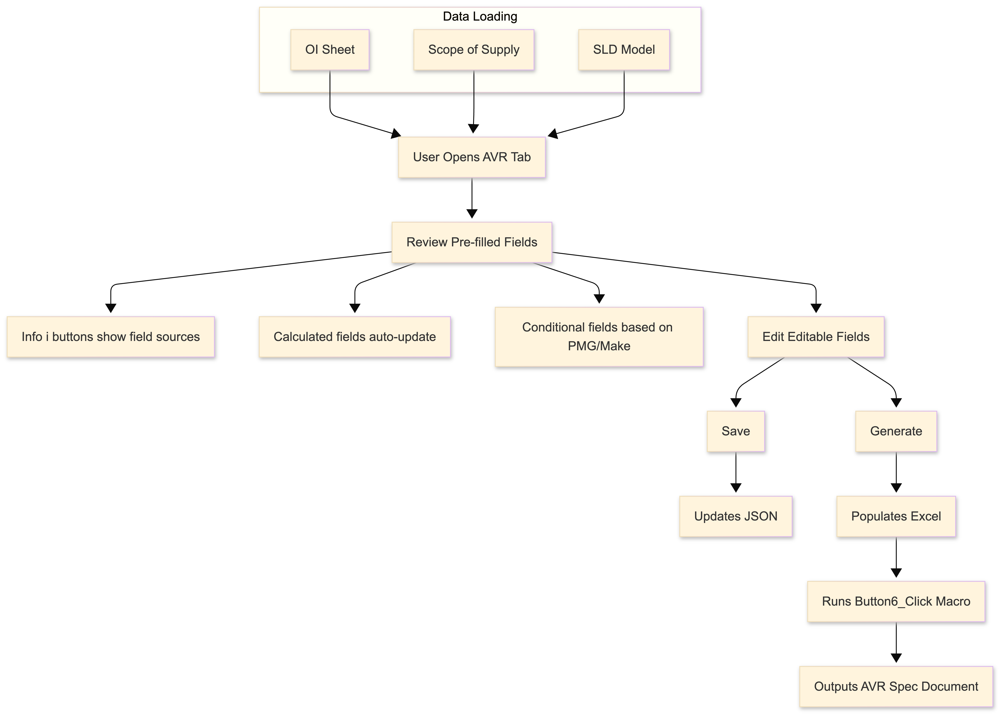

---

### 1) Quick mental model (what this tab is doing)

- **This screen is a “specification + automation” page** for AVR deliverables.
- Most values are **pulled from upstream inputs** you already filled earlier:
  - **Order Indent (OI)**: project / customer identifiers
  - **Scope of Supply (SOS)**: generator ratings + auxiliary supply levels + panel details
  - **Electrical → SLD input**: AVR module text + CT/PT texts used for drawing strings
- **Save** stores the AVR page values into the project’s BoP execution data.
- **Generate** fills the AVR Excel tool and runs its built-in macro to produce the output documents.

---

### 2) What the user does (practical flow)

1. **Open AVR tab**
   - Screen loads and shows a mix of editable and locked fields.

2. **Set `Unit No.`**
   - This is used to build the output file name.

3. **Verify generator rating inputs (read-only here)**
   - If MW / kV / PF / Hz look wrong, **fix them in SOS** (not here).

4. **Verify auxiliary supply levels (read-only here)**
   - AUX / UPS / 3‑Ph supply entries are **taken from SOS** and then split into Voltage + Frequency on this screen.

5. **Review Excitation / Enclosure / Transformer fields**
   - Some are **user-selectable** on this tab (pickers / entries).
   - Some remain **locked from SOS/SLD**.

6. Click **Save**, then **Generate**
   - **Generate** populates the Excel template and runs the AVR macro to create outputs.

---

### 3) What happens behind the scenes (Application → Excel)

- **Load**
  - Reads upstream OI + SOS + SLD values and pre-fills AVR.
  - AVR also formats some “display strings” (like the Special Voltage Level lines) based on those values.

- **Save**
  - Stores this tab’s state into `BOP_Execution.json` under `Electric → AVR`.

- **Generate**
  - Excel template: `AVR_Spec_Automation_Tool_v3.xlsm`
  - The app writes mapped values into Excel and runs the template’s macro (so Excel produces the final output).

---

### 4) Field grid (user-friendly source + exact upstream location + logic)

> **Legend (upstream pages)**  
> - **OI**: Order Indent (uploaded/filled before BoP Execution)  
> - **SOS**: Scope of Supply (uploaded/filled before BoP Execution)  
> - **SLD**: Electrical SLD input JSON (uploaded/filled before BoP Execution)  
> - **Manual**: You edit it on the AVR tab

| AVR UI field | Where the value comes from (what the user understands) | How the value is evaluated on AVR tab |
|---|---|---|
| `Unit No.` | **Manual (AVR tab)** | Pick `U1/U2/...` and it is saved for this project/unit. |
| `Output File Name` | **Derived** from OI WBS + `Unit No.` | Built like `{WBS Type}{WBS No}_{UnitNo}_637180002_Rev` (revision is handled with the revision fields / Excel output). |
| `Power Output (MW)` | **SOS → Generator → MW** | Shown as-is; used for calculated MVA and rating text. |
| `Power Factor (Lag)` | **SOS → Generator → Power factor** | Shown as-is; used for calculated MVA and rating text. |
| `Voltage (kV)` | **SOS → Generator → Voltage rating** (custom voltage when selected) | AVR keeps only the numeric part (example: `11 kV` → `11`). Used for rating + PTR text. |
| `Frequency (Hz)` | **SOS → Generator → Frequency level** | If SOS value includes units (example `50 Hz`), AVR keeps only `50`. |
| `MVA (calculated)` | **Calculated** from SOS MW + SOS PF | `MVA = MW ÷ PF`, rounded to **2 decimals**. |
| `Rating` | **Calculated** from Phase + MW + MVA + kV + PF + Hz | Builds one combined string (only includes parts that exist). |
| `DC Voltage (V)` | **SOS → Auxiliary Electrical Equipment → DC supply** (example: `110V DC`) | AVR extracts the **voltage number** (example `110V DC` → `110`). |
| `Aux AC Voltage (V)` | **SOS → Auxiliary Electrical Equipment → Aux supply** (example: `230V AC 50Hz`) | AVR extracts the **voltage number** (example → `230`). |
| `Aux AC Frequency (Hz)` | **SOS → Auxiliary Electrical Equipment → Aux supply** (same SOS field as above) | AVR extracts the **frequency number** from the tail (example → `50`). |
| `UPS AC Voltage (V)` | **SOS → Auxiliary Electrical Equipment → UPS1 supply** (example: `230V AC 50Hz`) | AVR extracts the **voltage number** (example → `230`). |
| `UPS Frequency (Hz)` | **SOS → Auxiliary Electrical Equipment → UPS1 supply** (same SOS field as above) | AVR extracts the **frequency number** (example → `50`). |
| `3‑Ph AC Voltage (V)` | **SOS → Auxiliary Electrical Equipment → 3‑Ph supply** (example: `415V AC 50Hz`) | AVR extracts the **voltage number** (example → `415`). |
| `3‑Ph Frequency (Hz)` | **SOS → Auxiliary Electrical Equipment → 3‑Ph supply** (same SOS field as above) | AVR extracts the **frequency number** (example → `50`). |
| `Special Voltage Levels` (A/B/C/D lines) | **Derived** from DC/AUX/UPS/3‑Ph voltage + frequency | AVR builds readable sentences like `B. AUX AC : 1‑Ph, 230V AC, 50Hz ...` (display fields). |
| `Packing Type` | **SOS → Design Basis → Packing** | Normalized wording (Domestic / Export sea worthy / As per customer specification). |
| `Packing Guideline` | **SOS → Design Basis → Packing** | Normalized guideline text (Siemens vs Customer guideline). |
| `Altitude above sea level` | **SOS → Design Basis → Site altitude** | Shown as-is (used as site condition text). |
| `Make of AVR` | **SLD → AVR module text** | If the SLD module text contains `SIEMENS`/`ABB`, AVR normalizes it to just `SIEMENS` or `ABB`. |
| `Type of module` | **Manual (AVR tab)** but UI depends on Make | If Make is `ABB`, you select from a dropdown (`Unitrol ...`). If `SIEMENS`, you type it in. |
| `No of Auto channel` | **Derived from SLD AVR module text** | If SLD text contains `1A` → `1 Nos.` else `2 Nos.` |
| `No of Manual channel` | **Derived from SLD AVR module text** | If SLD text contains `1M` → `1 Nos.` else `2 Nos.` |
| `Paint shade` | **SOS → Panel → Paint shade** | If the SOS text doesn’t already include “Texture”, AVR appends a second line with texture-finish instruction text. |
| `Type of connection (PMG / Main HT)` | **SOS → Generator → PMG / Without PMG** | Normalized to either `With PMG` or `Without PMG (Main HT Excitation transformer)`. Drives “Rated Primary Voltage/Frequency” behavior. |
| `Standby (Backup) LV excitation transformer` | **SOS → Generator → LT excitation transformer for AVR** | Normalized: `Yes` → `Required`, `No` → `Not Required`. |
| `Rated Primary voltage (kV)` | **Derived** from connection + generator voltage | If connection is `With PMG` → `NA`, else equals generator kV shown above. |
| `Rated Frequency (Hz)` (transformer data) | **Derived** from connection + generator frequency | If connection is `With PMG` → `NA`, else equals generator Hz shown above. |
| `Standby phase` | **Derived** from connection | Defaults to `Three` when `With PMG`, else defaults to `Single` (and saves that default). |
| `Standby primary voltage (V)` | **Derived** from 3‑Ph AC voltage | Mirrors the 3‑Ph AC voltage value. |
| `Standby secondary voltage (V)` | **Manual (AVR tab)** | Defaults to `180V` if empty; user can choose `180V/200V/220V`. |
| `Standby kVA rating` | **Manual (AVR tab)** | Defaults to `5KVA` if empty; user can choose `5KVA/8KVA`. |
| `Standby vector group` | **Manual (AVR tab)** | Options include `Not Applicable` and `Dy5` (default is `Dy5`). |
| `GPR Quantity` (Drawings) | **SOS → Panel → GPR quantity** | Normalized: contains `1` → `One`, contains `2` → `Two`. |
| `CTR` / `CT Detail` (Drawings) | **SLD → Line-side CT text** | AVR parses the CT string to extract `CTR`, `CLASS`, `VA`, then formats a drawing-ready sentence. |
| `PTR` (Drawings) | **Derived** from generator kV | Converts kV to volts and formats ratio text used in drawings. |
| `PT Detail` (Drawings) | **SLD → Line-side PT text** | AVR parses section count (`SEC`), plus `CLASS` and `VA`, then formats drawing-ready PT detail text. |
| `UPS VOLTAGE / DC VOLTAGE / AC Aux VOLTAGE` (Drawings) | **Derived** from the voltage/frequency values above | Builds strings like `230V AC, 50Hz` (or partial if one piece is missing). |

---

#### `LT Motor`

**Functional (screen-focused)**  
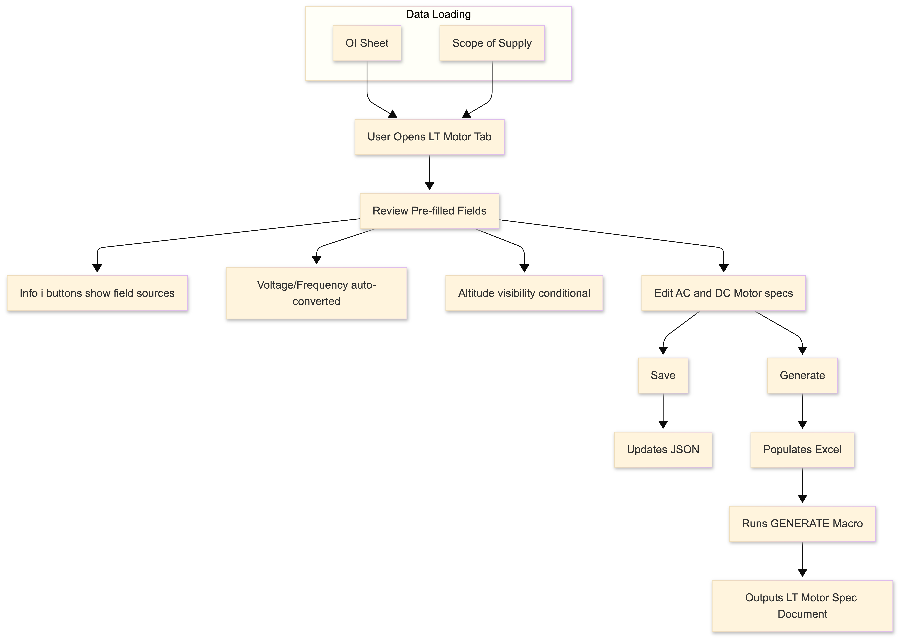

---

### 1) Quick mental model (what this tab is doing)

- This tab prepares the **LT Motor Specification** deliverable.
- It contains **two parts** on one screen:
  - **AC Motor Spec** (basic data, duty/temperature, DOP, packing line)
  - **DC Motor Spec** (basic data, duty/temperature, DOP, packing line)
- Most fields are **locked** because they are driven from upstream:
  - **OI (Order Indent)**: WBS / Project / Customer identifiers
  - **SOS (Scope of Supply)**: generator voltage & frequency, auxiliary supplies, site altitude, motor IP rating, motor efficiency class, packing, DC supply, DC starting method
- You only choose a few **dropdown fields** here (design codes, DC cooling, etc.).
- **Save** stores values for this tab; **Generate** fills the LT Motor Excel tool and runs its macro to produce outputs.

---

### 2) What the user does (practical flow)

1. Open **LT Motor**
   - Values load automatically from upstream OI/SOS.

2. Set **Unit No.**
   - Output file naming is unit-specific.

3. Review AC motor section (mostly read-only)
   - Rated voltage/frequency and auxiliary single-phase voltage come from SOS and are formatted for the spec.

4. Review DC motor section (mostly read-only)
   - DC rated voltage + starting method come from SOS and are formatted for the spec.
   - Choose the **Cooling** dropdown if required.

5. Click **Save**, then **Generate**
   - Generate writes into the Excel template and runs its macro to generate the final LT Motor spec output.

---

### 3) What happens behind the scenes (Application → Excel)

- **Load**
  - Pulls OI + SOS values and pre-fills the LT Motor model.
  - Some fields are **reformatted** (for example: kV → V, or “IE-2” → “IE2”).

- **Save**
  - Stores this tab’s state into `BOP_Execution.json` under `Electric → LTMotor`.

- **Generate**
  - Excel template: `LT_Motor_Spec_v5_1.xlsm`
  - Macro run: `Input Sheet` / `GENERATE`

---

### 4) Field grid (user-friendly source + exact upstream location + logic)

> **Legend (upstream pages)**  
> - **OI**: Order Indent (uploaded/filled before BoP Execution)  
> - **SOS**: Scope of Supply (uploaded/filled before BoP Execution)  
> - **Manual**: You edit it on the LT Motor tab

| LT Motor UI field | Where the value comes from (what the user understands) | How it is evaluated on LT Motor tab |
|---|---|---|
| `WBS Type` / `WBS No` | **OI → General Details → WBS** | Locked. If OI WBS is like `I2OP-1234`, screen shows `WBS Type = I2OP` and `WBS No = 1234`. |
| `Project` / `Customer` / `End Customer` / `Consultant` | **OI → General Details** | Locked. Shown as uploaded in OI. |
| `Purchaser` | **Fixed text** | Always `M/s SIEMENS ENERGY` (locked). |
| `Unit No.` | **Manual (LT Motor tab)** | Picker `U1/U2/...` used in output file name. |
| `OutputFileName` | **Derived** from OI WBS + `Unit No.` | Built like `{WBS Type}{WBS No}_{UnitNo}_637180002_Rev` (revision comes from the revision banner / Excel output). |
| `Type of Packing` | **SOS → Design Basis → Packing** | Locked. Normalized wording (Domestic / Export sea worthy / As per customer specification). |
| `Applicable Packing Guideline` | **SOS → Design Basis → Packing** | Locked. Normalized guideline text (Siemens vs Customer guideline). |

#### AC Motor Spec – Basic Data
| LT Motor UI field | Where the value comes from | How it is evaluated |
|---|---|---|
| `Design Code` | **Manual (LT Motor tab)** | Picker (default is `Indian Standard`). |
| `Rated Voltage` | **SOS → Generator → Voltage rating (custom value)** | Locked. The app extracts the numeric kV and converts to volts (example `3.3kV ±10%` → `3300V`). |
| `Rated Frequency (Hz)` | **SOS → Generator → Frequency level** | Locked. If SOS value includes units (example `50 Hz`), screen keeps only `50`. |
| `Single Phase Auxiliary Voltage (V)` | **SOS → Auxiliary Electrical Equipment → AUX 1‑Ph supply** | Locked. Extracts the leading number and formats as volts (example `230V AC 50Hz` → `230V`). |

#### AC Motor Spec – Temperature, Efficiency and Duty
| LT Motor UI field | Where the value comes from | How it is evaluated |
|---|---|---|
| `Altitude` | **SOS → Design Basis → Site altitude** | Locked, but drives visibility of the next line. If SOS altitude contains `<` it is treated as `< 1000 above MSL`. Otherwise it is treated as `> 1000 above MSL`. |
| `If Altitude >1000` (extra line) | **Derived** from SOS altitude | Only shows when altitude is treated as `> 1000`. Displays: `Altitude = {actual altitude} m above MSL`. |
| `Efficiency Class` | **SOS → Auxiliary Electrical Equipment → AC/DC motor efficiency grade** | Locked. Removes the dash for display (example `IE-2` → `IE2`). |

#### AC Motor Spec – DOP and Painting
| LT Motor UI field | Where the value comes from | How it is evaluated |
|---|---|---|
| `Degree of Protection` | **SOS → Auxiliary Electrical Equipment → AC/DC motor IP ratings** | Locked. Shown as-is (example `IP54`). |

#### AC Motor Spec – Other Special Requirement
| LT Motor UI field | Where the value comes from | How it is evaluated |
|---|---|---|
| `Packing` | **SOS → Design Basis → Packing** | Locked. Converted into a more “spec sentence” style (Domestic/Export/Customer contract wording). |

---

#### DC Motor Spec – Basic Data
| LT Motor UI field | Where the value comes from | How it is evaluated |
|---|---|---|
| `Design Code` | **Manual (LT Motor tab)** | Picker (default is `Indian Standard`). |
| `Rated Voltage` | **SOS → Auxiliary Electrical Equipment → DC supply** | Locked. If SOS value includes units (example `110V DC`), screen keeps only the first token (example `110V`). |
| `Method of Starting` | **SOS → Auxiliary Electrical Equipment → EOP DC resistor starter** | Locked. Normalized: `2 Step` → `Resistive - 2-Step`, `3 Step` → `Resistive - 3-Step`. |

#### DC Motor Spec – Temperature and Duty
| LT Motor UI field | Where the value comes from | How it is evaluated |
|---|---|---|
| `Altitude` | **SOS → Design Basis → Site altitude** | Same behavior as AC altitude (drives visibility of the next line). |
| `If Altitude >1000` (extra line) | **Derived** from SOS altitude | Only shows when altitude is treated as `> 1000`. Displays: `Altitude = {actual altitude} m above MSL`. |
| `Cooling` | **Manual (LT Motor tab)** | Picker (examples: `TESC`, `TEFC`, `See Remark`). |

#### DC Motor Spec – DOP and Painting
| LT Motor UI field | Where the value comes from | How it is evaluated |
|---|---|---|
| `Degree of Protection` | **SOS → Auxiliary Electrical Equipment → AC/DC motor IP ratings** | Locked. Shown as-is (example `IP54`). |

#### DC Motor Spec – Other Special Requirement
| LT Motor UI field | Where the value comes from | How it is evaluated |
|---|---|---|
| `Packing` | **SOS → Design Basis → Packing** | Locked. Converted into a more “spec sentence” style (Domestic/Export/Customer contract wording). |

---

#### `SLD Calculators` (CT / PT / NGR / NGT)

**Functional (screen-focused)**  
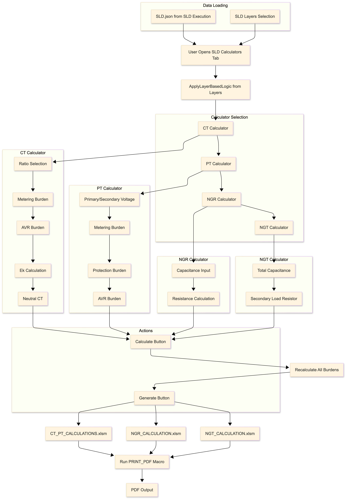

---

### 1) Quick mental model (what this screen is doing)

- This is a **calculation workspace** for **CT ratio and burden**, **PT burden**, and (when applicable) **NGR** or **NGT** sizing — tied to the same **SLD project inputs** as SLD Execution (generator kV/MW/PF, layers, AVR text, fault level, etc.).
- You **switch calculator mode** with the top buttons: **CT Calculator**, **PT Calculator**, and (only when the project type allows it) **NGR Calculator** or **NGT Calculator**.
- **`Save`** writes the full calculator state to a JSON file next to your auxiliary inputs so it can be reloaded.
- **`Generate`** produces Excel outputs (CT/PT workbook always; NGR or NGT workbook additionally when that mode is active) and runs each workbook’s PDF/print macro on the coversheet.

---

### 2) What the user does (practical flow)

1. Open **SLD Calculators** after SLD inputs are available (generator data, layers, AVR string, etc.).
2. Pick **CT** or **PT** (and **NGR** / **NGT** if those buttons are visible for your project type).
3. Review **Input Data** (generator kV, MW, PF, derived rated current, safety margin, CT primary/secondary) — most of this is **read-only** and comes from upstream SLD values.
4. Adjust **editable** items: cable sizes/lengths, units, pickers for meters/relays, margins, accuracy classes, and NGR/NGT-specific inputs where shown.
5. Click **`Save`** to persist calculator data to disk (`SLDCalculators.json` under auxiliary inputs).
6. Click **`Generate`** to build Excel files under the Electrical output area and trigger PDF generation.

---

### 3) What happens behind the scenes (Application → files → Excel)

- **Load**
  - Populates from your **SLD configuration** (same family of fields as SLD Execution: e.g. installation/customer, **kV**, **MW**, **PF**, **Hz**, **safety margin**, **layers**, **AVR module** text, **system fault level**, **project type**).
  - Optionally merges **saved calculator overrides** from `SLDCalculators.json` when present.
  - **Layer-based automation**: if the SLD layer list contains certain tags (e.g. metering layer `16A`–`16D`, `06`, `05`, `13A`/`13B`/`13C`, `09A`), the app auto-fills related TVM/PQM, meters, check-synch relay, multi-TDR units, etc. on both CT and PT sides.

- **Save (`Save` button)**
  - Serializes the in-memory **SLD calculators model** to  
    `…/Auxiliaries/AuxilaryInputs/SLDCalculators.json`.

- **Generate (`Generate` button)**
  - Always runs **CT/PT** generation: template `CT_PT_CALCULATIONS.xlsm`, writes mapped cells, macro **`Coversheet` → `PRINT_PDF`**.
  - If **NGR** mode is active (project type contains **Busbar**): also **`NGR_CALCULATION.xlsm`**, macro **`Coversheet` → `Print_PDF`**.
  - If **NGT** mode is active (project type indicates **Unit** scope): also **`NGT_CALCULATION.xlsm`**, macro **`Coversheet` → `Button2_Click`**.
  - Output folder: `…/BOPExecution/Electrical/SLDCalculators/` (via the same MVP directory helper as other Electrical modules).

---

### 4) Which calculators appear (NGR vs NGT)

| Project **Type** (from SLD input) | NGR button | NGT button |
|---|---|---|
| Contains **Busbar** | Shown | Hidden |
| Indicates **Unit** (unit-style scope) | Hidden | Shown |
| Anything else | Hidden | Hidden |

---

### 5) Field grid (user-friendly source + logic)

> **Legend**  
> - **SLD input**: Values from the SLD project/configuration used for SLD Execution (not edited on this calculator screen).  
> - **Manual**: You change it on this screen.  
> - **Derived**: Calculated in the app.  
> - **Database**: Burden per device comes from the internal burden lookup (`BurdenDatabase`) for the selected equipment name and CT secondary (1 A vs 5 A).

#### Common inputs (CT & PT)

| UI / concept | Source | Logic |
|---|---|---|
| Generator rated voltage (kV), MW, PF, frequency | **SLD input** | Shown read-only; used everywhere below. |
| Generator rated current (A) | **Derived** | From MW, kV, PF: **line current** = (MW × 1000) ÷ (√3 × kV × PF), shown to 2 decimals. |
| Safety margin / overload | **SLD input** | Read-only on UI; drives current after margin and CT primary rounding. |
| Current after safety margin (A) | **Derived** | Rated current × safety margin. |
| CT primary current (Ipn) (A) | **Derived** | Rounds **up** to the next **100 A** step from “current after margin”. |
| CT secondary (Isn) | **Manual** | Picker (e.g. 1 A / 5 A); affects burden lookups and cable burden formulas. |

#### CT calculator — burdens (pattern)

| Row type | Typical behavior |
|---|---|
| **Cable** | **Manual** cable size (mm²) and length (m); **Derived** total burden from resistance × length × I² (secondary) × 2 (go/return). |
| **TVM/PQM, MW‑TDR, meters, analog, multi‑TDR** | **Manual** description + unit count where applicable; **Burden per unit** from **Database**; **Derived** line total = burden × units. |
| **Totals** | **Derived** sum of metering rows; **margin** (%) **Manual**; **total with margin** **Derived**; **selected VA** and **accuracy class** for metering core **Manual** pickers. |
| **AVR burden block** | Same pattern as metering, but **AVR** description is often **pre-filled from AVR module text** in SLD (e.g. ABB Unitrol 1010/1020/6080 or Siemens `(1A+1M)` / `(2A+2M)`). |
| **Neutral CT / NGR block** (when present) | Uses **system fault level** from SLD (parsed into numeric + text parts); **GPR / 50G** burdens from database + units. |

#### PT calculator — burdens (pattern)

| Block | Typical behavior |
|---|---|
| Primary/secondary voltage | **Derived** or from SLD (primary follows generator kV logic in VM). |
| Metering / protection / AVR | Same idea as CT: **pickers + units**, **burden per** from **Database**, **line totals** and **margins** **Derived**. |

#### NGR calculator (when visible)

| Concept | Source |
|---|---|
| Stator capacitance, surge capacitor, rated duty/current, resistance | Mix of **SLD / SOS-style inputs** and **Derived** resistance values (see Excel mapping in app). |

#### NGT calculator (when visible)

| Concept | Source |
|---|---|
| Generator voltage, power, PF, frequency, capacitances | **SLD / SOS-style inputs** |
| Primary/secondary voltage, overload, short-time ratings | **Derived** or from configured inputs in the model |

---

### 6) Technical note (for maintainers)

- The dedicated **field-mapping file** for calculators is commented out in source; runtime behavior is driven by **`SLDExecutionCalculatorsViewModel`**, **`SLDExecutionCalculatorsModel`**, and **`ConfigReader`** / **`LoadDefaultsAsync`** paths shared with SLD Execution.


---

#### `SLD Execution`

**Functional (screen-focused)**  
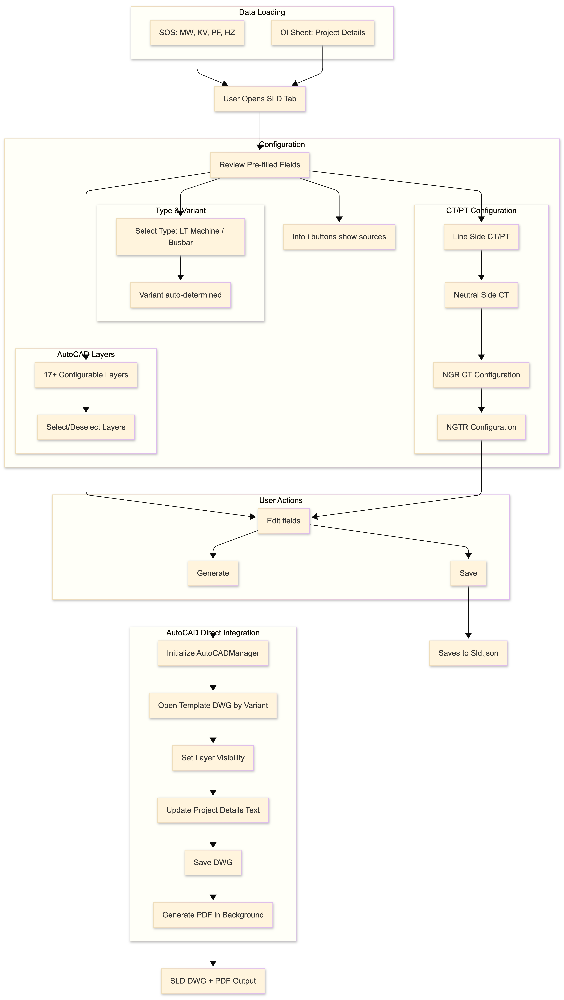

---

### 1) Quick mental model (what this screen is doing)

- This screen is the **Single Line Diagram (SLD) execution** workspace: it holds **project + revision metadata**, **electrical data** (mostly from Scope of Supply), **equipment / cubicle text**, **layer visibility** for AutoCAD, and **derived rating strings** used on the drawing.
- The subtitle **“SLD [ … ]”** shows the **installation / project name** from the SLD model.
- Banner text **“For Calculation Purpose Only”** is shown on the UI as a scope reminder.
- **Toolbar (read carefully — labels vs behavior):**
  - **`Save`** → writes **`Sld.json`** only (intermediate persist). Does **not** run AutoCAD.
  - **`Generate`** → runs **AutoCAD generation** (DWG from template + layer on/off + attribute update; PDF can follow in the background). The success message says *“SLD files saved successfully. PDF generation will happen in background.”*

---

### 2) What the user does (practical flow)

1. Ensure **Scope of Supply** (and related upstream inputs) are correct — most electrical fields here are **read-only mirrors** with **(i)** hints pointing to the exact SOS area.
2. Adjust **SLD-only** items: revision block, departments, **unit number**, **safety margin** (editable here), pickers/entries for layers and visible optional blocks (busduct CT, NGR/GPR visibility paths, sealed TVM CTPT, etc., per your project type).
3. Choose which **AutoCAD layers** are **ON** for the export (selected layer list drives visibility in generation).
4. Click **`Save`** when you only want to **persist** the SLD model to disk as **`Sld.json`** under auxiliary inputs.
5. Click **`Generate`** when you want the **drawing output** (template `SLD_{Variant}.dwg` under `AuxiliariesTemplates/SLD/{Type}/`).

---

### 3) What happens behind the scenes (Application → JSON → AutoCAD)

- **Model:** `SLDExecutionModel` (singleton) holds all bound fields; the ViewModel is `SLDExecutionViewModel`.
- **Intermediate save (`Save` button):** `SLDSaveService.Save_intermediate()` serializes the full model to  
  `{project path}/Auxiliaries/AuxilaryInputs/Sld.json`.
- **Generate (`Generate` button):** `SLDSaveService.GenerateSLD()`  
  - Copies **selected layers** from the UI into the model.  
  - Builds **layer visibility** (all off, then turns on selected layers; can force **“17_Sealed TVM CTPT”** on when the sealed option is ON).  
  - Opens the template **`SLD_{Variant}.dwg`** for the current **`Type`**, updates **title block / attribute tags** (customer, PO, kV, supplies, fault level, AVR module, PT/CT strings, ratings, etc.), saves output and can trigger **background PDF**.

---

### 4) Field grid (user-friendly source + UX)

> **Legend**  
> - **SOS**: Scope of Supply — change upstream; field here is read-only with **(i)** where implemented.  
> - **Manual (SLD screen)**: Editable on this screen.  
> - **Derived**: Filled or formatted by ViewModel logic from other fields.  
> - **Conditional**: Shown only for certain **Type** / flags (e.g. busduct, NGR, GPR).

#### Toolbar

| Button label | What it actually does |
|---|---|
| **Save** | Writes **`Sld.json`** (`Save_intermediate`). |
| **Generate** | Runs **AutoCAD SLD generation** (`GenerateSLD`). |

#### Project / document metadata (mostly **Manual** on SLD)

| Area | Source / UX |
|---|---|
| First submission rev/date, revision no/remark | **Manual** |
| Prepared by / checked by / dates / approved by/date | **Manual** (pickers/dates where bound) |
| Responsible department, take over department | **Manual** |
| Unit number | **Manual** (picker) |
| Installation / customer / end customer | Usually loaded with project; many related strings come from SOS/SLD load — treat as **project input**, not SOS-only |

#### Generator & electrical (mostly **SOS**, read-only)

| UI field | Upstream (per info icons / binding pattern) |
|---|---|
| MW (Png), pf (Cosφ), HZ | **SOS → E&I → Generator** |
| **Safety margin** | **Editable on SLD** (numeric); not the same as other locked generator fields |
| kV rating | **SOS → Generator → kV rating** |
| Aux 1Ø, UPS 1Ø, DC, 3Ø supplies | **SOS → Auxiliary electrical equipment** |
| System fault level | **SOS → E&I → System fault level** |
| Breaker number (sync/mimic text) | **SOS → Control panels → Breaker number** |
| Type, PMG, Cable | **SOS → Generator** |
| Line side CT / Line side PT | **SOS → Line side cubicle** |
| NGR after star (when visible) | **SOS → Neutral side cubicle** |
| Customer PO, Siemens order no, Consultant | **SOS → Project attributes → Project details** |

#### Equipment / drawing text blocks

- Fields such as **transformer (main exc.)**, **CT in busduct** (when visible), **GPR**, **AVR**, **neutral CT**, **redundancy**, **AVR module**, **standby transformer**, **STGCP**, **variant**, **generator/busduct ratings**, **LA/SC**, **PT sections**, **NGR/NGT-related strings**, etc. are bound to the SLD model; many are **populated from SOS** or **derived** in the ViewModel when defaults load. Treat them as **SLD execution inputs** once loaded—some lines are read-only mirrors, others editable depending on visibility and binding.

#### Layers

- User selects which schematic **layers** are **ON** for export; **`Generate`** turns those layers visible in AutoCAD and hides the rest (with special rules such as sealed TVM layer).

---

### 5) Link to SLD Calculators

- **SLD Calculators** reads the same family of values (kV, MW, PF, Hz, safety margin, layers, AVR text, fault level, type, etc.) when you load defaults — keeping SLD Execution and Calculators aligned is done by maintaining **`Sld.json`** / shared config flow.

---

### 6) Technical note (maintainers)

- In `SLDExecution.xaml`, **`Save`** is bound to **`InterSaveCommand`** and **`Generate`** to **`SaveCommand`** (`SaveSLD` → `GenerateSLD`). The naming is inverted vs typical `Save`/`Generate` wiring; document this for end users to avoid confusion.

---

#### `Control Panel Layout` (CPL)

**Functional (screen-focused)**  
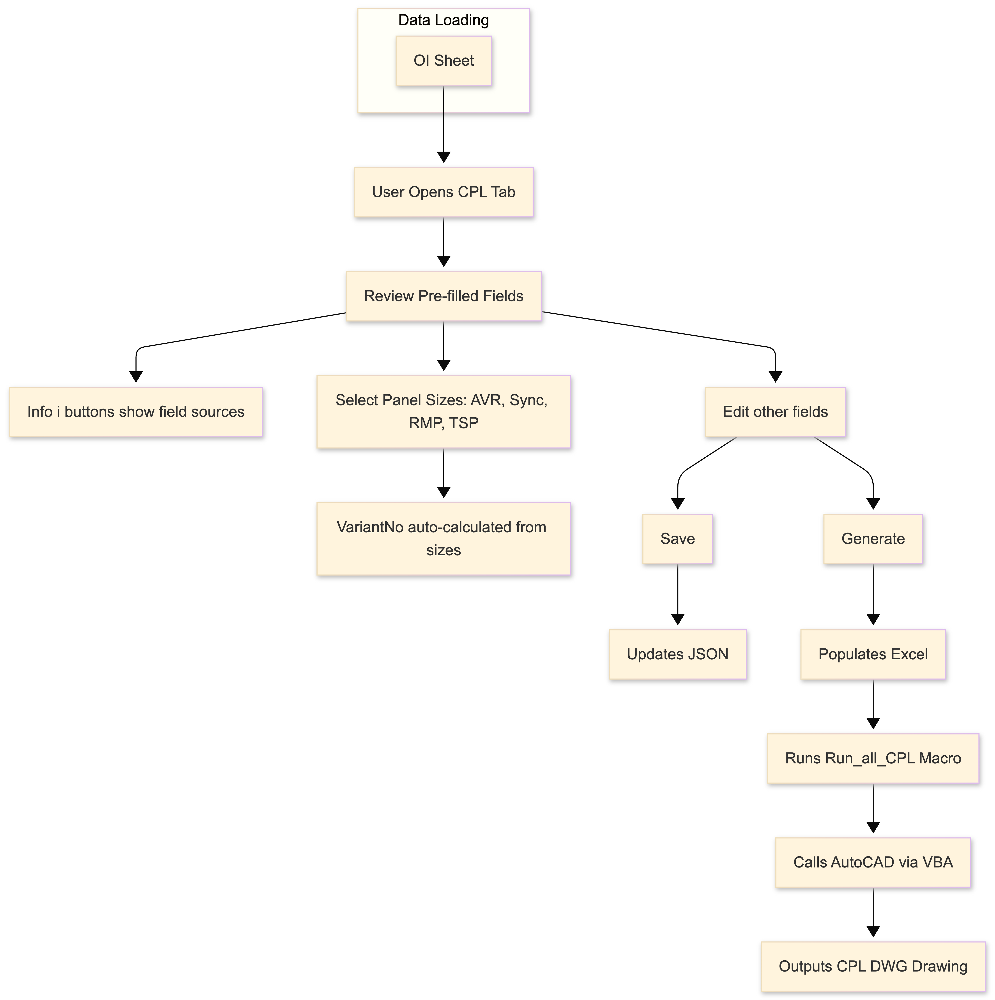

---

### 1) Quick mental model

- CPL captures **title-block style project data** plus **panel “variant” pickers** (AVR / synchronizing / RMP / TSP widths).  
- **Variant No.** is **not typed by hand** — it is **looked up** from the four pickers using a large fixed mapping table in the model.  
- **Save** / **Generate** follow the usual Electrical tab pattern: persist to `BOP_Execution.json`, then push to Excel and run the CPL macro.

---

### 2) What the user does

1. Confirm **Order Indent (OI)** is complete — many header fields are **locked** and only change in OI.  
2. Use the **Revision banner** for Prepared / Checked / Approved / Rev / Rev date (same pattern as other Electrical tabs).  
3. Set **Revision remark** if needed (editable).  
4. Choose **Unit No.** (`U1`–`U7`).  
5. Under **Variant selection**, pick **AVR**, **SYNCHRONIZING**, **RMP**, and **TSP**; **Variant No.** updates automatically.  
6. **Save** then **Generate** to refresh the CPL Excel output.

---

### 3) Toolbar

| Button | Behavior |
|--------|----------|
| **Save** | Saves CPL data to `BOP_Execution.json` under `Electric.ControlPanelLayout`. |
| **Generate** | Writes mapped cells in **`Control Panel Layout v2.xlsm`**, sheet **`CPL`**, macro **`Run_all_CPL`**. Output folder: Electrical MVP **`CPL`** directory (same pattern as other electrical modules). |

---

### 4) Field grid (source + UX + logic)

> **Legend**  
> - **OI**: Order Indent (General Details / project fields)  
> - **Manual (CPL tab)**: Editable on this screen  
> - **Derived**: Calculated in the app  

| UI field | Source | UX / logic |
|----------|--------|------------|
| Installation | **OI → Project name** | Locked; **(i)** → Order Indent → Project Name. |
| Customer | **OI → Customer** | Locked; **(i)** → Order Indent → Customer Name. |
| End Customer | **OI → End customer** | Locked; **(i)** → Order Indent → End Customer. |
| Customer’s P.O. | **OI → Customer PO** | Locked; **(i)** → Order Indent → Customer PO. |
| Siemens Order No. | **OI → WBS** (per mapping) | Locked; **(i)** → Order Indent → WBS. |
| Consultant | **OI → Consultant** | Locked; **(i)** → Order Indent → Consultant. |
| Revision No. | **OI → Rev** | Locked; **(i)** → Order Indent → Revision. |
| Revision remark | **Manual (CPL tab)** | Editable; default text e.g. first issue (from model default). |
| Responsible department | **Default in model** | Shown **locked** on UI (not editable in XAML). |
| Take over department | **Default in model** | Shown **locked** on UI. |
| Drawing reference no. | **OI → WBS** | Locked; **(i)** → Order Indent → WBS. If the value contains **hyphens**, the ViewModel **removes them** for storage/display. |
| Unit No. | **Manual (CPL tab)** | Picker `U1`–`U7`. |
| Document number | **Derived** | `{DrawingReferenceNo}_{UnitNo}_637020001` (read-only). |
| Rev date (banner) | **Manual** | Drives **`Formatted_dateforExcel`** for Excel: **day-abbreviated month-year** (e.g. `1-Jan-2026`). |
| **AVR** | **Manual** | Picker: `800`, `1000`, `800+800`. |
| **SYNCHRONIZING** | **Manual** | Picker: `800`, `1000`, `1200`, `800+800`. |
| **RMP** | **Manual** | Picker: `-`, `800`, `1000`, `1200`, `800+800`. |
| **TSP** | **Manual** | Picker: `800`, `1000`, `1200`, `800+800`, `800+800+800+800`. |
| **Variant No.** | **Derived** | Read-only. Result of matching the **exact combination** of the four picker values to an internal code (e.g. `1.1`, `2.3`, `8.xxx`). If the combination is **not** in the table, the value can be **empty / null**. |

---

### 5) Behind the scenes (data + Excel)

- **Load**: `ModelLoadCoordinator.LoadModelWithFallbackAsync` merges **`BOP_Execution.json` → `BOP.Electric.ControlPanelLayout`** with **`CPLFieldMapping`** defaults from **OI** for: Installation (project name), Customer, End Customer, Customer PO, Consultant, Rev No., Drawing Reference (WBS), Siemens Order No. (WBS).  
- Several of those properties are **`JsonIgnore`** on the model — they are **primarily fed from OI on load**; the CPL section in BoP JSON still holds the rest (variant pickers, remark, unit, revision meta, etc.).  
- **Excel**: `ExcelMappingCPL` maps the listed properties into sheet **`CPL`** cells **D5–D30** and revision / formatted date cells **D11–D22** (same formatted date string written to multiple date cells per sheet layout).

---

### 6) Technical note

- UI section title is spelled **“Varient Selection”** in XAML; the concept is **variant** selection for layout width/configuration.

---

#### `Local Push Button System` (LPBS)

**Functional (screen-focused)**  
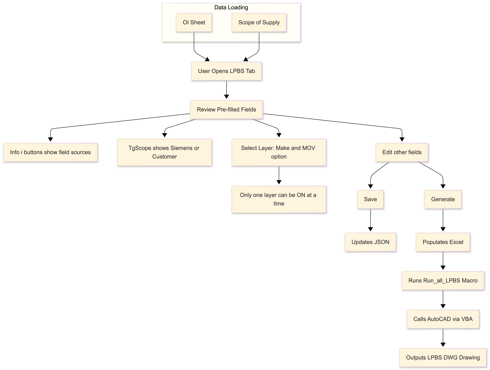

---

### 1) Quick mental model

- LPBS captures **project header data** (mostly from **Order Indent**), **TG MCC scope** from **Scope of Supply**, **unit and document number**, and **four mutually exclusive “layer” toggles** (Siemens/Rittal × with/without MOV) that drive which LPBS AutoCAD/Excel layer variant is intended to be **ON**.
- A red note on the screen reminds you to **upload the Feeder list** before **Generate**.
- **Save** / **Generate** follow the standard Electrical tab flow: persist to `BOP_Execution.json`, then fill Excel and run the LPBS macro.

---

### 2) What the user does

1. Complete **Order Indent** and **Scope of Supply** (TG motor control scope) where applicable.  
2. Ensure **Feeder list** is uploaded **before** generating outputs (per on-screen warning).  
3. Set the **Revision banner** (Prepared / Checked / Approved / Rev / date).  
4. Edit **Revision remark** if needed.  
5. Pick **Unit No.** (`U1`–`U7`).  
6. Under **Layer selection**, set **exactly one** of the four options to **ON** (see mutual-exclusion behavior below).  
7. **Save**, then **Generate**.

---

### 3) Toolbar & output

| Button | Behavior |
|--------|----------|
| **Save** | Persists LPBS to `BOP_Execution.json` → `Electric.LPBS`. |
| **Generate** | Writes **`Local Push Button System v1.xlsm`**, sheet **`LPBS`**, macro **`Run_all_LPBS`**. Output folder: Electrical MVP **`LPBS`** (ViewModel sets an explicit `DestinationFolderPath` under the Electrical output root). |

---

### 4) Field grid (source + UX + logic)

> **Legend**  
> - **OI**: Order Indent  
> - **SOS**: Scope of Supply  
> - **Manual (LPBS tab)**: Editable on this screen  
> - **Derived**: Calculated in the app  

| UI field | Source | UX / logic |
|----------|--------|------------|
| Installation | **OI → Project name** | Locked; **(i)** → Order Indent → Project Name. |
| Customer | **OI → Customer** | Locked; **(i)** → Order Indent → Customer Name. |
| End Customer | **OI → End customer** | Locked; **(i)** → Order Indent → End Customer. |
| Customer’s P.O. | **OI → Customer PO** | Locked; **(i)** → Order Indent → Customer PO. |
| Siemens Order No. | **OI → WBS** | Locked; **(i)** → Order Indent → WBS. |
| Consultant | **OI → Consultant** | Locked; **(i)** → Order Indent → Consultant. |
| Revision No. | **OI → Rev** | Locked; **(i)** → Order Indent → Revision. |
| Revision remark | **Manual (LPBS tab)** | Editable; model default e.g. first issue. |
| Responsible department | **Default in model** | Locked on UI. |
| Take over department | **Default in model** | Locked on UI. |
| Drawing reference no. | **OI → WBS** | Locked; **(i)** → Order Indent → WBS. **Hyphens are removed** when the value is applied through the ViewModel. |
| Unit No. | **Manual (LPBS tab)** | Picker `U1`–`U7`. |
| Document number | **Derived** | `{DrawingReferenceNo}_{UnitNo}_637020001` plus a **trailing space** in the current ViewModel string (read-only). |
| **TG MCC Scope** | **SOS → TG motor control → Scope** | Locked; **(i)** → Scope of Supply → E&I → TG Motor Control → Scope. When the value is set through the ViewModel, **`Yes` → `SIEMENS SCOPE`**, **`No` → `CUSTOMER SCOPE`**. |

#### Layer selection (ON / OFF pickers)

| Picker | Meaning in app |
|--------|----------------|
| Siemens Make Without MOV | **ON** / **OFF** |
| Siemens Make With MOV | **ON** / **OFF** |
| Rittal Make Without MOV | **ON** / **OFF** |
| Rittal Make With MOV | **ON** / **OFF** |

**Mutual exclusion:** Setting any one to **ON** forces the other three to **OFF**. If a change would leave **all four OFF**, the control you just used is forced back to **ON** so one variant always remains selected.

**Revision date → Excel:** Same pattern as CPL: **`Formatted_dateforExcel`** = revision date as **`d-MMM-yyyy`** (e.g. `1-Jan-2026`), mapped to multiple cells in Excel for the title block date lines.

---

### 5) Data & persistence notes

- **Load:** `ModelLoadCoordinator` merges **`BOP.Electric.LPBS`** with **`LPBSFieldMapping`**: OI fields above + **`TgScope`** from **`ScopeOfSupply.TgScope`** (SOS JSON).  
- OI-sourced header properties are **`JsonIgnore`** on the model — they are **refreshed from OI on load**; BoP JSON still stores LPBS-specific data (remark, unit, layer flags, revision meta, document number, etc.).

---

### 6) Technical note

- `LoadDataAsync` shows a generic error alert text referencing **Control Panel Layout** — that message is misleading if LPBS load fails; the code path is LPBS.


---

#### `Power Cable Schedule` (Power Cable)

**Functional (screen-focused)**  
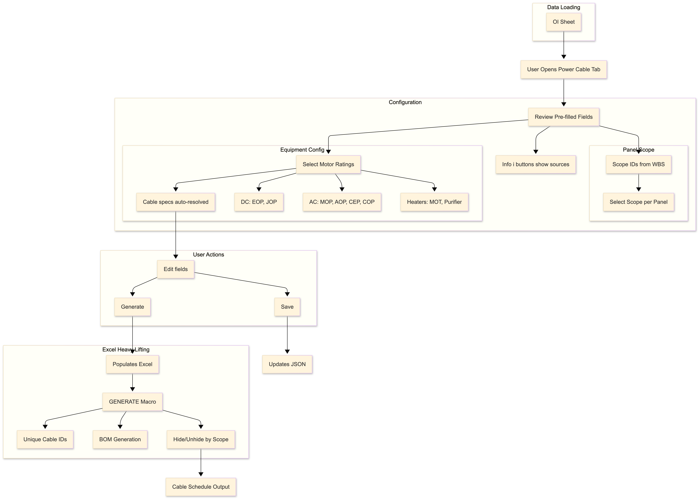

---

### 1) Quick mental model

- This tab builds the **Power Cable Schedule** output from:
  - **Project metadata** (mostly **Order Indent**),
  - A **scope matrix** (panel vs in‑scope / Siemens / customer / N.A. style choices),
  - **Required project inputs** (distribution boards: **cable size**, **insulation**, **material / voltage**),
  - Many **motor / heater / battery** rows where you pick **rating**, **tag**, and **cable type**; the app then **derives** field-wiring **size text**, **insulation**, and **conductor** via internal lookup tables.
- **Save** stores everything under **`Electric.PowerCable`** in `BOP_Execution.json`.  
- **Generate** pushes mapped fields into the Power Cable Excel tool and runs its macro.

---

### 2) What the user does

1. Confirm **OI** (WBS, project, customers, consultant) is correct — header fields are mostly **locked** with **(i)** hints to OI.  
2. Use the **Revision banner** for Prepared / Checked / Approved / Rev / date.  
3. Review **Scope Section**: each row shows a **generated Id**, **panel name**, and a **scope** picker (options differ by row — e.g. in‑scope vs Siemens scope vs applicability).  
4. Fill **Required project input** for each listed **distribution board** (size, insulation, cable material/voltage).  
5. Work through **motor / load blocks** (EOP, JOP, barring gear, oil pumps, fans, condensate pumps, control oil, tank heater, etc.): choose **motor (or heater) rating**, **tag** where shown, and **cable selection**; check the **auto-filled** derived columns (field wiring cable / insulation / conductor).  
6. Complete **battery / charger** inputs where applicable.  
7. **Save**, then **Generate**.

---

### 3) Toolbar & Excel

| Button | Behavior |
|--------|----------|
| **Save** | Persists the Power Cable model to `BOP_Execution.json` → `BOP.Electric.PowerCable`. |
| **Generate** | Writes to **`POWER CABLE SCHEDULE_23-01-2026.xlsm`** (template name in code), sheet **`Ip Sheet`**, macro **`GENERATE`**. *(Code comment notes the macro name may still need alignment with the workbook.)* |

Output folder follows the usual Electrical MVP pattern for section **`PowerCable`**.

---

### 4) Scope section — Id, panel, scope

| Column | Source / behavior |
|--------|-------------------|
| **Id** | **Derived**. Built as `{WBS Type}4XXXX_U1_{fixed scope code}` where the **scope code** is a fixed catalog number per row (relay panel, sync panel, busduct, feeder list, TG MCC, ACDB, UPSDB, DCDB, MOV, LPBS, etc.). **Ids refresh when WBS type changes** (on load / update). |
| **Panel** | **Fixed label** per row (e.g. Single Line Diagram, Feeder List, TG MCC) — shown read-only or via picker depending on row. |
| **Scope** | **Manual (picker)**. Row-specific option lists (e.g. in scope / Siemens scope / customer / not applicable). Defaults come from the model for each panel type. |

---

### 5) Required project input (distribution boards)

- Grid columns: **Distribution board**, **Size**, **Insulation**, **Cable material / voltage**.  
- You choose from app-defined option lists (`Dimensions_CableOptions`, `InsulationOptions`, material/voltage pickers per row).  
- These values feed the Excel **Ip Sheet** mappings together with scope and motor sections.

---

### 6) Motors, DC loads, and heaters — automation pattern

| User picks | App derives (read-only / auto-updated) |
|------------|----------------------------------------|
| **Motor rating** (AC or DC enum-style list) | |
| **Cable selection** (schedule line / type) | **Field wiring cable** (configuration text), **insulation**, **conductor** |

- **AC motors:** `CableRunResolver` + **AC cable mapping tables** (`ACMappings`).  
- **DC motors (e.g. EOP):** resolver + **DC mappings** and **DC supply voltage** context (`DcVoltageParser`).  
- **Heaters (e.g. lube oil tank heater):** resolver + **heater mappings** (`HeaterMappings`) and heater rating lists.

Changing **rating** or **cable selection** triggers a **recalculate** for that block’s derived fields.

---

### 7) Battery / DC cubicle–related inputs

- Fields such as **battery Ah**, **total amp rating**, **battery cable selection**, **charger amp rating** are bound to the model and exported to Excel per `ExcelMappingPowerCable` (alongside the rest of the **Ip Sheet** rows).

---

### 8) Field mapping (upstream preload)

From **`PowerCableFieldMapping`**, the following are loaded from **OI** when merging defaults:

- **WBS** (split into WBS Type / WBS No in the ViewModel, same pattern as other Electrical tabs)  
- **Project**, **Customer**, **End Customer**, **Consultant**

Everything else (scope pickers, DB rows, motors, battery) lives in the **Power Cable** section of `BOP_Execution.json` once saved.


---

#### `Control cable`

**Functional**  
**[TODO: insert ControlCable-func.png]**


---

### MECH

The **MECH** step is part of **BoP Execution**. It includes mechanical schedule tabs with UI-level rules and Excel macro generation.

---

#### Common screen behavior (applies to MECH tabs)

| Screen element | What it does |
|---|---|
| Left tab navigation (`MechanicalPage.xaml`) | `MechanicalPageViewModel` switches between `ValveSchedule` and `SpecialtySchedule`. |
| `Save` / `Generate` | Save persists section data into `BOP_Execution.json`; Generate runs Excel module automation. |
| Revision banner | Present for revision-tracked tabs. |
| Info icon `(i)` | Guides to upstream OI/SOS sources. |

---

#### `Valve Schedule` (ValveSchedule)

**Functional (screen-focused)**  
<!--  -->

Mechanical tab that fills the **valve schedule Excel tool** from OI, thermo workbook cells, WLABY JSON, Scope of Supply, PID 301/310, and what you save on this screen. **Save** updates `BOP_Execution.json` (mechanical valve schedule). **Generate** writes `Automation_Tool_Valve_schedule.xlsm` (sheet **Input Datasheet**) and runs its macros.

Paths below are under the app’s **project JSON root** (`JsonPathManager` / `BopConstantPaths` base).

---

### Field reference (UI label → source → behavior)

**Basic information**

| Label on screen | Where it’s read from | What the app does |
|-----------------|----------------------|-------------------|
| WBS Type | `OI/OI_GeneralDetails.json` → key `WBS` | Locked. If WBS looks like `XXXX-####`, only the part before `-` is shown here. |
| WBS No | Same `WBS` | Locked. If WBS has a `-`, only the part after `-` is shown here. |
| Project | `OI_GeneralDetails.json` → `ProjectName` | Locked. |
| Purchaser | Not in field-mapping table | Default / last saved value for this tab; read-only on screen. |
| Customer | `OI_GeneralDetails.json` → `Customer` | Locked. |
| End Customer | `OI_GeneralDetails.json` → `EndCustomer` | Locked. |
| Consultant | `OI_GeneralDetails.json` → `Consultant` | Locked. |

**Operating conditions**  
*(Section title shows pressure unit. If stored unit was `bar`, several pressures are converted to ata on load.)*

| Label on screen | Where it’s read from | What the app does |
|-----------------|----------------------|-------------------|
| Operating Pressure Live Stream | `Calculation/Thermal_Document_Automation_V-3.0.xlsm` → `Thermo-Data!D76` | Read-only. Bar→ata conversion on load when applicable. |
| Operating Temperature Live Stream | Same workbook → `Thermo-Data!D77` | Read-only. |
| Operating Pressure HP Wheel Chamber | Same → `Thermo-Data!G17` | Read-only. Bar→ata when applicable. |
| Operating Temperature HP Wheel Chamber | Same → `Thermo-Data!G18` | Read-only. |
| Operating Pressure Guarantee Case Exhaust | Same → `Thermo-Data!D114` | Read-only. Bar→ata when applicable. |
| Operating Temperature Max Exhaust | Same → `Thermo-Data!D115` | Read-only. |
| Operating Pressure Max AK1 | Same → `Thermo-Data!G53` | Read-only. Bar→ata when applicable. |
| Operating Temperature Max AK1 | Same → `Thermo-Data!G54` | Read-only. |
| Operating Pressure Turbine Cross Section (Casing Drain) | This tab / saved Valve Schedule | Editable. |
| Operating Temperature Turbine Cross Section (Casing Drain) | This tab / saved Valve Schedule | Editable. |
| Operating Temperature From WLABY (Leak-off Header) | Fed from `Calculation/Thermal Toolchain/Turman250/wlaby.JSON` | On load, app sets this to the **maximum** of root keys `MaxLoadTemperature1`, `MaxLoadTemperature2`, `NoLoadTemperature1`, `NoLoadTemperature2` (those four are **not** separate fields on this screen). You can edit afterward. |
| Operating Pressure From Scope Of Supply (Auxiliary Cooling Water) | This tab / saved (model default) | Read-only on screen. |
| Operating Temperature From Scope Of Supply (Auxiliary Cooling Water) | `Auxiliaries/AuxilaryInputs/ScopeOfSupply.JSON` → `DesignBasisCoolerInletTemp` | Read-only; change in Scope of Supply design basis. |
| Tube Side Design Pressure (Auxiliary Cooling Water) | This tab / saved (model default) | Read-only on screen. |

**PID sizing**

| Label on screen | Where it’s read from | What the app does |
|-----------------|----------------------|-------------------|
| Size PID Exhaust Line (NB) | This tab / saved (mapping has empty JSON key) | No auto-fill from SOS with current mapping. |
| Size PID 303 (NB) | This tab / saved (mapping has empty JSON key) | Same. |
| Project Type | This tab / saved | Picker: Domestic / Export. |

**Schedule update**

| Label on screen | Where it’s read from | What the app does |
|-----------------|----------------------|-------------------|
| Main Steam Line Schedule | This tab / saved | Editable. |
| Turbine Exhaust Line Schedule | This tab / saved | Editable. |
| Leak Off Header To GSC Inlet Schedule | This tab / saved | Editable. |
| Leak Off Header To GSC Schedule | This tab / saved | Editable. |

**PID 301**  
*File: `Auxiliaries/AuxilaryInputs/PID301.JSON`. Left column read-only; “… Input” = picker on this tab.*

| Label on screen | Where it’s read from | What the app does |
|-----------------|----------------------|-------------------|
| Main Steam Flow Nozzle | `PID301.JSON` → `MainSteamFlowNozzle` | Wording normalized (Customer/Siemens scope). Drives **Main Steam Flow Nozzle Input** options. |
| Main Steam Flow Nozzle Input | This tab / saved | Picker. |
| Flow Transmitter Main Steam | `PID301.JSON` → `MainSteamTransmitter` | Required / Not required cleanup. Drives **Flow Transmitter Main Steam Input**. |
| Flow Transmitter Main Steam Input | This tab / saved | Picker. |
| Preheating CV | `PID301.JSON` → `PreheatingCVScope` | Scope normalization. Drives **Preheating CV Input**. |
| Preheating CV Input | This tab / saved | Picker. |
| Separate PT For TSP | `PID301.JSON` → `SeparateExhaustLine` | Drives **Separate PT For TSP Input**. |
| Separate PT For TSP Input | This tab / saved | Picker. |
| Instrument Redundancy | `PID301.JSON` → `InstrumentRedundancy` | Drives **Instrument Redundancy Input**. |
| Instrument Redundancy Input | This tab / saved | Picker. |
| Turbine Gauge Board | `PID301.JSON` → `GaugeBoard` | Drives **Turbine Gauge Board Input**. |
| Turbine Gauge Board Input | This tab / saved | Picker. |
| Main Steam Blowing Manual Valve | `PID301.JSON` → `MainSteamBlowingManualValve` | Drives **Main Steam Blowing Manual Valve Input**. |
| Main Steam Blowing Manual Valve Input | This tab / saved | Picker. |
| Main Steam Start Up Vent Manual Valve | `PID301.JSON` → `MainSteamStartUpVentManualValve` | Drives **Main Steam Start Up Vent Manual Valve Input**. |
| Main Steam Start Up Vent Manual Valve Input | This tab / saved | Picker. |
| PG For HP Wheel Chamber | `PID301.JSON` → `PgForHPWheelChamber` | Drives **PG For HP Wheel Chamber Input**. |
| PG For HP Wheel Chamber Input | This tab / saved | Picker. |
| Exhaust Vent NRV Or QCNRV | `PID301.JSON` → `ExhaustVentNRVScope` | NRV scope wording normalized. Drives **Exhaust Vent NRV Or QCNRV Input**. |
| Exhaust Vent NRV Or QCNRV Input | This tab / saved | Picker. |
| Exhaust Flow Orifice | `PID301.JSON` → `ExhaustFlowOrifice` | Drives **Exhaust Flow Orifice Input**. |
| Exhaust Flow Orifice Input | This tab / saved | Picker. |
| Flow Transmitter Exhaust Steam | `PID301.JSON` → `ExhaustSteamTransmitter` | Drives **Flow Transmitter Exhaust Steam Input**. |
| Flow Transmitter Exhaust Steam Input | This tab / saved | Picker. |

**PID 310**  
*File: `Auxiliaries/AuxilaryInputs/PID310.JSON`.*

| Label on screen | Where it’s read from | What the app does |
|-----------------|----------------------|-------------------|
| Lube Oil Cooler Cooling Water Scope | `PID310.JSON` → `LubeOilCoolerScope` | Scope normalization. Drives **Lube Oil Cooler Cooling Water Scope Input**. |
| Lube Oil Cooler Cooling Water Scope Input | This tab / saved | Picker. |
| Lube Oil Cooler Cooling Water Inlet Location | `PID310.JSON` → `CoolerWaterInletPGTGLocation` | Read-only. |
| Alternator Cooling Water Scope | `PID310.JSON` → `CoolingWaterScope` | Drives **Alternator Cooling Water Scope Input**. |
| Alternator Cooling Water Scope Input | This tab / saved | Picker. |
| Alternator Cooler Configuration | `PID310.JSON` → `AlternatorCoolerConfig` | Read-only. |
| Alternator Cooler Cooling Water Inlet Location | `PID310.JSON` → `CoolingWaterInletPGTGLocation` | Read-only. |
| Lube Oil Cooler CW Inlet and Outlet Line Size | This tab / saved | Editable. |
| Alternator Cooler CW Inlet and Outlet Line Size | This tab / saved | Editable. |

---

#### `Specialty Schedule` (SpecialtySchedule)

**Functional (screen-focused)**  
<!--  -->

Mechanical tab for the **specialty schedule** Excel tool: project header, power/lube/alternator/gearbox data, thermo operating pressures/temperatures, casing-drain inputs, and **PID 310–style specialty rows** (filters, flex elements, orifices, sight glasses, fixed orifices). **Save** updates `BOP_Execution.json` (mechanical specialty schedule). **Generate** fills `Automation_tool_Specialty_Schedule_v2.xlsm` (sheet **Input Datasheet**) and runs macro **Button11_Click**. Specialty rows are also written to the workbook from a **dynamic row map** in code (starting around Excel row 46, with fixed gaps).

Paths below are under the app’s **project JSON root** (`JsonPathManager` / `BopConstantPaths` base).  
Workbooks: **`Calculation/Thermal_Document_Automation_V-3.0.xlsm`**, **`BZ file.xlsx`**.

---

### Field reference (UI label → source → behavior)

**Project information**

| Label on screen | Where it’s read from | What the app does |
|-----------------|----------------------|-------------------|
| WBS Type | `OI/OI_GeneralDetails.json` → `WBS` | Locked. Split on `-`: part before `-` shown here (same pattern as other mechanical tabs). |
| WBS No | Same `WBS` | Locked. Part after `-` when present. |
| Project | `OI_GeneralDetails.json` → `ProjectName` | Locked. |
| Purchaser | Not in field-mapping table | Default / last saved; read-only on screen. |
| Customer | `OI_GeneralDetails.json` → `Customer` | Locked. |
| End Customer | `OI_GeneralDetails.json` → `EndCustomer` | Locked. |
| Consultant | `OI_GeneralDetails.json` → `Consultant` | Locked. |

**Power output**

| Label on screen | Where it’s read from | What the app does |
|-----------------|----------------------|-------------------|
| Power Output (MW) | `Auxiliaries/AuxilaryInputs/ScopeOfSupply.JSON` → `GeneratorMegaWatt` | Locked. **Ceiling** of MW is used to look up alternator bearing flows (see Alternator). |

**Not on screen but loaded / used**

| (Data) | Where it’s read from | What the app does |
|--------|----------------------|-------------------|
| Main oil pump type | `ScopeOfSupply.JSON` → `CombinedLubeAndControlOilSystemMainOilPump` | No field on this XAML; drives visibility of fixed-orifice **OR504** (`Shaft Driven` → row visible). Still mapped to Excel **C19**. |

**Lube oil system – turbine**

| Label on screen | Where it’s read from | What the app does |
|-----------------|----------------------|-------------------|
| Core Module / Flooded Suction | This tab / saved | Picker **Core Module** or **Flooded Suction**. **Flooded Suction** shows **FF501** under Flushing Oil Filter. |
| Lube Oil Supply to Turbine Front Bearing (lpm) | Derived | Read-only. **Sum** of `Thermal_Document_Automation_V-3.0.xlsm` → **`Data to BOP & HEX!E26`** (front journal) + **`Data to BOP & HEX!G26`** (axial), each rounded to 2 decimals then added. |
| Lube Oil Supply to Turbine Rear Bearing (lpm) | `Thermal_Document_Automation_V-3.0.xlsm` → **`Data to BOP & HEX!F26`** | Read-only. Feeds adjustable-orifice sizing for **AOR502**. |

**Alternator**

| Label on screen | Where it’s read from | What the app does |
|-----------------|----------------------|-------------------|
| Alternator Front Bearing (DE) (lpm) | **Embedded table** `AlternatorPowerDatasheet` in code (`Ignite-X/Execution/LeanSpecs/Resource/AlternatorPowerData.cs`) | Read-only. Row chosen by **ceiling(Power Output MW)** vs `MinMW`/`MaxMW`; uses `BearingFront` / `BearingRear` strings. |
| Alternator Rear Bearing (NDE) (lpm) | Same table | Same lookup; `BearingRear`. Drives **AOR504** / **AOR505** sizing. |

**Gearbox**

| Label on screen | Where it’s read from | What the app does |
|-----------------|----------------------|-------------------|
| Gearbox Oil Flow (lpm) | **Embedded table** `GearPowerDatasheet` (`LeanSpecs/Resource/GearPowerData.cs`) | Read-only. **Gear rated power (kW)** = \((\text{MW} / (\eta_\text{alt}/100) / (\eta_\text{gear}/100)) × 1000\) with \(\eta_\text{alt}\) from **`BZ file.xlsx` → `Thermal!E39`** and \(\eta_\text{gear}\) from **`ScopeOfSupply.JSON` → `GearboxEfficiency`**. Table returns `OilQuantity` for that power band. |
| Gearbox Header Size | This tab / saved (default `200` in model) | Read-only on screen. Used for **Sight Flow Glass** sizing when not driven by FE506/FE507. |

**Lube oil system design & sizing**

| Label on screen | Where it’s read from | What the app does |
|-----------------|----------------------|-------------------|
| Lube Oil System Material | *(XAML only in repo)* | In current source, matching properties on `SpecialtyScheduleModel` are **commented out**—verify binding in your branch. |
| Size (Turbine GA) | Same | Same caveat. |
| Header Size (Turbine GA) | Same | Same caveat. |

**Operating parameters – thermodata sheet**

| Label on screen | Where it’s read from | What the app does |
|-----------------|----------------------|-------------------|
| Operating Pressure Live Stream | `Thermal_Document_Automation_V-3.0.xlsm` → **`Thermo-Data!D76`** | Read-only. Used for fixed-orifice pressure on **OR151/152** and user-added **OR*** rows. |
| Operating Temperature Live Stream | Same → **`Thermo-Data!D77`** | Read-only. |
| Operating Pressure HP Wheel Chamber (Max.) | Same → **`Thermo-Data!G17`** | Read-only. Used for **OR153** fixed-orifice logic. |
| Operating Temperature HP Wheel Chamber (Max.) | Same → **`Thermo-Data!G18`** | Read-only. |

**Not on UI but loaded for Excel / orifice logic**

| (Data) | Where it’s read from | What the app does |
|--------|----------------------|-------------------|
| Operating pressure / temperature “Max AK1” | `Thermo-Data!G53` / `Thermo-Data!G54` | No labels on current XAML; still loaded and written to Excel **C41/C41** area; **OR154** uses casing-style rule with **G53** pressure. |

**Operating parameters – casing drain**

| Label on screen | Where it’s read from | What the app does |
|-----------------|----------------------|-------------------|
| Operating Pressure (Turbine Cross-section) | This tab / saved | Editable. Used for **OR156** fixed-orifice pressure. |
| Operating Temperature (Turbine Cross-section) | This tab / saved | Editable. |

**Specialty items (PID 310)**  
Grid columns: **Component ID**, **Body Material**, **Medium**, **Scope**, **Size** (+ actions for fixed orifices). Defaults and IDs are created in code (`InitializeDefaultItems`). Read-only flags per row are set in `UpdateSpecialtyItemsBasedOnConditions` (e.g. **FF501** only when **Flooded Suction**; **OR504** only when main pump is **Shaft Driven**).

| Area | Where data comes from | What the app does |
|------|----------------------|-------------------|
| FLUSHING OIL FILTER | This tab / saved rows | **FF501** visible for Flooded Suction; body material, scope, size editable; medium locked. |
| FLEXIBLE ELEMENT | This tab / saved rows | **FE504/505**: body material & scope editable; size locked. **FE506/507**: scope & size editable; body/medium locked. Changing **FE506/507** size recalculates **SG501/SG502** sizes. |
| ADJUSTABLE ORIFICE | This tab / saved rows | **AOR501–505** sizes from flow bands: ≤35 → **15NB**, ≤220 → **25NB**, ≤900 → **50NB**, else **80NB**, using lpm from turbine front sum, rear, gearbox, alternator front/rear. |
| SIGHT FLOW GLASS | This tab / saved rows | **SG501** from numeric part of **FE506** size; **SG502** from **FE507**; **SG503** from **Gearbox Header Size** (≤100 → **50NB**, else **80NB**). |
| FIXED ORIFICE | This tab / saved rows | **OR151/152** use live-stream pressure; **OR153** HP wheel; **OR156** casing drain; **OR154** max AK1 pressure. If `pressure × 1.01325 ≤ 2` → valve class **7 mm Dia**, else **10 mm Dia**. **Add** creates new **OR{number}** using live-stream pressure for initial class. Default **OR*** rows cannot be deleted in code. |

---


