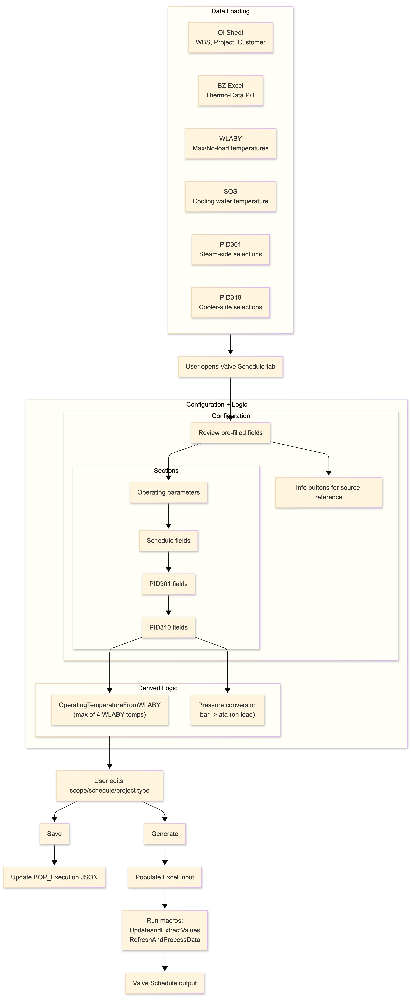
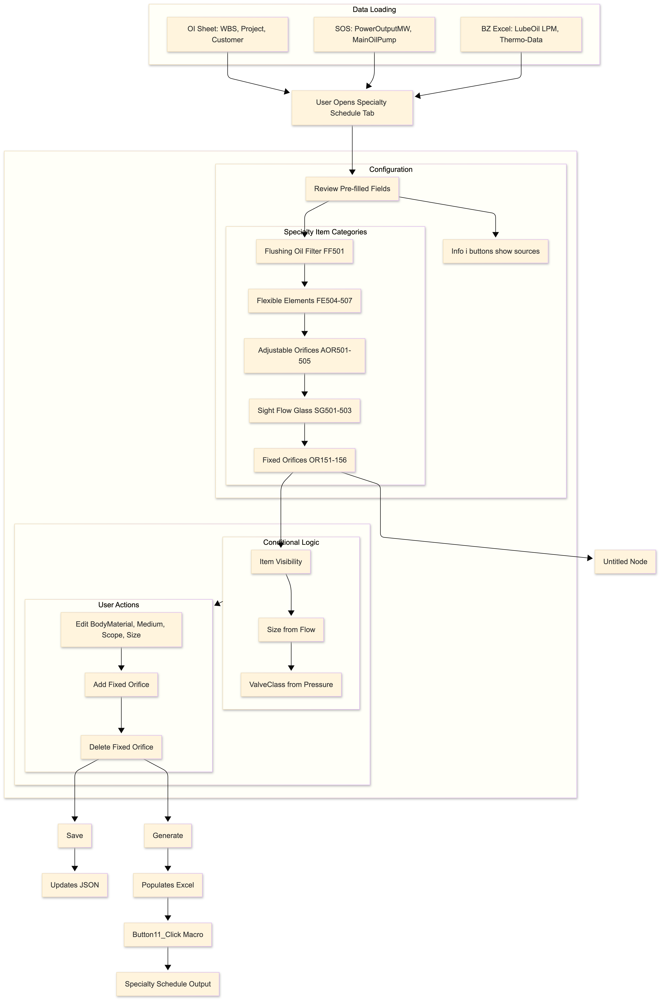

<div align="center">

<br/>


<br/><br/>

<p>
  
  &nbsp;
  
</p>

<h3><em> Documentation & Design Automation for SST-200 Back-Pressure Turbines</em></h3>

<br/>

<p>
  <a href="https://microsoft.com">
    
  </a>&nbsp;
  <a href="https://dotnet.microsoft.com/en-us/apps/maui">
    
  </a>&nbsp;
  <a href="https://visualstudio.microsoft.com/">
    
  </a>&nbsp;
  
</p>

<br/>

> **Ignite-X** unifies all stakeholders on a single platform, automating the complete SST-200 turbine value chain — from proposal creation to full engineering execution — at the click of a button.

<br/>

</div>

---

## Table of Contents

<details open>
<summary><strong> Expand / Collapse Navigation</strong></summary>

| # | Section |
|---|---------|
| 1 | [Overview](#-overview) |
| 2 | [What Problem It Solves](#-what-problem-it-solves) |
| 3 | [Key Components](#-key-components) |
| 4 | [Module Descriptions](#-module-descriptions) |
| 5 | [Documentation Structure](#-documentation-structure-engineer-focused) |
| 6 | [User Manual](#-user-manual) |
| 7 | [Advanced Features](#-advanced-features) |
| 8 | [Network Server & Admin Panel](#-network-server--admin-panel) |
| 9 | [Getting Started — Developers](#-getting-started--developers) |
| 10 | [Architecture — Navigation Through Code](#-architecture) |
| 11 | [Architecture — MVVM Deep-Dive & Dashboard](#mvvm-deep-dive--dashboard-homepage-breakdown) |
| 12 | [Thermal Calculation Documentation](#thermal-calculation-documentation--turbine-design) |

</details>

---

## Overview

### 1.1 Purpose and Scope

**Ignite-X** is a robust, reliable application designed to streamline the end-to-end value chain for **SST-200 back-pressure turbine units**. It enables rapid, consistent creation of HMBD documentation, technical annexures, drawings, specifications, and related deliverables — improving efficiency and speed across both proposal and execution phases.

---

---

## What Problem It Solves

The SST-200 turbine documentation and design process has traditionally been fragmented, time-consuming, and error-prone. Engineers across proposal, thermal design, auxiliaries, and execution teams work in isolated tools and documents, manually copying data between files and coordinating through emails and shared drives. A single project can require dozens of interdependent documents — HMBD diagrams, Turba files, Kreisl templates, P&IDs, SLDs, technical annexures, and execution packages — all of which must stay consistent with each other throughout the project lifecycle.

Ignite-X brings all stakeholders onto a single platform, allowing them to perform their tasks in one place. By automating repetitive manual activities — such as copying data across documents and triggering follow-on tasks — it eliminates mundane work, reduces effort, and accelerates delivery. Users can generate complete turbine and execution documentation at the click of a button, significantly reducing turnaround time (TAT) for customers while enabling teams to focus on higher-value activities.

**Core problems Ignite-X addresses:**

- **Manual data copying** — Steam parameters, scope values, and vendor data entered once in the Scope of Supply are automatically propagated to all downstream documents including P&IDs, SLDs, TG Hall layouts, Turba files, and Technical Annexures.
- **Inconsistent revisions** — Revision tracking and automatic change highlighting are built directly into the document generation workflow, making it easy to identify what changed between versions.
- **Delayed proposals** — The full turbine proposal package, including BZ Thermal, BZ Auxiliary, and all engineering annexures, is generated in minutes rather than days.
- **Coordination overhead** — The Handover feature transfers projects from the Proposal team to the Execution team within the same platform, eliminating email hand-offs and version confusion.
- **Version mismatch risk** — A centralised Scope of Supply acts as the single source of truth, automatically propagating values to all linked sections so no document falls out of sync.
- **Siloed workflows** — All departments — Thermal Design, Auxiliaries, Steam Path, Casing & Valves, and Execution — work inside the same system, with real-time visibility of project status and progress.

---

---

## Key Components

```
⚡ Ignite-X
│
├── 📁 Proposal
│   ├── Thermal – Turbine Design
│   ├── Auxiliary
│   └── BZ File
│
├── 📁 Engineering Execution
│   ├── Calculations
│   │   ├── Interdepartmental Files
│   │   └── Thermal Toolchain
│   ├── Steam Path
│   │   ├── Balancing Datasheet
│   │   ├── Turbine Nameplate
│   │   ├── HP/LP Radial Flow
│   │   ├── Flow Path Clearance
│   │   └── Assembly Protocol
│   └── Casing and Valves
│       ├── Cross-Section
│       ├── General Arrangement
│       ├── Control Book
│       ├── Hydrotest Protocol
│       ├── Loose Supply
│       ├── Control Valve
│       └── Sectional Drawing
│
└── 📁 BoP Execution
    ├── Lean Spec
    │   ├── General Details
    │   ├── Required Docs
    │   ├── Technical Requirements and Recommendations (TRR_M)
    │   ├── Customer Input
    │   ├── DOR of TG Train
    │   ├── Utility Requirments
    │   ├── Gearbox & Coupling
    │   ├── Gland Steam Condenser (PSGSC)
    │   ├── LOS MVP (PSLOS)
    │   └── Line Sizing
    │
    ├── Electric
    │   ├── Alternator
    │   ├── AVR
    │   ├── LT motor spec
    │   ├── SLD Calculators
    │   ├── SLD
    │   ├── Control Panel Layout (CPL)
    │   ├── LPBS
    │   ├── Power cable schedule
    │   └── Control cable
    │
    └── MECH
        ├── Valve Schedule
        └── Specialty Schedule
```

---

## Module Descriptions

### Thermal Proposal

> **Input:** Steam parameters
> **Output:** HMBD, Turba files, Kreisl files, BZ thermal data, log files

- Provides the ability to create revisions for each project with updated steam parameters, ensuring flexibility, easy tracking, and efficient version management.
- Proposals can be generated for multiple steam parameter sets.
- Supports creation of proposals for SST-200 1GBC Back Pressure variants including Standard, Executed, and Custom Flow Paths.
- **Advanced Design Mode** — Enhanced admin controls and specialised functionality for higher efficiency.
- **File Accessibility Features** — Integrated web view for file previews and direct File Explorer access.
- Provides functionality to hand over the project to the Execution team.

---

### Calculation

> **Input:** Turba files, BZ File
> **Output:** Interdepartmental files, Thermal Toolchain results

- Facilitates generation of interdepartmental files and the Thermal Toolchain.
- Displays both input and output files for easy reference.
- Provides visibility of project specifications.
- Includes functionality to edit steam parameters, create revisions, and generate turbine proposals.
- Provides functionality to release the project to the Steam Path, Casing, and Valves teams.

---

### Steam Path

> **Input:** Interdepartmental files, Turba files, BZ File
> **Output:** Assembly protocol, balancing datasheet, flow path clearance, HP/LP drawings, nameplate files

- Automates the creation of AutoCAD files and engineering documents.
- Provides visibility of project documentation and specifications.
- Provision to generate documents individually using custom inputs, or all at once using default parameters.

---

### Casing and Valves

> **Input:** Interdepartmental files, Turba files, BZ File
> **Output:** Cross-Section, General Arrangement, Control Book, Hydrotest Protocol, Loose Supply, Control Valve, Sectional Drawing

- Automates the creation of AutoCAD files and engineering documents.
- Provides visibility of project documentation and specifications.
- Flexible individual or batch document generation.

---

### BOP Proposal

> **Input:** User-provided data
> **Output:** Technical Annexure, SLD, P&ID (301, 303, 310, 314), TG Hall Layout, Control Oil Piping Layout, BZ Auxiliary documents

- Facilitates the creation of comprehensive offer packages with the following capabilities:
- Supports generation of proposals for auxiliaries in both Standard and Custom cases.
- Allows creation of revisions for each project, ensuring easy updates and version tracking.
- Provides integrated output options with both AutoCAD drawings and PDF documents.
- Includes a **Save Intermediate** functionality, enabling users to seamlessly resume work from where they left off.
- Offers auto-suggestions to improve accuracy, speed, and overall user experience.

---

## Documentation Structure (Engineer-Focused)

<details>
<summary><strong>1. Overview</strong></summary>

- **1.1 Purpose and Scope** — Define the goals, limitations, and extent of the Ignite-X system.
- **1.2 Audience and Reading Guide** — Specify the intended readers: engineers, developers, testers, and managers, and provide guidance on how to navigate the document.
- **1.3 High-Level Features and Non-Goals** — Summarise key system capabilities and explicitly state what is out of scope to avoid confusion.

</details>

<details>
<summary><strong>2. Getting Started (Developers)</strong></summary>

- **2.1 Prerequisites and Tooling** — Development environment setup: required IDEs, SDKs, libraries, and versions.
- **2.2 Clone, Build, Run** — Step-by-step instructions to get the system running locally.
- **2.3 Debugging Tips and Common Build Issues** — Troubleshooting guides and typical problem resolutions.

</details>

<details>
<summary><strong>3. Architecture</strong></summary>

- **3.1 MVVM Overview and Rationale** — Explain why the MVVM pattern is used and its benefits in this context.
- **3.2 Layered Architecture (UI, ViewModels, Data)** — Describe separation of concerns and the responsibilities of each layer.
- **3.3 Navigation Through Code** *(Priority 1)*
- **3.4 Dependency Injection and Configuration (`MauiProgram.cs`)** — Describe DI patterns and modular configuration.

</details>

<details>
<summary><strong>4. Project Structure</strong></summary>

- **4.1 Solution Layout and Naming Conventions** — Define folder structures and coding standards to maintain consistency.
- **4.2 Folders**
  - `Pages/` — Views (XAML)
  - `ViewModels/` — Business logic and data binding
  - `Models/` — Business entities
  - `Services/` — Application services
  - `Repositories/` — Data access layer
  - `Components/` — Reusable UI controls
  - `Resources/` — Styles, themes, images, fonts
  - `Platforms/` — Platform-specific code
- **4.3 Resource Management** — Guidelines for managing UI resources and assets.

</details>

<details>
<summary><strong>5. Data and State</strong></summary>

- **5.1 Data Flow in MVVM (Bindings, Commands)** *(Priority 2)* — Illustrate how data propagates through the app using MVVM binding techniques.
- **5.2 Local Storage (CSV Files, Folders)** — Handling local data persistence, file formats, and organisation.
- **5.3 Model Dispose Rules** — Memory and resource management practices.

</details>

<details>
<summary><strong>6. UI/UX and Accessibility</strong></summary>

- **6.1 Navigation Map (Screens and Flows)** *(Priority 1)* — Visual diagrams and descriptions of user flows.
- **6.2 Reusable Controls/Components and Styling Guidelines** — Design principles, component catalogue, and theming conventions.

</details>

<details>
<summary><strong>7. Error Handling, Logging, and Telemetry</strong></summary>

- **7.1 Global Exception Handling Approach** — Strategy for catching and managing exceptions gracefully.
- **7.2 Logging Categories and Correlation IDs** — Log organisation for monitoring and debugging.
- **7.3 Metrics/Events and Dashboards** — Telemetry practices and usage of observability tools.

</details>

<details>
<summary><strong>8. Testing Strategy</strong></summary>

- **8.1 Test Data, Fixtures, and Coverage Targets** — Testing methodologies, test suite organisation, and quality metrics.

</details>

---

<details>
<summary><strong> Module Section Template (Dashboard Format)</strong></summary>

Each module should be documented using the following structure:

**Key Functionality**

- Inputs: User data entry points and external data feeds.
- Prerequisites: Dependencies and initial setup required.
- Database (DB): Schemas used and key tables relevant to the module.
- External Libraries Used: Third-party tools and libraries integrated.
- Logic:
  - **Frontend:** UI behaviours and interaction logic.
  - **ViewModels and Bindings:** Binding logic managing presentation and data synchronisation.
  - **Data Models:** Structures representing business entities.
  - **Business Logic:** Rules and data transformations executed.

*This structure is defined using the Dashboard module as the reference. All subsequent modules — Sales, Thermal Proposal, Calculation, Steam Path, Casing and Valves, BOP Proposal — should follow the same format.*

</details>

---

## User Manual

### Step 1 — How to Run the Ignite-X Executable

| Step | Action |
|------|--------|
| **1** | **Locate the Shared Drive** — Access the shared drive containing `Ignite-X_Release_5_01_2026.zip`. |
| **2** | **Download the Application** — Download and extract the folder. |
| **3** | **Create the testDir Folder** — Create the directory `C:\testDir` on your C drive. |
| **4** | **Run Ignite-X.exe** — Locate `Ignite-X.exe` in the downloaded directory and double-click to launch. |
| **5** | **Landing Page** — The Dashboard will open automatically after the application launches. |


---

### Step 2 — Create an Enquiry

- Locate the **Create Enquiry** button on the Dashboard.
- Click the button to proceed.


**Sample Input Values**

| Project | Steam Pressure | Steam Temperature | Steam Mass Flow | Exhaust Pressure |
|---------|---------------|-------------------|-----------------|------------------|
| Project Name 1 | 42.981 | 440 | 8.93 | 4.59 |
| Project Name 2 | 62.743 | 480 | 10.579 | 4.59 |
| Project Name 3 | 41.910 | 495.01 | 6.83 | 4.903 |

---

### Step 3 — Navigate to Turbine Design

- Access the **left sidebar**.
- Click the **dropdown arrow** next to **Proposal** to expand the submenu.
	
- From the expanded submenu, click **Turbine Design**.
	

---

### Step 4 — Turbine Design Page

Once the Turbine Design page is open:

1. Click the **Load Enquiry** button to load your previously created enquiry.
	
	
2. After the enquiry loads, click the **Design Turbine** button.
	

3. On the next screen, click the **Start** button to begin the turbine design process.
	
4. Once the process completes, the generated files will appear in the **Turbine Files** section below.
	


---

### Step 5 — Navigate to Auxiliary

- Access the **left sidebar**.
- Expand the **Proposal** submenu.
- Click **Auxiliaries**.


---

### Step 6 — Load the Project

In the **Auxiliaries** section:

- A list of available projects will be displayed.
- Locate your desired project and click the **Load** button before running the Balance of Plant (BOP).


---

### Step 7 — Access the Scope of Supply Page

- You will see input and output folders for the project.
- Click on **Scope of Supply** under *Select Project Detail* to open the Scope of Supply interface.


---

### Step 8 — Choose Supply Type: Standard or Custom

| Mode | Description |
|------|-------------|
| **Standard** | Some values are pre-set by default (hidden from the user). Fields that are not default must be filled in manually. |
| **Custom** | All values must be filled in by the user. |

---

### Step 9 — Working with Standard Scope of Supply

1. Select the **Revision Number**.
2. Choose the **Project Attributes** and fill in the necessary project details.

---

### Step 10 — Fill Scope Details (Sequentially)

Complete the following sections one after the other:

1. **Mechanical Scope of Supply**
2. **Electrical & Instrumentation (E&I) Scope of Supply**

>  **Note:** Some scopes will already have default values set. In such cases, a pop-up will appear informing you of these defaults.

---

### Step 11 — Generate the Document

Once all mandatory fields are filled:

- Click **Generate** to create the Scope of Supply document.

>  **Output Location:**
> ```
> C:\testDir\TurbineNumber_ProjectName\R1\Auxiliaries
> ```

---

### Step 12 — Working with Custom Scope of Supply

The process is similar to Standard, with the following additional considerations:

- Certain sections (e.g., *Piping Valves and Accessories*) will display a pop-up when you select **YES** for specific fields.
- In these pop-ups, replace **Size**, **Class**, and **Material** with the appropriate values.

---

### Step 13 — Handling Specific Pop-Ups

For specific items such as HT/LT Power Cable:

- Selecting an option will trigger a pop-up window.
- Fill in the values carefully using the specified format as per the guidelines.


---

### Step 14 — Save Your Progress

- Use the **Save** feature to store your progress.
- If you reload the project later, all previously filled fields will be retained.

---

### Step 15 — Sharing BoP Saved Input Files

1. Navigate to `testDir`, then open the desired project folder — you will see the **Auxiliaries** folder.
	
2. Copy the folder and share it with another machine or desktop.
3. On the receiving machine, create a new enquiry using the **same project name** as in the copied data.
4. Paste the shared folder into the newly created folder at the corresponding location.
	
5. Load the project via **IgniteX → Proposal → Auxiliary**.

---

### Step 16 — Interlinkages from Scope of Supply

- The Scope of Supply is the primary location where important project details are entered first.
- Values entered here will automatically populate all related sections — such as P&IDs and Auxiliaries — after clicking the **Save Intermediate** button.
	 

**Default Values**

- In the Standard flow, some fields are pre-filled by default.
- Default values only appear after the **first Intermediate Save** in the Scope of Supply.
- Before saving, no default values will appear in the P&IDs or other sections.
- These default values are set by the system but can be changed as needed to match your project requirements.

> ℹ **Note:** Values that flow from the Scope of Supply can only be edited from the Scope of Supply page itself.

**Page Linking from Scope of Supply**

Certain fields in the **PID**, **SLD**, and **TG Hall Layout** sections are linked directly to values in the Scope of Supply page. To make editing these linked fields easier, an  information icon (i) now appears next to each of these fields, providing quick access to their source location.

**Identifying Linked Fields**

Look for the information icon (i) icon next to field names in the following sections:

- PID fields
- SLD (Single Line Diagram) fields
- TG Hall Layout fields

**How to Edit Linked Fields**

| Step | Action                                                                       |
| ---- | ---------------------------------------------------------------------------- |
| 1    | Click the (i) icon next to the field you want to modify.                     |
| 2    | A pop-up will appear showing the field's location in the Scope of Supply.    |
| 3    | Click **Open Scope Page** to navigate directly to that field.                |
| 4    | Edit the field value as needed.                                              |
| 5    | Click **Save** to save your changes.                                         |
| 6    | Click **Back** to return to the previous page (PID, SLD, or TG Hall Layout). |
| 7    | The updated value will now be automatically reflected in the linked field.   |


**Benefits**

- No need to manually navigate between pages to edit linked fields.
- Changes are immediately reflected across all linked locations.
- Reduces errors from manual updates by keeping values synchronized.

---

---

## Advanced Features

### 17 — PDF Generation Feature

The Auxiliary module now automatically generates PDF versions of all output files alongside standard formats, providing better compatibility and flexibility without any extra effort required from users.

**How It Works**

| File Type | Behaviour |
|-----------|-----------|
| **TA Files** | Both the Word document and PDF are created simultaneously. You can access either format as soon as generation completes. |
| **PID Files** | The `.dwg` file becomes available immediately. You can begin working while the PDF is generated automatically in the background. |

>  **Important Precaution:** When generating PID files, do not close AutoCAD or interrupt the process while the PDF is being plotted. Closing the application or interrupting the operation may prevent the PDF from being created successfully. Allow the background process to complete uninterrupted.

---

### 18 — Generate All Button

Previously, each module in the Auxiliary section had separate **Generate** and **Save** buttons. Now, a single **Generate All** button allows you to generate all documents from all modules in one action, streamlining your workflow.

**Requirements Before Use**

- Ensure the **Scope of Supply** input fields are fully completed and saved. Without completing this step, the generated documents may be incomplete, as the Scope of Supply feeds into all module outputs.

**Important Notes During Generation**

- Do not interrupt AutoCAD or Word while the generation process is running.
- If you encounter any issues, simply click **Generate All** again to retry.
- Allow the entire process to complete uninterrupted for best results.

---

### 19 — Copy Project Feature

The **Copy Project** feature allows you to quickly replicate proposal inputs from an existing project to a new one, eliminating the need to re-enter all information from scratch. This is especially useful when creating similar proposals based on previous projects.

**What Gets Copied**

- Only Auxiliary module files (proposal inputs) are copied to ensure data accuracy.
- The Vendor List is **not** copied due to potential modifications — it will be automatically fetched from the network drive when you click **Load**.

**What Does NOT Get Copied**

- Output files (TA, PID documents) cannot be copied as they contain references to the previous project name. You will need to regenerate them or use the **Generate All** button to create fresh output files for the new project.

**How to Use**

| Step | Action |
|------|--------|
| 1 | Create a fresh enquiry from the Sales page. |
| 2 | Navigate to the Auxiliary page, scroll right, and click **Copy Input**. |
| 3 | A modal window displays available projects. Only projects with a `ScopeOfSupply.json` file are selectable. |
| 4 | Select the source project and click **Confirm Copy**. |
| 5 | Modify inputs as needed, then click **Generate All** to produce new output files. |


> ℹ **Important Notes:**
> - Only projects with `ScopeOfSupply.json` are selectable as source projects.
> - The Vendor List will be refreshed from the network drive when you click Load.
> - Always regenerate output files after copying to ensure they reflect your new project details.

---

### 20 — Additional Scope Option

The **Additional Scope** feature allows you to add custom sections to the Technical Annexure (TA) document.

> **Availability:** This feature is only available in **Custom Mode** for both Mechanical and E&I modules. It is not available in Standard Mode.

**Navigation**

| Project Type | Path |
|--------------|------|
| Mechanical | Mechanical Scope of Supply → Additional Scope |
| Electrical | E&I Scope of Supply → Additional Scope |


**Adding New Sections**

| Step | Action |
|------|--------|
| 1 | Enter a **Title** and a **Description** for the new section. |
| 2 | Click **Add** to include the item in your Technical Annexure. |
| 3 | Repeat Steps 1–2 for any additional sections required. |
| 4 | To modify an existing entry, click **Edit** and update the fields. |
| 5 | Generate the Technical Annexure — your new sections will appear automatically. |


> ℹ **Notes:** You can add as many sections as required. All custom sections will be reflected in the generated TA document.

---

### 21 — Text Highlighting in Technical Annexure with Revisions

The Technical Annexure (TA) now includes **automatic text highlighting** to track changes between document revisions, making it easy to identify modifications immediately.

**How It Works**

| Revision | Behaviour |
|----------|-----------|
| **First Revision** | Generated without any highlighting, as there is no previous version to compare against. |
| **Subsequent Revisions** | The system automatically compares the new version against the previous revision and highlights all changed text in the Word document. |

**Automatic Comparison**

- No extra effort is required — comparison and highlighting happen automatically.
- Simply change the revision number and generate the TA; the system detects and highlights all modifications.
- The document is automatically compared against the Revision 1 version.

>  **Notes:**
> - Text highlighting is processed in the background — wait a moment after generating before opening the document to ensure all highlights have been applied.
> - All changes from the previous revision will be clearly marked in the generated Word document.

---

### 22 — Project Reset Functionality

Your application supports two project modes: **Standard Mode** (limited fields) and **Custom Mode** (expanded options). The Project Reset feature allows you to switch between these modes.

**Mode Differences**

| Mode | Description |
|------|-------------|
| **Standard Mode** | A limited set of input fields for simpler project setup. |
| **Custom Mode** | Extended options and additional fields for more detailed project configuration. |

**Switching from Custom to Standard Mode**

| Step | Action |
|------|--------|
| 1 | A confirmation pop-up will appear warning you about data loss. |
| 2 | Review the warning carefully — switching to Standard Mode will permanently delete all custom project input data. |
| 3 | Confirm to proceed; the project will be reset to Standard Mode. |
| 4 | Only the standard fields will remain available in your project. |

**Switching from Standard to Custom Mode**

| Step | Action |
|------|--------|
| 1 | Your project switches to Custom Mode immediately. |
| 2 | All existing Standard Mode data is preserved and remains unchanged. |
| 3 | You can now access and fill in the additional Custom Mode fields. |
| 4 | Your Standard Mode data will remain intact until you click **Save** in Custom Mode. |
| 5 | Once saved in Custom Mode, your data configuration is finalised in the new mode. |

>  **Important Notes:**
> - Switching to Standard Mode **permanently deletes** all Custom Mode data. A confirmation pop-up will appear before this action.
> - Switching to Custom Mode preserves all existing Standard Mode data until you save.
> - Always save your work before switching modes to avoid losing unsaved changes.

---

### 23 — Vendor Management

Vendor management operates at two levels: **Master Level** (organisation-wide vendor database) and **Project Level** (project-specific vendor configurations). This two-tier approach allows you to maintain a centralised vendor list while customising vendors for individual projects.

**Master Vendor File**

>  **Location:**
> ```
> \\invadi7fla.ad101.siemens-energy.net\ai@stg\VendorListMasterfile\MasterVendorList.json
> ```

A purple button located at the top right of the screen — adjacent to the Auxiliary heading — provides access to Master Vendor management. This button is independent of project selection.


**Access Control**

| Role | Permissions |
|------|-------------|
| Unauthorised User | Receives a pop-up alert on access attempt. |
| Read-Only | Can view the current vendor list but cannot make changes. |
| Read/Write | Can edit and modify the vendor list. |

**Available Operations**

| Button | Function |
|--------|----------|
| **Refresh** | Updates the vendor list with the latest changes from the server. |
| **Save** | Saves your local changes to the server. |
| **Add Equipment** | Adds new equipment to the master list by entering a name and selecting a category. |
| **Add Vendor** | Adds a new vendor to a selected equipment entry. |
| **Remove** | Removes equipment entries or vendors from the list. |

**Data Management & History**

- The network drive maintains a complete backup history of all changes.
- The latest `MasterVendor.json` file records the name of the most recent modifier.
- New vendors and equipment can be added through the UI, or developers can directly modify the JSON file.

>  **Requirements:** You must be connected to the internet and have the appropriate access rights (read or read/write) to view or modify the master vendor list.

---

**Project Vendor File**

>  **Location:**
> ```
> testDir/{project_folder}/R1/Auxillaries/AuxiliaryInput/VendorList.json
> ```


> **Availability:** This feature is only available for **Custom Mode** projects. Standard Mode projects use the Master Vendor File directly.

**How It Works**

| Step | Action |
|------|--------|
| 1 | When you load a project from the Auxiliary page, a copy of the Master Vendor File is automatically saved to your project's local path (one-time operation). |
| 2 | Modify the local vendor list to suit your project requirements. |
| 3 | Make changes using **Add Equipment**, **Add Vendor**, or **Remove**. |
| 4 | Click **Save** to save changes to the local project vendor file. |
| 5 | Your project-specific changes will not affect the Master Vendor File on the network drive. |

**How to Add a New Vendor**

1. Open the **Vendor Page** and select the equipment for which you want to add a vendor.
2. Click the dropdown to view existing vendors.
3. Enter the name of the new vendor in the text box below the dropdown.
4. Click **Add**, then click **Save** to confirm.


**How to Remove a Vendor**

1. Follow the same steps above to access the vendor list for that equipment.
2. Deselect the vendor from the list.
3. Click **Save**, then regenerate the TA.

**How to Add New Equipment**

1. Click the **Add Equipment** button in the top-right corner.
2. Select the **Category** from the dropdown.
3. Enter the equipment name and click **Add**.
4. Click **Save** to confirm the changes.

**How to Remove Equipment**

1. Click the **X** icon to the right of the equipment entry.
2. Click **Save** to confirm.

**Standard Mode Projects**

Standard Mode projects do not have a local vendor file. The Master Vendor File is used directly without any local modifications.

>  **Requirements for Project Vendor:**
> - You must be connected to the internet when loading a project, so the Master Vendor File can be downloaded and copied to your local project folder.
> - You must have at least read access to the Master Vendor File location.

> ℹ **Important Notes:**
> - Local project vendor changes are **isolated to your project** and do not affect the organization-wide Master Vendor File.
> - Each project maintains its own copy of the vendor list, allowing for project-specific customization.
> - Changes to the local vendor file persist only for that specific project and revision.

---

### 24 — SLD Layer Modification

The **Manage Layer** feature provides an improved interface for Single Line Diagram (SLD) layer selection, with organized layer grouping and simplified selection controls.

> **Access:** Click the **Manage Layer** button located in the bottom-right corner of the screen. An overlay panel will appear displaying all available layers organized into groups.


**How Layer Selection Works**

Layers are organized into logical groups based on their functionality. Each group displays related layers together for easy navigation.

**Selection Rules**

- Only **one layer per group** can be active at any time.
- One layer in each group is active by default.
- Clicking a different layer in the same group will automatically deselect the previous one.
- You cannot deselect all layers within a group — at least one must always remain active. If you attempt to deselect the last active layer, the system will automatically select the next available layer in that group.

**Editing Custom kV Rating Values**

For custom rating configurations, the following values can be manually edited:
- LA (Lightning Arrester) values
- SC (Surge Capacitor) values
- Ohms values
- With Main Exc. Transformer values

Simply click on the editable field and enter your desired value.

**Fixed kV Rating Values**

For fixed or standard rating configurations, values are automatically filled by the system and cannot be manually edited.

> ℹ **Important Notes:**
> - At least one layer must always be selected in each group.
> - Custom rating values can be manually adjusted; fixed values are system-generated.
> - Changes to layer selection are applied immediately to your SLD.
> - The overlay panel can be closed by clicking outside the panel or using the close button.

---

### 25 — Generate BZ Thermal and BZ Auxiliary

- Access the **left sidebar**.
- Expand the **Proposal** submenu.
	
- Click **BZ File** to navigate to the BZ File section.
	

---

### 26 — BZ Screen

- Load the enquiry for which you want to generate the BZ file.
	
- Click **BZ Thermal** to generate the BZ Thermal file, or **BZ Auxiliary** for the BZ Auxiliary file.
	
- A UI will open where you can verify all fields and generate the final BZ file.


>  **Note:** If you navigate to the BZ section without first generating the **Turbine Design** and **Proposal Auxiliary**, the fields will be empty. Always complete those steps first.

**BZ Thermal**


**BZ Auxiliary**


>  **Output Location:**
> ```
> C:\testDir\TurbineNumber_ProjectName\R1\
> ```

---

### 27 — Handover to Execution

Once the Proposal is complete, navigate to **Turbine Design** and click the **Handover** button to transfer the project to the Execution team.

**Handover Functionality**

**Case 1 — SE and SZ Changed (Bending Failure)**

When SE and SZ are changed for cases B and F, these are treated as non-standard flow paths. No additional action is required; the standard process applies.

**Case 2 — No Changes to SE and SZ**

| Step | Action |
|------|--------|
| 1 | Remove Varicard 114 from the `Turba.dat` file. |
| 2 | Re-run Turba using version **1.3.36**. |
| 3 | Verify that the latest `turba.bsp` matches the existing `turba.bsp` — specifically, check the last value: `ABSTAND`. |
| 4 | Use the latest verified files for handover. |


Additional notes:
- For the standard case, the `.bsp` file is stored in Ignite-X.
- For the executed case, `.bsp` files are fetched directly from the server.
- Create a folder named `TurbaOldVersion` to store all files processed with Turba v1.3.36.
- A `TurbaNewVersion` folder is created automatically when using Turba v2.5.0.


**Calculation Requirements for Thermal Documentation**

- Mention the Turba version in the internal kick-off file.
- In the Swallow folder, run the Turba `.dat` file with `var 14` using Turba v1.3.36 (if using TurbaOldVersion) or Turba v2.5.0 (if using TurbaNewVersion).

**For Welle and Rsmin Files in Thermal Toolchain**

- Use the latest version of Turman (v2.5.0).
- Finally, copy the Turba `.dat` file and run it with Turba v1.3.36.

---

### 28 — Generate the Thermal Toolchain

- Access the **left sidebar**.
- Expand **Engg Execution**.
	
- Click **Core-Calculation**.
	
	
- Load the project on which you want to run the Thermal Toolchain.
	
- Click **Thermal Toolchain** to generate the toolchain documents.
- Click **Generate Document** to produce the Thermal Documentation.

>  **Output Location:**
> ```
> C:\testDir\TurbineNumber_ProjectName\Execution\E1\Calculation
> ```


All generated Thermal Toolchain files will be found in the **Thermal Toolchain** folder, and all Thermal Documentation output files will be in the **Calculation** folder.


---

---

## Network Server & Admin Panel

### Network Server

1. Any user can create an enquiry and complete the turbine design process.
2. Only users with the appropriate **access rights** can upload a project to the server.
3. To upload a local project, click **Load Local Projects**, then click the **Upload** button next to the relevant project.


4. To download a project from the server, click **Load Project from Server**. Projects assigned to you by the Admin will be displayed for download.
	

---

### Admin Panel

> **Temporary Admin Credentials:**
> ```
> Username: adminhello1
> Password: adminhello1
> ```


**Project Access & Ownership Model**

- Projects are stored on the network server and are visible in the application based on user assignment.
- A project can be assigned to multiple users, but only **one user can own/download it** at a time.

**Admin Actions**

| Action | Description |
|--------|-------------|
| **View Available Projects** | On login, the admin sees a list of all projects on the network server. |
| **Open a Project** | Select a project from the list to view its details and manage assignments. |
| **Assign to Users** | Only assigned users will be able to see the project in their local application. |
| **Admin Unlock** | If the current owner has not uploaded the project back, the admin can manually unlock it so another assigned user can take ownership. |

**User Actions**

| Action | Description |
|--------|-------------|
| **View Projects** | Users see only projects that have been assigned to them by the Admin. |
| **Download = Ownership (Lock)** | The first assigned user who downloads the project becomes the owner. Other assigned users can see the project but cannot download it while it is owned. |
| **Upload = Release Lock** | To release ownership, the current owner must upload the project back to the server. Until this happens, the project remains locked. |


**Admin Project Management Page**

After selecting a project, the admin management page displays the following sections:

**Inquiry Information**


Basic enquiry details for the selected project. Use this to confirm you are working on the correct project.

**Working Status**


Shows the current user actively working on the project.

**Lock Status**


Displays who has locked/owns the project, including the exact lock timestamp.

**Access Management**


Add users via Microsoft email, view the access list, or revoke access using the Remove action.

**Activity Log**


Full audit history — who downloaded, who uploaded, and all other captured events.

---


---

## Getting Started — Developers

### 2.1 Prerequisites and Tooling

To develop and run the Ignite-X MAUI application on Windows, ensure the following development environment is set up:

| Requirement | Details |
|-------------|---------|
| **Operating System** | Windows |
| **IDE** | Visual Studio 2022 (v17.12 or later) |
| **VS Workload** | .NET Multi-platform App UI (MAUI) development |
| **.NET SDK** | .NET 8 — verify with `dotnet --version` |
| **MAUI Workload** | Included with VS; or install manually: `dotnet workload install maui` |

**Sharing Visual Studio Configuration**

The most efficient way to configure Visual Studio consistently across machines is to export and share a `.vsconfig` file.

**Exporting the Configuration**

1. Open **Visual Studio Installer** from the Start menu.
2. Click **More → Export Configuration**.
	
	
3. Review the currently selected options and click **Export**.
	
	
4. Share the exported `.vsconfig` file with your team.
	
	
**Importing the Configuration**

1. Open **Visual Studio Installer** on the target machine.
2. Click **More → Import Configuration**.
	
3. Select the `.vsconfig` file path provided by a colleague.
	
	
4. The pop-up will display all libraries to be installed — confirm to proceed.

---

### 2.2 Clone, Build, and Run

```bash
# Step 1 — Clone the Repository
git clone https://code.siemens-energy.com/Ignitex-Team/Ignitex.git
git checkout main

# Step 2 — Open Project in Visual Studio
# Open Ignite-X.sln in Visual Studio 2022
# Allow NuGet package restore to complete

# Step 3 — Build the Solution
# Visual Studio: Build > Rebuild Solution

# Step 4 — Run the Application
# Select "Windows Machine" as the target platform
# Run with debugging:     F5
# Run without debugging:  Ctrl+F5
# CLI alternative:
dotnet run -f net8.0-windows10.0.19041.0
```


**Step 5 — Debug the Application**

Set a breakpoint on any line you want to inspect. When the application executes that line, it will pause and allow you to step through the code.

**Example:** To debug the **Create Enquiry** button, place a breakpoint on the `OnCreateEnquiryClicked` method and click the button in the UI — the breakpoint will be hit.

Use **Step Into**, **Step Over**, and **Step Out** to navigate through code execution.

---

**Inspecting UI Elements (Inspect Element on Desktop)**

When running the application in debug mode, a **MAUI Hot Reload / Debug toolbar** will appear at the top of your screen. Here is a summary of each tool:


| #   | Tool                                                | Shortcut          | Purpose                                                                                                                                       |
| --- | --------------------------------------------------- | ----------------- | --------------------------------------------------------------------------------------------------------------------------------------------- |
| 1   | **Go to Live Visual Tree**        | —                 | Opens the runtime UI element hierarchy. Use it to find which control corresponds to a visible element and inspect its parent/child structure. |
| 2   | **Show in XAML Live Preview**     | —                 | Highlights the selected element's XAML definition. Use this to jump from a runtime element to the XAML that created it.                       |
| 3   | **Select Element**                | `Ctrl+Shift+K, C` | Click a UI element in the running app to select it in the Live Visual Tree/Preview.                                                           |
| 4   | **Display Layout Adorners**       | —                 | Draws overlays showing margins, padding, and layout bounds. Helpful for debugging spacing and alignment issues.                               |
| 5   | **Track Focused Element**         | —                 | Follows the element with keyboard focus. Use when debugging focus order and keyboard navigation.                                              |
| 6   | **Binding Failures**              | —                 | Shows the count of binding failures (wrong path, null source). Use when a label appears blank or a binding is not resolving.                  |
| 7   | **Scan for Accessibility Issues** | —                 | Runs accessibility checks on the selected element. Use before shipping to catch screen-reader and contrast issues.                            |
| 8   | **XAML Hot Reload**               | —                 | Push XAML/C# changes into the running app without restarting.                                                                                 |

**Quick Workflow Example**

```
1. Click "Select Element"             →  tap a UI control in the running app
2. VS auto-selects it in Live Visual Tree
3. Click "Show in XAML Live Preview"  →  reveals the exact XAML definition
4. Toggle "Display Layout Adorners"   →  inspect spacing and alignment
5. Edit XAML                          →  use XAML Hot Reload to apply changes immediately
6. If something is blank              →  check "Binding Failures: N" for errors
7. Run "Scan for Accessibility"       →  before finalising the UI
```

**Inspecting the "Create Enquiry" Button**

1. Click **Show in XAML Live Preview** from the debug toolbar.
	
	
2. Hover over the **Create Enquiry** button — you will see its styles, properties, and the parent file (`HomePage.xaml`) displayed at the top.
	
3. Click the element to jump directly to its XAML definition.
	
---

---

## Architecture

### 3.3 Navigation Through Code

Ignite-X uses the **.NET MAUI Shell navigation model** combined with custom logic in `AppShell.xaml` and `AppShell.xaml.cs` to manage navigation. This approach provides a centralised, consistent way to handle navigation, menu interactions, and UI states, supporting a clean MVVM pattern by abstracting navigation logic outside of individual ViewModels.

**Key Components**

| File | Responsibility |
|------|----------------|
| `AppShell.xaml` | Defines the overall UI navigation structure — flyout menu, header, footer, and Shell items (Home, Sales, Proposal, Engg Execution, etc.), including all submenu structures. |
| `AppShell.xaml.cs` | Contains the core navigation logic, event handlers for menu button clicks, submenu management, and route registration. |
| Routing | Routes are registered programmatically using `Routing.RegisterRoute`, mapping route names to page types. |

**Route Registration Example**

```csharp
Routing.RegisterRoute(nameof(HomePage), typeof(HomePage));
Routing.RegisterRoute(nameof(SalesPage), typeof(SalesPage));
Routing.RegisterRoute(nameof(TurbineDesign), typeof(TurbineDesign));
// Additional routes registered similarly...
```

**Navigation Flow**

Menu button clicks trigger event handlers in `AppShell.xaml.cs` that:
- Update UI states by setting active button and stack background colours.
- Toggle submenu visibility (e.g., the Proposal submenu).
- Call `NavigateSafelyAsync(routeName)` → `Shell.Current.GoToAsync(routeName)`.

`NavigateSafelyAsync` ensures navigation occurs on the main UI thread with a slight delay to maintain UI responsiveness and avoid navigation conflicts.

**UI State Management**

| Method | Behaviour |
|--------|-----------|
| `SetActiveButton` | Resets all button backgrounds to transparent, then highlights the selected button using colour `#31194E`. |
| `SetActiveSubmenuButton` | Applies highlight colour `#60641E8C` to the active submenu button, clearing the previously active one. |

**Extending Navigation**

- Register new pages in `Routing.RegisterRoute`.
- Add corresponding menu buttons and event handlers following the existing pattern in `AppShell.xaml` and `AppShell.xaml.cs`.
- Update `SetActiveButton` and `SetActiveSubmenuButton` to include visual feedback for new navigation targets.
	
---

### MVVM Deep-Dive — Dashboard (HomePage) Breakdown

This section walks through the **Dashboard (HomePage)** as a worked example to explain how the MVVM architecture is applied throughout Ignite-X.

**Purpose of the Dashboard**

- Single-screen summary for the user after login.
- Quick visibility into: total enquiries, counts by category (SST200, SST300, SST600), project list, and overall progress.
- Primary actions: Create Enquiry, filter by status, and select a project row to open its details.

**Visual Areas & Components**

| #   | Component                                    | Description                                                                                                                                    |
| --- | -------------------------------------------- | ---------------------------------------------------------------------------------------------------------------------------------------------- |
| 1   | **Top Heading**                              | "Dashboard" title                                                                                                                              |
| 2   | **Action Button**          | Create Enquiry (top-right, primary call-to-action)                                                                                             |
| 3   | **Summary / KPI Tiles**    | Row of 4 cards — total Enquiries, SST200 count, SST300 count, SST600 count. Each card shows a title, a large numeric value, and a description. |
| 4   | **Projects Summary Panel**                   | Table with columns: Customer, Date Created, SPOC, Status. Includes an optional status filter dropdown. Rows are clickable/selectable.          |
| 5   | **Overall Progress Panel** | Right-side card showing counts by status and a visual legend/pie or donut chart.                                                               |

---

**Component-by-Component Breakdown**

**1) Create Enquiry Button**

- **UI:** `<Button Text="Create Enquiry" ... Clicked="OnCreateEnquiryClicked" />`
- **What controls it:** Code-behind `OnCreateEnquiryClicked` calls `Navigation.PushAsync(ProjectDetailsPage.getInstance())`.
- **Why coded that way:** Simple navigation flow implemented directly in the page for quick behaviour. This is code-behind event wiring, not an `ICommand` on the ViewModel — meaning the action lives in the View rather than the ViewModel.
- **How the UI changes:** User tap → runtime calls the `Clicked` handler synchronously → navigation happens.

**2) Enquiries KPI Tile**

- **UI:** `Label Text="{Binding EnquiryCountText}"`, `Label Text="{Binding PercentageText}"`, `Label Text="{Binding ChangeDescriptionText}"`
- **VM props:** `EnquiryCountText`, `PercentageText`, `ChangeDescriptionText` in `HomePageViewModel`.
- **Why coded that way:** The ViewModel computes counts/strings from CSV/`MainViewModel` and exposes them as simple strings — keeping XAML simple (no formatting logic in the View).
- **How the UI updates:** VM sets a property (from `LoadDataFromCsv`/`LoadPieChart`) → setter calls `OnPropertyChanged()` → binding engine sees the notification and updates the Label text.

**3) Overall Progress Card**

- **UI:** Labels bound to `TotalEnquiries`, `Completed`, `InProgress`, `NotStarted`.
- **VM props:** Those exact string properties in `HomePageViewModel`.
- **Why coded that way:** Aggregated counts live in the ViewModel (from CSV or `MainViewModel`) and are exposed as properties. Colouring and legend are done in XAML for consistent visuals.
- **How the UI updates:** `LoadPieChart()` populates data and sets the `_completed`/`_inProgress`/`_notStarted`/`_totalEnquiries` fields → each property setter calls `OnPropertyChanged()` → the UI updates.

**4) Project Summary Header + ListView**

- **UI:**
  - Header: `Label Text="Projects Summary"`
  - Picker: `ItemsSource="{Binding StatusOptions}"`, `SelectedItem="{Binding SelectedStatus}"`
  - List: `<ListView ItemsSource="{Binding EnquiryData}">` with a `DataTemplate` using `Customer`, `DateCreated`, `PoC`, `Status`.
- **VM props:** `StatusOptions` (collection), `SelectedStatus` (string), `EnquiryData` (`ObservableCollection<Enquiry>`), `_allEnquiryData` (internal full dataset).
- **Why coded that way:** `EnquiryData` is the displayed collection; the ViewModel fills it from `MainViewModel`/CSV. Filtering is implemented in the View (`OnStatusPickerSelectedIndexChanged`) using a `_allEnquiries` snapshot for simplicity — avoiding extra ViewModel command code.
- **How the UI updates:** `EnquiryData` is an `ObservableCollection<Enquiry>` — adding/removing items fires collection events → the ListView updates automatically. If `EnquiryData` is replaced (set), the setter calls `OnPropertyChanged(nameof(EnquiryData))` so `ItemsSource` rebinds.

**5) Watermark Visibility (Empty State)**

- **UI:** `Label IsVisible="{Binding IsWatermarkVisible}"` with the message *"No Projects in Ignite-X"*
- **VM prop:** `IsWatermarkVisible` (bool) set by `UpdateVisibility()` in the ViewModel.
- **Why coded that way:** The ViewModel computes the empty state once data loads; the View simply binds to a boolean to show/hide the watermark.
- **How the UI updates:** VM sets `IsWatermarkVisible = IsEnquiryDataEmpty` → calls `OnPropertyChanged` → binding engine toggles `IsVisible`.

**6) INotify / Bindable Behaviour — Why and How**

- `HomePageViewModel` exposes `OnPropertyChanged()` via `BindableObject` + the `PropertyChanged` event.
- `Enquiry` model also implements `INotifyPropertyChanged`.
- **Why it exists:** So the UI (bindings) automatically refreshes when data changes — with no manual UI code required.
- **What triggers it:** VM setters (e.g., `EnquiryCountText = "10"`) call `OnPropertyChanged()` → the binding engine updates the UI. When a property on an `Enquiry` instance changes (e.g., `Status` updated), `Enquiry.OnPropertyChanged()` fires → the ListView item template updates for that row only.
- `PropertyChanged` is an **event** that listeners (the binding engine) subscribe to. `OnPropertyChanged()` is the **method** you call inside setters to raise that event.

**7) Where Logic Lives (and Why)**

- **ViewModel:** Parses CSV, builds `EnquiryData`, computes counts → keeps the View dumb and focused solely on display.
- **Model (`Enquiry`):** Has `INotifyPropertyChanged` so item-level changes reflect in the UI.
- **View (code-behind):** Handles navigation and quick filtering — chosen for simplicity and faster implementation, though not strictly pure MVVM.

---

**MVVM Patterns Used in This Codebase**

| # | Pattern | How It Is Applied |
|---|---------|-------------------|
| 1 | **Observable Properties** | ViewModels use `OnPropertyChanged()` in setters. When a property changes, the UI label/control bound to it auto-refreshes. |
| 2 | **ObservableCollection for List Data** | `EnquiryData` is `ObservableCollection<Enquiry>`. Adding/removing items triggers UI refresh automatically — no manual `Refresh()` call needed. |
| 3 | **Code-Behind Event Wiring** | Create Enquiry button uses `OnCreateEnquiryClicked` in code-behind. Status Picker triggers `OnStatusPickerSelectedIndexChanged` in the View, which swaps the `ItemsSource`. Simple, but puts logic in the View instead of the ViewModel. |
| 4 | **Model with Notifications (Per-Row Updates)** | `Enquiry` implements `INotifyPropertyChanged`. If one `Enquiry.Status` changes → only that row's UI updates. |
| 5 | **Events vs Commands** | Normally, user actions go through the ViewModel via `ICommand`. Here a mixed approach is used — Create Enquiry uses a code-behind handler; this is simpler but puts logic in the View. |
| 6 | **Visibility Controlled by ViewModel Flags** | The ViewModel provides booleans; the View binds them to `IsVisible`. `IsWatermarkVisible` toggles the watermark label via `UpdateVisibility()`. |
| 7 | **Singleton ViewModel** | `HomePageViewModel.getInstance()` provides one global instance. State is shared across pages; avoids reloading — but it couples pages and reduces testability. |

**Story Flow (for Reference)**

```
User presses "Create Enquiry"
  → MAUI calls OnCreateEnquiryClicked (framework wiring)
  → Handler navigates to the next page

User opens Dashboard
  → Page sets BindingContext
  → XAML bindings fetch VM property values (EnquiryCountText, TotalEnquiries, etc.) and display them

VM sets a property (e.g., EnquiryCountText = "10")
  → setter calls OnPropertyChanged("EnquiryCountText")
  → Framework hears event → reloads the Label bound to it → UI shows "10"

VM adds to EnquiryData (ObservableCollection)
  → collection notifies change
  → Framework re-draws the ListView → new row appears

VM changes one Enquiry.Status
  → that model's OnPropertyChanged("Status") fires
  → Framework updates only that cell in the list
```

---

**Code and Flow Details**

**`OnCreateEnquiryClicked` Event Handler**

- Located in `HomePage.xaml.cs`.
- Acts as a controller to clean/reset view state and trigger navigation.
- Ensures static singleton fields related to the enquiry page and ViewModel are reset to `null` for a fresh experience.

**`ProjectDetailsPage.getInstance()`**

- Typically employs a lazy singleton pattern or factory to return an existing or new page instance.
- Encapsulates creation logic to prevent multiple instances or stale state on repeated navigation.

**`Navigation.PushAsync(Page page)`**

- Part of the `INavigation` interface, defined in `Microsoft.Maui.Controls`.
- Stack-based navigation model: pages are managed in a stack that enables forward and backward navigation.
- `PushAsync` adds the new page instance to the top of the stack and transitions the UI to this page asynchronously.

**Stack-Based Navigation Concept**

- The navigation stack is a **Last-In-First-Out (LIFO)** data structure.
- **Push** adds a page; **Pop** removes the top page.
- The framework maintains `ModalStack` (modal pages) and `NavigationStack` (normal pages).
- Using this stack model, users can navigate back using device hardware/software back buttons or UI back buttons.

**XAML Page Lifecycle and Rendering**

- When the page instance is pushed, its constructor and XAML parsing occur.
- `BindingContext` (usually the ViewModel) is assigned and bindings are initialised.
- Lifecycle events such as `OnAppearing` trigger.
- Rendering converts the XAML visual tree via platform-specific renderers (handlers in MAUI) to native UI controls visible on the device screen.

---

**Step-by-Step Execution Flow — "Create Enquiry" Button**

The table below provides a complete trace of every step that executes when a user clicks the **Create Enquiry** button, from the UI event all the way through to the rendered page on screen.

| Step | Code Location / Class | What Happens / How It Works | Purpose & Concept |
|------|----------------------|-----------------------------|-------------------|
| **1.** User clicks **"Create Enquiry"** button | `HomePage.xaml` (XAML), `HomePage.xaml.cs` (code-behind) | The button `Clicked` event is invoked and routed to the `OnCreateEnquiryClicked` handler in `HomePage.xaml.cs`. | Connects UI user input with event handler logic. |
| **2.** Clear existing instances | `HomePage.xaml.cs` | Sets `ProjectDetailsViewModel.projectDetailsViewModel = null` and `ProjectDetailsPage.projectDetailsPage = null` to reset all static/singleton instances. | Ensures a fresh, clean state when creating a new enquiry. |
| **3.** Get Page instance | `ProjectDetailsPage.getInstance()` method | Returns a singleton/factory-managed instance of `ProjectDetailsPage`. Creates a new instance if none exists or after nulling. | Controls the lifecycle of the details page to avoid stale data. |
| **4.** Call `Navigation.PushAsync` | `HomePage.xaml.cs` | Calls `Navigation.PushAsync(ProjectDetailsPage.getInstance())` to add the enquiry details page to the navigation stack. | Navigates to the next page by pushing it onto the navigation stack. |
| **5.** `INavigation.PushAsync` method call | `Microsoft.Maui.Controls.INavigation` (interface) | The interface method `PushAsync(Page page, bool animated)` is triggered. The actual implementation lives in `NavigationPage`, which maintains the stack. | Adds the new page to `NavigationStack`; the stack model supports backward navigation. |
| **6.** Page Stack updated | `NavigationPage` (underlying MAUI class) | Adds the new `ProjectDetailsPage` instance to the top of the navigation stack collection. The UI is notified of the navigation update. | Keeps the stack consistent for forward and back navigation support. |
| **7.** XAML Page Initialisation | `ProjectDetailsPage.xaml` + code-behind | On creation/retrieval, XAML elements are parsed and instantiated, lifecycle events fire, and ViewModel data binding begins. | Sets up UI elements visually and binds the data context. |
| **8.** Render Page | MAUI Renderer / Handlers (platform-specific) | MAUI renders the XAML visual tree to native UI elements per platform. The UI updates to show the new page. | Draws the page visually on the device screen for user interaction. |

**High-Level Idea**

The entire flow is designed to **separate UI concerns** (XAML layout) from **logic** (C# event handlers, ViewModels) and **navigation management** (stack interface). When an action like "Create Enquiry" is triggered, the app clears stale state, constructs the next screen instance, and pushes it onto the navigation stack. This stack mechanism lets users move forward and backward seamlessly, while the framework manages view lifecycles and rendering behind the scenes.

---

### Thermal Calculation Documentation — Turbine Design

On opening the Ignite-X application, you will see the **Dashboard Page**, which shows how many enquiries have been created. To create a new enquiry, click the **Create Enquiry** button.

**Thermal Proposal — HMBD Diagram**

When creating an enquiry, you must fill in the project details, the TSP ID (if provided), and the **Load Point** configuration for which you want to create the HMBD Diagram of the SST-200 Turbine.

The HMBD Diagram is divided into two types:

| Type | Description |
|------|-------------|
| **Open HMBD** | Uses an open steam cycle. Selected when the user provides the 4 standard inlet parameters. |
| **Closed HMBD** | Uses a closed steam cycle. |

The Load Point configurations are also divided into two types:

| Type | Description |
|------|-------------|
| **Single Load Point** | One set of inlet parameters for the load point. |
| **Multiple Load Points** | Multiple sets of inlet parameters across different load points. |

**Open HMBD with Single Load Point**

For the Open HMBD Diagram, the user must provide exactly **4 input parameters** in the load point:

```
Inlet Pressure  →  Inlet Temperature  →  Inlet Mass Flow  →  Inlet Back Pressure
```

When these 4 parameters are supplied, the program automatically selects the Open HMBD Diagram.

**Open HMBD Logic — Template Selection**

When the user provides input, the program checks which template to use based on the input values. The selection logic is:

```
If user provides Process Steam Temperature (PST) along with the 4 standard parameters:
  → Select: Open Cycle WITH PST template

Otherwise:
  → Select: Open Cycle WITHOUT PST template
```

**Kreisl Tool and Templates**

Ignite-X uses the **Kreisl Tool**, which is a Siemens internal tool used to calculate internal turbine fields including:
- Power output
- Volumetric flow
- Any missing fields: temperature, mass flow, pressure, back pressure

The Kreisl template is pre-populated with the user's input parameters. The system uses the **Kreisl Template for Open Cycle without PST** as the base for standard open-cycle calculations.

---

**SST200 Steam Flow Path Categories**

The SST-200 steam turbine is designed for a wide range of industrial applications. The SST-200 model is categorised into three distinct steam flow paths:

**2.1 Standard Flow Path**

The Standard Flow Path category includes **six predefined standard templates** of steam paths. These templates are designed to meet common industrial requirements and ensure efficient steam flow through the turbine. Each template is optimised for specific operational conditions and can be selected based on the application's needs.

**2.2 Executed Flow Path**

The Executed Flow Path category comprises steam paths that have been designed and implemented in **previous projects** but are not standardised. These paths are tailored to specific customer requirements and operational conditions. While they are not part of the standard templates, they have been successfully executed and can be adapted for similar applications.

**2.3 Customised Flow Path**

The Customised Flow Path category is for **entirely new steam paths** that have never been designed or implemented before. These paths are developed from scratch based on unique customer specifications and operational requirements. Customised flow paths offer the highest level of flexibility and are ideal for specialised applications.

**2.4 General Procedure for Flow Path Selection**

When a new turbine design requirement arises, the following steps are taken:

**Pre-Feasibility Check:** Search through all three categories — Standard Flow Path, Executed Flow Path, and Customised Flow Path — based on specific pre-feasibility criteria.

For example, the standard flow path for a 1GBC straight back-pressure machine is selected once all parameters meet the defined criteria (Criteria 1). The system evaluates the incoming steam parameters against the feasibility table, and the first matching category is selected as the basis for the turbine design.

---

---

---

<div align="center">

<br/>


<br/><br/>

> *Put screenshots in the `images/` folder and replace the placeholder filenames with your actual screenshot files.*

<br/>

</div>
---

## BoP Execution

### Lean Spec

The **Lean Spec** step is part of **BoP Execution**. It is where you fill Lean Specification inputs in dedicated tabs, then use **Save** and **Generate** to persist section data into `BOP_Execution.json` and produce/update downstream deliverables (primarily Excel, plus AutoCAD/PDF for Line Sizing).

---

#### Common screen behavior (applies to most Lean Spec tabs)

| Screen element | What it does |
|---|---|
| Left tab navigation (`LeanSpec.xaml`) | Clicking a tab recreates right-side content using `LeanSpecPageViewModel` tab factories. |
| Tab toolbar (`Save` / `Generate`) | `Save` writes tab data into `BOP_Execution.json`; `Generate` runs section-specific output generation. |
| Revision banner | Shows revision metadata for active component tabs using `RevisionBanner`. |
| Info icon `(i)` | Guides user to upstream source values (mostly OI/SOS). |

---

#### Lean Spec tab order (as shown in UI)

1. `General Details`  
2. `Required Docs`  
3. `Technical Requirements and Recommendations (TRR_M)`  
4. `Customer Input`  
5. `DOR of TG Train`  
6. `Utility Requirments`  
7. `Gearbox & Coupling`  
8. `Gland Steam Condenser (PSGSC)`  
9. `LOS MVP (PSLOS)`  
10. `Line Sizing`

---

#### `General Details`

**Functional (screen-focused)**  


- Save/Generate toolbar.
- Project identity + vendor applicability UI.
- Upstream-linked fields shown with info cues.

**General Details** — where each field comes from (Order Indent upload vs Scope of Supply) and whether you can change it on this screen:

| Field (what the user sees) | Comes from upload | Editable in this tab? |
|---|---|---|
| Project Name | **OI** | Locked (read-only) |
| Purchaser | **SOS** | Editable |
| Customer | **OI** | Locked |
| End Customer | **OI** | Locked |
| Consultant | **OI** | Locked |
| Turbine Type | **SOS** | Editable (picker) |
| WBS Type | **OI** | Locked |
| WBS Number | **OI** | Locked |
| Specification For | **SOS** | Editable (picker) |
| Painting Specification | **SOS** | Locked (read-only) |

## Applicable Vendor List (Lean Spec → General Details)

- **What it is**: Read-only summary of selected vendors per equipment.
- **Source**: Project file `Auxiliaries/AuxilaryInputs/VendorList.json` (only selected/ticked vendors are shown).

| Equipment (as shown) |
|---|
| AIR FILTER REGULATORS |
| STRAINER |
| ACTUATOR MOV - (IF APPLICABLE) |
| DC MOTORS |
| LT AC MOTORS |
| BUTTERFLY VALVES |
| SOLENOID VALVES |
| MANUAL VALVE (GATE, GLOBE, NRV, ETC) |
| STEAM TRAP |
| SAFETY RELIEF VALVE |

- **How to edit**: Click the **info** icon → opens **Vendor List** screen → select vendors → **Save**.
- **Generate**: On Lean Spec **Generate**, selected vendors are written into the Lean Spec Excel (`ProjectData_A`) in predefined rows.

**Technical (data + Excel-focused)**  


- Load source: `BOP.GeneralDetails`
- Save target: `BOP_Execution.json` → `GeneralDetails`
- Workbook: `TPE_Lean_Specification_R9_1.xlsm`
- Sheet: `ProjectData_A`
- Output: updated Lean Spec workbook.

---

#### `Required Docs` (P&ID docs)

**Functional (screen-focused)**  
**[TODO: insert Required Docs functional image]**

- Save-only tab (no Generate).
- Package/status checklist style UI.

**Technical (data + output-focused)**  
**[TODO: insert Required Docs technical image]**

- Creates `.../BOPExecution/LeanSpecs/Required Docs/`
- Copies PID folders (`PID301`, `PID303`, `PID310`, `PID314`) to output structure.

---

#### `Technical Requirements and Recommendations (TRR_M)`

**Functional (screen-focused)**  

- **Save / Generate toolbar**: `Save` stores TRR data for this tab; `Generate` updates the TRR output in the Lean Spec Excel. While running, buttons are disabled and a loading spinner is shown.
- **Revision banner**: set `Rev`, `Prepared`, `Checked`, `Approved`, and `Rev Date` for the TRR output.
- **Project/Customer identity (read-only)**: shows `Project Name`, `EndCustomer Name`, `Customer Name`, and `Consultant Name`.
- **Info icons (i)**: click to open **Order Indent (OI) → General Details** to change upstream values (these fields are locked here).

**Technical (data + Excel/macro-focused)**  


- Load: `BOP.LeanSpec.TRR_M`
- Save: `BOP_Execution.json` → `LeanSpec.TRR_M`
- Workbook: `TPE_Lean_Specification_R9_1.xlsm`
- Sheet/Macro: `TRR_M` / `TRR`

---

#### `Customer Input`

**Functional (screen-focused)**  


- **Save / Generate toolbar**: `Save` stores Customer Input values for this tab; `Generate` updates the Customer Input output in the Lean Spec Excel. While running, buttons are disabled and a loading spinner is shown.
- **Revision banner**: set `Rev`, `Prepared`, `Checked`, `Approved`, and `Rev Date` for the output.

- **Mechanical** (you fill these on this screen):
  - **Site ambient conditions**: min/avg/max ambient temperature, location above mean sea level, wind velocity, seismic design, relative humidity.
  - **Auxiliary cooling water parameters**: you enter pressures/design pressure; temperatures shown here are locked when they come from Scope of Supply.
  - **Piping**: main steam size/material and turbine exhaust size/material.

- **Electrical**
  - **Voltage levels**: the supply voltage fields are shown as read-only when they come from Scope of Supply.
  - **Voltage auto-format**: when you finish typing and leave the field, these fields automatically append `V +/-10%` if missing:
    - **3–phase AC (LT)**
    - **1–phase AC (Non–UPS)**
    - **1–phase AC UPS**
  - **System fault level**: **HT system fault level** is read-only (from Scope of Supply); **LT system fault level** is entered here.
  - **Other voltage / bus details**: busduct rating, HT cable size, cable entry preferences, MCC feeder type, and GPR quantity (GPR is read-only when coming from Scope of Supply).
  - **Motorised valve**: actuator type (integral / non-integral).
  - **Others**: electrical equipment design temperature is read-only when coming from Scope of Supply.

- **Info icons (i)**: wherever a field is locked, the info icon tells you *exactly where in Scope of Supply* to change the upstream value.

**Technical (data + Excel/macro-focused)**  


- Load: `BOP.LeanSpec.CustomerInput`
- Save: `BOP_Execution.json` → `LeanSpec.CustomerInput`
- Workbook: `TPE_Lean_Specification_R9_1.xlsm`
- Sheet/Macro: `Customer Input` / `CustomerInput`

---

#### `DOR of TG Train` (DOR)

**Functional (screen-focused)**  


- **Save / Generate toolbar**: `Save` stores DOR inputs for this tab; `Generate` updates the DOR output in the Lean Spec Excel. While running, buttons are disabled and a loading spinner is shown.
- **Revision banner**: set `Rev`, `Prepared`, `Checked`, `Approved`, and `Rev Date` for the DOR output.
- **Turbine & gearbox inputs**
  - **Turbine Model No.** (picker)
  - **Turbine Direction of Rotation** (text entry)
  - **Gearbox Configuration** (picker: `L-R` / `R-L`)
  - **Gearbox** (picker: `Yes` / `No`)
- **Turbine Exhaust (read-only)**
  - **Turbine Exhaust** is shown as **locked/read-only**.
  - Click the **info (i) icon** next to **Turbine Exhaust** to jump to **Scope of Supply (Mechanical) → Steam Turbine → Turbine Exhaust Type** to change it upstream.

**Technical (data + Excel/macro-focused)**  


- Load: `BOP.LeanSpec.DOR`
- Save: `BOP_Execution.json` → `LeanSpec.DOR`
- Workbook: `TPE_Lean_Specification_R9_1.xlsm`
- Sheet/Macro: `DOR_F` / `DOR`

---

#### `Utility Requirments`

**Functional (screen-focused)**  
**[TODO: insert UTILITY-func.png]**

- **Save / Generate toolbar**: `Save` stores Utility Requirements values for this tab; `Generate` updates the Utility Requirements output in the Lean Spec Excel. While running, buttons are disabled and a loading spinner is shown.
- **Revision banner**: set `Rev`, `Prepared`, `Checked`, `Approved`, and `Rev Date` for the Utility Requirements output.
- **Input sections (all editable entries on this screen)**:
  - **Lube Oil Coolers**: Flow, Tube Side Design Pressure, Tube Side Pressure Drop.
  - **Alternator Oil Coolers**: Flow, Tube Side Design Pressure, Tube Side Pressure Drop.
  - **Gland Steam Condenser**: Flow, Tube Side Design Pressure, Tube Side Pressure Drop.

- **Save / Generate toolbar**: `Save` stores Utility Requirements values for this tab; `Generate` updates the Utility Requirements output in the Lean Spec Excel. While running, buttons are disabled and a loading spinner is shown.
- **Revision banner**: set `Rev`, `Prepared`, `Checked`, `Approved`, and `Rev Date` for the Utility Requirements output.
- **Input sections (all editable entries on this screen)**:
  - **Lube Oil Coolers**: Flow, Tube Side Design Pressure, Tube Side Pressure Drop.
  - **Alternator Oil Coolers**: Flow, Tube Side Design Pressure, Tube Side Pressure Drop.
  - **Gland Steam Condenser**: Flow, Tube Side Design Pressure, Tube Side Pressure Drop.

**Technical (data + Excel/macro-focused)**  
**[TODO: insert UTILITY-tech.png]**

- Load: `BOP.LeanSpec.UtilityRequirments`
- Save: `BOP_Execution.json` → `LeanSpec.UtilityRequirments`
- Workbook: `TPE_Lean_Specification_R9_1.xlsm`
- Sheet/Macro: `Utility Requirements` / `Print_Utility`

---

#### `Gearbox & Coupling` (PSCoupling)

**Functional (screen-focused)**  


- **Save / Generate toolbar**: `Save` stores Gearbox & Coupling inputs for this tab; `Generate` updates the output in the Lean Spec Excel. While running, buttons are disabled and a loading spinner is shown.
- **Revision banner**: set `Rev`, `Prepared`, `Checked`, `Approved`, and `Rev Date` for the Gearbox & Coupling output.
- **General Details**: **Max. Allowable Noise level (@ 1m)** is editable.
- **Coupling section (editable inputs)**:
  - **Gearbox Mounting on** (picker)
  - **Turbine Side HS Flange Type** (picker) and **HS Side DBSE** (entry)
  - **LS Side DBSE** (entry), **Max. Overspeed time** (entry), **Flange E1** (entry)
  - **Min. Turbine Barring Speed** (entry)
  - **HS Coupling Joint with Turbine** (picker)
  - **Gearbox Side HS Flange Type** (picker) and **Gear Box LS Flange Type** (picker)
  - **Overspeed Percentage (%)** (entry), **Thermal growth towards pinion (mm)** (entry), **Flange E2** (entry)
- **Main oil pump (editable inputs)**:
  - **Main Oil Pump** (Yes/No picker)
  - **Discharge Pressure**, **System Pressure**, **Suction strainer**, **Vertical suction head**, **Horizontal pipe length**, **90 deg Bends**, **Wafer Check valve** (entries)
  - **Flow Required (LPM)** is shown locked/read-only on this screen.
- **Installation Environment**: **Machine Building**, **Outside – covered**, **Outside – not covered** (Yes/No pickers).
- **Atmosphere**: **Dry**, **Wet**, **Wet and Saline**, **Dusty industrial environment** (Yes/No pickers).
- **Turbine Housing Details**: entries **A**, **B**, **C**, **D**.
- **Coupling Details (Vendor to Fill)**: the table is visible on-screen for entering values (Weights, Center of gravity, Torsional stiffness, Short circuit torque, Moment of inertia, plus remarks).
- **Info (i) pointers**: where upstream Scope-of-Supply values are driving locked fields (e.g., alternator rated speed/frequency, gearbox service factor, gear box efficiency), the **info icon** tells you where to change them in **Scope of Supply (Generator / frequency / efficiency/service factor)**.

| Field on UI | Source | Formula / logic (1 line) |
|---|---|---|
| Max. Alternator Output (KW) | **BZ** | No formula (auto-filled from BZ) |
| Alternator Efficiency (%) | **BZ** | If `AlternatorEfficiencyRaw` is numeric → display `0.00%`, else display stored value |
| Alternator Rated Speed (4 poles) (rpm) | **SOS** | If input like `50 Hz` → store `50*30` rpm; else store as-is |
| Calculated Turbine Rated Output (KW) | Calculated | `round0( RatedAlternatorOutput / (GearBoxEfficiency%/100) / (AlternatorEfficiency%/100) )` |
| Turbine Max. Speed (rpm) | **BZ** | No formula (auto-filled from BZ) |
| Alternator Max. Speed (rpm) | Calculated | `round0( AlternatorRatedSpeed * 1.05 )` |
| Gearbox Service Factor | **SOS** | No formula (auto-filled from SOS) |
| Turbine Break away torque (N-m) | **BZ** | On edit: enforce numeric `0.00` (2 decimals) |
| Turbine Co-efficient of friction | **BZ** | No formula (auto-filled from BZ) |
| Alternator Break away torque (N-m) | Lookup | Lookup by `ceil(MaxAlternatorOutput/1000)` → `ElectricalDatasheet[..].BreakawayTorqueOfRotor_kgm` |
| Alternator Co-efficient of friction | Lookup | Lookup by `ceil(MaxAlternatorOutput/1000)` → `ElectricalDatasheet[..].FrictionCoefficient` |
| Low Speed Side P/n | Calculated | `MaxAlternatorOutput / AlternatorRatedSpeed` (formatted `0.##`) |
| Rated Alternator Output (KW) | **BZ** | No formula (auto-filled from BZ) |
| Gear Box Efficiency (%) | **SOS** | On save: normalize to `0.00%` (strip `%`, round 2 decimals, add `%`) |
| Turbine Rated Speed (rpm) | **BZ** | No formula (auto-filled from BZ) |
| Turbine Design Max Coupling Power (KW) | **BZ** | No formula (auto-filled from BZ) |
| Calculated Turbine Max Output (KW) | Calculated | `round0( MaxAlternatorOutput / (GearBoxEfficiency%/100) / (AlternatorEfficiency%/100) )` |
| Turbine Trip Speed (rpm) | Calculated | `round0( TurbineRatedSpeed * 1.10 )` |
| Gearbox Speed ratio | Calculated | `round2( TurbineRatedSpeed / AlternatorRatedSpeed )` |
| Min. Turbine Barring Speed (rpm) | **BZ** | No formula (auto-filled from BZ) |
| Turbine Moment of inertia (Mr2) | **BZ** | On edit: if numeric → `0.00` (2 decimals), else empty |
| Min. Alternator Barring Speed (rpm) | Lookup | Lookup by `ceil(MaxAlternatorOutput/1000)` → `ElectricalDatasheet[..].MinBarringSpeed_RPM` |
| Alternator Moment of inertia (GD2) (kg-m²) | Lookup | Lookup by `ceil(MaxAlternatorOutput/1000)` → `ElectricalDatasheet[..].MomentOfInertia_GD2_kgm2` |
| High Speed Side P/n | Calculated | `MaxAlternatorOutput / TurbineRatedSpeed` (formatted `0.##`) |
| Overspeed Percentage (%) | Manual | On save: normalize to `0.00%` |
| Thermal growth towards pinion (mm) | Manual | If left empty while null → defaults to `12.5` if type is `Axial`, else `NA` |
| Main Oil Pump | **SOS** | If stored value exists use it; else if SOS says `Shaft Driven` → `Yes`, otherwise `No` |
| Flow Required (LPM) | Calculated | If Main Oil Pump ≠ `Yes` → empty; else `round(axial)+round(rear)+round(front)+altRear+altFront` then shown as `0.##+xx` |
| Discharge Pressure (bar(g)) | Manual | If Main Oil Pump = `No` → empty; else default `12` until user edits (then as-is) |
| System Pressure (bar(g)) | Manual | If Main Oil Pump = `No` → empty; else default `4` until user edits (then as-is) |
| Suction strainer (nos) | Manual | If Main Oil Pump = `No` → empty; else default `1` until user edits (then as-is) |
| Vertical Suction head (m) | Manual | If Main Oil Pump = `No` → empty; else default `5` until user edits (then as-is) |
| Horizontal pipe length (m) | Manual | If Main Oil Pump = `No` → empty; else default `20` until user edits (then as-is) |
| 90 deg Bends (nos) | Manual | If Main Oil Pump = `No` → empty; else default `4` until user edits (then as-is) |
| Wafer Check valve (nos) | Manual | If Main Oil Pump = `No` → empty; else default `1` until user edits (then as-is) |


**Technical (data + Excel/macro-focused)**  


- Load: `BOP.LeanSpec.GearboxCoupling`
- Save: `BOP_Execution.json` → `LeanSpec.GearboxCoupling`
- Workbook: `TPE_Lean_Specification_R9_1.xlsm`
- Sheet/Macro:
  - `Coupling_E_Type1` / `Print_Couplings`
  - `Gearbox_G` / `GB`

---

#### `Gland Steam Condenser` (PSGSC)

**Functional (screen-focused)**  


This tab has **2 parts**:

1) **Normal GSC inputs (top form)**  
- Pick **Design Standard**, then set **Corrosion Allowance**, **Factor Type** (Cleanliness vs Fouling), and **Plugging Margin**.  
- Some values are **locked/read-only** (design temps/material thicknesses, blower count, water inlet). If a field is locked, use the **info (i)** icon to jump to the upstream **Scope of Supply** page.

1) **Normal GSC inputs (top form)**  
- You fill basic **GSC design inputs** here. Some values are **locked** because they come from **Scope of Supply (SOS)** (use the **info (i)** icon to open the SOS location and change it there).

1) **Normal GSC inputs (top form)**  
- You fill basic **GSC design inputs** here. Some values are **locked** because they come from **Scope of Supply (SOS)** (use the **info (i)** icon to open the SOS location and change it there).

| Field on UI | Source | UX / Formula (simple) |
|---|---|---|
| Design Standard | Manual | Picker; value used as selected. |
| Tube thickness | SOS | Locked; info (i) → SOS (Gland Steam Condenser → Shell Thickness). If SOS value has units (e.g., `10 BWG`), app keeps only `10`. |
| Tube material | SOS | Locked; info (i) → SOS (Gland Steam Condenser → Tube MOC). |
| Shell material | SOS | Locked; info (i) → SOS (Gland Steam Condenser → Shell MOC). |
| Tube sheet material | Manual | Picker; value used as selected. |
| Water box material | Manual | Picker; value used as selected. |
| Cooling water outlet | SOS | Locked; info (i) → SOS (Project Attributes → Design Basis → Cooler Outlet Temperature). |
| Corrosion Allowance (except tube) | Manual | Picker; value used as selected. |
| Factor Type | Manual | Picker; controls whether you select **Cleanliness Factor** or **Fouling Factor**. |
| Fouling/Cleanliness Factor | Calculated | If Factor Type = **Cleanliness** → value = `85`. If Factor Type = **Fouling** → value = the selected Fouling Factor (`0.001/0.002/0.003`). |
| Plugging Margin | Manual | Picker; value used as selected. |
| No of Blowers | SOS | Locked; info (i) → SOS (Mechanical → Gland Steam Condenser → No of Blower). |
| Cooling water inlet | SOS | Locked; info (i) → SOS (Project Attributes → Design Basis → Cooler Inlet Temperature). |

- Some additional GSC values are **auto-read from the project’s `wlaby.JSON` file** and written into the **generated GSC Excel/output**, even though they are **not shown on the GSC UI screen**.

| Output field (used by GSC) | Comes from | Simple formula (plain text) |
|---|---|---|
| Air inlet flow (Normal) | `wlaby.JSON` | 3600 × MAX( (MaxLoadAirInlet + MaxLoadAirOutlet), (NoLoadAirInlet + NoLoadAirOutlet) ) |
| Air inlet flow (Maximum) | `wlaby.JSON` | 1.5 × Air inlet flow (Normal) |
| Steam inlet flow (Normal) | `wlaby.JSON` | 3600 × MAX( (MaxLoadSteamInlet + MaxLoadSteamOutlet), (NoLoadSteamInlet + NoLoadSteamOutlet) ) |
| Steam inlet flow (Maximum) | `wlaby.JSON` | 1.5 × Steam inlet flow (Normal) |
| Steam/Air inlet temperature (Normal) | `wlaby.JSON` | (MaxLoadMassFlow1 × MaxLoadTemperature1 + MaxLoadMassFlow2 × MaxLoadTemperature2) / (MaxLoadMassFlow1 + MaxLoadMassFlow2) |
| Steam/Air inlet temperature (Maximum) | `wlaby.JSON` | (NoLoadMassFlow1 × NoLoadTemperature1 + NoLoadMassFlow2 × NoLoadTemperature2) / (NoLoadMassFlow1 + NoLoadMassFlow2) |
| Design temperature | `wlaby.JSON` | Steam/Air inlet temperature (Maximum) + 10 |

2) **GSC Line Sizing (below)**  
- Click **Calculate**.  
- You get **cards per GSC line**; for each card set **Velocity band**, **V1**, and **Material**.  
- Use **Show Full Table / Hide Full Table** to switch between summary vs detailed sizing/check table.

**Technical (data + Excel/macro-focused)**  


- Load: `BOP.LeanSpec.PSGSC`
- Save: `BOP_Execution.json` → `LeanSpec.PSGSC`
- Workbook: `TPE_Lean_Specification_R9_1.xlsm`
- Sheet/Macro: `GSC_C` / `GSC`

---

#### `LOS MVP` (PSLOS)

**Functional (screen-focused)**  
**[TODO: insert LOS-func.png]**

**Technical (data + Excel/macro-focused)**  
**[TODO: insert LOS-tech.png]**

- Load: `BOP.LeanSpec.PSLOS`
- Save: `BOP_Execution.json` → `LeanSpec.PSLOS`
- Workbook: `Lube_Oil_BoP-Exec_v7.xlsm`
- Sheet/Macro: `App_Input` / `GENERATE`
- Conditional mapping logic differs for `PHE` vs `Shell&Tube`.

---

#### `Line Sizing` (HMBD line sizing)

**Functional (screen-focused)**  


- Per-pipe card UX (`velocity`, `apply`, `adjust thickness` actions).

**Technical (Excel + AutoCAD output-focused)**  


- Load: `BOP_Execution.json` → `LeanSpec.LineSize` (fallback to `linesize.json`)
- Save: `BOP_Execution.json` → `LeanSpec.LineSize`
- Workbook: `TPE_Lean_Specification_R9_1.xlsm`
- Sheets: `Line size_Input`, `Line size_Output`
- Generate output:
  - DWG via AutoCAD automation
  - PDF generated in background after DWG save

---

### Electric

The **Electric** step is part of **BoP Execution**. It includes tab-wise electrical spec capture and downstream automation (Excel macros and SLD AutoCAD outputs).

---

#### Common screen behavior (applies to most Electric tabs)

| Screen element | What it does |
|---|---|
| Left tab navigation (`ElectricalPage.xaml`) | `ElectricalPageViewModel` recreates tab content through factories/singletons. |
| `Save` / `Generate` | Save writes to `BOP_Execution.json`; Generate runs Excel module generation and tab-specific automation. |
| Revision banner | Appears on tabs with revision metadata integration. |
| Info icon `(i)` | Points to upstream OI/SOS sources. |

---

#### Electric tab order (as shown in UI)

1. `Alternator`  
2. `AVR`  
3. `LT motor spec`  
4. `SLD Calculators`  
5. `SLD`  
6. `Control Panel Layout (CPL)`  
7. `LPBS`  
8. `Power cable schedule`  
9. `Control cable`

---

#### `Alternator`

**Functional**  


**Technical**  


- Load: `BOP.Electric.Alternator`
- Save: `BOP_Execution.json` → `Electric.Alternator`
- Workbook/Sheet/Macro: `PS_Alternator_v5_2.xlsm` / `Input Sheet` / `GENERATE`

---

#### `AVR`

**Functional**  


**Technical**  


- Load: `BOP.Electric.AVR`
- Save: `BOP_Execution.json` → `Electric.AVR`
- Workbook/Sheet/Macro: `AVR_Spec_Automation_Tool_v3.xlsm` / `Input Sheet` / `Button6_Click`

---

#### `LT motor spec`

**Functional**  


**Technical**  


- Load: `BOP.Electric.LTMotor`
- Save: `BOP_Execution.json` → `Electric.LTMotor`
- Workbook/Sheet/Macro: `LT_Motor_Spec_v5_1.xlsm` / `Input Sheet` / `GENERATE`

---

#### `SLD Calculators`

**Functional**  


**Technical**  


- Intermediate save: `.../Auxiliaries/AuxilaryInputs/SLDCalculators.json`
- Outputs generated from calculator templates using Excel macros:
  - `CT_PT_CALCULATIONS.xlsm` (`PRINT_PDF`)
  - `NGR_CALCULATION.xlsm` (`Print_PDF`) when applicable
  - `NGT_CALCULATION.xlsm` (`Button2_Click`) when applicable

---

#### `SLD`

**Functional**  


**Technical**  


- Intermediate save: `Auxiliaries/AuxilaryInputs/Sld.json`
- Generate via AutoCAD automation with layer visibility logic
- Output: SLD DWG + PDF in SLD destination folder

---

#### `Control Panel Layout (CPL)`

**Functional**  


- `Variant No.` auto-computed from AVR/Synchronizing/RMP/TSP picks.

**Technical**  


- Load: `BOP.Electric.ControlPanelLayout`
- Save: `BOP_Execution.json` → `Electric.ControlPanelLayout`
- Workbook/Sheet/Macro: `Control Panel Layout v2.xlsm` / `CPL` / `Run_all_CPL`

---

#### `LPBS` (Local Push Button System)

**Functional**  


- Mutual exclusivity logic across make selections.

**Technical**  


- Load: `BOP.Electric.LPBS`
- Save: `BOP_Execution.json` → `Electric.LPBS`
- Workbook/Sheet/Macro: `Local Push Button System v1.xlsm` / `LPBS` / `Run_all_LPBS`

---

#### `Power cable schedule` (PowerCable)

**Functional**  


- Dependent auto-fill logic (`MotorRating` + `CableSelection` => computed cable/insulation/conductor fields).

**Technical**  


- Load: `BOP.Electric.PowerCable`
- Save: `BOP_Execution.json` → `Electric.PowerCable`
- Workbook/Sheet/Macro: `POWER CABLE SCHEDULE_23-01-2026.xlsm` / `Ip Sheet` / `GENERATE`
- Uses resolver services (e.g., cable run + barring gear mappings).

---

#### `Control cable`

**Functional**  
**[TODO: insert ControlCable-func.png]**

**Technical**  
**[TODO: insert ControlCable-tech.png]**

- Load: `BOP.Electric.ControlCable`
- Save: `BOP_Execution.json` → `Electric.ControlCable`
- Current code caveat: `MainExcelFileName` and `SheetMacroPairs` are empty in `ControlCableViewModel` (template/macro wiring should be finalized).

---

### MECH

The **MECH** step is part of **BoP Execution**. It includes mechanical schedule tabs with UI-level rules and Excel macro generation.

---

#### Common screen behavior (applies to MECH tabs)

| Screen element | What it does |
|---|---|
| Left tab navigation (`MechanicalPage.xaml`) | `MechanicalPageViewModel` switches between `ValveSchedule` and `SpecialtySchedule`. |
| `Save` / `Generate` | Save persists section data into `BOP_Execution.json`; Generate runs Excel module automation. |
| Revision banner | Present for revision-tracked tabs. |
| Info icon `(i)` | Guides to upstream OI/SOS sources. |

---

#### `Valve Schedule` (ValveSchedule)

**Functional (screen-focused)**  


- Core identity fields are read-only from OI.
- Operating conditions shown with pressure unit label.
- Scope pickers update downstream options/values.
- Pressure normalization on load (`bar` -> `ata`) is applied in ViewModel logic.

**Technical (data + Excel/macro-focused)**  


- Load: `BOP.Mecha.ValveScheduleModel`
- Save: `BOP_Execution.json` → `Mecha.ValveScheduleModel`
- Workbook: `Automation_Tool_Valve_schedule.xlsm`
- Sheet: `Input Datasheet`
- Macros:
  - `UpdateandExtractValues.UpdateandExtractValues`
  - `RefreshAndProcessData`
- Output folder: `.../BOPExecution/Mechanical/ValveSchedule/`

---

#### `Specialty Schedule` (SpecialtySchedule)

**Functional (screen-focused)**  


- Includes the **“Specialty Items (PID 310)”** grid/table, horizontally scrollable.
- Grid columns:
  - `Component ID`
  - `Body Material`
  - `Medium`
  - `Scope`
  - `Size`
  - `Action`
- Category-wise grouped rows:
  - `FLUSHING OIL FILTER`
  - `FLEXIBLE ELEMENT`
  - `ADJUSTABLE ORIFICE`
  - `SIGHT FLOW GLASS`
  - `FIXED ORIFICE`
- Fixed Orifice block supports:
  - `+ Add Item` (adds new OR row)
  - Row-level delete (`✕`) for removable entries
- UI automation from ViewModel:
  - visibility toggles (`FF501`, `OR504`) based on upstream conditions
  - edit/read-only flags per row type
  - size/valve-class auto-rules based on flow/pressure
  - interdependent updates (e.g., FE size updates SG sizing)

**Technical (data + Excel/macro-focused)**  


- Load: `BOP.Mecha.SpecialtyScheduleModel`
- Save: `BOP_Execution.json` → `Mecha.SpecialtyScheduleModel`
- Workbook: `Automation_tool_Specialty_Schedule_v2.xlsm`
- Sheet: `Input Datasheet`
- Macro: `Button11_Click`
- Dynamic table export logic:
  - starts at row `46`
  - skips rows `47, 52, 58, 62`
  - maps item columns to sheet columns (`C` body material, `D` medium, `E` scope, `F` size)
- Output folder: `.../BOPExecution/Mechanical/SpecialtySchedule/`

