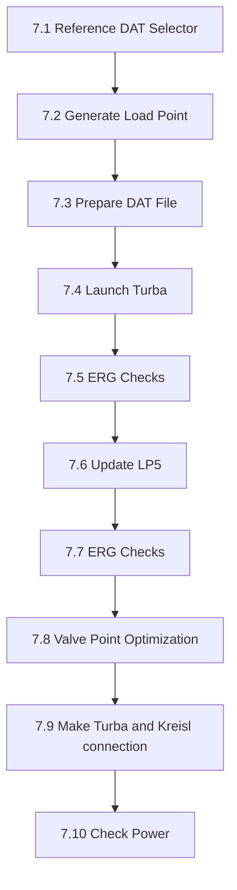
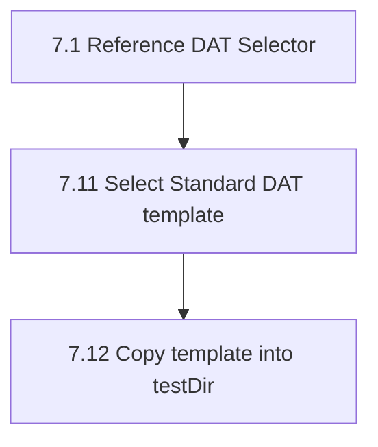
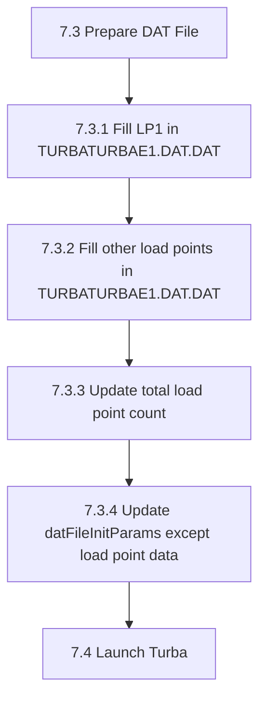
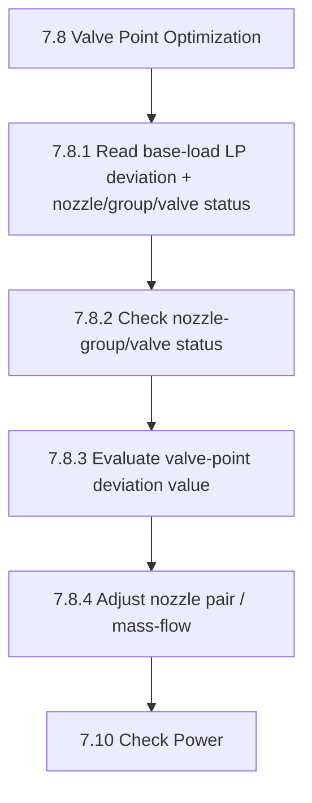
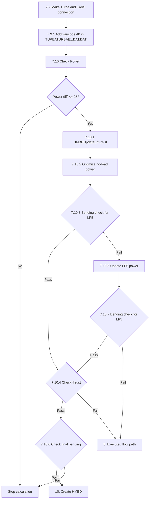

# SST-200 Back-Pressure Turbine Automation - Code Documentation

This documentation explains the code logic for the SST-200 turbine automation pipeline in a flow-wise format.  
It is intended as a living document, so more sections can be added progressively for each flow path and sub-flow.

---

## 1) What this code does

This codebase automates core engineering tasks that are usually manual in SST-200 back-pressure turbine design:

- selecting and preparing Kreisl/DAT templates,
- generating and updating load points,
- launching Kreisl and Turba runs,
- checking ERG results,
- optimizing valve/nozzle behavior,
- validating final power match,
- producing HMBD-aligned output behavior (open/closed variants).

The objective is to reduce repetitive manual work, keep calculations consistent, and shorten turnaround time.

---

## 2) Main flow path first (top-level)

The code follows one top-level dispatch path, then branches into sub-flows:

1. **Main flow path (entry)**
   - `Program` -> `StartExec.Main4(...)` for standard path.
   - `MainExecutedClass.GotoBCD1120()` / `GotoBCD1190()` for executed path.
   - `CustomExecutedClass.Main_CustomFlowPathTest()` for custom path (direct or fallback).

2. **Standard flow path**
   - Base automation flow (`StartExec.Main4`) with template selection + Turba + ERG + valve + power match.

3. **Executed flow path**
   - Criteria-driven flow (`MainExecuted(criteria)`), where criteria can be:
     - `BCD1120`
     - `BCD1190`
     - `Throttle` (limited retry, then custom handoff)

4. **Custom flow path**
   - Heavy optimization flow (`Main_CustomFlowPathTest`) with custom DAT selection, PSO, custom ERG checks, valve optimization, and final power closure.

5. **Additional load points flow**
   - Activated in executed/custom when customer load points exceed base set (`CustomerLoadPoints.Count > 2`), and iterated LP-wise.

---

## 3) HMBD logic families used in code

### A. Open HMBD

- Open cycle **with PST**
- Open cycle **without PST**

### B. Closed HMBD

Closed-cycle handling is entered when:

- `DeaeratorOutletTemp > 0`

Inside this branch, it splits into:

1. **Dump condenser ON** (`DumpCondensor == true`)
2. **Dump condenser OFF** (`DumpCondensor == false`)

Then template choice is refined by:

- PRV feasibility check (`tsatvonp(ExhaustPressure * 0.92 - 0.25) - DeaeratorOutletTemp`),
- ERG presence (`File.Exists(KREISL.ERG)`),
- desuperheater decision (`exhaustTemp < PST`).

---

## 4) Code locations (quick map)

- `src/kreisl.cs`
  - `StartKreisl.MainKreisL(...)` orchestration
  - `FillInputValues()` branch behavior for open/closed conditions
- `src/core/Handlers/KreislDATHandler.cs`
  - `RefreshKreislDAT()` template selection and copy/update logic
- `src/core/HMBD/HMBD_Configuration.cs`
  - HMBD pre-feasibility and extraction behavior
- `src/core/Utilities/PrintPDF.cs`
  - closed-cycle output template combinations for dump/deaerator states

---

## 5) Flowchart - Standard path (starting section)

Below is the current standard-path flowchart (shared and refined for documentation).  
This is the first detailed flow section; executed/custom flows will be added next.

### 5.1 Standard flow path chart (clean split, as shared)

To keep the Standard section readable (not messy), the same logic is split into smaller charts exactly like your diagram style.

#### 5.1.1 Main Standard pipeline (7.1 to 7.10)

This is the base Standard run sequence before deeper sub-logic.

#### 5.1.2 Reference DAT selector detail (7.1.x)

Explanation:
- `7.11` chooses the correct Standard template from input condition.
- `7.12` copies that template to runtime location (`testDir`) so later steps always work on the active DAT.

#### 5.1.3 Prepare DAT detail (7.3.x)

Explanation:
- LP1 is written first, then remaining LPs are appended.
- Load-point count is synchronized with written rows.
- Non-LP init params are refreshed before Turba launch.

#### 5.1.4 Valve optimization detail (7.8.x)

Explanation:
- This block reduces valve-point deviation iteratively.
- Based on status + deviation band, code applies nozzle pair/mass-flow corrections.
- Control then returns to `7.10 Check Power`.

#### 5.1.5 Turba-Kreisl connection + power decision (7.9.1, 7.10.x)

Explanation:
- `7.9.1` adds the coupling marker (`varicode 40`) so Turba-Kreisl handoff is complete.
- `7.10` gates success by power difference first.
- If LP5/bending/thrust checks fail repeatedly, flow escalates to `8. Executed flow path`.
- If all checks pass, flow closes at `10. Create HMBD`.

---

## 6) Theory walkthrough - explain the full standard flowchart

This section explains what each major block in the flowchart is doing and why it exists.

### 6.1 Entry and cleanup (`A -> D`)

The flow starts from `StartKreisl.MainKreisL`, then immediately performs runtime cleanup:

- delete stale `.CON` / `.ERG` files,
- create `KreislDATHandler`,
- call `RefreshKreislDAT`.

Why this matters:

- old simulation artifacts can pollute a new run,
- template selection must happen before running Kreisl/Turba,
- all later calculations depend on this initial DAT state.

### 6.2 Template selection subgraph (`T`)

`RefreshKreislDAT` is the most important decision engine in the standard path.

It first determines whether the request is **closed-cycle-like** or **open-cycle-like**:

- if `DeaeratorOutletTemperature > 0` -> closed-cycle branch,
- else -> open-cycle/PST branch.

#### 6.2.1 Open-cycle / PST side (`T1 = No`)

If no deaerator outlet temperature is provided:

- when `PST <= 0`, it copies `kreislp1.dat` (without PST path),
- when `PST > 0`, it tries to read `KREISL.ERG` and extract exhaust temperature.

Then it compares `exhaustTemp` with `PST`:

- `exhaustTemp < PST` -> choose **without desuperheater** template,
- otherwise -> choose **with desuperheater** template.

If ERG is missing, the flow safely defaults to the **without desuperheater** template.

#### 6.2.2 Closed-cycle with deaerator (`T1 = Yes`)

When `DeaeratorOutletTemperature > 0`, the next split is dump condenser:

- `DumpCondensor == true` (dump ON),
- `DumpCondensor == false` (dump OFF).

Inside both dump ON/OFF paths, code checks PRV feasibility:

- `tsatvonp(ExhaustPressure*0.92 - 0.25) - DeaeratorOutletTemp > 0`.

That condition determines whether `IsPRVTemplate` stays true or false.

After that, it optionally reads `KREISL.ERG` and compares `exhaustTemp < PST` to decide:

- with-desuperheater template vs without-desuperheater template.

For non-PRV outcomes, the selected PRV template is converted using:

- `UpdateTemplatePRVToWPRVInDumpCondensor` (dump ON),
- `UpdateTemplatePRVToWPRV` (dump OFF).

This conversion step is essential because template families are reused and then adjusted to match final mode.

### 6.3 Post-template thermodynamic initialization (`D -> J`)

After template decision:

1. `FillClosestTurbineEfficiency` loads nearest known performance context.
2. `GetTurbaCON(ClosestProjectID)` binds reference project CON data.
3. `InitConfig` hydrates runtime model state.
4. `LaunchKreisL` runs Kreisl with selected template/input.
5. `RefreshKreislDAT` + `InitConfig` run again to sync generated outputs back into the pipeline.

The key idea is: **select -> run -> resync** before entering final DAT/Turba checks.

### 6.4 Main computation pipeline (`K -> R`)

This is the operational sequence:

1. `ReferenceDATSelector` picks final DAT reference.
2. `GenerateLoadPoints` builds LP inputs.
3. `PrepareDATFile` writes LP and control values into DAT.
4. `LaunchTurba` runs turbine simulation.
5. `ERGResultsCheck` validates result quality.
6. `UpdateLP5` modifies LP5 scenario and checks ERG again.
7. `ValvePointOptimize` adjusts valve configuration for convergence/performance.

Why LP5 is checked again:

- LP5 often acts as a corrective or boundary operating point,
- second ERG check ensures the updated point still satisfies constraints.

### 6.5 Final stabilization and power closure (`S -> W`)

After valve optimization:

1. `FillVari40` updates DAT/Kreisl variable settings.
2. `LaunchTurba` runs once more on updated values.
3. `Rename TURBATURBAE1.DAT.CON -> TURBA.CON` normalizes output naming for downstream use.
4. `FillWheelChamberPressure` pushes wheel chamber pressure back to Kreisl/DAT side.
5. `PowerMatch.CheckPower` performs final power closure.

This final block ensures the output is not just feasible, but also aligned with target power behavior.

### 6.6 Fallback and resilience behavior (conceptual)

Across this flow, the code uses practical fallback rules:

- if ERG file does not exist, choose safe default templates,
- if branch-specific PRV mode is not feasible, convert PRV templates to non-PRV variants,
- rerun key steps after major state updates (Kreisl run, LP update, valve optimization).

This makes the pipeline robust to missing intermediate files and branch-dependent state transitions.

---

## 7) Flow-wise content: Executed flow path

### 7.1 Main executed flow (`MainExecutedClass.MainExecuted`)

The executed flow sequence is:

1. initialize counters and criteria limits (`mainCallCounters`, `throttleCounters`),
2. apply retry/fallback gates:
   - `Throttle` only up to `MAX_THROTTLE_CALLS`,
   - `BCD1120` exhaustion -> switch to `BCD1190`,
   - `BCD1190` exhaustion -> move to custom flow (`Main_CustomFlowPathTest`),
3. run HMBD defaults and nearest project selection (`PowerKNN`, `MoveYAndSetParams`),
4. select executed DAT (`ReferenceDATSelectorExecuted`),
5. load DAT and generate LPs (`LoadDatFile`, `GenerateLoadPoints`),
6. write DAT (`PrepareDATFileExecuted`),
7. validate wheel chamber pressure; if invalid, re-run executed selection,
8. launch Turba (`LaunchTurba`),
9. run ERG checks by criteria (`ErgResultsCheckExecuted(criteria, false)`),
10. update LP5 and re-check ERG (`UpdateLP5`, `ErgResultsCheckExecuted(criteria, true)`),
11. valve optimization (`ValvePointOptimize`),
12. final stabilization:
    - `FillVari40`
    - Turba re-launch
    - rename `TURBATURBAE1.DAT.CON` -> `TURBA.CON`
    - fill wheel chamber pressure
13. final power match (`CheckPower`).

### 7.2 Executed criteria sub-flows

- **BCD1120 flow**
  - Uses `ErgResultsCheckBCD1120` in both initial and LP5-updated passes.
  - If call budget is exhausted, auto-handoff to `BCD1190`.

- **BCD1190 flow**
  - Uses `ErgResultsCheckBCD1190` in both initial and LP5-updated passes.
  - If call budget is exhausted, auto-handoff to custom flow.

- **Throttle flow**
  - Uses `ErgResultsCheckThrottle`.
  - Hard-limited retry count; beyond limit, flow returns and effectively shifts toward custom handling path.

---

## 8) Flow-wise content: Custom flow path

### 8.1 Main custom flow (`CustomExecutedClass.Main_CustomFlowPathTest`)

The custom flow sequence is:

1. initialize dependencies and cleanup (`DeleteCONFiles`, `RefreshKreislDAT`),
2. read nearest Turba context and fill input values,
3. set HMBD defaults + initial efficiency setup,
4. generate custom load points (`CustomLoadPointGenerator.GenerateLoadPoints`),
5. pre-feasibility checks (`fillPrefeasibilityDecisionChecks`),
6. pick nearest custom params and custom reference DAT:
   - `GetNearestParams_Custom`
   - delete executed DAT
   - copy custom reference DAT,
7. prepare DAT (`CustomDATFileProcessor.PrepareDatFile`),
8. run base update and optimization:
   - `BCD_UPDATE`
   - PSO flow optimizer (`InvokeTurbineDesigner`),
9. run custom base checks (`ERG_CUSTOM_BASE_CHECKS`),
10. convert/update steam path (`TurnaConvert`, `UpdatePunConvertor`) and launch Turba,
11. select ERG criterion from pre-feasibility decision:
   - custom BCD1120 check or
   - custom BCD1190 check,
12. LP5 update + second criterion check,
13. custom valve point optimization (`CustomValvePointOptimizer`),
14. final closure:
   - `FillVari40`
   - Turba launch
   - rename/load final CON
   - fill wheel chamber pressure
   - custom power match + final checks (`checkFinalTurbine`).

---

## 9) Flow-wise content: Additional load points path

This path appears in both executed and custom flows when:

- `AdditionalLoadPoint.GetInstance().CustomerLoadPoints.Count > 2`

LP-wise sequence:

1. ensure `TURBA.CON` exists (rename fallback if needed),
2. refresh Kreisl DAT and push wheel chamber pressure,
3. iterate customer load points from index 1 onward,
4. for each LP, resolve unknown input dimension and fill LP template:
   - `Pr` (pressure unknown),
   - `T` (temperature unknown),
   - `M` (mass flow unknown),
   - `P` (power unknown),
   - `E` (exhaust pressure unknown),
5. append each generated LP DAT block into final `KREISL.DAT`,
6. if deaerator/PST path is active, update desuperheater fields from Turba ERG,
7. launch Kreisl on merged multi-LP DAT.

---

## 10) Complete flow map (all paths)

`Main Entry` -> `Standard` **or** `Executed` **or** `Custom`

- `Standard` -> single baseline path -> ERG checks -> valve optimization -> power match.
- `Executed` -> `BCD1120 / BCD1190 / Throttle` criteria sub-flow -> fallback chain -> power match.
- `Custom` -> custom DAT + PSO + custom ERG criteria -> valve + final custom checks.
- `Executed/Custom` + additional LP count -> `Additional Load Points LP-wise loop`.

---

## 11) Notes

- This README is code-logic first and intentionally flow-oriented.
- Keep terminology as in code where possible (`DumpCondensor`, `DeaeratorOutletTemp`, `IsPRVTemplate`) to avoid mismatch.
- Extend each section with diagrams and method-level call mapping as documentation evolves.

