# SST-200 Back-Pressure Turbine Automation - Code Documentation

This documentation explains the code logic for the SST-200 turbine automation pipeline in a flow-wise format.  
It is intended as a living document, so more sections can be added progressively for each flow path and sub-flow.

---

## 1) What this code does

This codebase automates core engineering tasks that are usually manual in SST-200 back-pressure turbine design:

- selecting and preparing Kreisl/DAT templates,
- generating and updating load points,
- launching Kreisl and Turba runs,
- checking ERG results,
- optimizing valve/nozzle behavior,
- validating final power match,
- producing HMBD-aligned output behavior (open/closed variants).

The objective is to reduce repetitive manual work, keep calculations consistent, and shorten turnaround time.

---

## 2) Main flow path first (top-level)

The code follows one top-level dispatch path, then branches into sub-flows:

1. **Main flow path (entry)**
   - `Program` -> `StartExec.Main4(...)` for standard path.
   - `MainExecutedClass.GotoBCD1120()` / `GotoBCD1190()` for executed path.
   - `CustomExecutedClass.Main_CustomFlowPathTest()` for custom path (direct or fallback).

2. **Standard flow path**
   - Base automation flow (`StartExec.Main4`) with template selection + Turba + ERG + valve + power match.

3. **Executed flow path**
   - Criteria-driven flow (`MainExecuted(criteria)`), where criteria can be:
     - `BCD1120`
     - `BCD1190`
     - `Throttle` (limited retry, then custom handoff)

4. **Custom flow path**
   - Heavy optimization flow (`Main_CustomFlowPathTest`) with custom DAT selection, PSO, custom ERG checks, valve optimization, and final power closure.

5. **Additional load points flow**
   - Activated in standard/executed/custom when customer load points exceed base set (`CustomerLoadPoints.Count > 1`), and iterated LP-wise.

---

## 3) HMBD logic families used in code

### A. Open HMBD

- Open cycle **with PST**
- Open cycle **without PST**

### B. Closed HMBD

Closed-cycle handling is entered when:

- `DeaeratorOutletTemp > 0`

Inside this branch, it splits into:

1. **Dump condenser ON** (`DumpCondensor == true`)
2. **Dump condenser OFF** (`DumpCondensor == false`)

Then template choice is refined by:

- PRV feasibility check (`tsatvonp(ExhaustPressure * 0.92 - 0.25) - DeaeratorOutletTemp`),
- ERG presence (`File.Exists(KREISL.ERG)`),
- desuperheater decision (`exhaustTemp < PST`).

---

## 4) Code locations (quick map)

- `src/kreisl.cs`
  - `StartKreisl.MainKreisL(...)` orchestration
  - `FillInputValues()` branch behavior for open/closed conditions
- `src/core/Handlers/KreislDATHandler.cs`
  - `RefreshKreislDAT()` template selection and copy/update logic
- `src/core/HMBD/HMBD_Configuration.cs`
  - HMBD pre-feasibility and extraction behavior
- `src/core/Utilities/PrintPDF.cs`
  - closed-cycle output template combinations for dump/deaerator states

---

## 5) Flowchart - Standard path (starting section)

Below is the current standard-path flowchart (shared and refined for documentation).  
This is the first detailed flow section; executed/custom flows will be added next.

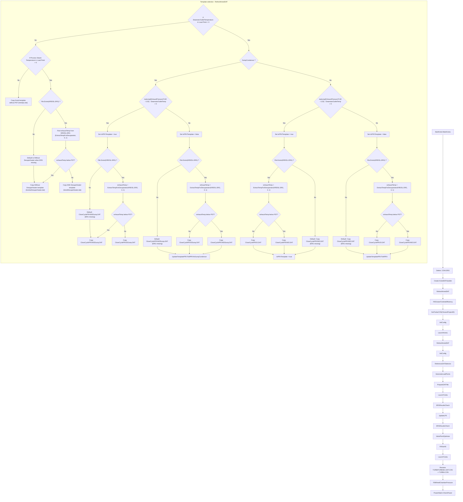

### 5.0 End-to-end pipeline (shared diagram)

This is the clean top-level view of how inputs move through template selection, efficiency, prefeasibility, and the Standard → Executed → Custom fallback chain before **Create HMBD**. It sits before the detailed Standard-path splits in §5.1.

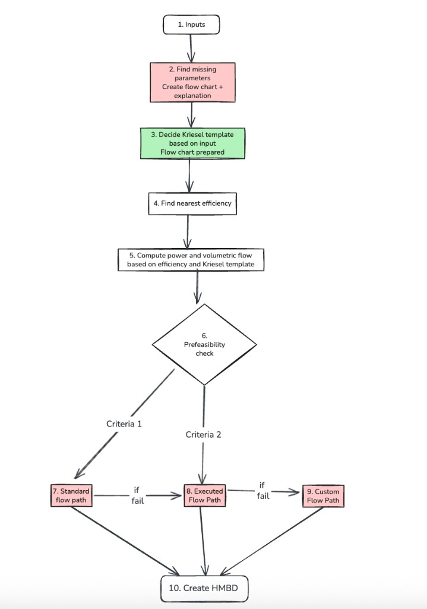

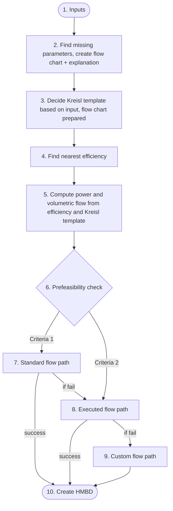

### 5.1 Standard flow path chart (clean split, as shared)

To keep the Standard section readable (not messy), the same logic is split into smaller charts exactly like your diagram style.

#### 5.1.1 Main Standard pipeline (7.1 to 7.10)

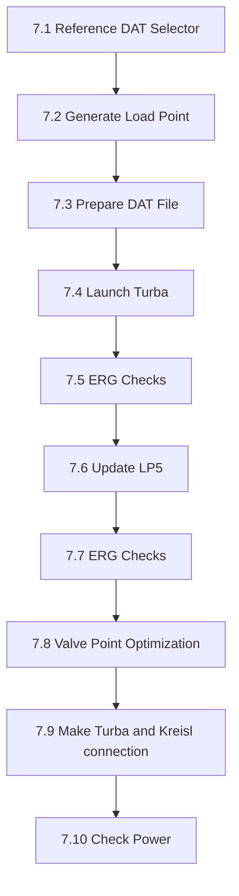

This is the base Standard run sequence before deeper sub-logic.

#### 5.1.2 Reference DAT selector detail (7.1.x)

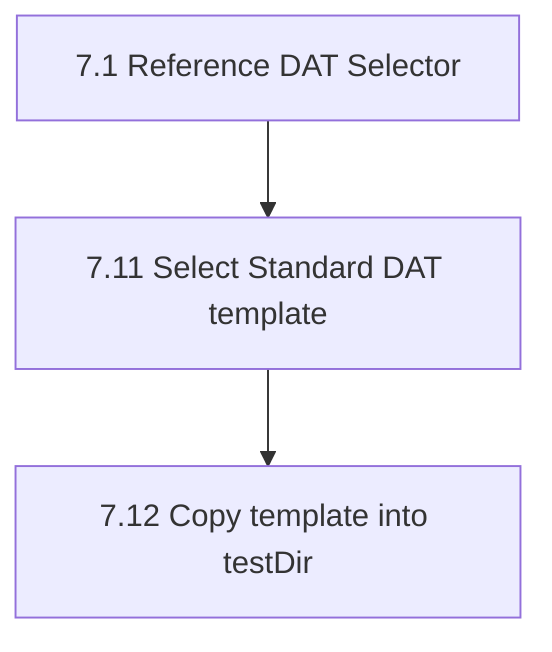

Explanation:
- `7.11` chooses the correct Standard template from input condition.
- `7.12` copies that template to runtime location (`testDir`) so later steps always work on the active DAT.

#### 5.1.3 Prepare DAT detail (7.3.x)

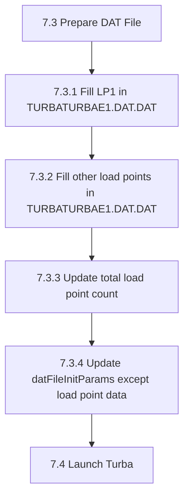

Explanation:
- LP1 is written first, then remaining LPs are appended.
- Load-point count is synchronized with written rows.
- Non-LP init params are refreshed before Turba launch.

#### 5.1.4 Valve optimization detail (7.8.x)

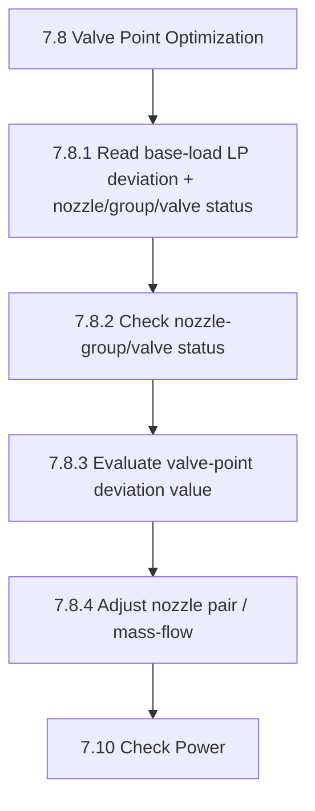

Explanation:
- This block reduces valve-point deviation iteratively.
- Based on status + deviation band, code applies nozzle pair/mass-flow corrections.
- Control then returns to `7.10 Check Power`.

#### 5.1.5 Turba-Kreisl connection + power decision (7.9.1, 7.10.x)

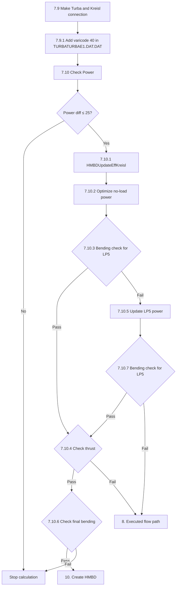

Explanation:
- `7.9.1` adds the coupling marker (`varicode 40`) so Turba-Kreisl handoff is complete.
- `7.10` gates success by power difference first.
- If LP5/bending/thrust checks fail repeatedly, flow escalates to `8. Executed flow path`.
- If all checks pass, flow closes at `10. Create HMBD`.

---

## 6) Theory walkthrough - explain the full standard flowchart

This section explains what each major block in the flowchart is doing and why it exists.

### 6.1 Entry and cleanup (`A -> D`)

The flow starts from `StartKreisl.MainKreisL`, then immediately performs runtime cleanup:

- delete stale `.CON` / `.ERG` files,
- create `KreislDATHandler`,
- call `RefreshKreislDAT`.

Why this matters:

- old simulation artifacts can pollute a new run,
- template selection must happen before running Kreisl/Turba,
- all later calculations depend on this initial DAT state.

### 6.2 Template selection subgraph (`T`)

`RefreshKreislDAT` is the most important decision engine in the standard path.

It first determines whether the request is **closed-cycle-like** or **open-cycle-like**:

- if `DeaeratorOutletTemperature > 0` -> closed-cycle branch,
- else -> open-cycle/PST branch.

#### 6.2.1 Open-cycle / PST side (`T1 = No`)

If no deaerator outlet temperature is provided:

- when `PST <= 0`, it copies `kreislp1.dat` (without PST path),
- when `PST > 0`, it tries to read `KREISL.ERG` and extract exhaust temperature.

Then it compares `exhaustTemp` with `PST`:

- `exhaustTemp < PST` -> choose **without desuperheater** template,
- otherwise -> choose **with desuperheater** template.

If ERG is missing, the flow safely defaults to the **without desuperheater** template.

#### 6.2.2 Closed-cycle with deaerator (`T1 = Yes`)

When `DeaeratorOutletTemperature > 0`, the next split is dump condenser:

- `DumpCondensor == true` (dump ON),
- `DumpCondensor == false` (dump OFF).

Inside both dump ON/OFF paths, code checks PRV feasibility:

- `tsatvonp(ExhaustPressure*0.92 - 0.25) - DeaeratorOutletTemp > 0`.

That condition determines whether `IsPRVTemplate` stays true or false.

After that, it optionally reads `KREISL.ERG` and compares `exhaustTemp < PST` to decide:

- with-desuperheater template vs without-desuperheater template.

For non-PRV outcomes, the selected PRV template is converted using:

- `UpdateTemplatePRVToWPRVInDumpCondensor` (dump ON),
- `UpdateTemplatePRVToWPRV` (dump OFF).

This conversion step is essential because template families are reused and then adjusted to match final mode.

### 6.3 Post-template thermodynamic initialization (`D -> J`)

After template decision:

1. `FillClosestTurbineEfficiency` loads nearest known performance context.
2. `GetTurbaCON(ClosestProjectID)` binds reference project CON data.
3. `InitConfig` hydrates runtime model state.
4. `LaunchKreisL` runs Kreisl with selected template/input.
5. `RefreshKreislDAT` + `InitConfig` run again to sync generated outputs back into the pipeline.

The key idea is: **select -> run -> resync** before entering final DAT/Turba checks.

### 6.4 Main computation pipeline (`K -> R`)

This is the operational sequence:

1. `ReferenceDATSelector` picks final DAT reference.
2. `GenerateLoadPoints` builds LP inputs.
3. `PrepareDATFile` writes LP and control values into DAT.
4. `LaunchTurba` runs turbine simulation.
5. `ERGResultsCheck` validates result quality.
6. `UpdateLP5` modifies LP5 scenario and checks ERG again.
7. `ValvePointOptimize` adjusts valve configuration for convergence/performance.

Why LP5 is checked again:

- LP5 often acts as a corrective or boundary operating point,
- second ERG check ensures the updated point still satisfies constraints.

### 6.5 Final stabilization and power closure (`S -> W`)

After valve optimization:

1. `FillVari40` updates DAT/Kreisl variable settings.
2. `LaunchTurba` runs once more on updated values.
3. `Rename TURBATURBAE1.DAT.CON -> TURBA.CON` normalizes output naming for downstream use.
4. `FillWheelChamberPressure` pushes wheel chamber pressure back to Kreisl/DAT side.
5. `PowerMatch.CheckPower` performs final power closure.

This final block ensures the output is not just feasible, but also aligned with target power behavior.

### 6.6 Fallback and resilience behavior (conceptual)

Across this flow, the code uses practical fallback rules:

- if ERG file does not exist, choose safe default templates,
- if branch-specific PRV mode is not feasible, convert PRV templates to non-PRV variants,
- rerun key steps after major state updates (Kreisl run, LP update, valve optimization).

This makes the pipeline robust to missing intermediate files and branch-dependent state transitions.

---

## 7) Flow-wise content: Executed flow path

### 7.1 Main executed flow (`MainExecutedClass.MainExecuted`)

The executed flow sequence is:

1. initialize counters and criteria limits (`mainCallCounters`, `throttleCounters`),
2. apply retry/fallback gates:
   - `Throttle` only up to `MAX_THROTTLE_CALLS`,
   - `BCD1120` exhaustion -> switch to `BCD1190`,
   - `BCD1190` exhaustion -> move to custom flow (`Main_CustomFlowPathTest`),
3. run HMBD defaults and nearest project selection (`PowerKNN`, `MoveYAndSetParams`),
4. select executed DAT (`ReferenceDATSelectorExecuted`),
5. load DAT and generate LPs (`LoadDatFile`, `GenerateLoadPoints`),
6. write DAT (`PrepareDATFileExecuted`),
7. validate wheel chamber pressure; if invalid, re-run executed selection,
8. launch Turba (`LaunchTurba`),
9. run ERG checks by criteria (`ErgResultsCheckExecuted(criteria, false)`),
10. update LP5 and re-check ERG (`UpdateLP5`, `ErgResultsCheckExecuted(criteria, true)`),
11. valve optimization (`ValvePointOptimize`),
12. final stabilization:
    - `FillVari40`
    - Turba re-launch
    - rename `TURBATURBAE1.DAT.CON` -> `TURBA.CON`
    - fill wheel chamber pressure
13. final power match (`CheckPower`).

### 7.2 Executed criteria sub-flows

- **BCD1120 flow**
  - Uses `ErgResultsCheckBCD1120` in both initial and LP5-updated passes.
  - If call budget is exhausted, auto-handoff to `BCD1190`.

- **BCD1190 flow**
  - Uses `ErgResultsCheckBCD1190` in both initial and LP5-updated passes.
  - If call budget is exhausted, auto-handoff to custom flow.

- **Throttle flow**
  - Uses `ErgResultsCheckThrottle`.
  - Hard-limited retry count; beyond limit, flow returns and effectively shifts toward custom handling path.

### 7.3 Executed main pipeline flowchart

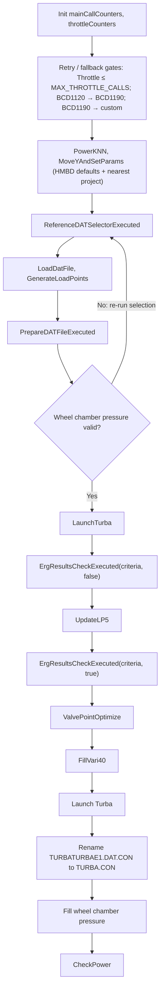

### 7.4 Executed criteria and ERG fallback flowchart

Each criterion uses the matching ERG checker on **both** passes in the main pipeline (`ErgResultsCheckExecuted(criteria, false)` then after `UpdateLP5`, `ErgResultsCheckExecuted(criteria, true)`). This chart shows how criteria **hand off** when budgets are exhausted.

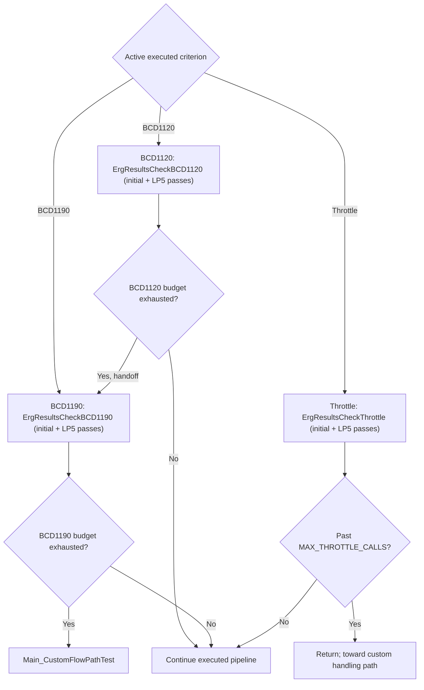

### 7.5 `MainExecuted(criteria, maxLp)` in-depth flow and purpose

This is the **main controller** for the executed flow path.

In simple terms, it:

1. decides whether the current criterion is still allowed to run,
2. selects the nearest executed reference project,
3. rebuilds the DAT with executed load points,
4. runs Turba,
5. applies criterion-specific ERG checks,
6. updates LP5 and checks again,
7. optimizes valve behavior,
8. performs final stabilization and power matching,
9. falls back to the next path if the current executed path cannot close.

#### 7.5.1 Easy overall picture

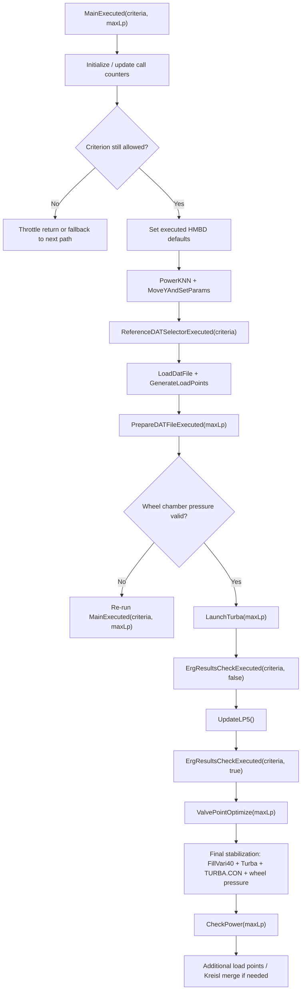

#### 7.5.2 Counter and fallback logic

Before the executed calculation starts, `MainExecuted()` checks whether the current criterion is still allowed to continue.

- `mainCallCounters` tracks retries for `BCD1120` and `BCD1190`
- `throttleCounters` tracks retries for `Throttle`
- `MAX_THROTTLE_CALLS = 2`

Behavior:

- if the criterion is `Throttle` and the retry limit is exceeded, the method returns and effectively gives up on the throttle-executed path
- if `BCD1120` exceeds its allowed neighbor/call budget, the flow resets state and hands off to `BCD1190`
- if `BCD1190` exceeds its budget, the flow moves to `Main_CustomFlowPathTest(maxLp)`

So this method is not just a run pipeline. It is also the **gatekeeper for executed-path retry and fallback policy**.

#### 7.5.3 Main executed setup phase

Once the criterion is accepted, the method performs the executed-run setup:

1. HMBD defaults are initialized:
   - `HBDsetDefaultCustomerParamas_Executed()` or Kreisl-specific variant
2. nearest executed candidates are resolved:
   - `PowerKNN(criteria)`
   - `MoveYAndSetParams()`
3. the executed DAT is selected:
   - `ReferenceDATSelectorExecuted(criteria)`
4. the selected DAT is loaded:
   - `LoadDatFile()`
5. executed load points are generated:
   - `GenerateLoadPoints(maxLp)`
6. turbine efficiency from the nearest match is pushed into runtime state:
   - `HBDupdateEfficiency(efficiency)`
7. the DAT is rebuilt for the executed run:
   - `PrepareDATFileExecuted(maxLp)`

This means the executed flow first establishes the **nearest known project context**, then rewrites that selected DAT around the current request.

### 7.6 `ReferenceDATSelectorExecuted(criteria)` in-depth flow and purpose

This step is the executed-flow **reference project selector**.

It does not build a DAT from scratch. Instead, it chooses the closest executed reference project for the active criterion and copies that DAT into the working area.

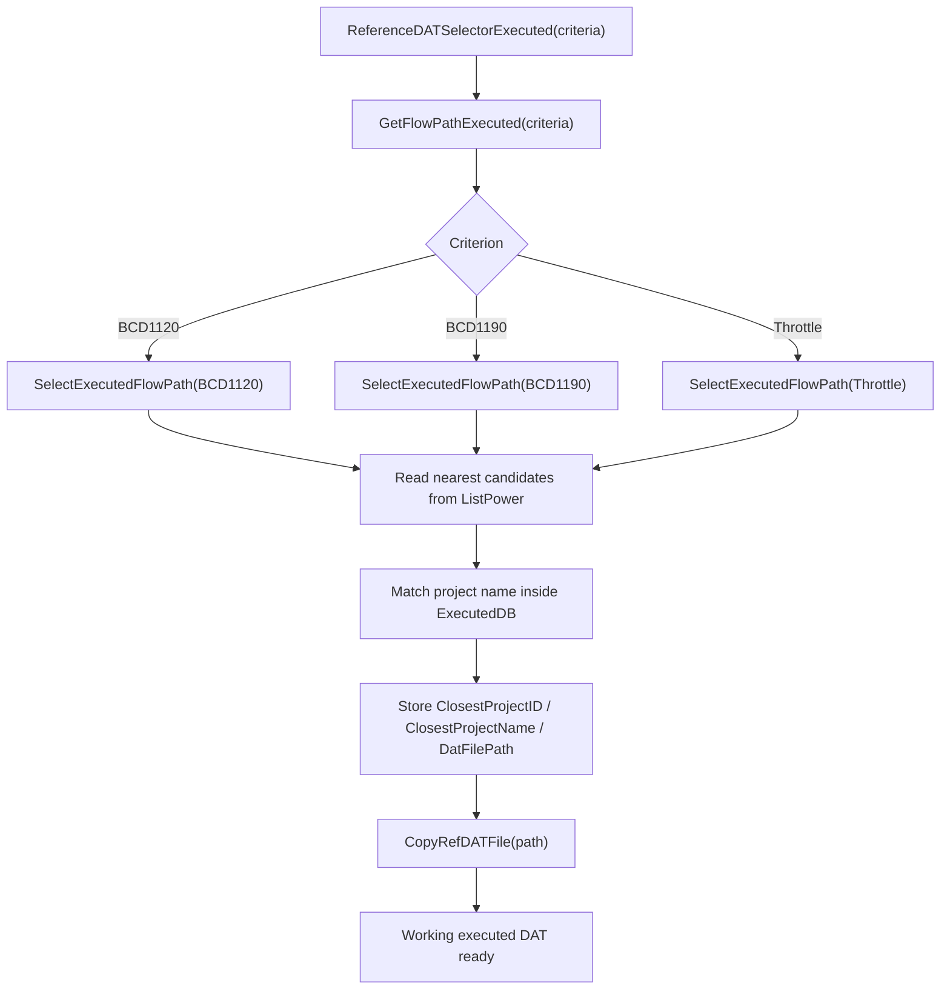

What it really does:

- `SelectExecutedFlowPath(criteria)` loops through the nearest candidates already prepared in `turbineDataModel.ListPower`
- it looks for entries marked with `KNearest == "Y"`
- it matches those candidate names against `ExecutedDB.ExecutedProjectDB`
- once it finds the matching project:
  - stores closest project metadata in `TurbineDataModel`
  - returns the DAT file path
- `CopyRefDATFile(path)` then copies that chosen executed DAT into the active runtime area

So this is the step that converts “nearest executed project” into an actual working DAT file.

### 7.7 `PrepareDATFileExecuted(maxLp)` in-depth flow and purpose

This method is the executed-flow **DAT reconstruction step**.

It rewrites the selected executed DAT with the generated executed load points and then refreshes executed-specific non-LP initialization values.

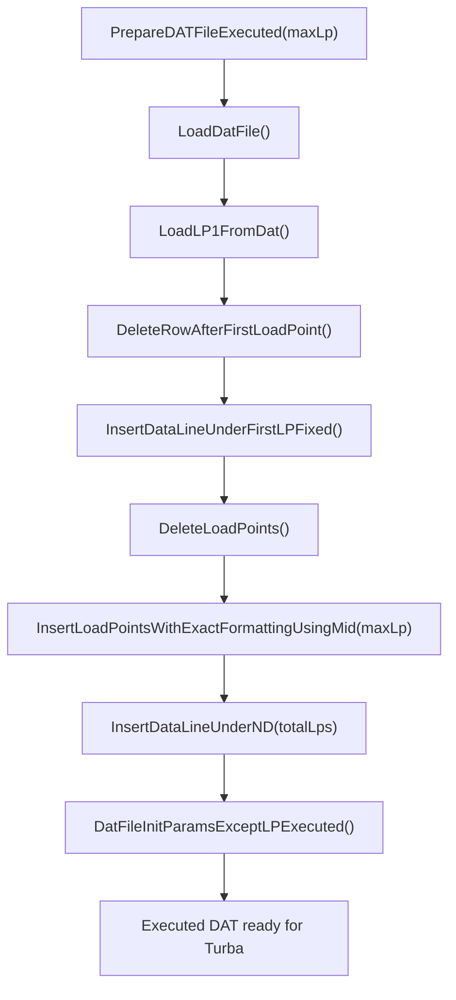

Important meaning:

- LP1 is preserved from the selected executed reference DAT
- old LP blocks are removed
- new executed LPs are inserted
- the ND/load-point count line is updated
- executed-specific DAT init parameters are refreshed after LP insertion

So this is the executed equivalent of the custom DAT rebuild step.

### 7.8 `UpdateLP5()` in-depth flow and purpose

This method regenerates the special LP5 case before the second ERG pass.

It uses current turbine inlet conditions and derives a corrective LP5 condition:

- pressure = inlet pressure
- temperature = inlet temperature minus a computed offset
- mass flow = current inlet mass flow
- back pressure = `0.5 * ExhaustPressure`
- RPM = LP1 RPM
- several flags (`InFlow`, `BYP`, `EIN`, `WANZ`, `RSMIN`) are reset

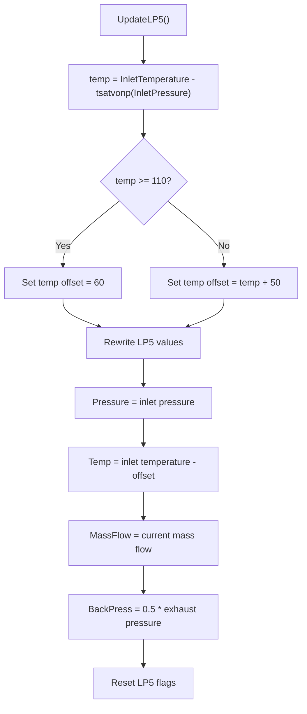

Why it matters:

- the first ERG check runs on the original executed LP set
- then LP5 is rebuilt into a stronger corrective/bending/thrust-sensitive case
- the second ERG check verifies whether the design still survives after that LP5 update

So `UpdateLP5()` is the executed flow’s **second-pass stress/correction load-point generator**.

### 7.9 `ErgResultsCheckExecuted(criteria, isLP5Update, maxLp)` in-depth flow and purpose

This method is the **dispatcher** for executed ERG validation.

It does not perform the actual check logic itself. It routes to the criterion-specific checker:

- `BCD1120` -> `ErgResultsCheckBCD1120(isLP5Update, maxLp)`
- `BCD1190` -> `ErgResultsCheckBCD1190(isLP5Update, maxLp)`
- `Throttle` -> `ErgResultsCheckThrottle()`

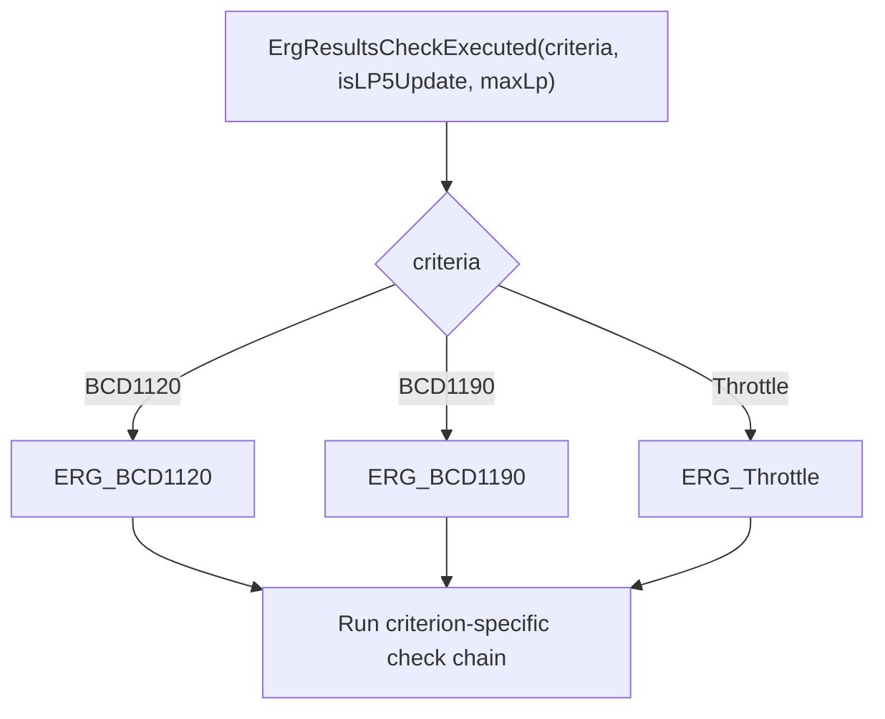

#### 7.9.1 `BCD1120` executed check chain

`ErgResultsCheckBCD1120(maxLp)` runs a staged validation chain:

1. exhaust volumetric-flow check
2. nozzle-section check
3. thrust-value check
4. Delta-T / GBC / wheel-chamber / PT / bending check
5. final `ErgResultsCheckBCD1120New(maxLp)` consolidation

Important fallback behavior:

- if nozzle optimization fails, it resets nearest-neighbor state and immediately hands off to `MainExecuted("BCD1190", maxLp)`

It also contains load-point repair behavior:

- if stage-pressure checks fail for MCR/high-BP points, it adjusts generated load points
- rewrites DAT with `PrepareDatFileOnlyLPUpdate()`
- reruns Turba
- re-enters the BCD1120 check flow

So BCD1120 is not a single yes/no check. It is a **repair-and-retry validation chain**.

#### 7.9.2 `BCD1190` executed check chain

`ErgResultsCheckBCD1190(maxLp)` follows a similar pattern, but with 1190-specific limits:

1. exhaust check using delta-T-dependent exhaust curves
2. nozzle-section optimization check
3. thrust check
4. Delta-T / GBC / wheel-chamber / bending check
5. final `ErgResultsCheckBCD1190New(maxLp)` consolidation

Important fallback behavior:

- if exhaust or nozzle checks fail badly, it usually re-calls `MainExecuted("BCD1190", maxLp)` to try the next neighbor
- once executed retries are exhausted, the higher-level `MainExecuted()` logic escalates to the custom path

So BCD1190 is the **second executed rescue path** before custom flow is used.

#### 7.9.3 `Throttle` executed check chain

`ERGResultsCheckThrottle()` runs its own sequence:

1. exhaust volumetric flow check
2. Delta-T / GBC / wheel-chamber / PT / bending check
3. thrust check
4. load-point pressure/power correction check
5. exhaust check

If load-point pressure checks fail:

- mass flow is increased for MCR points
- BP can be reduced for the high-BP case
- DAT is updated with `PrepareDATFileOnlyLPUpdate()`
- Turba is re-launched
- throttle ERG checks are re-run

So throttle behaves like a smaller executed sub-flow with its own repair loop.

### 7.10 `ValvePointOptimize(maxLp)` and final stabilization

After both ERG passes complete, the executed flow enters the final executed stabilization block.

Sequence:

1. `ValvePointOptimize(maxLp)`
2. `FillVari40()`
3. Turba re-launch
4. normalize output CON file to `TURBA.CON`
5. push wheel chamber pressure back into Kreisl/DAT side
6. `CheckPower(maxLp)`

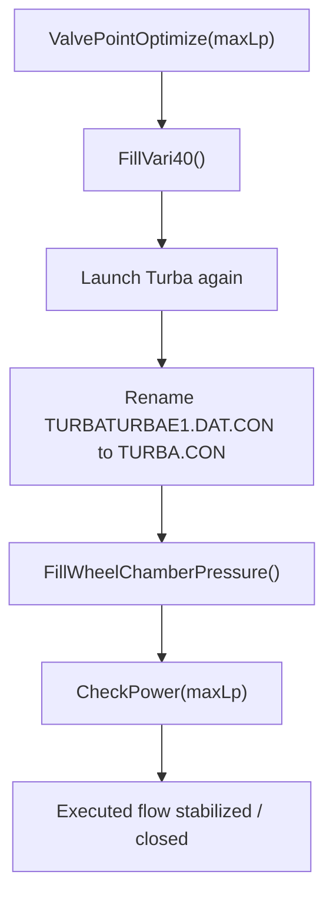

Meaning:

- valve-point optimization tries to improve convergence/performance before final closure
- `Vari40` reconnects Turba and Kreisl state
- the wheel chamber pressure is pushed back into the Kreisl-side files
- `CheckPower()` is the final gate for executed success

### 7.11 Additional load points in executed flow

If the customer has more than two load points, the executed flow continues after power match into an additional-load-point merge path.

That block:

1. ensures `TURBA.CON` exists,
2. refreshes Kreisl DAT,
3. writes wheel chamber pressure back,
4. loops over extra customer LPs,
5. regenerates those LPs into `KREISL.DAT`,
6. launches Kreisl again on the merged file.

So the executed flow can end either as:

- a normal executed single/base LP solution, or
- an executed base solution followed by an additional-LP Kreisl expansion step.

---

## 8) Flow-wise content: Custom flow path

### 8.1 Main custom flow (`CustomExecutedClass.Main_CustomFlowPathTest`)

The custom flow sequence is:

1. initialize dependencies and cleanup (`DeleteCONFiles`, `RefreshKreislDAT`),
2. read nearest Turba context and fill input values,
3. set HMBD defaults + initial efficiency setup,
4. generate custom load points (`CustomLoadPointGenerator.GenerateLoadPoints`),
5. pre-feasibility checks (`fillPrefeasibilityDecisionChecks`),
6. pick nearest custom params and custom reference DAT:
   - `GetNearestParams_Custom`
   - delete executed DAT
   - copy custom reference DAT,
7. prepare DAT (`CustomDATFileProcessor.PrepareDatFile`),
8. run base update and optimization:
   - `BCD_UPDATE`
   - PSO flow optimizer (`InvokeTurbineDesigner`),
9. run custom base checks (`ERG_CUSTOM_BASE_CHECKS`),
10. convert/update steam path (`TurnaConvert`, `UpdatePunConvertor`) and launch Turba,
11. select ERG criterion from pre-feasibility decision:
   - custom BCD1120 check or
   - custom BCD1190 check,
12. LP5 update + second criterion check,
13. custom valve point optimization (`CustomValvePointOptimizer`),
14. final closure:
    - `FillVari40`
    - Turba launch
    - rename/load final CON
    - fill wheel chamber pressure
    - custom power match + final checks (`checkFinalTurbine`).

### 8.2 Custom flow path flowchart

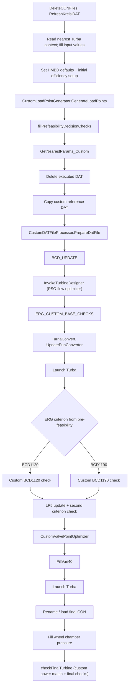

### 8.3 `GetNearestParams_Custom()` flow and purpose

This method is the custom **reference-DAT selection and parameter-seeding** step used in `Main_Custom.cs`.

What it does:

1. runs a nearest-neighbor search for custom/nozzle candidates,
2. updates HMBD custom parameters from the chosen nearest project,
3. resolves and copies the matching reference DAT,
4. loads that DAT into memory,
5. scans the DAT and extracts the key geometry constants used later in the custom flow.

The extracted values are:

- `BEAUFSCHL`
- `RADKAMMER`
- `DRUCK`
- `INNNEN`
- `AUSGL`

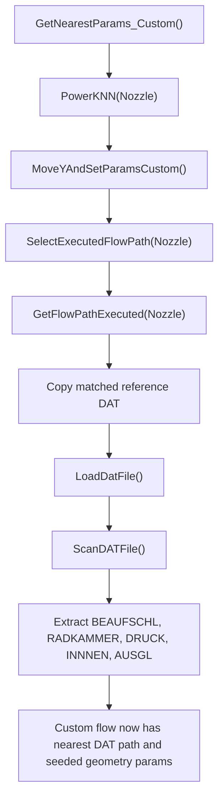

Implementation breakdown:

- `PowerKNN("Nozzle")` filters the nearest-project search to nozzle-like candidates and stores the closest matches in `ListPower`.
- `MoveYAndSetParamsCustom()` moves/selects the active custom neighbor row and updates HMBD custom parameters when a valid row is found.
- `SelectExecutedFlowPath("Nozzle")` resolves the DAT path of the nearest matching project from the executed-project database.
- `GetFlowPathExecuted("Nozzle")` performs the actual copy of that reference DAT into the working area.
- `LoadDatFile()` reads `TURBATURBAE1.DAT.DAT` into `turbineDataModel.DAT_DATA`.
- `ScanDATFile()` parses the copied DAT and fills turbine constants used later by the custom flow.

This means `GetNearestParams_Custom()` is not doing optimization itself. It is preparing the **best starting reference DAT and initial custom geometry parameters** before later stages like custom DAT preparation, `BCD_UPDATE`, and PSO optimization begin.

### 8.4 `CustomDATFileProcessor.PrepareDatFile(mxlp)` flow and purpose

This method is the custom-flow **DAT file preparation step** called from `Main_Custom.cs`.

Its job is to rebuild the working DAT file so Turba/custom-flow stages run on the correct load-point structure and updated initialization values.

What it does:

1. loads the active working DAT into memory,
2. reads the first load point already present in the DAT,
3. removes old LP rows / resets the LP area layout,
4. inserts the regenerated custom load points up to `mxlp`,
5. updates the ND/load-point count line,
6. refreshes DAT initialization parameters except LP data,
7. inserts the swallow load point used later by the run.

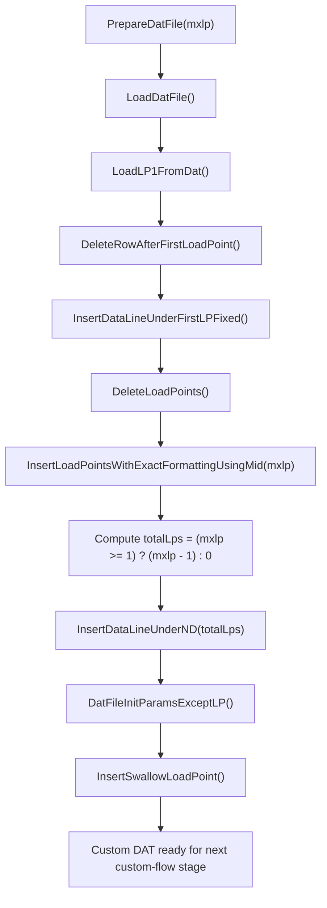

Implementation breakdown:

- `LoadDatFile()` reads `TURBATURBAE1.DAT.DAT` into `turbineDataModel.DAT_DATA`.
- `LoadLP1FromDat()` captures the original first load-point structure so the regenerated DAT keeps the expected LP1 baseline.
- `DeleteRowAfterFirstLoadPoint()` and `InsertDataLineUnderFirstLPFixed()` normalize the DAT block immediately under LP1 before bulk LP insertion.
- `DeleteLoadPoints()` clears previously existing load-point entries from the working DAT.
- `InsertLoadPointsWithExactFormattingUsingMid(mxlp)` writes the regenerated custom LP rows with the exact DAT formatting expected by downstream tools.
- `InsertDataLineUnderND(totalLps)` updates the ND section with the effective number of generated load points.
- `DatFileInitParamsExceptLP()` refreshes non-load-point initialization / machine parameters after the LP rewrite.
- `InsertSwallowLoadPoint()` appends the swallow operating point needed for later custom processing.

So `PrepareDatFile(mxlp)` is not selecting projects or optimizing anything by itself. It is the **DAT reconstruction step** that converts the chosen custom inputs and generated LPs into the final runtime DAT structure used by the next stages.

### 8.5 `customSaxaSaxi.BCD_UPDATE(mxlp)` flow and purpose

This method is the custom-flow **BCD rewrite step** used after DAT preparation.

Its role is simple but important: it loads the current DAT, updates the BCD-related value in the DAT based on the pre-feasibility decision, and writes the modified DAT back to disk.

At the current implementation level, the `mxlp` argument is passed in from `Main_Custom.cs`, but the actual `BCD_UPDATE()` method does not use it internally.

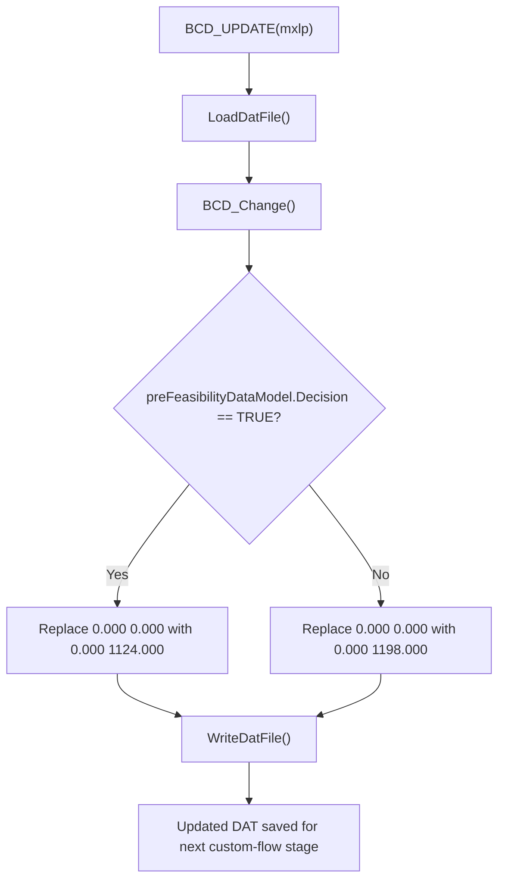

Implementation breakdown:

- `LoadDatFile()` reloads the current working DAT into memory.
- `BCD_Change()` scans for the `!     ABSTAND AXIALLAGER` section and checks the line immediately below it.
- If the next line starts with `0.000     0.000`, the code rewrites that line using the pre-feasibility result:
  - decision `TRUE` -> set BCD to `1124.000`
  - otherwise -> set BCD to `1198.000`
- `WriteDatFile()` saves the modified DAT back to `TURBATURBAE1.DAT.DAT`.

So `BCD_UPDATE(mxlp)` is not a full optimization stage by itself. It is a **targeted DAT parameter patch** that converts the custom-flow pre-feasibility decision into the correct BCD setting before downstream checks and optimizers run.

### 8.6 `pSOFlowPathOptimizerNozzle.InvokeTurbineDesigner()` in-depth flow and purpose

This is the **main custom nozzle optimization function** in the custom flow.

In simple terms, it tries many combinations of five DAT parameters, runs Turba for each combination, rejects combinations that violate engineering rules, keeps the best feasible one, and then does a final refinement pass.

The five optimized parameters are:

- `B` = `BEAUFSCHL` (admission factor)
- `R` = `RADKAMMER` (wheel chamber pressure)
- `D` = `DRUCKZIFFERN` (stage-related setting, stored as negative in DAT)
- `I` = `INNENDURCHMESSER` (shaft diameter)
- `A` = `AUSGLEICHSKOLBEN` (balance piston diameter)

#### 8.6.1 Easy overall picture

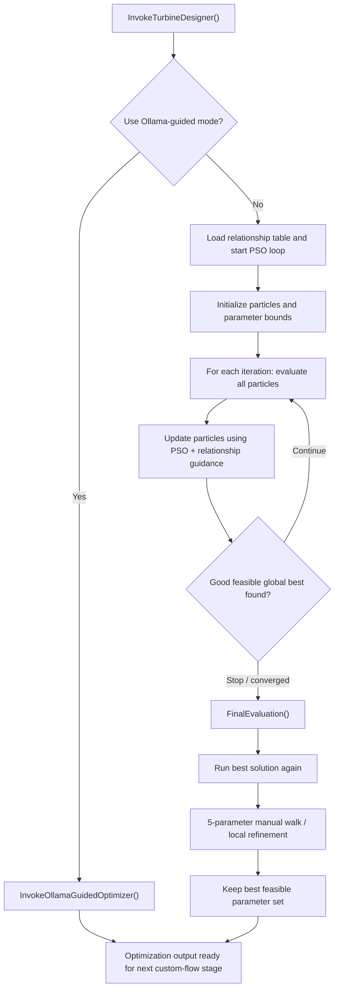

#### 8.6.2 What this function is doing, step by step

1. **Choose optimization mode**
   - `InvokeTurbineDesigner()` first checks `AppSettings:UseOllamaGuidedNozzle`.
   - If it is enabled, the function switches to `InvokeOllamaGuidedOptimizer()`.
   - Otherwise it runs the default **relationship-aware PSO** path.

2. **Initialize optimization search space**
   - `InitializeParameterBounds()` creates min/max/step values for `B, R, D, I, A`.
   - Bounds depend partly on process inputs like inlet pressure and backpressure.
   - Example:
     - `B` gets an admission-factor range,
     - `R` gets a wheel-chamber-pressure range,
     - `D` gets a stage-related range,
     - `I` and `A` get shaft/piston diameter ranges.

3. **Create initial particles**
   - `InitializeParticles()` creates the PSO population.
   - Each particle is one candidate parameter set: `(B, R, D, I, A)`.
   - `InitializeParticleWithRelationshipGuidance()` does not randomize blindly:
     - it starts from conservative values,
     - it biases values using engineering relationships,
     - for example smaller shaft + larger piston is preferred for thrust balance.

4. **Run the PSO loop**
   - `PSOLoop()` currently runs a fixed number of iterations.
   - In each iteration:
     - `EvaluateAndUpdateParticles()`
     - `UpdateParticlesWithRelationships()`
   - Then it checks whether a strong feasible global best has already been found.

#### 8.6.3 Detailed particle evaluation flow

This is the core of the optimizer because every particle is tested by actually updating the DAT and launching Turba.

```mermaid
flowchart TD
  A["Evaluate particle (B,R,D,I,A)"]
  B{"Blacklisted combination?"}
  C["Reset particle to safe guided values"]
  D["RunBlackboxApplication(B,R,D,I,A)"]
  E["UpdateDATSoftChecks() writes B,R,D,I,A into DAT"]
  F["LaunchTurba()"]
  G["Read outputs: efficiency, power, HOEHE, DELTA_T, wheel temp, GBC length, thrust, PSI, LANG"]
  H["GetPenaltyScore()"]
  I{"Penalty > 0?"}
  J["ApplyConstraintSpecificCorrection()"]
  K{"Parameters changed?"}
  L["Re-run DAT update + Turba + penalty"]
  M{"Still penalty > 0?"}
  N["Reject particle"]
  O["Accept particle as feasible"]
  P["Update personal best"]
  Q["Update global best if efficiency is better"]

  A --> B
  B -->|Yes| C --> D
  B -->|No| D
  D --> E --> F --> G --> H --> I
  I -->|No| O --> P --> Q
  I -->|Yes| J --> K
  K -->|No| M
  K -->|Yes| L --> M
  M -->|Yes| N
  M -->|No| O
```

#### 8.6.4 What `RunBlackboxApplication()` means

This is the real “test a candidate” step:

1. `UpdateDATSoftChecks(B,R,D,I,A)` writes the five candidate values into the nozzle DAT file.
2. `LaunchTurba()` runs Turba on that updated DAT.
3. The code then reads the resulting outputs from `turbaOutputModel`.

So the optimizer is **not using a formula-only estimate**. It is using the actual Turba run as the black-box evaluator.

#### 8.6.5 How penalty-based feasibility works

After each Turba run, `GetPenaltyScore()` is called.

- If penalty is `0`, the candidate is treated as **feasible**.
- If penalty is greater than `0`, the candidate violates one or more engineering constraints.

The checks include output conditions such as:

- nozzle height (`HOEHE`)
- nozzle area (`FMIN1`)
- wheel chamber temperature
- `DELTA_T`
- `GBC_Length`
- `PSI`
- `LANG`
- thrust per load point

The exact limits depend on whether the pre-feasibility branch implies **BCD1120** or **BCD1190**.

#### 8.6.6 How correction works when a particle fails

If a particle is infeasible, the optimizer does **targeted correction** instead of discarding it immediately.

`ApplyConstraintSpecificCorrection()`:

1. detects whether the active check type is `1120` or `1190`,
2. reads current Turba outputs,
3. changes only the parameters that are most relevant to the failed constraint,
4. snaps the result back to valid step sizes.

Examples of correction logic:

- if nozzle area is too high -> reduce `B`
- if wheel chamber temperature is too high -> reduce `R`
- if `DELTA_T` is too high -> reduce `R`
- if GBC length is too large -> adjust `D`
- if PSI fails -> adjust stages (`D`)
- if thrust fails -> adjust shaft diameter `I`

After correction, the optimizer re-runs Turba and re-checks the penalty.

If the particle is still infeasible, it is rejected.

#### 8.6.7 How PSO updates the particles

After evaluation, `UpdateParticlesWithRelationships()` moves particles for the next iteration.

This stage combines:

- normal PSO behavior:
  - current position
  - velocity
  - personal best
  - global best
- engineering relationship guidance:
  - shaft diameter vs thrust
  - piston diameter vs thrust
  - admission factor vs nozzle area
  - pressure vs wheel chamber temperature

So this optimizer is not a plain random PSO. It is a **relationship-aware PSO** that tries to move particles in directions that make engineering sense.

#### 8.6.8 What happens if no good solution is found in an iteration

If no feasible particles are found:

- `ApplyEmergencyDiversification()` resets particles into broader but still sensible ranges.

There is also extra diversification support for poor-performing particles through:

- `AnalyzeRelationshipPerformance()`
- `ApplyRelationshipGuidedDiversification()`

These are meant to push the search away from bad regions and back toward more promising combinations.

#### 8.6.9 Final evaluation and manual walk

After the PSO loop finishes, the code does **more than just accept the best PSO particle**.

`FinalEvaluation()`:

1. runs the current global best again,
2. checks final penalty and efficiency,
3. logs the best `B, R, D, I, A`,
4. performs a **manual walk** across each of the five parameters one by one,
5. keeps any improved feasible result.

That manual walk is important because:

- PSO finds a strong candidate region,
- the final sweep then tries to squeeze out a little more efficiency,
- but only while keeping penalty at zero.

So the real flow is:

- broad guided search first,
- exact local improvement second.

#### 8.6.10 Final refinement flow

```mermaid
flowchart TD
  A["FinalEvaluation()"]
  B{"Global best feasible exists?"}
  C["Run best B,R,D,I,A again"]
  D["Check final penalty and efficiency"]
  E["Loop over each parameter: B, R, D, I, A"]
  F["Try next stepped value"]
  G["Run Turba again"]
  H{"Penalty = 0 and efficiency improved?"}
  I["Keep improved parameter set"]
  J["Stop scan for that direction / parameter"]
  K["Write final best result summary"]

  A --> B
  B -->|No| K
  B -->|Yes| C --> D --> E --> F --> G --> H
  H -->|Yes| I --> E
  H -->|No| J --> E
  E --> K
```

#### 8.6.11 Easy summary

`InvokeTurbineDesigner()` is the main engine that:

1. chooses a candidate nozzle DAT parameter set,
2. writes those values into the DAT,
3. launches Turba,
4. checks whether the result is feasible,
5. corrects bad candidates,
6. keeps the best feasible solution,
7. finally refines that solution again before handing it back to the custom flow.

So in one sentence: this function is the **main black-box optimizer that searches for the best feasible custom nozzle design by repeatedly editing the DAT, running Turba, enforcing engineering constraints, and refining the best result**.

### 8.7 `cuPunConvertor.TurnaConvert(mxlp)` in-depth flow and purpose

This method is the **file-conversion and DAT re-preparation bridge** used after the custom nozzle optimizer finishes.

In simple terms, it takes the latest Turba-generated `.PUN` result, converts it back into the working `.DAT` form, inserts the custom varicode lines needed for the next phase, removes the swallow LP block, and fixes the load-point count again.

So this method is not doing optimization. It is turning the optimizer output into the **next valid working DAT** for downstream custom checks and final runs.

#### 8.7.1 Easy overall picture

```mermaid
flowchart TD
  A["TurnaConvert(mxlp)"]
  B["Rename current TURBATURBAE1.DAT.DAT to TURBA_BASE.DAT"]
  C["Convert latest Turba PUN into working DAT file"]
  D["Load converted DAT into memory"]
  E["Insert VARICODE 52"]
  F["Insert VARICODE 54"]
  G["Remove swallow load-point block"]
  H["Write cleaned DAT back to disk"]
  I["Recompute total LP count from mxlp"]
  J["InsertDataLineUnderND(totalLps)"]
  K["Converted DAT ready for next custom-flow stage"]

  A --> B --> C --> D --> E --> F --> G --> H --> I --> J --> K
```

#### 8.7.2 What this method is doing, step by step

1. **Preserve the current DAT as a base copy**
   - `RenameOLDDat()` renames:
     - `TURBATURBAE1.DAT.DAT` -> `TURBA_BASE.DAT`
   - This keeps the previous working DAT as a base/reference before the `.PUN` output is turned into a new DAT.

2. **Convert Turba output into a DAT again**
   - `ConvertPUN()` performs a two-step rename:
     - `TURBAE1.PUN` -> `TURBAE1.DAT`
     - `TURBAE1.DAT` -> `TURBATURBAE1.DAT.DAT`
   - In other words, the latest Turba result becomes the new working DAT file.

3. **Load the converted DAT**
   - `LoadDatFile()` reads the converted `TURBATURBAE1.DAT.DAT` into `turbineDataModel.DAT_DATA`.
   - From this point on, edits happen in memory first.

4. **Insert required custom varicodes**
   - `InsertVARICODE52()` finds the `49.000` varicode line and inserts a new `52.000` line after it.
   - `InsertVARICODE54()` then finds the new `52.000` line and inserts a `54.000 13200.000` style line after it.
   - These insertions prepare the converted DAT for the next custom-flow behavior expected by the codebase.

5. **Remove the swallow load-point block**
   - `RemoveSwallow(mxlp)` removes the LP block starting from:
     - `!LP<mxlp>` if `mxlp > 0`
     - otherwise `!LP11`
   - The method clears four lines starting at that LP marker, then compacts the list by removing empty lines.
   - The purpose is to strip out the swallow LP block that should not remain in the converted DAT for the next stage.

6. **Write the edited DAT back**
   - `WriteDatFile()` writes `turbineDataModel.DAT_DATA` back to disk.

7. **Fix the ND / load-point count**
   - `totalLps = (mxlp >= 1) ? (mxlp - 1) : 0`
   - `InsertDataLineUnderND(totalLps)` updates the ND section so the DAT metadata matches the LP structure left after swallow removal.

#### 8.7.3 Detailed conversion flow

```mermaid
flowchart TD
  A["Start TurnaConvert(mxlp)"]
  B{"Working DAT exists?"}
  C["Rename TURBATURBAE1.DAT.DAT to TURBA_BASE.DAT"]
  D{"TURBAE1.PUN exists?"}
  E["Rename TURBAE1.PUN to TURBAE1.DAT"]
  F["Rename TURBAE1.DAT to TURBATURBAE1.DAT.DAT"]
  G["LoadDatFile()"]
  H["InsertVARICODE52()"]
  I["InsertVARICODE54()"]
  J["RemoveSwallow(mxlp)"]
  K["WriteDatFile()"]
  L["InsertDataLineUnderND(totalLps)"]
  M["Final converted DAT ready"]

  A --> B
  B -->|Yes| C --> D
  B -->|No| D
  D -->|Yes| E --> F --> G --> H --> I --> J --> K --> L --> M
  D -->|No| M
```

#### 8.7.4 How `RemoveSwallow(mxlp)` decides what to delete

This part is important because `mxlp` directly affects the cleanup.

- If `mxlp > 0`, the method looks for:
  - `!LP<mxlp>`
- Otherwise it defaults to:
  - `!LP11`

Once it finds that LP marker, it removes that LP block by blanking four lines and then filtering empty lines out of the DAT list.

So the meaning is:

- use the actual last custom LP when known,
- otherwise assume the swallow block starts at LP11.

#### 8.7.5 Why varicode insertion happens here

The conversion step is not just a file rename.

The code also adds:

- `VARICODE 52`
- `VARICODE 54`

This suggests the converted DAT must carry extra control/configuration entries before the next Turba/custom validation phase runs.

So `TurnaConvert()` is both:

- a **file conversion** step, and
- a **DAT patching** step.

#### 8.7.6 Why the ND line is fixed again at the end

After swallow removal, the DAT may no longer have the same effective number of active LPs.

That is why the method ends with:

- recomputing `totalLps`
- calling `InsertDataLineUnderND(totalLps)`

Without this, the LP count metadata in the DAT could disagree with the actual LP blocks present in the file.

#### 8.7.7 Easy summary

`TurnaConvert(mxlp)` is the method that:

1. preserves the old DAT,
2. converts the latest Turba `.PUN` output into the new working DAT,
3. injects custom varicode entries,
4. removes the swallow LP block,
5. rewrites the DAT,
6. fixes the LP count metadata.

So in one sentence: this function is the **post-optimizer DAT conversion step that transforms Turba output back into a clean custom-runtime DAT for the next engineering checks and launches**.

### 8.8 `cuPunConvertor.UpdatePunConvertor()` in-depth flow and purpose

This method is the **ERG-to-DAT stage update step** that runs after `TurnaConvert(mxlp)`.

In simple terms, it reads stage-wise deformation data from the Turba `.ERG` file, rounds those values upward to the next `0.05`, and writes them back into the current working DAT stage table.

So this is not a general DAT rebuild. It is a **targeted stage-parameter synchronization step** that transfers important stage results from ERG into DAT.

#### 8.8.1 Easy overall picture

```mermaid
flowchart TD
  A["UpdatePunConvertor()"]
  B["Open TURBATURBAE1.DAT.ERG"]
  C["Find ERG section: STUFE RSPALT RDZENT RDEHN GEF"]
  D["Read stage rows marked with *"]
  E["Take stage number and RDEHN"]
  F["Round RDEHN upward with Next005()"]
  G["UpdateValueinDat(stage, rounded RDEHN)"]
  H["Open current TURBATURBAE1.DAT.DAT"]
  I["Find !ST section before !LP2"]
  J["Match row by stage number and type = 2"]
  K["Write rounded value into field 8"]
  L["Save DAT"]

  A --> B --> C --> D --> E --> F --> G --> H --> I --> J --> K --> L
```

#### 8.8.2 What this method is doing, step by step

1. **Open the ERG file**
   - The method reads:
     - `C:\testDir\TURBATURBAE1.DAT.ERG`

2. **Find the stage-result table**
   - It looks for the header:
     - `STUFE  RSPALT  RDZENT   RDEHN  GEF`
   - That is the ERG section containing stage-wise data.

3. **Skip down into the actual rows**
   - After finding the header, the method moves down a few lines.
   - Then it loops row by row until it reaches an empty line, form-feed marker, or `DATE`.

4. **Process only marked stage rows**
   - Only lines containing `*` are processed.
   - For each such row, it extracts:
     - stage number from `Params[0]`
     - `RDEHN` from `Params[3]`

5. **Round `RDEHN` upward**
   - `Next005()` converts the ERG value to the **next higher multiple of `0.05`**.
   - If the value is already exactly on a `0.05` step, it still adds one more `0.05`.

6. **Write the updated value into the DAT**
   - `UpdateValueinDat(find, replace)` opens:
     - `C:\testDir\TURBATURBAE1.DAT.DAT`
   - It searches the stage table under `!ST`.
   - For each stage row before `!LP2`, it splits the row by `|`.
   - It updates the row where:
     - field `0` = matching stage number
     - field `1` = `2`
   - Then it replaces:
     - `fields[8] = replace.ToString("0.00")`

7. **Save the DAT**
   - After the matching stage row is modified, the DAT file is written back to disk.

#### 8.8.3 Detailed update flow

```mermaid
flowchart TD
  A["Start UpdatePunConvertor()"]
  B["Read all lines from TURBATURBAE1.DAT.ERG"]
  C{"Found stage table header?"}
  D["Move 3 lines down"]
  E["Read next ERG row"]
  F{"Stop marker? empty / form-feed / DATE"}
  G{"Row contains * ?"}
  H["Split row into Params[]"]
  I["stage = Params[0]"]
  J["rdehn = Params[3]"]
  K["nRdehn = Next005(rdehn)"]
  L["UpdateValueinDat(stage, nRdehn)"]
  M["Read DAT and search !ST block"]
  N{"Matching stage and type=2 found before !LP2?"}
  O["Set fields[8] = nRdehn"]
  P["Write DAT back"]
  Q["Continue with next ERG stage row"]
  R["Finish"]

  A --> B --> C
  C -->|Yes| D --> E --> F
  C -->|No| R
  F -->|Yes| R
  F -->|No| G
  G -->|No| Q --> E
  G -->|Yes| H --> I --> J --> K --> L --> M --> N
  N -->|Yes| O --> P --> Q
  N -->|No| Q
```

#### 8.8.4 What `Next005()` is doing

This helper is small but very important.

Its rule is:

- take a numeric value,
- move it to the **next higher `0.05` step**,
- even if it is already exactly on a step, move one more step higher.

Examples:

- `1.02` -> `1.05`
- `1.05` -> `1.10`
- `1.11` -> `1.15`

So the method is intentionally **conservative upward rounding**, not simple normal rounding.

#### 8.8.5 Why the DAT update is limited to the `!ST` block before `!LP2`

`UpdateValueinDat()` only edits rows:

- inside the stage section starting at `!ST`
- before the next `!LP2`
- where the second field equals `2`

This means the method is carefully targeting one particular stage-data region in the DAT, instead of globally replacing numbers everywhere.

That is important because the same stage number might appear in other parts of the file, but this method only wants the **main stage table entries** relevant for this conversion step.

#### 8.8.6 Why this step matters in the custom flow

After Turba has run, the ERG file contains updated stage information that the DAT does not yet fully reflect.

`UpdatePunConvertor()` closes that gap by:

- reading stage-wise ERG output,
- converting the deformation value into the format/range expected by DAT,
- syncing it back into the DAT stage table.

So this is effectively a **feedback step from ERG to DAT**.

#### 8.8.7 Easy summary

`UpdatePunConvertor()` is the method that:

1. reads stage `RDEHN` values from the ERG,
2. rounds them upward to the next `0.05`,
3. finds the matching stage rows in the DAT,
4. writes the rounded values back into the DAT,
5. saves the file again.

So in one sentence: this function is the **stage-data feedback updater that pushes ERG deformation results back into the working DAT before the next custom-flow steps continue**.

---

## 9) Flow-wise content: Additional load points path

This path appears when the main flow has **more than one customer load point** to merge into Kreisl/Turba work (exact gate depends on caller: e.g. executed path checks `CustomerLoadPoints.Count > 2` in places; the idea is the same: **extra LPs beyond the base case**).

Implementation lives mainly in `AdditionalLoadPoints.cs` (`CustomLoadPointHandler`), especially **`cxLP_mainKreisl(customerLPList)`**.

### 9.0.1 Legend (terms used in charts)

- **LP indexing**
  - **LP1** in this chapter refers to the *first customer load point row the handler uses* (in code many accesses use `CustomerLoadPoints[1]` as the base row).
  - “extra LPs” means subsequent customer points (`i = 2..` in the spreadsheet sense), merged via `fillAGainDat` / `fillLPAgain`.
- **Unknown-dimension codes**
  - **`Pr`**: `SteamPressure` is unknown / zero
  - **`T`**: `SteamTemp` is unknown / zero
  - **`M`**: `SteamMass` is unknown / zero
  - **`P`**: `PowerGeneration` is unknown / zero
  - **`E`**: `ExhaustPressure` is unknown / zero
- **Key artifacts**
  - **`KREISL.DAT`** (written repeatedly) and **`KREISL.ERG`** (read to back-fill)
  - **`TURBATURBAE1.DAT.ERG`** (read during desuperheater update)
  - **`MainTemp`**: an in-memory accumulator that often does `MainTemp += File.ReadAllText("C:\\testDir\\KREISL.DAT")` after each LP write.

### 9.1 High-level flow (`cxLP_mainKreisl`)

```mermaid
flowchart TD
  A["cxLP_mainKreisl(customerLPList)"]
  B["checkingPartLoadExist"]
  C["Snapshot initList + lpNumberToIndexMap"]
  D["DeleteCONFiles, fillCustomerLoadPointList"]
  E["RefreshKreislDAT, set exhaust from LP1"]
  F["cxLP_GetLPcount"]
  G["fillLPINDat (write LP1 unknowns into KREISL.DAT)"]
  H["Fill missing fields from KREISL.ERG for each LP"]
  I["SortCustomerLoadPointsByVol"]
  J["Closed-cycle extras: capacity dump LP, PST, extend range"]
  K["fillLoadPointList + RefreshKreislDAT + FillInputDat"]
  L["CorrectLP1unknowParams if single customer LP"]
  M["HBD defaults + eff init + persist power"]
  N["ReferenceDATSelector(cxLP_RngStop + 10)"]
  O["cxLP_GenerateLoadPoints Recal + GenerateLoadPoints"]
  P["prepareDATFile (standard DAT processor)"]
  Q["LaunchTurba"]
  R["ergResultsCheck + UpdateLP5 + ergResultsCheck"]
  S["ValvePointOptimize"]
  T["TURBA.CON, FillVari40, RemoveErg, RefreshKreislDAT"]
  U["FillWheelChamberPressure from Turba LP1"]
  V["Loop LP2..: fillAGainDat / fillLPAgain Pr T M P E"]
  W["Write KREISL.DAT"]
  X["Deaerator or PST: UpdateDesupratorWithTurba from TURBA ERG"]
  Y["LaunchKreisl + CheckPower"]

  A --> B --> C --> D --> E --> F --> G --> H --> I --> J --> K --> L --> M --> N --> O --> P --> Q --> R --> S --> T --> U --> V --> W --> X --> Y
```

### 9.2 Per-LP merge after Turba (unknown dimension)

After the Turba stabilization block, the handler walks **each extra customer LP** (`i = 1 .. Count-1`). For `i == 1` it rebuilds the first appended block via `fillAGainDat`. For later indices it picks the unknown and calls **`fillLPAgain(index, dimension, lpRow, initList)`** with `Pr`, `T`, `M`, `P`, or `E`.

```mermaid
flowchart TD
  L["For each extra customer LP i"]
  Q1{"i == 1?"}
  F1["fillAGainDat(index, initList)"]
  Q2{"Which field is zero?"}
  FPr["fillLPAgain(..., Pr, ...)"]
  FT["fillLPAgain(..., T, ...)"]
  FM["fillLPAgain(..., M, ...)"]
  FP["fillLPAgain(..., P, ...)"]
  FE["fillLPAgain(..., E, ...)"]
  NXT["Next LP"]

  L --> Q1
  Q1 -->|Yes| F1 --> NXT
  Q1 -->|No| Q2
  Q2 -->|SteamPressure == 0| FPr --> NXT
  Q2 -->|SteamTemp == 0| FT --> NXT
  Q2 -->|SteamMass == 0| FM --> NXT
  Q2 -->|PowerGeneration == 0| FP --> NXT
  Q2 -->|ExhaustPressure == 0| FE --> NXT
```

Open-cycle mass-flow tie-up (when neither deaerator nor PST): if mass is unknown but exhaust mass is known, code uses **`SteamMass = 0.055 + ExhaustMassFlow`**; if mass is known but exhaust mass is not, **`ExhaustMassFlow = SteamMass - 0.055`**.

### 9.3 LP1 into Kreisl (`fillLPINDat`)

Before the ERG fill loop, **`fillLPINDat()`** writes customer LP1 boundary conditions into **`KREISL.DAT`** via `KreislDATHandler` (pressure, temperature, mass flow, power, exhaust pressure, closed-cycle makeup/condensate/PST/PRV branches, dump condenser capacity paths). It accumulates working text in **`MainTemp`** (often by appending the current `KREISL.DAT` file after edits).

#### 9.3.1 `fillLPINDat()` mini spec (inputs/outputs)

- **Reads**
  - `AdditionalLoadPoint.GetInstance().CustomerLoadPoints[1]` fields (pressure/temp/mass/power/exhaust pressure/exhaust mass/PST/closed-cycle fields)
  - `turbineDataModel` flags: `DeaeratorOutletTemp`, `PST`, `DumpCondensor`, `IsPRVTemplate`, `ExhaustPressure`
- **Writes**
  - `StartKreisl.filePath` (the Kreisl DAT) via `KreislDATHandler.*`
  - appends the final file text into `MainTemp`
- **Key behavior**
  - If **closed-cycle** (`DeaeratorOutletTemp > 0`) it writes makeup/condensate/process steam temp (PST) and optionally desuperheater pressure.
  - If **PST-only** (`PST > 0`) it writes process steam temp and optional desuperheater pressure.
  - If **open-cycle** (no deaerator and PST=0) it applies the `0.055` mass tie-up between inlet and exhaust mass flows.

#### 9.3.2 Detailed branch chart for `fillLPINDat()`

```mermaid
flowchart TD
  A["fillLPINDat()"]
  B["Load input = CustomerLoadPoints[1]"]
  C{"Closed cycle? (DeaeratorOutletTemp > 0)"}
  C1["Write makeup/condensate fields"]
  C2["Set model PST = tsat(exhaustP)+5 if PST==0"]
  C3["Write process steam temperature using PST"]
  C4{"IsPRVTemplate?"}
  C5["fillPsatvont_t using DeaeratorOutletTemp"]
  C6{"SteamPressure > 0?"}
  C7["FillPressureDesh = 1.2*SteamPressure"]

  D{"PST-only? (PST > 0)"}
  D1["Write process steam temperature using model PST"]
  D2{"SteamPressure > 0?"}
  D3["FillPressureDesh = 1.2*SteamPressure"]

  E{"Open cycle (no deaerator, PST==0)?"}
  E1{"SteamMass==0 and ExhaustMassFlow>0?"}
  E2["SteamMass = 0.055 + ExhaustMassFlow"]
  E3{"SteamMass>0 and ExhaustMassFlow==0?"}
  E4["ExhaustMassFlow = SteamMass - 0.055"]

  U{"Which field is zero? (Pr/T/M/P/else)"}
  Pr["Pr unknown: FillMassFlow; inletP sweep 0.000 -> 42.981; set exP + inletT + power(+25)"]
  T["T unknown: FillMassFlow; set inletP; inletT sweep 0.000 -> 440; set exP + power(+25)"]
  M["M unknown: Mass sweep 0.000 -> (exMass+10); set inletP + inletT + exP; power(+25) OR ProcessMassFlow if closed/PST"]
  P["P unknown: set inletP + inletT + exP + mass; then dump-cond branches may force power=0 / mass=0"]
  OK["No main unknown: uses given values (still may do dump-cond/PST writes above)"]

  DC{"DumpCondensor enabled?"}
  DC1{"Capacity > 0?"}
  DC2["fillCapacity; set power=0 and/or mass=0; ProcessMassFlow(exhaust mass); mass step uses (10+exMass)"]
  DC3{"Capacity==0 and checkIfDumpcondensorON==true?"}
  DC4["ProcessMassFlow(exhaust mass)"]
  DC5["TurnOffCondensor (multiple calls)"]

  Z["MainTemp += read KREISL.DAT"]

  A --> B --> C
  C -->|Yes| C1 --> C2 --> C3 --> C4
  C4 -->|Yes| C5 --> C6
  C4 -->|No| C6
  C6 -->|Yes| C7 --> E
  C6 -->|No| E

  C -->|No| D
  D -->|Yes| D1 --> D2
  D2 -->|Yes| D3 --> E
  D2 -->|No| E
  D -->|No| E

  E -->|Yes| E1
  E1 -->|Yes| E2 --> U
  E1 -->|No| E3
  E3 -->|Yes| E4 --> U
  E3 -->|No| U
  E -->|No| U

  U -->|SteamPressure==0| Pr --> DC
  U -->|SteamTemp==0| T --> DC
  U -->|SteamMass==0| M --> DC
  U -->|PowerGeneration==0| P --> DC
  U -->|else| OK --> DC

  DC -->|No| Z
  DC -->|Yes| DC1
  DC1 -->|Yes| DC2 --> Z
  DC1 -->|No| DC3
  DC3 -->|Yes| DC4 --> Z
  DC3 -->|No| DC5 --> Z
```

### 9.4 ERG back-fill for all customer LPs

After LP1 is in the DAT, a loop over **`CustomerLoadPoints[1..]`** fills any zero from **`KREISL.ERG`** using `KreislERGHandlerService` (`ExtractPressure`, `ExtractTemperature`, `ExtractMassFlow`, `ExtractBackPressure`, `ExtractVolFlowForLoadPoint`). Then **`SortCustomerLoadPointsByVol()`** reorders LPs by volumetric flow.

### 9.5 Standard-path DAT rebuild and checks

The middle block mirrors the **standard** pipeline at scaled LP count:

- `ReferenceDATSelector((int)cxLP_RngStop + 10)`
- `cxLP_GenerateLoadPoints("Recal")` then `GenerateLoadPoints()`
- `prepareDATFile` -> `DATFileProcessor.PrepareDATFile`
- `LaunchTurba`
- `ergResultsCheck` -> `UpdateLP5` -> `ergResultsCheck` again (LP5 flag on `ERGVerification`)
- `ValvePointOptimize`

### 9.6 Desuperheater update from Turba ERG

If **`DeaeratorOutletTemp > 0` or `PST > 0`**, **`UpdateDesupratorWithTurba(...)`** reads **`TURBATURBAE1.DAT.ERG`** pressure/temperature/enthalpy/mass blocks and updates Kreisl desuperheater sections per LP (closed PRV with/without dump condenser, or open-cycle desuperheater helpers), then **`LaunchKreisl`** and **`CheckPower`**.

### 9.7 LP validation helper (`cxLP_validateLPs`)

Used to classify customer input before heavy work: counts known fields per LP (must be more than three knowns per LP in the current rule), and returns **`Power`**, **`Flow`**, **`Hybrid`**, or **`Error`** depending on whether all LPs have power, all have mass flow, or a mix.

#### 9.7.1 Detailed decision chart for `cxLP_validateLPs()`

In code, “known” increments for: `SteamPressure`, `SteamTemp`, `SteamMass`, `ExhaustPressure`, `PowerGeneration`, `ExhaustMassFlow`, `PartLoad`, `VolFlow` (each positive adds 1). If `knownValuesCount <= 3` for any LP, it logs and terminates.

```mermaid
flowchart TD
  A["cxLP_validateLPs()"]
  B["isAll_LPhasPower=true; isAll_LPhasFlow=true; isLPValid=false"]
  C["For i=1..cxLP_RngStop"]
  D["knownValuesCount=0; isLPValid=true"]
  E{"PowerGeneration <= 0?"}
  F["isAll_LPhasPower=false"]
  G{"SteamMass <= 0?"}
  H["isAll_LPhasFlow=false"]
  I["knownValuesCount += each positive of P,T,M,ExP,Power,ExMass,PartLoad,VolFlow"]
  J{"knownValuesCount <= 3?"}
  K["isLPValid=false; Logger invalid; TerminateIgniteX"]
  R{"isAll_LPhasPower?"}
  S["return Power"]
  T{"isAll_LPhasFlow?"}
  U["return Flow"]
  V{"isLPValid?"}
  W["return Hybrid"]
  X["return Error"]

  A --> B --> C --> D --> E
  E -->|Yes| F --> G
  E -->|No| G
  G -->|Yes| H --> I --> J
  G -->|No| I --> J
  J -->|Yes| K --> C
  J -->|No| C
  C --> R
  R -->|Yes| S
  R -->|No| T
  T -->|Yes| U
  T -->|No| V
  V -->|Yes| W
  V -->|No| X
```

### 9.8 Inner flow: `fillLPAgain(i, unk, count, initList)`

Used when **LP index `i` is not the first** extra LP and one dimension is still unknown (`unk` is **`Pr`**, **`T`**, **`M`**, **`P`**, or **`E`**). It picks a **row template file**, stamps the Kreisl LP row id, then writes boundary guesses into **`KREISL.DAT`** via `KreislDATHandler`, and appends the updated file into **`MainTemp`**.

#### 9.8.1 Choose LP row template (`dat` path)

```mermaid
flowchart TD
  A["fillLPAgain(i, unk, count, initList)"]
  B{"DeaeratorOutletTemp positive?"}
  C{"DumpCondensor?"}
  D["dat = LoadPointDumpCondenPRV.DAT"]
  E["dat = loadpointclosecyclePRV.DAT"]
  F{"PST positive?"}
  G["dat = loadPointD.dat"]
  H["dat = loadPoint.dat"]
  A --> B
  B -->|Yes| C
  C -->|Yes| D
  C -->|No| E
  B -->|No| F
  F -->|Yes| G
  F -->|No| H
```

#### 9.8.2 Unknown-dimension branches (same pattern for each `unk`)

For every `unk`, the code does:

1. copy the chosen template to `C:\testDir\KREISL.DAT`, clear it, read template text, replace **`lp` -> `count`**, append to `KREISL.DAT`
2. fill the **known** inlet fields on `StartKreisl.filePath`
3. drive the **unknown** field with a Kreisl sweep pattern (for example `Pr`: mass fixed, inlet pressure stepped `0.000` then `42.981`; `T`: temperature stepped `0.000` then `440`; `E`: exhaust pressure stepped `0.000` then `4.59`)
4. optional **dump condenser** branch: capacity vs `checkIfDumpcondensorON` vs `TurnOffCondensor` lines
5. closed-cycle tail: PRV to WPRV conversion, makeup/condensate/PST lines, `FillPressureDesh` when pressure is known and `unk` is not `Pr`
6. **`MainTemp +=` entire `KREISL.DAT`** after edits

```mermaid
flowchart TD
  A["Pick dat template"]
  B["Copy template to KREISL.DAT, replace lp with count"]
  C["Fill Kreisl DAT for this LP row"]
  D{"unk"}
  EPr["Pr branch: fix mass, sweep inlet P"]
  ET["T branch: fix P, sweep inlet T"]
  EM["M branch: sweep mass / exhaust mass helpers"]
  EP["P branch: optional dump condenser mass path"]
  EE["E branch: sweep exhaust P"]
  F["Closed cycle: PRV or makeup / PST updates"]
  G["MainTemp += read KREISL.DAT"]

  A --> B --> C --> D
  D -->|Pr| EPr --> F --> G
  D -->|T| ET --> F --> G
  D -->|M| EM --> F --> G
  D -->|P| EP --> F --> G
  D -->|E| EE --> F --> G
```

### 9.9 Inner flow: `fillAGainDat(i, initList)`

Same physical idea as **`fillLPINDat`**, but for **customer index `i` inside `initList`** when rebuilding the **first** extra LP block (`i == 1` path in `cxLP_mainKreisl`). It:

1. applies **closed-cycle** makeup / PST / PRV logic when `initList[i].DeaeratorOutletTemp > 0`, or **PST-only** desuperheater pressure when `PST > 0`
2. applies **open-cycle** mass tie (`0.055` rule) when neither deaerator nor PST
3. runs the same **Pr / T / M / P / E** ladder as `fillLPAgain`, writing Kreisl and appending **`MainTemp`** for whichever branch matches the missing field

```mermaid
flowchart TD
  A["fillAGainDat(i, initList)"]
  B["Closed or PST header fields on Kreisl DAT"]
  C["Open cycle mass tie if needed"]
  D{"First missing among Pr T M P E"}
  E["KreislDATHandler fills + MainTemp += KREISL.DAT"]
  A --> B --> C --> D --> E
```

### 9.10 Inner flow: `checkingPartLoadExist(customerLoadPoints)`

If **any** customer row has **`PartLoad > 0`**, the method:

1. scans for a **fully specified base LP** (`SteamPressure`, `SteamTemp`, `SteamMass`, `ExhaustPressure` all positive and **`PartLoad == 0`**)
2. for that row: `RefreshKreislDAT`, `fillInputDatFileForParLoad`, rename Turba CON, **`LaunchKreisL`**, read **`ExtractPowerFromERG`** as candidate max power
3. for rows without full thermo, it keeps **`PowerGeneration`** from the sheet as the max candidate
4. for every row with **`PartLoad > 0`**, sets  
   `PowerGeneration = (maxPower * PartLoad) / 100`

```mermaid
flowchart TD
  A["checkingPartLoadExist(list)"]
  B{"Any PartLoad positive?"}
  C["Find base LP with full inputs and PartLoad == 0"]
  D["RefreshKreislDAT + fillInputDatFileForParLoad"]
  E["LaunchKreisl + read max power from ERG"]
  F["Else use existing PowerGeneration"]
  G["For each PartLoad row: Power = maxPower * PartLoad / 100"]
  H["No-op if no part loads"]

  A --> B
  B -->|No| H
  B -->|Yes| C --> D --> E
  C -->|none| F
  E --> G
  F --> G
```

### 9.11 Inner flow: `CorrectLP1unknowParams()`

Runs only when **`customerLPList.Count == 1`** inside `cxLP_mainKreisl`. It is a **mini calibration loop** for LP1 before the big multi-LP pipeline:

1. `HBDsetDefaultCustomerParamas`, `cxLP_GenerateLoadPoints`, `ReferenceDATSelector(1)`, `cxLP_prepareDATFile(1)`, `LaunchTurba(2)`
2. optional wheel chamber pressure write-back
3. **`fillAGainDat`** for LP1, then **`File.WriteAllText(KREISL.DAT, MainTemp)`**
4. optional **`UpdateDesupratorWithTurba(1)`** when closed cycle or PST
5. `FillVari40`, copy Turba efficiency into Kreisl eff fields, then **several Turba + Kreisl launch pairs** with CON rename between them
6. fills any remaining LP1 unknown from **`KREISL.ERG`**, then **`ClearFile`** (deletes CON side artifacts)

```mermaid
flowchart TD
  A["CorrectLP1unknowParams"]
  B["Mini Turba prep: ReferenceDAT + cxLP_prepare + LaunchTurba(2)"]
  C["fillAGainDat for LP1 + write KREISL.DAT"]
  D["Optional UpdateDesupratorWithTurba(1)"]
  E["FillVari40 + eff from Turba LP2 output"]
  F["Repeat Turba / Kreisl / CON rename chain"]
  G["Fill missing LP1 fields from ERG"]
  H["ClearFile (DeleteCONFiles)"]

  A --> B --> C --> D --> E --> F --> G --> H
```

### 9.12 Inner flow: `UpdateDesupratorWithTurba(loadPoint)` (summary)

Parses **`TURBATURBAE1.DAT.ERG`** blocks (`DRUECKE`, `TEMPERATUREN`, `ENTHALPIEN`, `DAMPFMENGEN`) into per-LP matrices, compares **exhaust temperature vs PST** per LP, and calls the matching **`KreislDATHandler.UpdateDesuprator...`** helpers (open cycle, closed PRV, dump condenser variants). Resets **`turbineDataModel.PST`** when customer PST is zero on LP1 or each extra LP.

```mermaid
flowchart TD
  A["UpdateDesupratorWithTurba(loadPoint)"]
  B["Read TURBATURBAE1.DAT.ERG lines"]
  C["Parse blocks: pressures, temperatures, enthalpies, mass flows"]
  D["Build 3 x loadPoint matrices (inlet/wheel/exhaust)"]
  E["LP1: exhaustTemp = temps[2,0]"]
  F["Set model PST = tsat(CustomerLP1.ExhaustPressure)+5 if PST==0"]
  G{"exhaustTemp > model PST?"}
  H{"DeaeratorOutletTemp > 0?"}
  I{"DumpCondensor?"}
  J["UpdateDesupratorClosedPRVDumpCondensor(..., count=1)"]
  K["UpdateDesupratorClosedPRV(..., count=1)"]
  L["UpdateDesupratorFirst + Second(..., count=1)"]
  M{"CustomerLP1.PST == 0?"}
  N["model PST = 0"]
  O{"Any extra customer LPs? (loadPoint - 10 >= 1)"}
  P["Loop columns i=10..(loadPoint-1), count=2.."]
  Q["exhaustTemp = temps[2,i]; set PST using CustomerLoadPoints[count].ExhaustPressure if PST==0"]
  R{"exhaustTemp > model PST?"}
  S["Apply same Closed/ Dump / Open updates using count"]
  T{"CustomerLoadPoints[count].PST == 0?"}
  U["model PST = 0"]
  Z["Done"]

  A --> B --> C --> D --> E --> F --> G
  G -->|No| M
  G -->|Yes| H
  H -->|Yes| I
  I -->|Yes| J --> M
  I -->|No| K --> M
  H -->|No| L --> M
  M -->|Yes| N --> O
  M -->|No| O
  O -->|No| Z
  O -->|Yes| P --> Q --> R
  R -->|No| T
  R -->|Yes| S --> T
  T -->|Yes| U --> P
  T -->|No| P
```

---


## 10) Complete flow map (all paths)

`Main Entry` -> `Standard` **or** `Executed` **or** `Custom`

- `Standard` -> single baseline path -> ERG checks -> valve optimization -> power match.
- `Executed` -> `BCD1120 / BCD1190 / Throttle` criteria sub-flow -> fallback chain -> power match.
- `Custom` -> custom DAT + PSO + custom ERG criteria -> valve + final custom checks.
- `Standard/Executed/Custom` + additional LP count -> `Additional Load Points LP-wise loop`.

---

## 11) Notes

- If diagrams show as a `mermaid` **code block** instead of a picture, your editor preview is not rendering Mermaid (re-enable a **Markdown Mermaid** extension, or view this file on GitHub). A recent Cursor/VS Code or extension update can turn that off.
- This README is code-logic first and intentionally flow-oriented.
- Keep terminology as in code where possible (`DumpCondensor`, `DeaeratorOutletTemp`, `IsPRVTemplate`) to avoid mismatch.
- Extend each section with diagrams and method-level call mapping as documentation evolves.

