# SST-200 Back-Pressure Turbine Automation - Code Documentation

This guide explains how the SST-200 turbine automation code works, step by step.  
We add new sections over time as more flow paths are documented.

### Contents

| Section | Topic |
|--------|--------|
| [1](#1-what-this-code-does) | What the code does |
| [2](#2-main-flow-path-first-top-level) | Main routes (standard, executed, custom, extra load points) |
| [3](#3-hmbd-logic-families-used-in-code) | HMBD open vs closed cycle rules |
| [4](#4-code-locations-quick-map) | Where to find key files |
| [Flowcharts gallery](#flowcharts-gallery-all-automation-paths-overview) | Overview diagrams for all paths |
| [5](#5-flowchart-standard-path-starting-section) | Standard path (detailed flowchart) |
| [6](#6-theory-walkthrough-explain-the-full-standard-flowchart) | Standard path in plain language |
| [7](#7-flow-wise-content-executed-flow-path) | Executed path |
| [8](#8-flow-wise-content-custom-flow-path) | Custom path |
| [9](#9-flow-wise-content-additional-load-points-path) | Additional load points |
| [10](#10-complete-flow-map-all-paths) | How all paths fit together |
| [11](#11-code-documentation-execution-starting-points) | Where execution starts in code |
| [12](#12-notes) | Notes and PDF export |

---

## 1) What this code does

This codebase automates core engineering tasks that are usually manual in SST-200 back-pressure turbine design:

- selecting and preparing Kreisl/DAT templates,
- generating and updating load points,
- launching Kreisl and Turba runs,
- checking ERG results,
- optimizing valve/nozzle behavior,
- validating final power match,
- producing HMBD-aligned output behavior (open/closed variants).

The goal is to cut down repetitive manual work, keep results consistent, and finish jobs faster.

---

## 2) Main flow path first (top-level)

The program starts from one main entry point, then splits into separate flows:

1. **Main flow path (entry)**
   - `StartExec.Main4(...)` in `src/Program.cs` for the shorter standard path.
   - `MainExecutedClass.GotoBCD1120()` / `GotoBCD1190()` for executed path.
   - `CustomExecutedClass.Main_CustomFlowPathTest()` for custom path (direct or fallback).

2. **Standard flow path** (two entries — see Section 11.5.1)
   - **`StartExec.Main4`**: template → Turba → **one** ERG pass → valve → power (no Kreisl launch, no `UpdateLP5`).
   - **`StartKreisl.MainKreisL`**: Kreisl launches, **two** ERG passes with `UpdateLP5`, valve, then Turba/Kreisl tie-up → power (Section 5 diagram).

3. **Executed flow path**
   - Criteria-driven flow (`MainExecuted(criteria)`), where criteria can be:
     - `BCD1120`
     - `BCD1190`
     - `Throttle` (up to 2 tries, then **stops** — it does **not** call the custom flow; only `BCD1190` retry exhaustion does)

4. **Custom flow path**
   - Heavy optimization flow (`Main_CustomFlowPathTest`) with custom DAT selection, PSO, custom ERG checks, valve optimization, and final power closure.

5. **Additional load points flow**
   - **Dedicated entry:** `CustomLoadPointHandler.cxLP_mainKreisl(...)` in `src/AdditionalLoadPoints.cs` (typically from the UI).
   - **Inline merge:** executed/custom/power-match code also merges extra LPs when `CustomerLoadPoints.Count > 2` (see `Main_Executed.cs`, `Main_Custom.cs`). Details in Section 9.

For **overview diagrams of all four paths in one place**, see the [Flowcharts gallery (all automation paths overview)](#flowcharts-gallery-all-automation-paths-overview) below. Step-by-step detail for each path is in **Sections 5–9**.

---

## 3) HMBD logic families used in code

### A. Open HMBD

- Open cycle **with PST**
- Open cycle **without PST**

### B. Closed HMBD

Closed-cycle handling is entered when:

- `DeaeratorOutletTemp > 0`

Inside this branch, it splits into:

1. **Dump condenser ON** (`DumpCondensor == true`)
2. **Dump condenser OFF** (`DumpCondensor == false`)

Then the code picks a template using:

- whether the PRV setup is feasible (`tsatvonp(ExhaustPressure * 0.92 - 0.25) - DeaeratorOutletTemp`),
- whether a Kreisl ERG file already exists (`File.Exists(KREISL.ERG)`),
- whether a desuperheater is needed (`exhaustTemp < PST`).

---

## 4) Code locations (quick map)

For **where the program actually starts** (`Main4`, `MainKreisL`, `MainExecuted`, custom, additional LP), see **[Section 11: Where execution starts in code](#11-code-documentation-execution-starting-points)**.

- `src/kreisl.cs`
  - `StartKreisl.MainKreisL(...)` — runs the full standard flow starting from Kreisl
  - `FillInputValues()` branch behavior for open/closed conditions
- `src/core/Handlers/KreislDATHandler.cs`
  - `RefreshKreislDAT()` template selection and copy/update logic
- `src/core/HMBD/HMBD_Configuration.cs`
  - HMBD early checks and data extraction
- `src/core/Utilities/PrintPDF.cs`
  - closed-cycle output template combinations for dump/deaerator states

---

## Flowcharts gallery (all automation paths overview)

Here you will find **short end-to-end flowcharts** for all four flows, plus **smaller charts** under each path that show what happens inside the main steps. Full template rules and branch logic are in **Sections 5–9**.

### Standard path flowchart (overview)

Template selection (`RefreshKreislDAT`), Kreisl runs, Turba/varicode renames, and bending/thrust fixes are covered in **[Section 5](#5-flowchart-standard-path-starting-section)** and **[Section 6](#6-theory-walkthrough-explain-the-full-standard-flowchart)**.

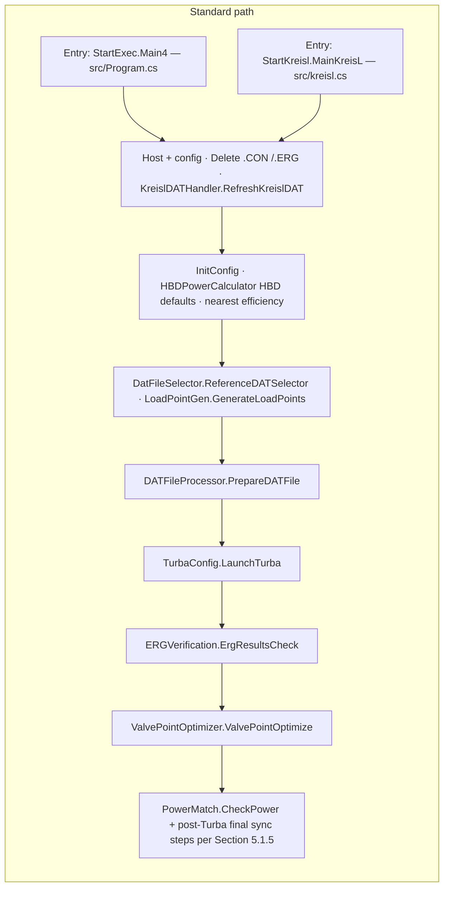
```mermaid
flowchart TD
  subgraph STD["Standard path"]
    direction TB
    E1["Entry: StartExec.Main4 — src/Program.cs"]
    E2["Entry: StartKreisl.MainKreisL — src/kreisl.cs"]
    S0["Host + config · Delete .CON /.ERG · KreislDATHandler.RefreshKreislDAT"]
    S1["InitConfig · HBDPowerCalculator HBD defaults · nearest efficiency"]
    S2["DatFileSelector.ReferenceDATSelector · LoadPointGen.GenerateLoadPoints"]
    S3["DATFileProcessor.PrepareDATFile"]
    S4["TurbaConfig.LaunchTurba"]
    S5["ERGVerification.ErgResultsCheck"]
    S6["ValvePointOptimizer.ValvePointOptimize"]
    S7["PowerMatch.CheckPower + post-Turba final sync steps per Section 5.1.5"]

    E1 --> S0
    E2 --> S0
    S0 --> S1 --> S2 --> S3 --> S4 --> S5 --> S6 --> S7
  end
```

#### Standard path — detail charts (what happens inside the boxes)

**Detail chart STD-A — Early checks and who picks the reference DAT (`DatFileSelector`)**

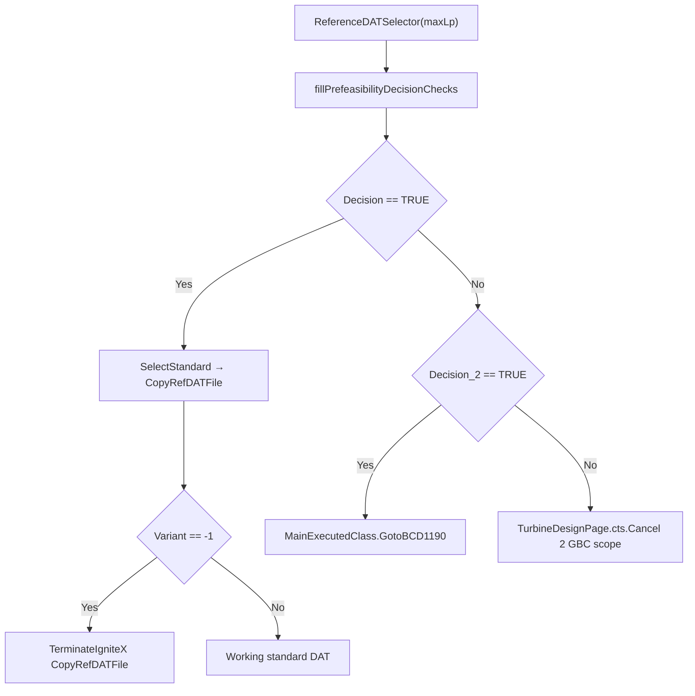
```mermaid
flowchart TD
  A["ReferenceDATSelector(maxLp)"]
  B["fillPrefeasibilityDecisionChecks"]
  D1{"Decision == TRUE"}
  D1 -->|Yes| S["SelectStandard → CopyRefDATFile"]
  V{"Variant == -1"}
  S --> V
  V -->|Yes| TERM["TerminateIgniteX CopyRefDATFile"]
  V -->|No| OK["Working standard DAT"]
  D1 -->|No| D2{"Decision_2 == TRUE"}
  D2 -->|Yes| E1190["MainExecutedClass.GotoBCD1190"]
  D2 -->|No| CAN["TurbineDesignPage.cts.Cancel 2 GBC scope"]
  A --> B --> D1
```

**Detail chart STD-B — Kreisl template family (`RefreshKreislDAT` logic, simplified)**

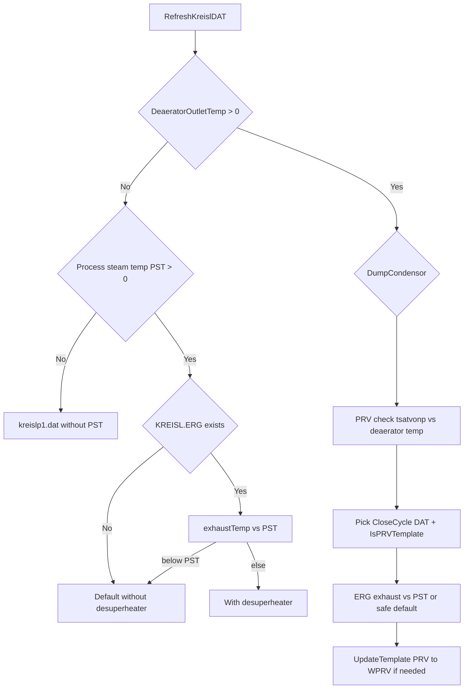
```mermaid
flowchart TD
  R["RefreshKreislDAT"]
  Q1{"DeaeratorOutletTemp > 0"}
  Q1 -->|No| O1{"Process steam temp PST > 0"}
  O1 -->|No| T0["kreislp1.dat without PST"]
  O1 -->|Yes| E1{"KREISL.ERG exists"}
  E1 -->|No| W0["Default without desuperheater"]
  E1 -->|Yes| CMP1["exhaustTemp vs PST"]
  CMP1 -->|below PST| W0
  CMP1 -->|else| W1["With desuperheater"]
  Q1 -->|Yes| Q2{"DumpCondensor"}
  Q2 --> PR["PRV check tsatvonp vs deaerator temp"]
  PR --> CX["Pick CloseCycle DAT + IsPRVTemplate"]
  CX --> DES["ERG exhaust vs PST or safe default"]
  DES --> AJ["UpdateTemplate PRV to WPRV if needed"]
  R --> Q1
```

**Detail chart STD-C — Compute core (between “LPs generated” and “valve optimize”)**

```mermaid
flowchart LR
  G["GenerateLoadPoints"] --> P["PrepareDATFile"]
  P --> TB["LaunchTurba"]
  TB --> ER1["ERGResultsCheck"]
  ER1 --> U5["UpdateLP5"]
  U5 --> ER2["ERGResultsCheck"]
  ER2 --> VO["ValvePointOptimize"]
```

**Detail chart STD-D — Closure strip (tie Turba ↔ Kreisl, then power)**

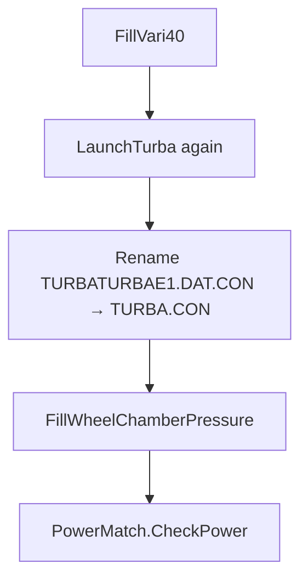
```mermaid
flowchart TD
  F["FillVari40"]
  T2["LaunchTurba again"]
  RN["Rename TURBATURBAE1.DAT.CON → TURBA.CON"]
  WH["FillWheelChamberPressure"]
  PM["PowerMatch.CheckPower"]
  F --> T2 --> RN --> WH --> PM
```

### Executed path flowchart (overview)

How criteria switch, fallback (`BCD1120 → BCD1190 → Main_CustomFlowPathTest`), and ERG checks work is in **[Section 7](#7-flow-wise-content-executed-flow-path)**.

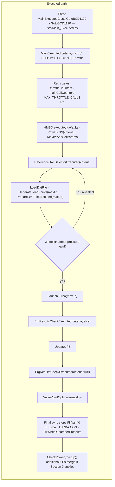
```mermaid
flowchart TD
  subgraph EXE["Executed path"]
    direction TB
    E0["Entry: MainExecutedClass.GotoBCD1120 / GotoBCD1190 — src/Main_Executed.cs"]
    E0b["MainExecuted(criteria,maxLp): BCD1120 | BCD1190 | Throttle"]
    E1["Retry gates: throttleCounters · mainCallCounters MAX_THROTTLE_CALLS etc."]
    E2["HMBD executed defaults · PowerKNN(criteria) · MoveYAndSetParams"]
    E3["ReferenceDATSelectorExecuted(criteria)"]
    E4["LoadDatFile · GenerateLoadPoints(maxLp) · PrepareDATFileExecuted(maxLp)"]
    E5{"Wheel chamber pressure valid?"}
    E6["LaunchTurba(maxLp)"]
    E7["ErgResultsCheckExecuted(criteria,false)"]
    E8["UpdateLP5"]
    E9["ErgResultsCheckExecuted(criteria,true)"]
    EA["ValvePointOptimize(maxLp)"]
    EB["Final sync steps FillVari40 + Turba · TURBA.CON · FillWheelChamberPressure"]
    EC["CheckPower(maxLp); additional LPs merge if Section 9 applies"]

    E0 --> E0b --> E1 --> E2 --> E3 --> E4 --> E5
    E5 -->|no · re-select| E3
    E5 -->|yes| E6 --> E7 --> E8 --> E9 --> EA --> EB --> EC
  end
```

#### Executed path — detail charts (retry limits and ERG before and after LP5)

**Detail chart EXE-A — Retry / fallback ladder (same idea as `MainExecuted`)**

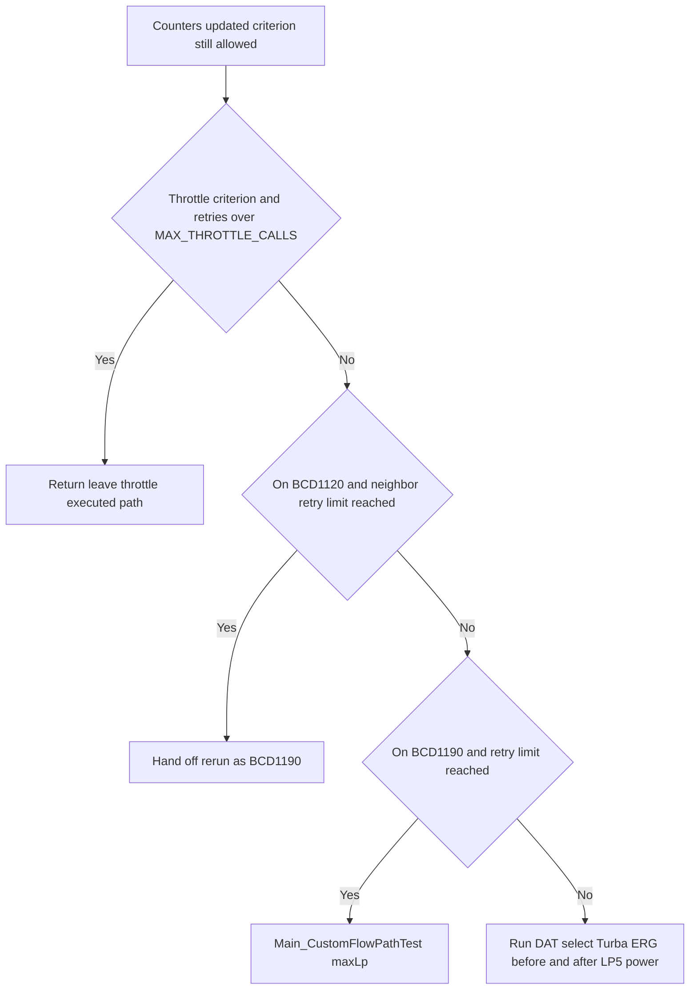
```mermaid
flowchart TD
  START["Counters updated criterion still allowed"]
  TH{"Throttle criterion and retries over MAX_THROTTLE_CALLS"}
  TH -->|Yes| RTH["Return leave throttle executed path"]
  TH -->|No| BD1{"On BCD1120 and neighbor retry limit reached"}
  BD1 -->|Yes| H1190["Hand off rerun as BCD1190"]
  BD1 -->|No| BD2{"On BCD1190 and retry limit reached"}
  BD2 -->|Yes| HC["Main_CustomFlowPathTest maxLp"]
  BD2 -->|No| RUN["Run DAT select Turba ERG before and after LP5 power"]
  START --> TH
```

**Detail chart EXE-B — Reference DAT chosen by criterion**

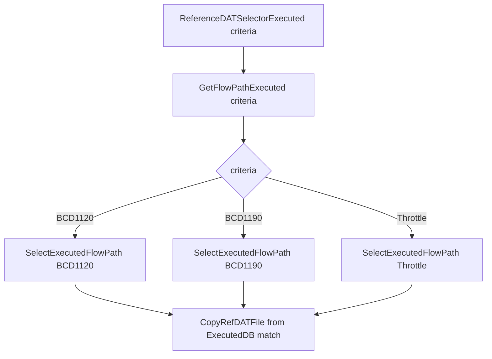
```mermaid
flowchart TD
  A["ReferenceDATSelectorExecuted criteria"]
  B["GetFlowPathExecuted criteria"]
  C{"criteria"}
  C -->|BCD1120| D["SelectExecutedFlowPath BCD1120"]
  C -->|BCD1190| E["SelectExecutedFlowPath BCD1190"]
  C -->|Throttle| F["SelectExecutedFlowPath Throttle"]
  D --> G["CopyRefDATFile from ExecutedDB match"]
  E --> G
  F --> G
  A --> B --> C
```

**Detail chart EXE-C — Turba + ERG checks before and after LP5**

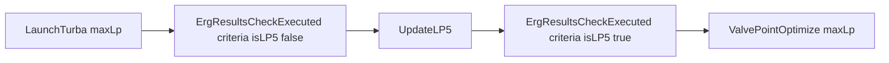
```mermaid
flowchart LR
  TB["LaunchTurba maxLp"] --> E0["ErgResultsCheckExecuted criteria isLP5 false"]
  E0 --> U5["UpdateLP5"]
  U5 --> E1["ErgResultsCheckExecuted criteria isLP5 true"]
  E1 --> VO["ValvePointOptimize maxLp"]
```

**Detail chart EXE-D — Final sync steps (same shape as standard tail)**

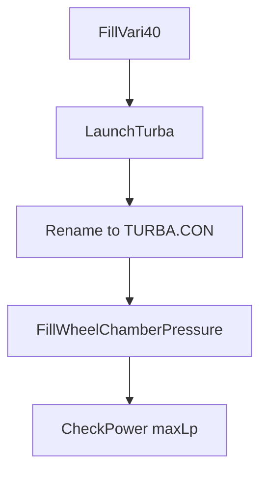
```mermaid
flowchart TD
  V40["FillVari40"]
  TB2["LaunchTurba"]
  RN["Rename to TURBA.CON"]
  WCP["FillWheelChamberPressure"]
  CP["CheckPower maxLp"]
  V40 --> TB2 --> RN --> WCP --> CP
```

### Custom path flowchart (overview)

Nearest DAT/PSO and `TurnaConvert` / `UpdatePunConvertor` detail are in **[Section 8](#8-flow-wise-content-custom-flow-path)**.

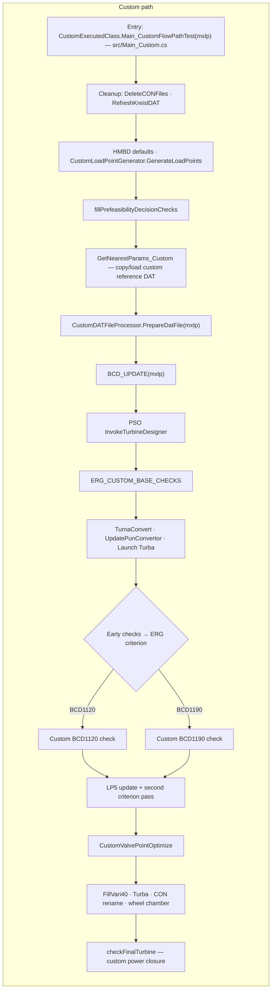
```mermaid
flowchart TD
  subgraph CST["Custom path"]
    direction TB
    C0["Entry: CustomExecutedClass.Main_CustomFlowPathTest(mxlp) — src/Main_Custom.cs"]
    C1["Cleanup: DeleteCONFiles · RefreshKreislDAT"]
    C2["HMBD defaults · CustomLoadPointGenerator.GenerateLoadPoints"]
    C3["fillPrefeasibilityDecisionChecks"]
    C4["GetNearestParams_Custom — copy/load custom reference DAT"]
    C5["CustomDATFileProcessor.PrepareDatFile(mxlp)"]
    C6["BCD_UPDATE(mxlp)"]
    C7["PSO InvokeTurbineDesigner"]
    C8["ERG_CUSTOM_BASE_CHECKS"]
    C9["TurnaConvert · UpdatePunConvertor · Launch Turba"]
    CQ{"Early checks → ERG criterion"}
    CR1120["Custom BCD1120 check"]
    CR1190["Custom BCD1190 check"]
    CS["LP5 update + second criterion pass"]
    CT["CustomValvePointOptimize"]
    CU["FillVari40 · Turba · CON rename · wheel chamber"]
    CV["checkFinalTurbine — custom power closure"]

    C0 --> C1 --> C2 --> C3 --> C4 --> C5 --> C6 --> C7 --> C8 --> C9 --> CQ
    CQ -->|BCD1120| CR1120 --> CS
    CQ -->|BCD1190| CR1190 --> CS
    CS --> CT --> CU --> CV
  end
```

#### Custom path — detail charts (DAT rebuild, PSO, ERG choice, closure)

**Detail chart CST-A — `PrepareDatFile(mxlp)` inside custom (DAT edits)**

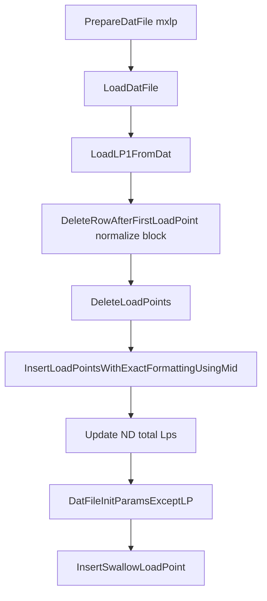
```mermaid
flowchart TD
  P0["PrepareDatFile mxlp"]
  P1["LoadDatFile"]
  P2["LoadLP1FromDat"]
  P3["DeleteRowAfterFirstLoadPoint normalize block"]
  P4["DeleteLoadPoints"]
  P5["InsertLoadPointsWithExactFormattingUsingMid"]
  P6["Update ND total Lps"]
  P7["DatFileInitParamsExceptLP"]
  P8["InsertSwallowLoadPoint"]
  P0 --> P1 --> P2 --> P3 --> P4 --> P5 --> P6 --> P7 --> P8
```

**Detail chart CST-B — After DAT is ready BCD rewrite + optimizer**

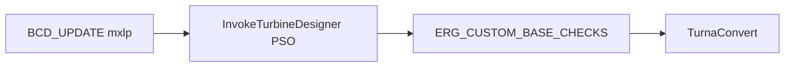
```mermaid
flowchart LR
  BCD["BCD_UPDATE mxlp"] --> PSO["InvokeTurbineDesigner PSO"]
  PSO --> E0["ERG_CUSTOM_BASE_CHECKS"]
  E0 --> TC["TurnaConvert"]
```

**Detail chart CST-C — ERG-derived feedback into DAT**

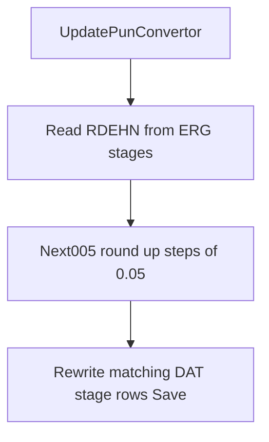
```mermaid
flowchart TD
  UC["UpdatePunConvertor"]
  RD["Read RDEHN from ERG stages"]
  N5["Next005 round up steps of 0.05"]
  WR["Rewrite matching DAT stage rows Save"]
  UC --> RD --> N5 --> WR
```

**Detail chart CST-D — Criterion split after Turba restart**

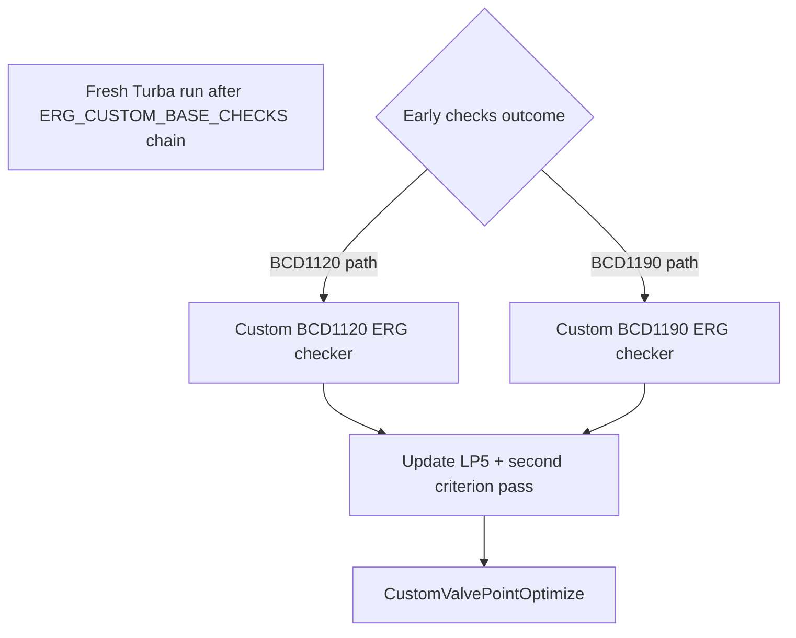
```mermaid
flowchart TD
  X["Fresh Turba run after ERG_CUSTOM_BASE_CHECKS chain"]
  Q{"Early checks outcome"}
  Q -->|BCD1120 path| Z1["Custom BCD1120 ERG checker"]
  Q -->|BCD1190 path| Z2["Custom BCD1190 ERG checker"]
  Z1 --> LP["Update LP5 + second criterion pass"]
  Z2 --> LP
  LP --> VV["CustomValvePointOptimize"]
```

**Detail chart CST-E — Last mile to power**

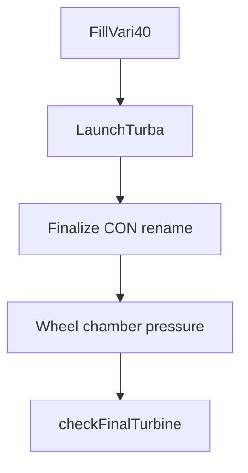
```mermaid
flowchart TD
  FV["FillVari40"]
  TB["LaunchTurba"]
  CF["Finalize CON rename"]
  FW["Wheel chamber pressure"]
  FT["checkFinalTurbine"]
  FV --> TB --> CF --> FW --> FT
```

### Additional load points flowchart (overview)

Symbols (`Pr/T/M/P/E`), `fillLPINDat`, `MainTemp`, and Kreisl merge loops are spelled out in **[Section 9](#9-flow-wise-content-additional-load-points-path)**.

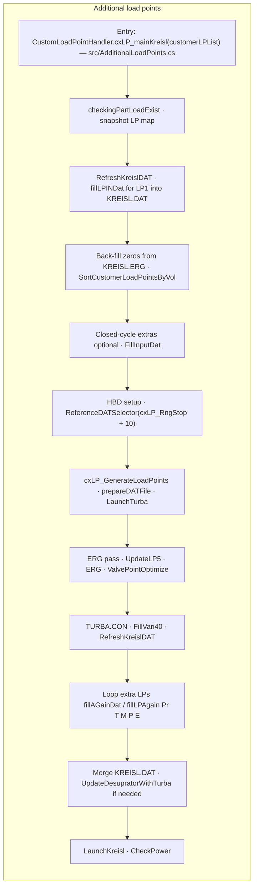
```mermaid
flowchart TD
  subgraph ALP["Additional load points"]
    direction TB
    A0["Entry: CustomLoadPointHandler.cxLP_mainKreisl(customerLPList) — src/AdditionalLoadPoints.cs"]
    A1["checkingPartLoadExist · snapshot LP map"]
    A2["RefreshKreislDAT · fillLPINDat for LP1 into KREISL.DAT"]
    A3["Back-fill zeros from KREISL.ERG · SortCustomerLoadPointsByVol"]
    A4["Closed-cycle extras optional · FillInputDat"]
    A5["HBD setup · ReferenceDATSelector(cxLP_RngStop + 10)"]
    A6["cxLP_GenerateLoadPoints · prepareDATFile · LaunchTurba"]
    A7["ERG pass · UpdateLP5 · ERG · ValvePointOptimize"]
    A8["TURBA.CON · FillVari40 · RefreshKreislDAT"]
    A9["Loop extra LPs fillAGainDat / fillLPAgain Pr T M P E"]
    AA["Merge KREISL.DAT · UpdateDesupratorWithTurba if needed"]
    AB["LaunchKreisl · CheckPower"]

    A0 --> A1 --> A2 --> A3 --> A4 --> A5 --> A6 --> A7 --> A8 --> A9 --> AA --> AB
  end
```

#### Additional load points — detail charts (Kreisl LP1, mirrored standard block, per-LP merge)

**Detail chart ALP-A — Startup checks and snapshots**

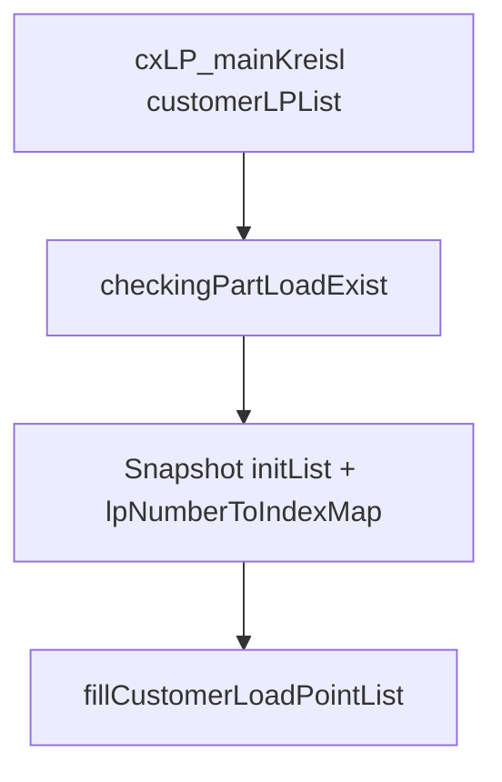
```mermaid
flowchart TD
  A["cxLP_mainKreisl customerLPList"]
  B["checkingPartLoadExist"]
  C["Snapshot initList + lpNumberToIndexMap"]
  D["fillCustomerLoadPointList"]
  A --> B --> C --> D
```

**Detail chart ALP-B — Kreisl LP1 shaping (`fillLPINDat`) at a glance**

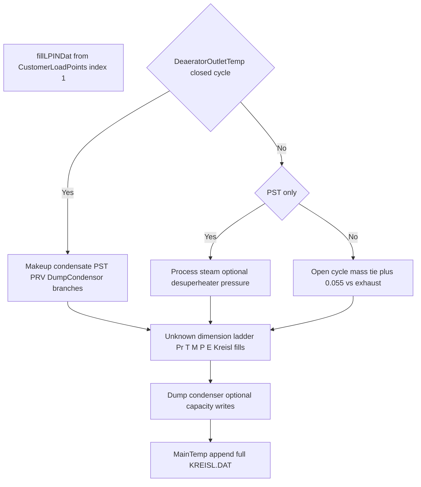
```mermaid
flowchart TD
  F["fillLPINDat from CustomerLoadPoints index 1"]
  G{"DeaeratorOutletTemp closed cycle"}
  G -->|Yes| MK["Makeup condensate PST PRV DumpCondensor branches"]
  G -->|No| H{"PST only"}
  H -->|Yes| PSTW["Process steam optional desuperheater pressure"]
  H -->|No| OP["Open cycle mass tie plus 0.055 vs exhaust"]
  MK --> U["Unknown dimension ladder Pr T M P E Kreisl fills"]
  PSTW --> U
  OP --> U
  U --> DC["Dump condenser optional capacity writes"]
  DC --> MT["MainTemp append full KREISL.DAT"]
```

**Detail chart ALP-C — Mirror of standard flow at scaled LP count (middle block)**

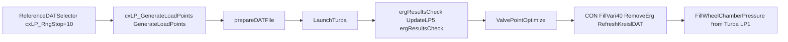
```mermaid
flowchart LR
  R["ReferenceDATSelector cxLP_RngStop+10"] --> GL["cxLP_GenerateLoadPoints GenerateLoadPoints"]
  GL --> PR["prepareDATFile"]
  PR --> LT["LaunchTurba"]
  LT --> ERG["ergResultsCheck UpdateLP5 ergResultsCheck"]
  ERG --> VP["ValvePointOptimize"]
  VP --> ST["CON FillVari40 RemoveErg RefreshKreislDAT"]
  ST --> W["FillWheelChamberPressure from Turba LP1"]
```

**Detail chart ALP-D — Loop over extra customer LPs (unknown dimension)**

```mermaid
flowchart TD
  L["For each extra customer LP i"]
  Q1{"i == 1"}
  Q1 -->|Yes| FA["fillAGainDat index initList"]
  Q1 -->|No| Q2{"Which field is zero SteamPressure SteamTemp SteamMass PowerGeneration ExhaustPressure"}
  Q2 --> FPr["fillLPAgain Pr"]
  Q2 --> FT["fillLPAgain T"]
  Q2 --> FM["fillLPAgain M"]
  Q2 --> FP["fillLPAgain P"]
  Q2 --> FE["fillLPAgain E"]
  FA --> NX["Append KREISL write continue"]
  FPr --> NX
  FT --> NX
  FM --> NX
  FP --> NX
  FE --> NX
  L --> Q1
```

**Detail chart ALP-E — Closeout across cycles**

```mermaid
flowchart TD
  DSR["Optional UpdateDesupratorWithTurba from TURBA ERG"]
  LK["LaunchKreisl"]
  CP["CheckPower"]
  DSR --> LK --> CP
```

---

## 5) Flowchart - Standard path (starting section)

> **Overview chart:** [Standard path flowchart](#standard-path-flowchart-overview) in the [flowcharts gallery](#flowcharts-gallery-all-automation-paths-overview).

Below is the **detailed standard-path flowchart for `StartKreisl.MainKreisL`** (Kreisl entry), including Kreisl template selection (`RefreshKreislDAT`). The shorter **`StartExec.Main4`** path skips Kreisl launches, `UpdateLP5`, and the second Turba/ERG block — see Section 11.5.1. Executed, custom, and additional-LP summaries are in the same gallery; **Sections 7–9** have the full breakdowns.

**Reading the main vertical chain:** the outer steps are labeled **`A` … `W`** (short letters so the diagram stays readable). **`D`** opens the **template selection** branch (inner decision boxes `T1`, `T2`, … — not the same as **`T2a`**, which is the *second Turba launch* later on the chain). A full list of **`A`–`W`** is in **[Section 6.0: Letter legend](#standard-path-letter-legend)**.

```mermaid
flowchart TD
  A["StartKreisl.MainKreisL"] --> B["Delete .CON/.ERG"]
  B --> C["Create KreislDATHandler"]
  C --> D["RefreshKreislDAT"]
 
 
  subgraph tmplSel["Template selection - RefreshKreislDAT"]
    direction TB
 
 
    T1{"If DeaeratorOutletTemperature in Load Point > 0"}
 
 
    T1 -- "No" --> T4{"If Process Steam Temperature in Load Point > 0"}
    T4 -- "No" --> T5["Copy Kreisl template without PST (kreislp1.dat)"]
 
 
    T4 -- "Yes" --> P1{"File.Exists(KREISL.ERG) ?"}
    P1 -- "Yes" --> P2["Find exhaustTemp from KREISL.ERG (ExtractTempForDesuparator, 5, 1)"]
    P1 -- "No"  --> P3["Default to Without Desuperheater when ERG missing"]
 
 
    P2 --> D1{"exhaustTemp below PST?"}
    D1 -- "Yes" --> T6a["Copy Without Desuperheater template (kreislwDesuperheater.dat)"]
    D1 -- "No"  --> T6b["Copy With Desuperheater template (kreislDesuperheater.dat)"]
    P3 --> T6a
 
 
    T1 -- "Yes" --> T2{"DumpCondensor ?"}
   
    T2 -- "Yes" --> T3{"tsatvonp(ExhaustPressure*0.92 - 0.25) - DeaeratorOutletTemp > 0"}
   
    T3 -- "Yes" --> TDSET["Set IsPRVTemplate = true"]
    TDSET --> ERGCHK{"File.Exists(KREISL.ERG) ?"}
    ERGCHK -- "Yes" --> EXTR["exhaustTemp = ExtractTempForDesuparator(KREISL.ERG, 3, 1)"]
    ERGCHK -- "No"  --> DEFWD["Default: CloseCyclePRVWDDump.DAT (ERG missing)"]
    EXTR --> PRVCMP{"exhaustTemp below PST?"}
    PRVCMP -- "Yes" --> TD1["Copy CloseCyclePRVWDDump.DAT"]
    PRVCMP -- "No"  --> TD1B["Copy CloseCyclePRVDDump.DAT"]
    DEFWD --> TD1
 
 
    T3 -- "No" --> TD2_START["Set IsPRVTemplate = false"]
    TD2_START --> TD2_ERG{"File.Exists(KREISL.ERG) ?"}
    TD2_ERG -- "Yes" --> TD2_EXTR["exhaustTemp = ExtractTempForDesuparator(KREISL.ERG, 3, 1)"]
    TD2_ERG -- "No" --> TD2_DEF["Default: CloseCyclePRVWDDump.DAT (ERG missing)"]
    TD2_EXTR --> TD2_CMP{"exhaustTemp below PST?"}
    TD2_CMP -- "Yes" --> TD2_WD["Copy CloseCyclePRVWDDump.DAT"]
    TD2_CMP -- "No" --> TD2_D["Copy CloseCyclePRVDDump.DAT"]
    TD2_WD --> TD2_UPDATE["UpdateTemplatePRVToWPRVInDumpCondensor"]
    TD2_D --> TD2_UPDATE
    TD2_DEF --> TD2_UPDATE
   
    T2 -- "No" --> T7{"tsatvonp(ExhaustPressure*0.92 - 0.25) - DeaeratorOutletTemp > 0"}
   
    T7 -- "Yes" --> TN1_SET["Set IsPRVTemplate = true"]
    TN1_SET --> TN1_ERG{"File.Exists(KREISL.ERG) ?"}
    TN1_ERG -- "Yes" --> TN1_EXTR["exhaustTemp = ExtractTempForDesuparator(KREISL.ERG, 3, 1)"]
    TN1_ERG -- "No" --> TN1_DEF["Default: Copy CloseCyclePRVWD.DAT (ERG missing)"]
    TN1_EXTR --> TN1_CMP{"exhaustTemp below PST?"}
    TN1_CMP -- "Yes" --> TN1_WD["Copy CloseCyclePRVWD.DAT"]
    TN1_CMP -- "No" --> TN1_D["Copy CloseCyclePRVD.DAT"]
    TN1_DEF --> TN1_END
    TN1_WD --> TN1_END["IsPRVTemplate = true"]
    TN1_D --> TN1_END
   
    T7 -- "No" --> TN2_SET["Set IsPRVTemplate = false"]
    TN2_SET --> TN2_ERG{"File.Exists(KREISL.ERG) ?"}
    TN2_ERG -- "Yes" --> TN2_EXTR["exhaustTemp = ExtractTempForDesuparator(KREISL.ERG, 3, 1)"]
    TN2_ERG -- "No" --> TN2_DEF["Default: Copy CloseCyclePRVWD.DAT (ERG missing)"]
    TN2_EXTR --> TN2_CMP{"exhaustTemp below PST?"}
    TN2_CMP -- "Yes" --> TN2_WD["Copy CloseCyclePRVWD.DAT"]
    TN2_CMP -- "No" --> TN2_D["Copy CloseCyclePRVD.DAT"]
    TN2_WD --> TN2_UPDATE["UpdateTemplatePRVToWPRV"]
    TN2_D --> TN2_UPDATE
    TN2_DEF --> TN2_UPDATE
  end
 
 
  D --> E["FillClosestTurbineEfficiency"]
  E --> F["GetTurbaCON(ClosestProjectID)"]
  F --> G["InitConfig"]
  G --> H["LaunchKreisL"]
  H --> I["RefreshKreislDAT"]
  I --> J["InitConfig"]
  J --> K["ReferenceDATSelector"]
  K --> L["GenerateLoadPoints"]
  L --> M["PrepareDATFile"]
  M --> N["LaunchTurba"]
  N --> O["ERGResultsCheck"]
  O --> P["UpdateLP5"]
  P --> Q["ERGResultsCheck"]
  Q --> R["ValvePointOptimize"]
  R --> S["FillVari40"]
  S --> T2a["LaunchTurba"]
  T2a --> U["Rename TURBATURBAE1.DAT.CON -> TURBA.CON"]
  U --> V["FillWheelChamberPressure"]
  V --> W["PowerMatch.CheckPower"]
```

### 5.0 Full flow overview (shared diagram)

This is the clean top-level view of how inputs move through template selection, efficiency, early checks, and the Standard → Executed → Custom fallback chain before **Create HMBD**. It sits before the detailed Standard-path splits in Section 5.1.

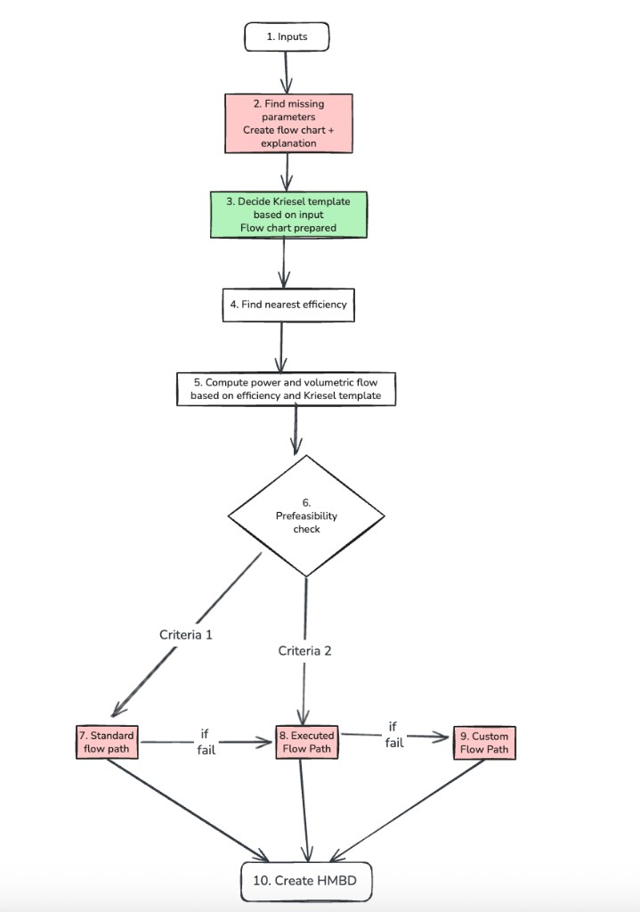

```mermaid
flowchart TD
  P1([1. Inputs])
  P2[2. Find missing parameters, create flow chart + explanation]
  P3[3. Decide Kreisl template based on input, flow chart prepared]
  P4[4. Find nearest efficiency]
  P5[5. Compute power and volumetric flow from efficiency and Kreisl template]
  P6{6. Early feasibility check}
  P7[7. Standard flow path]
  P8[8. Executed flow path]
  P9[9. Custom flow path]
  P10([10. Create HMBD])

  P1 --> P2 --> P3 --> P4 --> P5 --> P6
  P6 -->|Criteria 1| P7
  P6 -->|Criteria 2| P8
  P7 -->|success| P10
  P7 -->|if fail| P8
  P8 -->|success| P10
  P8 -->|if fail| P9
  P9 --> P10
```

### 5.1 Standard flow path chart (clean split, as shared)

To keep the Standard section readable (not messy), the same logic is split into smaller charts exactly like your diagram style.

#### 5.1.1 Main standard flow (7.1 to 7.10)

```mermaid
flowchart TD
  S71["7.1 Reference DAT Selector"] --> S72["7.2 Generate Load Point"]
  S72 --> S73["7.3 Prepare DAT File"]
  S73 --> S74["7.4 Launch Turba"]
  S74 --> S75["7.5 ERG Checks"]
  S75 --> S76["7.6 Update LP5"]
  S76 --> S77["7.7 ERG Checks"]
  S77 --> S78["7.8 Valve Point Optimization"]
  S78 --> S79["7.9 Make Turba and Kreisl connection"]
  S79 --> S710["7.10 Check Power"]
```

This is the base Standard run sequence before deeper sub-logic.

#### 5.1.2 Reference DAT selector detail (7.1.x)

```mermaid
flowchart TD
  S71["7.1 Reference DAT Selector"] --> S711["7.11 Select Standard DAT template"]
  S711 --> S712["7.12 Copy template into testDir"]
```

Explanation:
- `7.11` chooses the correct Standard template from input condition.
- `7.12` copies that template to runtime location (`testDir`) so later steps always work on the active DAT.

#### 5.1.3 Prepare DAT detail (7.3.x)

```mermaid
flowchart TD
  S73["7.3 Prepare DAT File"] --> S731["7.3.1 Fill LP1 in TURBATURBAE1.DAT.DAT"]
  S731 --> S732["7.3.2 Fill other load points in TURBATURBAE1.DAT.DAT"]
  S732 --> S733["7.3.3 Update total load point count"]
  S733 --> S734["7.3.4 Update datFileInitParams except load point data"]
  S734 --> S74["7.4 Launch Turba"]
```

Explanation:
- LP1 is written first, then remaining LPs are appended.
- Load-point count is synchronized with written rows.
- Non-LP init params are refreshed before Turba launch.

#### 5.1.4 Valve optimization detail (7.8.x)

```mermaid
flowchart TD
  S78["7.8 Valve Point Optimization"] --> S781["7.8.1 Read base-load LP deviation + nozzle/group/valve status"]
  S781 --> S782["7.8.2 Check nozzle-group/valve status"]
  S782 --> S783["7.8.3 Evaluate valve-point deviation value"]
  S783 --> S784["7.8.4 Adjust nozzle pair / mass-flow"]
  S784 --> S710["7.10 Check Power"]
```

Explanation:
- This block reduces valve-point deviation in a loop.
- Based on status + deviation band, code applies nozzle pair/mass-flow corrections.
- Control then returns to `7.10 Check Power`.

#### 5.1.5 Turba-Kreisl connection + power decision (7.9.1, 7.10.x)

```mermaid
flowchart TD
  S79["7.9 Make Turba and Kreisl connection"] --> S791["7.9.1 Add varicode 40 in TURBATURBAE1.DAT.DAT"]
  S791 --> S710["7.10 Check Power"]
  S710 --> C1{"Power diff ≤ 25?"}
  C1 -- "No" --> STOP["Stop calculation"]
  C1 -- "Yes" --> S7101["7.10.1 HMBDUpdateEffKreisl"]
  S7101 --> S7102["7.10.2 Optimize no-load power"]
  S7102 --> S7103{"7.10.3 Bending check for LP5"}
  S7103 -- "Pass" --> S7104{"7.10.4 Check thrust"}
  S7103 -- "Fail" --> S7105["7.10.5 Update LP5 power"]
  S7105 --> S7107{"7.10.7 Bending check for LP5"}
  S7107 -- "Pass" --> S7104
  S7107 -- "Fail" --> EXEC["8. Executed flow path"]
  S7104 -- "Pass" --> S7106{"7.10.6 Check final bending"}
  S7104 -- "Fail" --> EXEC
  S7106 -- "Pass" --> HMBD["10. Create HMBD"]
  S7106 -- "Fail" --> STOP
```

Explanation:
- `7.9.1` adds the coupling marker (`varicode 40`) so Turba-Kreisl switch is complete.
- `7.10` gates success by power difference first.
- If LP5/bending/thrust checks fail repeatedly, flow switches to `8. Executed flow path`.
- If all checks pass, flow closes at `10. Create HMBD`.

---

## 6) Standard path explained (plain language)

This section explains what each major step in the Section 5 flowchart does and why it is there.

### 6.0 Legend — Section 5 main-spine diagram letters (`A` … `W`)

The large **standard-path diagram** at the start of **[Section 5: Flowchart — Standard path](#5-flowchart-standard-path-starting-section)** labels each step on the outer chain with a short **letter** (`A`, `B`, `C`, …). Those letters exist **only in the diagram** — they are not C# variable names.

When a subsection heading below writes **(Section 5: `X` → `Y`)**, it means “the part of Section 5’s diagram from node `X` through node `Y`.”

Spine IDs and what they label in Section 5:

| ID | Labels in Section 5 diagram |
|----|-----------------------|
| `A` | `StartKreisl.MainKreisL` |
| `B` | Delete `.CON` / `.ERG` |
| `C` | Create `KreislDATHandler` |
| `D` | `RefreshKreislDAT` (same box that opens **template selection**; inner boxes there are named `T1`, `T2`, … — see Section 6.2) |
| `E` | `FillClosestTurbineEfficiency` |
| `F` | `GetTurbaCON(ClosestProjectID)` |
| `G` | `InitConfig` (after Kreisl setup) |
| `H` | `LaunchKreisL` |
| `I` | `RefreshKreislDAT` (second sync) |
| `J` | `InitConfig` (after second refresh) |
| `K` | `ReferenceDATSelector` |
| `L` | `GenerateLoadPoints` |
| `M` | `PrepareDATFile` |
| `N` | `LaunchTurba` |
| `O` | `ERGResultsCheck` |
| `P` | `UpdateLP5` |
| `Q` | `ERGResultsCheck` (second pass) |
| `R` | `ValvePointOptimize` |
| `S` | `FillVari40` |
| `T2a` | Second `LaunchTurba` (label in diagram is **`T2a`** so it does not clash with template diamonds `T1`, `T2`, … inside `RefreshKreislDAT`) |
| `U` | Rename `TURBATURBAE1.DAT.CON` → `TURBA.CON` |
| `V` | `FillWheelChamberPressure` |
| `W` | `PowerMatch.CheckPower` |

**Do not confuse:** Section 6.2 heading **“branch (`T`)”** refers to the **whole template-selection branch** in Section 5 (called **`T`** in prose). That is unrelated to spine node **`T2a`** (second Turba run).

---

### 6.1 Entry and cleanup (Section 5: `A` → `D`)

The flow starts from `StartKreisl.MainKreisL`, then immediately performs runtime cleanup:

- delete stale `.CON` / `.ERG` files,
- create `KreislDATHandler`,
- call `RefreshKreislDAT`.

Why this matters:

- old simulation artifacts can pollute a new run,
- template selection must happen before running Kreisl/Turba,
- all later calculations depend on this initial DAT state.

### 6.2 Template selection branch (**`T`** = inner part of Section 5 on node `D`)

`RefreshKreislDAT` is the main decision step in the standard path. **Here, `T` means the nested “template selection” logic** on **`D`** in Section 5 (`tmplSel`), not spine node **`T2a`**.

In the **[Section 5 flowchart](#5-flowchart-standard-path-starting-section)**, decision box **`T1`** asks: *“Is `DeaeratorOutletTemperature` in the load point greater than zero?”*

- **`T1 = Yes`** — you leave `T1` on the **Yes** arrow → **closed-cycle with deaerator** branch.
- **`T1 = No`** — you leave `T1` on the **No** arrow → **`DeaeratorOutletTemperature` is not greater than zero** (not set / zero) → treated as **open-cycle / PST** side of template selection (“no deaerator outlet temp”).

So **`T1` is only a diagram shortcut for that first diamond**; it is not a separate variable in code.

It first determines whether the request is **closed-cycle-like** or **open-cycle-like**:

- if `DeaeratorOutletTemperature > 0` -> closed-cycle branch,
- else -> open-cycle/PST branch.

#### 6.2.1 Open-cycle / PST side (`T1 = No`)

If no deaerator outlet temperature is provided:

- when `PST <= 0`, it copies `kreislp1.dat` (without PST path),
- when `PST > 0`, it tries to read `KREISL.ERG` and extract exhaust temperature.

Then it compares `exhaustTemp` with `PST`:

- `exhaustTemp < PST` -> choose **without desuperheater** template,
- otherwise -> choose **with desuperheater** template.

If ERG is missing, the flow safely defaults to the **without desuperheater** template.

#### 6.2.2 Closed-cycle with deaerator (`T1 = Yes`)

When `DeaeratorOutletTemperature > 0`, the next split is dump condenser:

- `DumpCondensor == true` (dump ON),
- `DumpCondensor == false` (dump OFF).

Inside both dump ON/OFF paths, code checks whether the PRV setup is OK:

- `tsatvonp(ExhaustPressure*0.92 - 0.25) - DeaeratorOutletTemp > 0`.

That condition determines whether `IsPRVTemplate` stays true or false.

After that, it optionally reads `KREISL.ERG` and compares `exhaustTemp < PST` to decide:

- with-desuperheater template vs without-desuperheater template.

For non-PRV outcomes, the selected PRV template is converted using:

- `UpdateTemplatePRVToWPRVInDumpCondensor` (dump ON),
- `UpdateTemplatePRVToWPRV` (dump OFF).

This conversion step is essential because template families are reused and then adjusted to match final mode.

### 6.3 After template pick: set up steam values (Section 5: `D` → `J`)

After template decision:

1. `FillClosestTurbineEfficiency` loads nearest known performance context.
2. `GetTurbaCON(ClosestProjectID)` binds reference project CON data.
3. `InitConfig` hydrates runtime model state.
4. `LaunchKreisL` runs Kreisl with selected template/input.
5. `RefreshKreislDAT` + `InitConfig` run again to sync generated outputs back into the flow.

The key idea is: **select -> run -> resync** before entering final DAT/Turba checks.

### 6.4 Main calculation steps (Section 5: `K` → `R`)

This is the operational sequence:

1. `ReferenceDATSelector` picks final DAT reference.
2. `GenerateLoadPoints` builds LP inputs.
3. `PrepareDATFile` writes LP and control values into DAT.
4. `LaunchTurba` runs turbine simulation.
5. `ERGResultsCheck` validates result quality.
6. `UpdateLP5` modifies LP5 scenario and checks ERG again.
7. `ValvePointOptimize` adjusts valve configuration for a better valve match.

Why LP5 is checked again:

- LP5 often acts as a corrective or boundary operating point,
- second ERG check ensures the updated point still satisfies constraints.

### 6.5 Final sync steps and power closure (Section 5: `S` → `T2a` → `U` → `V` → `W`)

This is the **tail of the Section 5 spine after valve optimization** — not only `S` and `W`, but every hop in between (see **Section 6.0**). Some older notes abbreviated this as “`S` → `W`”; the diagram’s full chain is below.

After valve optimization:

1. **`S` —** `FillVari40` updates DAT/Kreisl variable settings.
2. **`T2a` —** `LaunchTurba` runs once more on updated values.
3. **`U` —** `Rename TURBATURBAE1.DAT.CON -> TURBA.CON` normalizes output naming for later use.
4. **`V` —** `FillWheelChamberPressure` pushes wheel chamber pressure back to Kreisl/DAT side.
5. **`W` —** `PowerMatch.CheckPower` performs final power closure.

This final block ensures the output is not just feasible, but also aligned with target power behavior.

### 6.6 Backup paths when something fails

Across this flow, the code uses practical fallback rules:

- if ERG file does not exist, choose safe default templates,
- if branch-specific PRV mode is not feasible, convert PRV templates to non-PRV variants,
- rerun key steps after major state updates (Kreisl run, LP update, valve optimization).

This helps the flow keep going when some files are missing or the branch changes.

---

## 7) Executed flow path (step-by-step)

> **Overview chart:** [Executed path flowchart](#executed-path-flowchart-overview) in the [flowcharts gallery](#flowcharts-gallery-all-automation-paths-overview).

### 7.1 Main executed flow (`MainExecutedClass.MainExecuted`)

The executed flow sequence is:

1. initialize counters and criteria limits (`mainCallCounters`, `throttleCounters`),
2. apply retry and fallback rules:
   - `Throttle` only up to `MAX_THROTTLE_CALLS`,
   - `BCD1120` retry limit -> switch to `BCD1190`,
   - `BCD1190` retry limit -> move to custom flow (`Main_CustomFlowPathTest`),
3. run HMBD defaults and nearest project selection (`PowerKNN`, `MoveYAndSetParams`),
4. select executed DAT (`ReferenceDATSelectorExecuted`),
5. load DAT and generate LPs (`LoadDatFile`, `GenerateLoadPoints`),
6. write DAT (`PrepareDATFileExecuted`),
7. validate wheel chamber pressure; if invalid, re-run executed selection,
8. launch Turba (`LaunchTurba`),
9. run ERG checks by criteria (`ErgResultsCheckExecuted(criteria, false)`),
10. update LP5 and re-check ERG (`UpdateLP5`, `ErgResultsCheckExecuted(criteria, true)`),
11. valve optimization (`ValvePointOptimize`),
12. final final sync steps:
    - `FillVari40`
    - Turba re-launch
    - rename `TURBATURBAE1.DAT.CON` -> `TURBA.CON`
    - fill wheel chamber pressure
13. final power match (`CheckPower`).

### 7.2 Executed criteria branches

- **BCD1120 flow**
  - Uses `ErgResultsCheckBCD1120` in both initial and LP5-updated passes.
  - If retry limit is reached, auto-switch to `BCD1190`.

- **BCD1190 flow**
  - Uses `ErgResultsCheckBCD1190` in both initial and LP5-updated passes.
  - If retry limit is reached, auto-switch to custom flow.

- **Throttle flow**
  - Uses `ErgResultsCheckThrottle`.
  - Hard-limited retry count; beyond limit, flow returns and effectively shifts toward custom handling path.

### 7.3 Executed main flowchart

```mermaid
flowchart TD
  A["Init mainCallCounters, throttleCounters"]
  B["Retry rules: Throttle ≤ 2 then stop; BCD1120 → BCD1190; BCD1190 → custom"]
  C["PowerKNN, MoveYAndSetParams (HMBD defaults + nearest project)"]
  D["ReferenceDATSelectorExecuted"]
  E["LoadDatFile, GenerateLoadPoints"]
  F["PrepareDATFileExecuted"]
  G{Wheel chamber pressure valid?}
  H["LaunchTurba"]
  I["ErgResultsCheckExecuted(criteria, false)"]
  J["UpdateLP5"]
  K["ErgResultsCheckExecuted(criteria, true)"]
  L["ValvePointOptimize"]
  M["FillVari40"]
  N["Launch Turba"]
  O["Rename TURBATURBAE1.DAT.CON to TURBA.CON"]
  P["Fill wheel chamber pressure"]
  Q["CheckPower"]

  A --> B --> C --> D --> E --> F --> G
  G -->|No: re-run selection| D
  G -->|Yes| H --> I --> J --> K --> L --> M --> N --> O --> P --> Q
```

### 7.4 Executed criteria and ERG fallback flowchart

Each criterion uses the matching ERG checker on **both** passes in the main flow (`ErgResultsCheckExecuted(criteria, false)` then after `UpdateLP5`, `ErgResultsCheckExecuted(criteria, true)`). This chart shows how criteria **switch** when retry limits are reached.

```mermaid
flowchart TD
  C0{"Active executed criterion"}
  E1["BCD1120: ErgResultsCheckBCD1120 (initial + LP5 passes)"]
  E2{BCD1120 retry limit reached?}
  E3["BCD1190: ErgResultsCheckBCD1190 (initial + LP5 passes)"]
  E4{BCD1190 retry limit reached?}
  CF["Main_CustomFlowPathTest"]
  OK["Continue executed flow"]
  T1["Throttle: ErgResultsCheckThrottle (initial + LP5 passes)"]
  T2{Past MAX_THROTTLE_CALLS?}
  T3["Return; toward custom handling path"]

  C0 -->|BCD1120| E1
  C0 -->|BCD1190| E3
  C0 -->|Throttle| T1

  E1 --> E2
  E2 -->|Yes, switch| E3
  E2 -->|No| OK

  E3 --> E4
  E4 -->|Yes| CF
  E4 -->|No| OK

  T1 --> T2
  T2 -->|Yes| T3
  T2 -->|No| OK
```

### 7.5 `MainExecuted(criteria, maxLp)` what it does (detailed flow)

This is the **main controller** for the executed flow path.

In simple terms, it:

1. decides whether the current criterion is still allowed to run,
2. selects the nearest executed reference project,
3. rebuilds the DAT with executed load points,
4. runs Turba,
5. applies criterion-specific ERG checks,
6. updates LP5 and checks again,
7. optimizes valve behavior,
8. performs final final sync steps and power matching,
9. falls back to the next path if the current executed path cannot close.

#### 7.5.1 Easy overall picture

```mermaid
flowchart TD
  A["MainExecuted(criteria, maxLp)"]
  B["Initialize / update call counters"]
  C{"Criterion still allowed?"}
  D["Throttle return or fallback to next path"]
  E["Set executed HMBD defaults"]
  F["PowerKNN + MoveYAndSetParams"]
  G["ReferenceDATSelectorExecuted(criteria)"]
  H["LoadDatFile + GenerateLoadPoints"]
  I["PrepareDATFileExecuted(maxLp)"]
  J{"Wheel chamber pressure valid?"}
  K["Re-run MainExecuted(criteria, maxLp)"]
  L["LaunchTurba(maxLp)"]
  M["ErgResultsCheckExecuted(criteria, false)"]
  N["UpdateLP5()"]
  O["ErgResultsCheckExecuted(criteria, true)"]
  P["ValvePointOptimize(maxLp)"]
  Q["Final sync steps: FillVari40 + Turba + TURBA.CON + wheel pressure"]
  R["CheckPower(maxLp)"]
  S["Additional load points / Kreisl merge if needed"]

  A --> B --> C
  C -->|No| D
  C -->|Yes| E --> F --> G --> H --> I --> J
  J -->|No| K
  J -->|Yes| L --> M --> N --> O --> P --> Q --> R --> S
```

#### 7.5.2 Counter and fallback logic

Before the executed calculation starts, `MainExecuted()` checks whether the current criterion is still allowed to continue.

- `mainCallCounters` tracks retries for `BCD1120` and `BCD1190`
- `throttleCounters` tracks retries for `Throttle`
- `MAX_THROTTLE_CALLS = 2`

Behavior:

- if the criterion is `Throttle` and the retry limit is exceeded, the method returns and effectively gives up on the throttle-executed path
- if `BCD1120` exceeds its allowed neighbor/call budget, the flow resets state and switches to `BCD1190`
- if `BCD1190` exceeds its budget, the flow moves to `Main_CustomFlowPathTest(maxLp)`

This method does more than run the steps: it **controls when the executed path retries or switches to another path**.

#### 7.5.3 Main executed setup phase

Once the criterion is accepted, the method performs the executed-run setup:

1. HMBD defaults are initialized:
   - `HBDsetDefaultCustomerParamas_Executed()` or Kreisl-specific variant
2. nearest executed candidates are resolved:
   - `PowerKNN(criteria)`
   - `MoveYAndSetParams()`
3. the executed DAT is selected:
   - `ReferenceDATSelectorExecuted(criteria)`
4. the selected DAT is loaded:
   - `LoadDatFile()`
5. executed load points are generated:
   - `GenerateLoadPoints(maxLp)`
6. turbine efficiency from the nearest match is pushed into runtime state:
   - `HBDupdateEfficiency(efficiency)`
7. the DAT is rebuilt for the executed run:
   - `PrepareDATFileExecuted(maxLp)`

This means the executed flow first establishes the **nearest known project context**, then rewrites that selected DAT around the current request.

### 7.6 `ReferenceDATSelectorExecuted(criteria)` what it does (detailed flow)

This step is the executed-flow **reference project selector**.

It does not build a DAT from scratch. Instead, it chooses the closest executed reference project for the active criterion and copies that DAT into the working area.

```mermaid
flowchart TD
  A["ReferenceDATSelectorExecuted(criteria)"]
  B["GetFlowPathExecuted(criteria)"]
  C{"Criterion"}
  D["SelectExecutedFlowPath(BCD1120)"]
  E["SelectExecutedFlowPath(BCD1190)"]
  F["SelectExecutedFlowPath(Throttle)"]
  G["Read nearest candidates from ListPower"]
  H["Match project name inside ExecutedDB"]
  I["Store ClosestProjectID / ClosestProjectName / DatFilePath"]
  J["CopyRefDATFile(path)"]
  K["Working executed DAT ready"]

  A --> B --> C
  C -->|BCD1120| D
  C -->|BCD1190| E
  C -->|Throttle| F
  D --> G
  E --> G
  F --> G
  G --> H --> I --> J --> K
```

What it really does:

- `SelectExecutedFlowPath(criteria)` loops through the nearest candidates already prepared in `turbineDataModel.ListPower`
- it looks for entries marked with `KNearest == "Y"`
- it matches those candidate names against `ExecutedDB.ExecutedProjectDB`
- once it finds the matching project:
  - stores closest project metadata in `TurbineDataModel`
  - returns the DAT file path
- `CopyRefDATFile(path)` then copies that chosen executed DAT into the active runtime area

So this is the step that converts “nearest executed project” into an actual working DAT file.

### 7.7 `PrepareDATFileExecuted(maxLp)` what it does (detailed flow)

This method is the executed-flow **DAT reconstruction step**.

It rewrites the selected executed DAT with the generated executed load points and then refreshes executed-specific non-LP initialization values.

```mermaid
flowchart TD
  A["PrepareDATFileExecuted(maxLp)"]
  B["LoadDatFile()"]
  C["LoadLP1FromDat()"]
  D["DeleteRowAfterFirstLoadPoint()"]
  E["InsertDataLineUnderFirstLPFixed()"]
  F["DeleteLoadPoints()"]
  G["InsertLoadPointsWithExactFormattingUsingMid(maxLp)"]
  H["InsertDataLineUnderND(totalLps)"]
  I["DatFileInitParamsExceptLPExecuted()"]
  J["Executed DAT ready for Turba"]

  A --> B --> C --> D --> E --> F --> G --> H --> I --> J
```

Important meaning:

- LP1 is preserved from the selected executed reference DAT
- old LP blocks are removed
- new executed LPs are inserted
- the ND/load-point count line is updated
- executed-specific DAT init parameters are refreshed after LP insertion

So this is the executed equivalent of the custom DAT rebuild step.

### 7.8 `UpdateLP5()` what it does (detailed flow)

This method regenerates the special LP5 case before the second ERG pass.

It uses current turbine inlet conditions and derives a corrective LP5 condition:

- pressure = inlet pressure
- temperature = inlet temperature minus a computed offset
- mass flow = current inlet mass flow
- back pressure = `0.5 * ExhaustPressure`
- RPM = LP1 RPM
- several flags (`InFlow`, `BYP`, `EIN`, `WANZ`, `RSMIN`) are reset

```mermaid
flowchart TD
  A["UpdateLP5()"]
  B["temp = InletTemperature - tsatvonp(InletPressure)"]
  C{"temp >= 110?"}
  D["Set temp offset = 60"]
  E["Set temp offset = temp + 50"]
  F["Rewrite LP5 values"]
  G["Pressure = inlet pressure"]
  H["Temp = inlet temperature - offset"]
  I["MassFlow = current mass flow"]
  J["BackPress = 0.5 * exhaust pressure"]
  K["Reset LP5 flags"]

  A --> B --> C
  C -->|Yes| D --> F
  C -->|No| E --> F
  F --> G --> H --> I --> J --> K
```

Why it matters:

- the first ERG check runs on the original executed LP set
- then LP5 is rebuilt into a stronger corrective/bending/thrust-sensitive case
- the second ERG check verifies whether the design still survives after that LP5 update

So `UpdateLP5()` is the executed flow’s **second-pass stress/correction load-point generator**.

### 7.9 `ErgResultsCheckExecuted(criteria, isLP5Update, maxLp)` what it does (detailed flow)

This method **picks which ERG checks** to run for the executed path.

It does not perform the actual check logic itself. It routes to the criterion-specific checker:

- `BCD1120` -> `ErgResultsCheckBCD1120(isLP5Update, maxLp)`
- `BCD1190` -> `ErgResultsCheckBCD1190(isLP5Update, maxLp)`
- `Throttle` -> `ErgResultsCheckThrottle()`

```mermaid
flowchart TD
  A["ErgResultsCheckExecuted(criteria, isLP5Update, maxLp)"]
  B{"criteria"}
  C["ERG_BCD1120"]
  D["ERG_BCD1190"]
  E["ERG_Throttle"]
  F["Run criterion-specific check chain"]

  A --> B
  B -->|BCD1120| C --> F
  B -->|BCD1190| D --> F
  B -->|Throttle| E --> F
```

#### 7.9.1 `BCD1120` executed check chain

`ErgResultsCheckBCD1120(maxLp)` runs a staged validation chain:

1. exhaust volumetric-flow check
2. nozzle-section check
3. thrust-value check
4. Delta-T / GBC / wheel-chamber / PT / bending check
5. final `ErgResultsCheckBCD1120New(maxLp)` consolidation

Important fallback behavior:

- if nozzle optimization fails, it resets nearest-neighbor state and immediately calls `MainExecuted("BCD1190", maxLp)`

It also contains load-point repair behavior:

- if stage-pressure checks fail for MCR/high-BP points, it adjusts generated load points
- rewrites DAT with `PrepareDatFileOnlyLPUpdate()`
- reruns Turba
- re-enters the BCD1120 check flow

So BCD1120 is not a single yes/no check. It is a **repair-and-retry validation chain**.

#### 7.9.2 `BCD1190` executed check chain

`ErgResultsCheckBCD1190(maxLp)` follows a similar pattern, but with 1190-specific limits:

1. exhaust check using delta-T-dependent exhaust curves
2. nozzle-section optimization check
3. thrust check
4. Delta-T / GBC / wheel-chamber / bending check
5. final `ErgResultsCheckBCD1190New(maxLp)` consolidation

Important fallback behavior:

- if exhaust or nozzle checks fail badly, it usually re-calls `MainExecuted("BCD1190", maxLp)` to try the next neighbor
- once executed retries run out, the higher-level `MainExecuted()` logic switches to the custom path

So BCD1190 is the **second executed rescue path** before custom flow is used.

#### 7.9.3 `Throttle` executed check chain

`ERGResultsCheckThrottle()` runs its own sequence:

1. exhaust volumetric flow check
2. Delta-T / GBC / wheel-chamber / PT / bending check
3. thrust check
4. load-point pressure/power correction check
5. exhaust check

If load-point pressure checks fail:

- mass flow is increased for MCR points
- BP can be reduced for the high-BP case
- DAT is updated with `PrepareDATFileOnlyLPUpdate()`
- Turba is re-launched
- throttle ERG checks are re-run

So throttle behaves like a smaller executed branch with its own repair loop.

### 7.10 `ValvePointOptimize(maxLp)` and final final sync steps

After both ERG passes complete, the executed flow enters the final executed final sync steps block.

Sequence:

1. `ValvePointOptimize(maxLp)`
2. `FillVari40()`
3. Turba re-launch
4. normalize output CON file to `TURBA.CON`
5. push wheel chamber pressure back into Kreisl/DAT side
6. `CheckPower(maxLp)`

```mermaid
flowchart TD
  A["ValvePointOptimize(maxLp)"]
  B["FillVari40()"]
  C["Launch Turba again"]
  D["Rename TURBATURBAE1.DAT.CON to TURBA.CON"]
  E["FillWheelChamberPressure()"]
  F["CheckPower(maxLp)"]
  G["Executed flow synced / closed"]

  A --> B --> C --> D --> E --> F --> G
```

Meaning:

- valve-point optimization tries to improve a better valve match before final closure
- `Vari40` reconnects Turba and Kreisl state
- the wheel chamber pressure is pushed back into the Kreisl-side files
- `CheckPower()` is the final gate for executed success

#### 7.10.0 Inside `ExecPowerMatch.CheckPower(maxLp)` (executed) — full closure flow

`CheckPower(maxLp)` lives in `src/core/Checks/Exec_ERG_PowerMatch.cs` (class `ExecPowerMatch`). It is the **last main check** of the executed path: it tries to **close** on power, no-load, bending (LP5 repair), thrust, and “final bending across all LPs”. If it cannot close within its retry limits, it **falls back** to the custom path (`Main_CustomFlowPathTest`).

**What it uses (inputs):**

- **From Turba**: `TurbaOutputModel.OutputDataList[...]` (LP1 power/efficiency, LP5 bending + thrust, etc.)
- **From Kreisl/HBD**: `turbineDataModel.FinalPower` (target power), plus HMBD configuration defaults
- **From file system**:
  - `C:\testDir\AdminControl.csv` → `PowerMargin` (default 25 if missing)
  - `C:\testDir\TURBATURBAE1.DAT.DAT` for generator/turbine/gearbox spec extraction + “AUS…” soft-check parameter edits

**High-level phases in order (as implemented):**

1. **Sync HMBD defaults and update efficiency**
   - `ExecHMBDConfiguration.HBDSetDefaultCustomerParams()`
   - reads **Efficiency** from Turba (`OutputDataList[1].Efficiency`)
   - writes the efficiency back:
     - if `StartKreisl.kreislKey`: `HBDUpdateEffKriesl(Efficiency, maxLp)` (Kreisl+Turba coupling rounds)
     - else: `HBDupdateEff(Efficiency)`

2. **Power match on LP1 vs HBD target**
   - target power = `floor(turbineDataModel.FinalPower)` (assigned into `turbineDataModel.AK25`)
   - compares against Turba LP1: `PowerLP1 = OutputDataList[1].Power_KW`
   - considers “matched” if:
     - `abs(targetPower - PowerLP1) <= getPowerMargin()` OR `targetPower <= PowerLP1`
   - if not matched, it tries one “generator sync” round:
     - `UpdateGeneratorinKriesl()` reads **generator/gearbox/turbine** powertrain specs from `TURBATURBAE1.DAT.DAT` and pushes them into Kreisl via `KreislDATHandler.updateGeneratorSpecs(...)`, `updateGearBoxPower(...)`, `updateTurbinePower(...)`
     - `KreislIntegration.LaunchKreisL()` then re-extracts `AK25` from ERG
     - if still not matched: logs failure and cancels

3. **No-load optimization**
   - `NoLoadPowerOptimize(maxLp)` calls `ExecNoLoadPowerOptimizer.NoLoadPowerOptimize(maxLp)`

4. **LP5 bending loop (repair + re-run Turba)**
   - reads bending from Turba: `OutputDataList[5].Bending`
   - if bending exists:
     - `UpdateLP5Power(maxLp)` modifies Kreisl LP5 template inputs and runs Kreisl+Turba to refresh the LP5 operating point
     - sets `isLP5Change = true`
   - then `TurbaAutomation.LaunchRsmin()` and starts a bounded loop:
     - while LP5 bending still exists, up to **~7 iterations**:
       - `CorrectLP5Bending()` patches the Turba DAT blade table (see **Section 7.10.1**)
       - `TurbaAutomation.LaunchTurba(maxLp)` reruns Turba so the next ERG reflects the patch
   - if bending still exists after the loop:
     - falls back to custom: `CustomExecutedClass.Main_CustomFlowPathTest(maxLp)` and returns

5. **Thrust loop (soft-check adjust “AUS…” parameter)**
   - while `LP5.Thrust > ThrustLimit` **and** `getAUS() > 270`:
     - `getAUS()` reads the value under the DAT label `!               AUSGLEICHSKOLBENDURCHMESSER`
     - `UpdateDATSoftChecks(getAUS() + 1)` increments this parameter in `TURBATURBAE1.DAT.DAT`
     - reruns `LaunchRsmin()` to re-evaluate thrust with the new soft-check value
   - if thrust is still above limit after the loop:
     - falls back to custom: `Main_CustomFlowPathTest(maxLp)` and returns

6. **Final bending check across all load points**
   - `checkFinalBending(maxLp)` scans all LPs (1..maxLoadPoints-1) and fails if **any** `OutputDataList[lp].Bending` is non-empty
   - if passed:
     - runs `LaunchRsmin()`, `UpdateOutletTempAndEnth()`, logs “turbine is good”, writes final power/efficiency, writes/load-points outputs, then cancels `finalToken` to end the run
   - if failed:
     - falls back to custom path again (then cancels)

**Mini flow (executed `CheckPower`)**:

```mermaid
flowchart TD
  A["Sync HMBD defaults + push Turba efficiency back (HBDupdateEff / HBDUpdateEffKriesl)"] --> B{"LP1 power within margin?"}
  B -->|No| C["UpdateGeneratorinKriesl + LaunchKreisl + recompute target"] --> B2{"LP1 power within margin now?"}
  B2 -->|No| FAIL1["Cancel: executed can't match base power"]
  B2 -->|Yes| D
  B -->|Yes| D["NoLoadPowerOptimize(maxLp)"]
  D --> E{"LP5 bending present?"}
  E -->|Yes| F["UpdateLP5Power (optional) + LaunchRsmin"]
  F --> G["Loop <= ~7: CorrectLP5Bending + LaunchTurba"]
  G --> H{"LP5 bending cleared?"}
  H -->|No| CUSTOM1["Fallback to custom path"]
  H -->|Yes| I["Thrust loop: while Thrust>Limit && AUS>270: AUS++ + LaunchRsmin"]
  E -->|No| I
  I --> J{"Thrust <= limit?"}
  J -->|No| CUSTOM2["Fallback to custom path"]
  J -->|Yes| K["checkFinalBending across all LPs"]
  K --> L{"Any bending remains anywhere?"}
  L -->|Yes| CUSTOM3["Fallback to custom path"]
  L -->|No| OK["Success: log results + export/loadpoints + end run"]
```

#### 7.10.1 Inside `CheckPower(maxLp)`: `CorrectLP5Bending()` (executed) — easy purpose + flow

`CorrectLP5Bending()` lives in `src/core/Checks/Exec_ERG_PowerMatch.cs` (class `ExecPowerMatch`).

**What it is for (in simple words):**

- This is part of the **`CheckPower(maxLp)` closure loop**. After no-load optimization, `CheckPower` looks at LP5 bending; if bending is reported it keeps trying repairs and re-running Turba.
- LP5 is used as a “stress / correction” operating point (see **Section 7.8 UpdateLP5**).
- After Turba runs, the ERG contains stage-wise **bending status flags** for LP5.
- If any stage in LP5 reports a bending flag (**`F`** or **`B`**), `CorrectLP5Bending()` **patches the blade table in the Turba DAT** (`TURBATURBAE1.DAT.DAT`) for the affected stage row(s), so the next Turba run is more likely to pass bending constraints.

**Inputs / outputs:**

- **Reads**: `C:\testDir\TURBATURBAE1.DAT.ERG`
- **Writes**: `C:\testDir\TURBATURBAE1.DAT.DAT` (via `CorrectDatFileF(...)` / `CorrectDatFileB(...)`)

**Where it sits in the `CheckPower` loop (very high-level):**

```mermaid
flowchart LR
  A["CheckPower: NoLoadPowerOptimize"] --> B{"LP5 bending present?"}
  B -->|Yes| C["UpdateLP5Power (optional)"]
  C --> D["LaunchRsmin / read bending"]
  D --> E["CorrectLP5Bending + LaunchTurba (repeat up to ~7)"]
  B -->|No| OK["Continue thrust / final bending closure"]
```

**How it decides what to fix:**

- It finds the LP5 block (`#UST 5`) in the ERG.
- It finds the stage table header line:
  - `STUFE SIGZV SIGAZS SIGAZF SIGVS SIGAS  GSS  HSS SIGVF SIGAF  HSF PRESZ PRESS GEF`
- It scans each stage row until a blank line.
- It looks at the **last 4 tokens** of the row; if any of those are:
  - **`F`** → call `CorrectDatFileF(stage, gi)`
  - **`B`** → call `CorrectDatFileB(stage, gi)`

```mermaid
flowchart TD
  A["CorrectLP5Bending()"]
  B["Read TURBATURBAE1.DAT.ERG"]
  C["Find '#UST 5' block (LP5)"]
  D["Find stage bending table header"]
  E["For each stage row until blank line"]
  F["Extract stage keys: FirstVal=line[0], SecondVal=line[1]"]
  G{"Any of last 4 tokens == 'F'?"}
  H["CorrectDatFileF(FirstVal, SecondVal)"]
  I{"Any of last 4 tokens == 'B'?"}
  J["CorrectDatFileB(FirstVal, SecondVal)"]
  K["Continue next stage row"]

  A --> B --> C --> D --> E --> F --> G
  G -->|Yes| H --> I
  G -->|No| I
  I -->|Yes| J --> K
  I -->|No| K
  K --> E
```

**What the DAT patchers do (detailed, with examples):**

Both patchers are **small deterministic edits** to the **`!ST` blade table** in `TURBATURBAE1.DAT.DAT`. They keep one main invariant: the pair of coupled numbers (roughly “`SE`” and a linked count/setting next to it) is kept consistent by preserving the product ratio used by the code.

> In executed `Exec_ERG_PowerMatch.cs` rows are split by **spaces**. In custom `Cu_ERG_PowerMatch.cs` rows are split by **`|`**. The math is the same, but the field indices differ.

##### A) `CorrectDatFileF(stage, gi)` — enforce a minimum `SE` (= 25) + set correction mode

**Trigger:** any LP5 stage row has a bending token `F` (from ERG).

**What it changes (executed):**

- Find the matching `!ST ...` row where:
  - `lineArray[0] == stage` and `lineArray[1] == gi`
- Treat:
  - `SE = lineArray[4]`
  - `SZ = lineArray[5]`
  - “correction mode flag” = `lineArray[10]`
- If `SE < 25` then:
  1. compute: `ans = int64(SE * SZ / 25)` (floor/truncate)
  2. set `SE = 25`
  3. force `SZ` parity based on `gi` parity:
     - if `gi` is even → make `SZ` **odd**
     - if `gi` is odd → make `SZ` **even**
     - (done by incrementing `ans` by 1 when needed)
  4. set correction flag `lineArray[10] = 2`
- Else (already `SE >= 25`):
  - only sets correction flag `lineArray[10] = 2`

**Worked example (executed):**

Assume a blade row for `(stage=3, gi=2)` has:

- `SE = 20`
- `SZ = 100`
- `gi = 2` (even)

The patch does:

- `ans = floor(20 * 100 / 25) = floor(80) = 80`
- `gi` is even ⇒ `SZ` must be **odd** ⇒ `SZ = 81`
- Set `SE = 25`
- Set correction flag field to `2`

So the pair goes from `(SE,SZ) = (20,100)` to approximately `(25,81)` while keeping the ratio logic close (since \(20×100 ≈ 25×80\), then nudged to 81 to satisfy parity rule).

Mini before/after (executed `!ST` row fields only):

| Field (executed) | Before | After |
|---|---:|---:|
| `SE` (`lineArray[4]`) | 20 | 25 |
| `SZ` (`lineArray[5]`) | 100 | 81 |
| correction flag (`lineArray[10]`) | *(unchanged / whatever it was)* | 2 |

##### B) `CorrectDatFileB(stage, gi)` — bump `SE` to the next allowed NB step + keep parity

**Trigger:** any LP5 stage row has a bending token `B` (from ERG).

**What it changes (executed):**

- For the matching `(stage,gi)` row, read:
  - `SE = lineArray[4]`
  - `SZ = lineArray[5]`
- Compute the next allowed step:
  - `SENextNB = getNextNB(SE)` where `getNextNB` scans the static `data` table’s first column and picks the **next higher** value.
- Preserve the ratio with the new SE:
  1. `ans = floor(SE * SZ / SENextNB)`
  2. set `SE = SENextNB`
  3. enforce parity on `SZ` based on `gi`:
     - if `gi` is even → make `SZ` **odd**
     - if `gi` is odd → make `SZ` **even**
     - (again: bump `ans` by 1 when needed)

**Worked example (executed):**

Assume `(stage=4, gi=1)` has:

- `SE = 32.0`
- `SZ = 101`
- `gi = 1` (odd)

From the static table, the next higher `SE` after 32.0 is **40.0**.

- `ans = floor(32.0 * 101 / 40.0) = floor(80.8) = 80`
- `gi` is odd ⇒ `SZ` must be **even** ⇒ `SZ = 80` (already even, so keep)
- Set `SE = 40.0`

So the pair moves from `(32.0,101)` to `(40.0,80)` preserving the same “capacity” scale approximately and respecting the row parity rule.

Mini before/after (executed `!ST` row fields only):

| Field (executed) | Before | After |
|---|---:|---:|
| `SE` (`lineArray[4]`) | 32.0 | 40.0 |
| `SZ` (`lineArray[5]`) | 101 | 80 |

##### C) How this relates to bending repair

`CorrectLP5Bending()` does not guess new geometry randomly. It uses a **rule-based, repeatable edit**:

- `F` → ensure a hard minimum threshold (`SE >= 25`) + mark correction mode
- `B` → move `SE` to the next discretized “NB” step

Then `CheckPower` re-runs Turba and checks whether LP5 bending clears (looping up to ~7 iterations in both executed and custom).

### 7.11 Additional load points in executed flow

If the customer has more than two load points, the executed flow continues after power match into an additional-load-point merge path.

That block:

1. ensures `TURBA.CON` exists,
2. refreshes Kreisl DAT,
3. writes wheel chamber pressure back,
4. loops over extra customer LPs,
5. regenerates those LPs into `KREISL.DAT`,
6. launches Kreisl again on the merged file.

So the executed flow can end either as:

- a normal executed single/base LP solution, or
- an executed base solution followed by an additional-LP Kreisl expansion step.

---

## 8) Custom flow path (step-by-step)

> **Overview chart:** [Custom path flowchart](#custom-path-flowchart-overview) in the [flowcharts gallery](#flowcharts-gallery-all-automation-paths-overview).

### 8.1 Main custom flow (`CustomExecutedClass.Main_CustomFlowPathTest`)

The custom flow sequence is:

1. initialize dependencies and cleanup (`DeleteCONFiles`, `RefreshKreislDAT`),
2. read nearest Turba context and fill input values,
3. set HMBD defaults + initial efficiency setup,
4. generate custom load points (`CustomLoadPointGenerator.GenerateLoadPoints`),
5. early checks (`fillPrefeasibilityDecisionChecks`),
6. pick nearest custom params and custom reference DAT:
   - `GetNearestParams_Custom`
   - delete executed DAT
   - copy custom reference DAT,
7. prepare DAT (`CustomDATFileProcessor.PrepareDatFile`),
8. run base update and optimization:
   - `BCD_UPDATE`
   - PSO flow optimizer (`InvokeTurbineDesigner`),
9. run custom base checks (`ERG_CUSTOM_BASE_CHECKS`),
10. convert/update steam path (`TurnaConvert`, `UpdatePunConvertor`) and launch Turba,
11. select ERG criterion from early checks decision:
   - custom BCD1120 check or
   - custom BCD1190 check,
12. LP5 update + second criterion check,
13. custom valve point optimization (`CustomValvePointOptimizer`),
14. final closure:
    - `FillVari40`
    - Turba launch
    - rename/load final CON
    - fill wheel chamber pressure
    - custom power match + final checks (`checkFinalTurbine`).

### 8.2 Custom flow path flowchart

```mermaid
flowchart TD
  A["DeleteCONFiles, RefreshKreislDAT"]
  B["Read nearest Turba context; fill input values"]
  C["Set HMBD defaults + initial efficiency setup"]
  D["CustomLoadPointGenerator.GenerateLoadPoints"]
  E["fillPrefeasibilityDecisionChecks"]
  F["GetNearestParams_Custom"]
  G["Delete executed DAT"]
  H["Copy custom reference DAT"]
  I["CustomDATFileProcessor.PrepareDatFile"]
  J["BCD_UPDATE"]
  K["InvokeTurbineDesigner (PSO flow optimizer)"]
  L["ERG_CUSTOM_BASE_CHECKS"]
  M["TurnaConvert, UpdatePunConvertor"]
  N["Launch Turba"]
  Q{"ERG criterion from early checks"}
  R1120["Custom BCD1120 check"]
  R1190["Custom BCD1190 check"]
  S["LP5 update + second criterion check"]
  T["CustomValvePointOptimizer"]
  U["FillVari40"]
  V["Launch Turba"]
  W["Rename / load final CON"]
  X["Fill wheel chamber pressure"]
  Y["checkFinalTurbine (custom power match + final checks)"]

  A --> B --> C --> D --> E --> F --> G --> H --> I --> J --> K --> L --> M --> N
  N --> Q
  Q -->|BCD1120| R1120
  Q -->|BCD1190| R1190
  R1120 --> S
  R1190 --> S
  S --> T --> U --> V --> W --> X --> Y
```

### 8.3 `GetNearestParams_Custom()` flow and purpose

This method is the custom **reference-DAT selection and parameter-seeding** step used in `Main_Custom.cs`.

What it does:

1. runs a nearest-neighbor search for custom/nozzle candidates,
2. updates HMBD custom parameters from the chosen nearest project,
3. resolves and copies the matching reference DAT,
4. loads that DAT into memory,
5. scans the DAT and extracts the key geometry constants used later in the custom flow.

The extracted values are:

- `BEAUFSCHL`
- `RADKAMMER`
- `DRUCK`
- `INNNEN`
- `AUSGL`

```mermaid
flowchart TD
  A["GetNearestParams_Custom()"]
  B["PowerKNN(Nozzle)"]
  C["MoveYAndSetParamsCustom()"]
  D["SelectExecutedFlowPath(Nozzle)"]
  E["GetFlowPathExecuted(Nozzle)"]
  F["Copy matched reference DAT"]
  G["LoadDatFile()"]
  H["ScanDATFile()"]
  I["Extract BEAUFSCHL, RADKAMMER, DRUCK, INNNEN, AUSGL"]
  J["Custom flow now has nearest DAT path and seeded geometry params"]

  A --> B --> C --> D --> E --> F --> G --> H --> I --> J
```

Implementation breakdown:

- `PowerKNN("Nozzle")` filters the nearest-project search to nozzle-like candidates and stores the closest matches in `ListPower`.
- `MoveYAndSetParamsCustom()` moves/selects the active custom neighbor row and updates HMBD custom parameters when a valid row is found.
- `SelectExecutedFlowPath("Nozzle")` resolves the DAT path of the nearest matching project from the executed-project database.
- `GetFlowPathExecuted("Nozzle")` performs the actual copy of that reference DAT into the working area.
- `LoadDatFile()` reads `TURBATURBAE1.DAT.DAT` into `turbineDataModel.DAT_DATA`.
- `ScanDATFile()` parses the copied DAT and fills turbine constants used later by the custom flow.

This means `GetNearestParams_Custom()` is not doing optimization itself. It is preparing the **best starting reference DAT and initial custom geometry parameters** before later stages like custom DAT preparation, `BCD_UPDATE`, and PSO optimization begin.

### 8.4 `CustomDATFileProcessor.PrepareDatFile(mxlp)` flow and purpose

This method is the custom-flow **DAT file preparation step** called from `Main_Custom.cs`.

Its job is to rebuild the working DAT file so Turba/custom-flow stages run on the correct load-point structure and updated initialization values.

What it does:

1. loads the active working DAT into memory,
2. reads the first load point already present in the DAT,
3. removes old LP rows / resets the LP area layout,
4. inserts the regenerated custom load points up to `mxlp`,
5. updates the ND/load-point count line,
6. refreshes DAT initialization parameters except LP data,
7. inserts the swallow load point used later by the run.

```mermaid
flowchart TD
  A["PrepareDatFile(mxlp)"]
  B["LoadDatFile()"]
  C["LoadLP1FromDat()"]
  D["DeleteRowAfterFirstLoadPoint()"]
  E["InsertDataLineUnderFirstLPFixed()"]
  F["DeleteLoadPoints()"]
  G["InsertLoadPointsWithExactFormattingUsingMid(mxlp)"]
  H["Compute totalLps = (mxlp >= 1) ? (mxlp - 1) : 0"]
  I["InsertDataLineUnderND(totalLps)"]
  J["DatFileInitParamsExceptLP()"]
  K["InsertSwallowLoadPoint()"]
  L["Custom DAT ready for next custom-flow stage"]

  A --> B --> C --> D --> E --> F --> G --> H --> I --> J --> K --> L
```

Implementation breakdown:

- `LoadDatFile()` reads `TURBATURBAE1.DAT.DAT` into `turbineDataModel.DAT_DATA`.
- `LoadLP1FromDat()` captures the original first load-point structure so the regenerated DAT keeps the expected LP1 baseline.
- `DeleteRowAfterFirstLoadPoint()` and `InsertDataLineUnderFirstLPFixed()` normalize the DAT block immediately under LP1 before bulk LP insertion.
- `DeleteLoadPoints()` clears previously existing load-point entries from the working DAT.
- `InsertLoadPointsWithExactFormattingUsingMid(mxlp)` writes the regenerated custom LP rows with the exact DAT formatting expected by later tools.
- `InsertDataLineUnderND(totalLps)` updates the ND section with the effective number of generated load points.
- `DatFileInitParamsExceptLP()` refreshes non-load-point initialization / machine parameters after the LP rewrite.
- `InsertSwallowLoadPoint()` appends the swallow operating point needed for later custom processing.

So `PrepareDatFile(mxlp)` is not selecting projects or optimizing anything by itself. It is the **DAT reconstruction step** that converts the chosen custom inputs and generated LPs into the final runtime DAT structure used by the next stages.

### 8.5 `customSaxaSaxi.BCD_UPDATE(mxlp)` flow and purpose

This method is the custom-flow **BCD rewrite step** used after DAT preparation.

Its role is simple but important: it loads the current DAT, updates the BCD-related value in the DAT based on the early checks decision, and writes the modified DAT back to disk.

At the current implementation level, the `mxlp` argument is passed in from `Main_Custom.cs`, but the actual `BCD_UPDATE()` method does not use it internally.

```mermaid
flowchart TD
  A["BCD_UPDATE(mxlp)"]
  B["LoadDatFile()"]
  C["BCD_Change()"]
  D{"preFeasibilityDataModel.Decision == TRUE?"}
  E["Replace 0.000 0.000 with 0.000 1124.000"]
  F["Replace 0.000 0.000 with 0.000 1198.000"]
  G["WriteDatFile()"]
  H["Updated DAT saved for next custom-flow stage"]

  A --> B --> C --> D
  D -->|Yes| E --> G
  D -->|No| F --> G
  G --> H
```

Implementation breakdown:

- `LoadDatFile()` reloads the current working DAT into memory.
- `BCD_Change()` scans for the `!     ABSTAND AXIALLAGER` section and checks the line immediately below it.
- If the next line starts with `0.000     0.000`, the code rewrites that line using the early checks result:
  - decision `TRUE` -> set BCD to `1124.000`
  - otherwise -> set BCD to `1198.000`
- `WriteDatFile()` saves the modified DAT back to `TURBATURBAE1.DAT.DAT`.

So `BCD_UPDATE(mxlp)` is not a full optimization stage by itself. It is a **targeted DAT parameter patch** that converts the custom-flow early checks decision into the correct BCD setting before later checks and optimizers run.

### 8.6 `pSOFlowPathOptimizerNozzle.InvokeTurbineDesigner()` what it does (detailed flow)

This is the **main custom nozzle optimization function** in the custom flow. The current implementation uses **relationship-aware PSO only** (`InvokeTurbineDesigner` → `PSOLoop` in `Cu_PSOFlowPathOptimizerNozzle.cs`).

In simple terms, it tries many combinations of five DAT parameters, runs Turba for each combination, rejects combinations that violate engineering rules, keeps the best feasible one, and then does a final refinement pass.

The five optimized parameters are:

- `B` = `BEAUFSCHL` (admission factor)
- `R` = `RADKAMMER` (wheel chamber pressure)
- `D` = `DRUCKZIFFERN` (stage-related setting, stored as negative in DAT)
- `I` = `INNENDURCHMESSER` (shaft diameter)
- `A` = `AUSGLEICHSKOLBEN` (balance piston diameter)

#### 8.6.1 Easy overall picture

```mermaid
flowchart TD
  A["InvokeTurbineDesigner()"]
  D["Relationship table already loaded"]
  E["Initialize particles and parameter bounds"]
  F["For each iteration: evaluate all particles"]
  G["Update particles using PSO + relationship guidance"]
  H{"Good feasible global best found?"}
  I["FinalEvaluation()"]
  J["Run best solution again"]
  K["5-parameter manual walk / local refinement"]
  L["Keep best feasible parameter set"]
  M["Optimization output ready for next custom-flow stage"]

  A --> D --> E --> F --> G --> H
  H -->|Continue| F
  H -->|Stop / converged| I
  I --> J --> K --> L --> M
```

#### 8.6.2 What this function is doing, step by step

1. **Start the relationship-aware PSO path**
   - `InvokeTurbineDesigner()` runs **only** this path: it logs the loaded engineering relationships and calls **`PSOLoop()`** (see `Cu_PSOFlowPathOptimizerNozzle.cs`). There is no alternate “LLM-guided” branch in this entry point.

2. **Initialize optimization search space**
   - `InitializeParameterBounds()` creates min/max/step values for `B, R, D, I, A`.
   - Bounds depend partly on process inputs like inlet pressure and backpressure.
   - Example:
     - `B` gets an admission-factor range,
     - `R` gets a wheel-chamber-pressure range,
     - `D` gets a stage-related range,
     - `I` and `A` get shaft/piston diameter ranges.

3. **Create initial particles**
   - `InitializeParticles()` creates the PSO population.
   - Each particle is one candidate parameter set: `(B, R, D, I, A)`.
   - `InitializeParticleWithRelationshipGuidance()` does not randomize blindly:
     - it starts from conservative values,
     - it biases values using engineering relationships,
     - for example smaller shaft + larger piston is preferred for thrust balance.

4. **Run the PSO loop**
   - `PSOLoop()` currently runs a fixed number of iterations.
   - In each iteration:
     - `EvaluateAndUpdateParticles()`
     - `UpdateParticlesWithRelationships()`
   - Then it checks whether a strong feasible global best has already been found.

#### 8.6.3 Detailed particle evaluation flow

This is the core of the optimizer because every particle is tested by actually updating the DAT and launching Turba.

```mermaid
flowchart TD
  A["Evaluate particle (B,R,D,I,A)"]
  B{"Blacklisted combination?"}
  C["Reset particle to safe guided values"]
  D["RunBlackboxApplication(B,R,D,I,A)"]
  E["UpdateDATSoftChecks() writes B,R,D,I,A into DAT"]
  F["LaunchTurba()"]
  G["Read outputs: efficiency, power, HOEHE, DELTA_T, wheel temp, GBC length, thrust, PSI, LANG"]
  H["GetPenaltyScore()"]
  I{"Penalty > 0?"}
  J["ApplyConstraintSpecificCorrection()"]
  K{"Parameters changed?"}
  L["Re-run DAT update + Turba + penalty"]
  M{"Still penalty > 0?"}
  N["Reject particle"]
  O["Accept particle as feasible"]
  P["Update personal best"]
  Q["Update global best if efficiency is better"]

  A --> B
  B -->|Yes| C --> D
  B -->|No| D
  D --> E --> F --> G --> H --> I
  I -->|No| O --> P --> Q
  I -->|Yes| J --> K
  K -->|No| M
  K -->|Yes| L --> M
  M -->|Yes| N
  M -->|No| O
```

#### 8.6.4 What `RunBlackboxApplication()` means

This is the real “test a candidate” step:

1. `UpdateDATSoftChecks(B,R,D,I,A)` writes the five candidate values into the nozzle DAT file.
2. `LaunchTurba()` runs Turba on that updated DAT.
3. The code then reads the resulting outputs from `turbaOutputModel`.

So the optimizer is **not using a formula-only estimate**. It is using the actual Turba run as the black-box evaluator.

#### 8.6.5 How failed PSO trials are scored

After each Turba run, `GetPenaltyScore()` is called.

- If penalty is `0`, the candidate is treated as **feasible**.
- If penalty is greater than `0`, the candidate violates one or more engineering constraints.

The checks include output conditions such as:

- nozzle height (`HOEHE`)
- nozzle area (`FMIN1`)
- wheel chamber temperature
- `DELTA_T`
- `GBC_Length`
- `PSI`
- `LANG`
- thrust per load point

The exact limits depend on whether the early checks branch implies **BCD1120** or **BCD1190**.

#### 8.6.6 How correction works when a particle fails

If a particle is infeasible, the optimizer does **targeted correction** instead of discarding it immediately.

`ApplyConstraintSpecificCorrection()`:

1. detects whether the active check type is `1120` or `1190`,
2. reads current Turba outputs,
3. changes only the parameters that are most relevant to the failed constraint,
4. snaps the result back to valid step sizes.

Examples of correction logic:

- if nozzle area is too high -> reduce `B`
- if wheel chamber temperature is too high -> reduce `R`
- if `DELTA_T` is too high -> reduce `R`
- if GBC length is too large -> adjust `D`
- if PSI fails -> adjust stages (`D`)
- if thrust fails -> adjust shaft diameter `I`

After correction, the optimizer re-runs Turba and re-checks the penalty.

If the particle is still infeasible, it is rejected.

#### 8.6.7 How PSO updates the particles

After evaluation, `UpdateParticlesWithRelationships()` moves particles for the next iteration.

This stage combines:

- normal PSO behavior:
  - current position
  - velocity
  - personal best
  - global best
- engineering relationship guidance:
  - shaft diameter vs thrust
  - piston diameter vs thrust
  - admission factor vs nozzle area
  - pressure vs wheel chamber temperature

So this optimizer is not a plain random PSO. It is a **relationship-aware PSO** that tries to move particles in directions that make engineering sense.

#### 8.6.8 What happens if no good solution is found in an iteration

If no feasible particles are found:

- `ApplyEmergencyDiversification()` resets particles into broader but still sensible ranges.

There is also extra diversification support for poor-performing particles through:

- `AnalyzeRelationshipPerformance()`
- `ApplyRelationshipGuidedDiversification()`

These are meant to push the search away from bad regions and back toward more promising combinations.

#### 8.6.9 Final evaluation and manual walk

After the PSO loop finishes, the code does **more than just accept the best PSO particle**.

`FinalEvaluation()`:

1. runs the current global best again,
2. checks final penalty and efficiency,
3. logs the best `B, R, D, I, A`,
4. performs a **manual walk** across each of the five parameters one by one,
5. keeps any improved feasible result.

That manual walk is important because:

- PSO finds a strong candidate region,
- the final sweep then tries to squeeze out a little more efficiency,
- but only while keeping penalty at zero.

So the real flow is:

- broad guided search first,
- exact local improvement second.

#### 8.6.10 Final refinement flow

```mermaid
flowchart TD
  A["FinalEvaluation()"]
  B{"Global best feasible exists?"}
  C["Run best B,R,D,I,A again"]
  D["Check final penalty and efficiency"]
  E["Loop over each parameter: B, R, D, I, A"]
  F["Try next stepped value"]
  G["Run Turba again"]
  H{"Penalty = 0 and efficiency improved?"}
  I["Keep improved parameter set"]
  J["Stop scan for that direction / parameter"]
  K["Write final best result summary"]

  A --> B
  B -->|No| K
  B -->|Yes| C --> D --> E --> F --> G --> H
  H -->|Yes| I --> E
  H -->|No| J --> E
  E --> K
```

#### 8.6.11 Easy summary

`InvokeTurbineDesigner()` is the main engine that:

1. chooses a candidate nozzle DAT parameter set,
2. writes those values into the DAT,
3. launches Turba,
4. checks whether the result is feasible,
5. corrects bad candidates,
6. keeps the best feasible solution,
7. finally refines that solution again before handing it back to the custom flow.

So in one sentence: this function is the **main black-box optimizer that searches for the best feasible custom nozzle design by repeatedly editing the DAT, running Turba, enforcing engineering constraints, and refining the best result**.

### 8.7 `cuPunConvertor.TurnaConvert(mxlp)` what it does (detailed flow)

This method is the **file-conversion and DAT re-preparation bridge** used after the custom nozzle optimizer finishes.

In simple terms, it takes the latest Turba-generated `.PUN` result, converts it back into the working `.DAT` form, inserts the custom varicode lines needed for the next phase, removes the swallow LP block, and fixes the load-point count again.

So this method is not doing optimization. It is turning the optimizer output into the **next valid working DAT** for later custom checks and final runs.

#### 8.7.1 Easy overall picture

```mermaid
flowchart TD
  A["TurnaConvert(mxlp)"]
  B["Rename current TURBATURBAE1.DAT.DAT to TURBA_BASE.DAT"]
  C["Convert latest Turba PUN into working DAT file"]
  D["Load converted DAT into memory"]
  E["Insert VARICODE 52"]
  F["Insert VARICODE 54"]
  G["Remove swallow load-point block"]
  H["Write cleaned DAT back to disk"]
  I["Recompute total LP count from mxlp"]
  J["InsertDataLineUnderND(totalLps)"]
  K["Converted DAT ready for next custom-flow stage"]

  A --> B --> C --> D --> E --> F --> G --> H --> I --> J --> K
```

#### 8.7.2 What this method is doing, step by step

1. **Preserve the current DAT as a base copy**
   - `RenameOLDDat()` renames:
     - `TURBATURBAE1.DAT.DAT` -> `TURBA_BASE.DAT`
   - This keeps the previous working DAT as a base/reference before the `.PUN` output is turned into a new DAT.

2. **Convert Turba output into a DAT again**
   - `ConvertPUN()` performs a two-step rename:
     - `TURBAE1.PUN` -> `TURBAE1.DAT`
     - `TURBAE1.DAT` -> `TURBATURBAE1.DAT.DAT`
   - In other words, the latest Turba result becomes the new working DAT file.

3. **Load the converted DAT**
   - `LoadDatFile()` reads the converted `TURBATURBAE1.DAT.DAT` into `turbineDataModel.DAT_DATA`.
   - From this point on, edits happen in memory first.

4. **Insert required custom varicodes**
   - `InsertVARICODE52()` finds the `49.000` varicode line and inserts a new `52.000` line after it.
   - `InsertVARICODE54()` then finds the new `52.000` line and inserts a `54.000 13200.000` style line after it.
   - These insertions prepare the converted DAT for the next custom-flow behavior expected by the codebase.

5. **Remove the swallow load-point block**
   - `RemoveSwallow(mxlp)` removes the LP block starting from:
     - `!LP<mxlp>` if `mxlp > 0`
     - otherwise `!LP11`
   - The method clears four lines starting at that LP marker, then compacts the list by removing empty lines.
   - The purpose is to strip out the swallow LP block that should not remain in the converted DAT for the next stage.

6. **Write the edited DAT back**
   - `WriteDatFile()` writes `turbineDataModel.DAT_DATA` back to disk.

7. **Fix the ND / load-point count**
   - `totalLps = (mxlp >= 1) ? (mxlp - 1) : 0`
   - `InsertDataLineUnderND(totalLps)` updates the ND section so the DAT metadata matches the LP structure left after swallow removal.

#### 8.7.3 Detailed conversion flow

```mermaid
flowchart TD
  A["Start TurnaConvert(mxlp)"]
  B{"Working DAT exists?"}
  C["Rename TURBATURBAE1.DAT.DAT to TURBA_BASE.DAT"]
  D{"TURBAE1.PUN exists?"}
  E["Rename TURBAE1.PUN to TURBAE1.DAT"]
  F["Rename TURBAE1.DAT to TURBATURBAE1.DAT.DAT"]
  G["LoadDatFile()"]
  H["InsertVARICODE52()"]
  I["InsertVARICODE54()"]
  J["RemoveSwallow(mxlp)"]
  K["WriteDatFile()"]
  L["InsertDataLineUnderND(totalLps)"]
  M["Final converted DAT ready"]

  A --> B
  B -->|Yes| C --> D
  B -->|No| D
  D -->|Yes| E --> F --> G --> H --> I --> J --> K --> L --> M
  D -->|No| M
```

#### 8.7.4 How `RemoveSwallow(mxlp)` decides what to delete

This part is important because `mxlp` directly affects the cleanup.

- If `mxlp > 0`, the method looks for:
  - `!LP<mxlp>`
- Otherwise it defaults to:
  - `!LP11`

Once it finds that LP marker, it removes that LP block by blanking four lines and then filtering empty lines out of the DAT list.

So the meaning is:

- use the actual last custom LP when known,
- otherwise assume the swallow block starts at LP11.

#### 8.7.5 Why varicode insertion happens here

The conversion step is not just a file rename.

The code also adds:

- `VARICODE 52`
- `VARICODE 54`

This suggests the converted DAT must carry extra control/configuration entries before the next Turba/custom validation phase runs.

So `TurnaConvert()` is both:

- a **file conversion** step, and
- a **DAT patching** step.

#### 8.7.6 Why the ND line is fixed again at the end

After swallow removal, the DAT may no longer have the same effective number of active LPs.

That is why the method ends with:

- recomputing `totalLps`
- calling `InsertDataLineUnderND(totalLps)`

Without this, the LP count metadata in the DAT could disagree with the actual LP blocks present in the file.

#### 8.7.7 Easy summary

`TurnaConvert(mxlp)` is the method that:

1. preserves the old DAT,
2. converts the latest Turba `.PUN` output into the new working DAT,
3. injects custom varicode entries,
4. removes the swallow LP block,
5. rewrites the DAT,
6. fixes the LP count metadata.

So in one sentence: this function is the **post-optimizer DAT conversion step that transforms Turba output back into a clean custom-runtime DAT for the next engineering checks and launches**.

### 8.8 `cuPunConvertor.UpdatePunConvertor()` what it does (detailed flow)

This method is the **ERG-to-DAT stage update step** that runs after `TurnaConvert(mxlp)`.

In simple terms, it reads stage-wise deformation data from the Turba `.ERG` file, rounds those values upward to the next `0.05`, and writes them back into the current working DAT stage table.

So this is not a general DAT rebuild. It is a **targeted stage-parameter synchronization step** that transfers important stage results from ERG into DAT.

#### 8.8.1 Easy overall picture

```mermaid
flowchart TD
  A["UpdatePunConvertor()"]
  B["Open TURBATURBAE1.DAT.ERG"]
  C["Find ERG section: STUFE RSPALT RDZENT RDEHN GEF"]
  D["Read stage rows marked with *"]
  E["Take stage number and RDEHN"]
  F["Round RDEHN upward with Next005()"]
  G["UpdateValueinDat(stage, rounded RDEHN)"]
  H["Open current TURBATURBAE1.DAT.DAT"]
  I["Find !ST section before !LP2"]
  J["Match row by stage number and type = 2"]
  K["Write rounded value into field 8"]
  L["Save DAT"]

  A --> B --> C --> D --> E --> F --> G --> H --> I --> J --> K --> L
```

#### 8.8.2 What this method is doing, step by step

1. **Open the ERG file**
   - The method reads:
     - `C:\testDir\TURBATURBAE1.DAT.ERG`

2. **Find the stage-result table**
   - It looks for the header:
     - `STUFE  RSPALT  RDZENT   RDEHN  GEF`
   - That is the ERG section containing stage-wise data.

3. **Skip down into the actual rows**
   - After finding the header, the method moves down a few lines.
   - Then it loops row by row until it reaches an empty line, form-feed marker, or `DATE`.

4. **Process only marked stage rows**
   - Only lines containing `*` are processed.
   - For each such row, it extracts:
     - stage number from `Params[0]`
     - `RDEHN` from `Params[3]`

5. **Round `RDEHN` upward**
   - `Next005()` converts the ERG value to the **next higher multiple of `0.05`**.
   - If the value is already exactly on a `0.05` step, it still adds one more `0.05`.

6. **Write the updated value into the DAT**
   - `UpdateValueinDat(find, replace)` opens:
     - `C:\testDir\TURBATURBAE1.DAT.DAT`
   - It searches the stage table under `!ST`.
   - For each stage row before `!LP2`, it splits the row by `|`.
   - It updates the row where:
     - field `0` = matching stage number
     - field `1` = `2`
   - Then it replaces:
     - `fields[8] = replace.ToString("0.00")`

7. **Save the DAT**
   - After the matching stage row is modified, the DAT file is written back to disk.

#### 8.8.3 Detailed update flow

```mermaid
flowchart TD
  A["Start UpdatePunConvertor()"]
  B["Read all lines from TURBATURBAE1.DAT.ERG"]
  C{"Found stage table header?"}
  D["Move 3 lines down"]
  E["Read next ERG row"]
  F{"Stop marker? empty / form-feed / DATE"}
  G{"Row contains * ?"}
  H["Split row into Params[]"]
  I["stage = Params[0]"]
  J["rdehn = Params[3]"]
  K["nRdehn = Next005(rdehn)"]
  L["UpdateValueinDat(stage, nRdehn)"]
  M["Read DAT and search !ST block"]
  N{"Matching stage and type=2 found before !LP2?"}
  O["Set fields[8] = nRdehn"]
  P["Write DAT back"]
  Q["Continue with next ERG stage row"]
  R["Finish"]

  A --> B --> C
  C -->|Yes| D --> E --> F
  C -->|No| R
  F -->|Yes| R
  F -->|No| G
  G -->|No| Q --> E
  G -->|Yes| H --> I --> J --> K --> L --> M --> N
  N -->|Yes| O --> P --> Q
  N -->|No| Q
```

#### 8.8.4 What `Next005()` is doing

This helper is small but very important.

Its rule is:

- take a numeric value,
- move it to the **next higher `0.05` step**,
- even if it is already exactly on a step, move one more step higher.

Examples:

- `1.02` -> `1.05`
- `1.05` -> `1.10`
- `1.11` -> `1.15`

So the method is intentionally **conservative upward rounding**, not simple normal rounding.

#### 8.8.5 Why the DAT update is limited to the `!ST` block before `!LP2`

`UpdateValueinDat()` only edits rows:

- inside the stage section starting at `!ST`
- before the next `!LP2`
- where the second field equals `2`

This means the method is carefully targeting one particular stage-data region in the DAT, instead of globally replacing numbers everywhere.

That is important because the same stage number might appear in other parts of the file, but this method only wants the **main stage table entries** relevant for this conversion step.

#### 8.8.6 Why this step matters in the custom flow

After Turba has run, the ERG file contains updated stage information that the DAT does not yet fully reflect.

`UpdatePunConvertor()` closes that gap by:

- reading stage-wise ERG output,
- converting the deformation value into the format/range expected by DAT,
- syncing it back into the DAT stage table.

So this is effectively a **feedback step from ERG to DAT**.

#### 8.8.7 Easy summary

`UpdatePunConvertor()` is the method that:

1. reads stage `RDEHN` values from the ERG,
2. rounds them upward to the next `0.05`,
3. finds the matching stage rows in the DAT,
4. writes the rounded values back into the DAT,
5. saves the file again.

So in one sentence: this function is the **stage-data feedback updater that pushes ERG deformation results back into the working DAT before the next custom-flow steps continue**.

---

### 8.9 Custom power closure: `checkFinalTurbine` + `CustomPowerMatch.CheckPower()` + `CorrectLP5Bending()` (easy spec)

The custom path closes by running **custom power match + final checks** (`checkFinalTurbine`). Inside that closure, the code also uses `CustomPowerMatch.CheckPower(maxLp)` (from `src/core/Checks/Cu_ERG_PowerMatch.cs`). A key helper used *inside that power-match loop* is **`CorrectLP5Bending()`**.

**What `CorrectLP5Bending()` does (same concept as executed, custom formatting):**

- It reads the LP5 stage-status table from `TURBATURBAE1.DAT.ERG` under the `#UST 5` block.
- If any stage row has a bending flag token **`B`** or **`F`** near the end of the row, it patches the corresponding stage row in the **Turba DAT blade table** (`TURBATURBAE1.DAT.DAT`).
- The patch is applied by calling:
  - `CorrectDatFileB(stage, gi)` for `B`
  - `CorrectDatFileF(stage, gi)` for `F`

**Why it exists:**

- In custom flow, LP5 is again the “hard” point used to validate bending-sensitive behavior.
- Instead of abandoning the run immediately on an LP5 bending flag, the code attempts a **deterministic DAT edit** to move the design toward a pass on the next Turba rerun.

**Where it sits in the custom `CheckPower` loop (very high-level):**

```mermaid
flowchart LR
  A["Custom CheckPower: NoLoadPowerOptimize"] --> B{"LP5 bending present?"}
  B -->|Yes| C["UpdateLP5Power (optional)"]
  C --> D["LaunchRsmin / read bending"]
  D --> E["CorrectLP5Bending + LaunchTurba (repeat up to ~7)"]
  B -->|No| OK["Continue thrust / final bending closure"]
```

**Custom vs executed differences you’ll see in code:**

- The custom DAT blade table uses a different parsing format in places (rows split by `|` in the custom patchers), but the intent is the same:
  - identify the stage by `(stage, gi)` keys coming from the ERG row,
  - adjust the blade-table row so bending status improves,
  - write the DAT back to disk.

```mermaid
flowchart TD
  A["CorrectLP5Bending()"]
  B["Read TURBATURBAE1.DAT.ERG"]
  C["Find '#UST 5' block (LP5) + stage table header"]
  D["Scan stage rows until blank"]
  E{"Bending flag present? (B or F in last tokens)"}
  FB["If F: CorrectDatFileF(stage,gi)"]
  BB["If B: CorrectDatFileB(stage,gi)"]
  W["Write TURBATURBAE1.DAT.DAT"]

  A --> B --> C --> D --> E
  E -->|F| FB --> W
  E -->|B| BB --> W
  E -->|none| D
```

## 9) Additional load points (step-by-step)

> **Overview chart:** [Additional load points flowchart](#additional-load-points-flowchart-overview) in the [flowcharts gallery](#flowcharts-gallery-all-automation-paths-overview).

This path runs when there are **extra customer load points to merge** into Kreisl/Turba. In `Main_Executed.cs`, `Main_Custom.cs`, and power-match code, the merge block is gated by **`CustomerLoadPoints.Count > 2`** (three or more customer rows). Entry: **`CustomLoadPointHandler.cxLP_mainKreisl(customerLPList)`** in `src/AdditionalLoadPoints.cs`.

Implementation lives mainly in `AdditionalLoadPoints.cs` (`CustomLoadPointHandler`), especially **`cxLP_mainKreisl(customerLPList)`**.

### 9.0.1 Legend (terms used in charts)

- **LP indexing**
  - **LP1** in this chapter refers to the *first customer load point row the handler uses* (in code many accesses use `CustomerLoadPoints[1]` as the base row).
  - “extra LPs” means subsequent customer points (`i = 2..` in the spreadsheet sense), merged via `fillAGainDat` / `fillLPAgain`.
- **Unknown-dimension codes**
  - **`Pr`**: `SteamPressure` is unknown / zero
  - **`T`**: `SteamTemp` is unknown / zero
  - **`M`**: `SteamMass` is unknown / zero
  - **`P`**: `PowerGeneration` is unknown / zero
  - **`E`**: `ExhaustPressure` is unknown / zero
- **Key artifacts**
  - **`KREISL.DAT`** (written repeatedly) and **`KREISL.ERG`** (read to back-fill)
  - **`TURBATURBAE1.DAT.ERG`** (read during desuperheater update)
  - **`MainTemp`**: an in-memory accumulator that often does `MainTemp += File.ReadAllText("C:\\testDir\\KREISL.DAT")` after each LP write.

### 9.1 High-level flow (`cxLP_mainKreisl`)

If you open `src/AdditionalLoadPoints.cs`, it can feel confusing because **two different pipelines are stitched together**:

- **Phase 1 (Kreisl-side LP preparation)**: take customer LPs, write LP1 into `KREISL.DAT`, run Kreisl as needed, and back-fill missing values from `KREISL.ERG`, then sort LPs by volumetric flow.
- **Phase 2 (Standard-mirror Turba block)**: run the normal **Reference DAT → internal LPs → Turba → ERG → UpdateLP5 → ERG → valve** sequence to sync the design at the chosen internal points.
- **Phase 3 (Per-customer-LP merge loop)**: for each extra customer LP, write/update the Kreisl DAT block using `fillAGainDat` / `fillLPAgain` until all customer LPs are merged, then do final desuperheater sync (if closed/PST) and close with Kreisl + `CheckPower`.

#### 9.1.1 Main flow (phased and readable)

```mermaid
flowchart TD
  A0["cxLP_mainKreisl(customerLPList)"]

  subgraph P1["Phase 1: Kreisl-side LP preparation"]
    direction TB
    A1["checkingPartLoadExist + snapshot initList + LPNumber map"]
    A2["DeleteCONFiles + fillCustomerLoadPointList"]
    A3["RefreshKreislDAT + cxLP_GetLPcount"]
    A4["fillLPINDat(): write customer LP1 into KREISL.DAT"]
    A5["Back-fill zeros from KREISL.ERG (Pr/T/M/E) + compute VolFlow"]
    A6["SortCustomerLoadPointsByVol"]
    A7["Closed-cycle extras: DumpCondensor Capacity LP + PST default + cxLP_RngStop++"]
    A8["fillLoadPointList + RefreshKreislDAT + FillInputDat (+ CorrectLP1unknowParams when single LP)"]
  end

  subgraph P2["Phase 2: Standard-mirror Turba final sync steps"]
    direction TB
    B1["HBD defaults + eff init + persist power"]
    B2["ReferenceDATSelector(cxLP_RngStop + 10)"]
    B3["cxLP_GenerateLoadPoints(Recal) + GenerateLoadPoints()"]
    B4["prepareDATFile(cxLP_RngStop + 10)"]
    B5["LaunchTurba(cxLP_RngStop + 10)"]
    B6["ergResultsCheck → UpdateLP5 → ergResultsCheck"]
    B7["ValvePointOptimize"]
    B8["Ensure TURBA.CON + FillVari40 + RemoveErg + RefreshKreislDAT"]
    B9["FillWheelChamberPressure from Turba LP1"]
  end

  subgraph P3["Phase 3: Merge remaining customer LPs back into KREISL.DAT"]
    direction TB
    C1["Loop extra customer LPs (i = 1..Count-1)"]
    C2["i==1: fillAGainDat(index, initList)"]
    C3["else: choose missing dimension Pr/T/M/P/E → fillLPAgain(index, unk, count, initList)"]
    C4["Write merged KREISL.DAT from MainTemp"]
    C5["If closed-cycle or PST: UpdateDesupratorWithTurba(loadPointCount)"]
    C6["LaunchKreisl + CheckPower(10 + cxLP_RngStop)"]
  end

  A0 --> P1 --> P2 --> P3
```

#### 9.1.2 Full chain chart (original “single line” view)

```mermaid
flowchart TD
  A["cxLP_mainKreisl(customerLPList)"]
  B["checkingPartLoadExist"]
  C["Snapshot initList + lpNumberToIndexMap"]
  D["DeleteCONFiles, fillCustomerLoadPointList"]
  E["RefreshKreislDAT, set exhaust from LP1"]
  F["cxLP_GetLPcount"]
  G["fillLPINDat (write LP1 unknowns into KREISL.DAT)"]
  H["Fill missing fields from KREISL.ERG for each LP"]
  I["SortCustomerLoadPointsByVol"]
  J["Closed-cycle extras: capacity dump LP, PST, extend range"]
  K["fillLoadPointList + RefreshKreislDAT + FillInputDat"]
  L["CorrectLP1unknowParams if single customer LP"]
  M["HBD defaults + eff init + persist power"]
  N["ReferenceDATSelector(cxLP_RngStop + 10)"]
  O["cxLP_GenerateLoadPoints Recal + GenerateLoadPoints"]
  P["prepareDATFile (standard DAT processor)"]
  Q["LaunchTurba"]
  R["ergResultsCheck + UpdateLP5 + ergResultsCheck"]
  S["ValvePointOptimize"]
  T["TURBA.CON, FillVari40, RemoveErg, RefreshKreislDAT"]
  U["FillWheelChamberPressure from Turba LP1"]
  V["Loop LP2..: fillAGainDat / fillLPAgain Pr T M P E"]
  W["Write KREISL.DAT"]
  X["Deaerator or PST: UpdateDesupratorWithTurba from TURBA ERG"]
  Y["LaunchKreisl + CheckPower"]

  A --> B --> C --> D --> E --> F --> G --> H --> I --> J --> K --> L --> M --> N --> O --> P --> Q --> R --> S --> T --> U --> V --> W --> X --> Y
```

### 9.2 Per-LP merge after Turba (unknown dimension)

After the Turba final sync steps block, the handler walks **each extra customer LP** (`i = 1 .. Count-1`). For `i == 1` it rebuilds the first appended block via `fillAGainDat`. For later indices it picks the unknown and calls **`fillLPAgain(index, dimension, lpRow, initList)`** with `Pr`, `T`, `M`, `P`, or `E`.

```mermaid
flowchart TD
  L["For each extra customer LP i"]
  Q1{"i == 1?"}
  F1["fillAGainDat(index, initList)"]
  Q2{"Which field is zero?"}
  FPr["fillLPAgain(..., Pr, ...)"]
  FT["fillLPAgain(..., T, ...)"]
  FM["fillLPAgain(..., M, ...)"]
  FP["fillLPAgain(..., P, ...)"]
  FE["fillLPAgain(..., E, ...)"]
  NXT["Next LP"]

  L --> Q1
  Q1 -->|Yes| F1 --> NXT
  Q1 -->|No| Q2
  Q2 -->|SteamPressure == 0| FPr --> NXT
  Q2 -->|SteamTemp == 0| FT --> NXT
  Q2 -->|SteamMass == 0| FM --> NXT
  Q2 -->|PowerGeneration == 0| FP --> NXT
  Q2 -->|ExhaustPressure == 0| FE --> NXT
```

Open-cycle mass-flow tie-up (when neither deaerator nor PST): if mass is unknown but exhaust mass is known, code uses **`SteamMass = 0.055 + ExhaustMassFlow`**; if mass is known but exhaust mass is not, **`ExhaustMassFlow = SteamMass - 0.055`**.

### 9.2.1 Easy terms: `fillAGainDat` and `fillLPAgain` (additional load points only)

These two functions run **after** Turba has been synced. Their job is to **grow one big Kreisl input file** by pasting **one extra operating case at a time** into a string called **`MainTemp`**. At the end of the loop, the code does **`File.WriteAllText("C:\\testDir\\KREISL.DAT", MainTemp)`** — so think of **`MainTemp`** as **“all the Kreisl LP snippets glued together”**.

**`fillAGainDat(i, initList)` — used for the *first* extra customer LP in the merge loop (`i == 1` in `cxLP_mainKreisl`)**

- **In one sentence:** “Take the customer row at index `i` in our frozen copy `initList`, patch the **current** `KREISL.DAT` on disk with closed-cycle / PST / open-cycle helpers, then **append the whole file** to `MainTemp`.”
- **Why it exists:** The first appended block is handled like a **full LP rebuild** on the live Kreisl file (makeup temps, PRV/dump paths, desuperheater pressure, then the same kind of **which number is missing?** ladder as LP1: pressure vs temp vs mass vs power vs exhaust pressure).
- **Not magic:** It edits **`StartKreisl.filePath`** (your Kreisl DAT), then does **`MainTemp += File.ReadAllText(KREISL.DAT)`** so that slice becomes part of the final merged file.

**`fillLPAgain(i, unk, count, initList)` — used for *later* extra LPs when **one** quantity is still unknown**

- **In one sentence:** “Drop in a **small blank row template** for Kreisl load point number `count`, fill in everything we **already know** from `initList[i]`, and use **dummy / sweep values** only for the **one** missing quantity `unk` so Kreisl can run.”
- **Steps (always the same idea):**
  1. Pick a template file (`loadPoint.dat`, or a closed-cycle / PST variant) based on plant mode.
  2. Copy it to `KREISL.DAT`, replace the placeholder **`lp`** with the real LP index **`count`**.
  3. Call `KreislDATHandler` helpers to write mass, pressures, temperatures, power, dump-condenser bits, etc.
  4. Append **`MainTemp += read KREISL.DAT`** again.

**What `unk` means (plain English)**

| Code | Meaning | What the code is doing in practice |
| --- | --- | --- |
| **`Pr`** | Inlet **pressure** was left blank (0). | Writes mass, exhaust pressure, temperature, power from the customer row, but **inlet pressure is stepped** (placeholder `0` then a high value like `42.981`) so Kreisl has a solvable setup. |
| **`T`** | Inlet **temperature** was blank. | Keeps pressure/mass/exhaust; **temperature is stepped** (`0` then a high value like `440`) so Kreisl can find a consistent state. |
| **`M`** | **Mass flow** was blank. | Sets known P/T/exhaust; uses **mass placeholders** (often tied to exhaust mass in dump-condenser cases) so Kreisl can close the balance. |
| **`P`** | **Generator power** was blank. | Keeps steam conditions; adjusts **power / dump-condenser mass paths** so the case is still valid for Kreisl. |
| **`E`** | **Exhaust pressure** was blank. | Keeps inlet side; **exhaust pressure is stepped** (`0` then a value like `4.59`) so Kreisl has a back-pressure target. |

After the `unk`-specific block, both functions may still apply **deaerator / PST / PRV template** patches (same family as elsewhere), then **`MainTemp`** grows by one more **`KREISL.DAT`** snapshot.

For **diagram-level** detail of branches, keep reading **Section 9.8** (`fillLPAgain`) and **Section 9.9** (`fillAGainDat`).

### 9.3 LP1 into Kreisl (`fillLPINDat`)

Before the ERG fill loop, **`fillLPINDat()`** writes customer LP1 boundary conditions into **`KREISL.DAT`** via `KreislDATHandler` (pressure, temperature, mass flow, power, exhaust pressure, closed-cycle makeup/condensate/PST/PRV branches, dump condenser capacity paths). It accumulates working text in **`MainTemp`** (often by appending the current `KREISL.DAT` file after edits).

#### 9.3.1 `fillLPINDat()` mini spec (inputs/outputs)

- **Reads**
  - `AdditionalLoadPoint.GetInstance().CustomerLoadPoints[1]` fields (pressure/temp/mass/power/exhaust pressure/exhaust mass/PST/closed-cycle fields)
  - `turbineDataModel` flags: `DeaeratorOutletTemp`, `PST`, `DumpCondensor`, `IsPRVTemplate`, `ExhaustPressure`
- **Writes**
  - `StartKreisl.filePath` (the Kreisl DAT) via `KreislDATHandler.*`
  - appends the final file text into `MainTemp`
- **Key behavior**
  - If **closed-cycle** (`DeaeratorOutletTemp > 0`) it writes makeup/condensate/process steam temp (PST) and optionally desuperheater pressure.
  - If **PST-only** (`PST > 0`) it writes process steam temp and optional desuperheater pressure.
  - If **open-cycle** (no deaerator and PST=0) it applies the `0.055` mass tie-up between inlet and exhaust mass flows.

#### 9.3.2 Detailed branch chart for `fillLPINDat()`

```mermaid
flowchart TD
  A["fillLPINDat()"]
  B["Load input = CustomerLoadPoints[1]"]
  C{"Closed cycle? (DeaeratorOutletTemp > 0)"}
  C1["Write makeup/condensate fields"]
  C2["Set model PST = tsat(exhaustP)+5 if PST==0"]
  C3["Write process steam temperature using PST"]
  C4{"IsPRVTemplate?"}
  C5["fillPsatvont_t using DeaeratorOutletTemp"]
  C6{"SteamPressure > 0?"}
  C7["FillPressureDesh = 1.2*SteamPressure"]

  D{"PST-only? (PST > 0)"}
  D1["Write process steam temperature using model PST"]
  D2{"SteamPressure > 0?"}
  D3["FillPressureDesh = 1.2*SteamPressure"]

  E{"Open cycle (no deaerator, PST==0)?"}
  E1{"SteamMass==0 and ExhaustMassFlow>0?"}
  E2["SteamMass = 0.055 + ExhaustMassFlow"]
  E3{"SteamMass>0 and ExhaustMassFlow==0?"}
  E4["ExhaustMassFlow = SteamMass - 0.055"]

  U{"Which field is zero? (Pr/T/M/P/else)"}
  Pr["Pr unknown: FillMassFlow; inletP sweep 0.000 -> 42.981; set exP + inletT + power(+25)"]
  T["T unknown: FillMassFlow; set inletP; inletT sweep 0.000 -> 440; set exP + power(+25)"]
  M["M unknown: Mass sweep 0.000 -> (exMass+10); set inletP + inletT + exP; power(+25) OR ProcessMassFlow if closed/PST"]
  P["P unknown: set inletP + inletT + exP + mass; then dump-cond branches may force power=0 / mass=0"]
  OK["No main unknown: uses given values (still may do dump-cond/PST writes above)"]

  DC{"DumpCondensor enabled?"}
  DC1{"Capacity > 0?"}
  DC2["fillCapacity; set power=0 and/or mass=0; ProcessMassFlow(exhaust mass); mass step uses (10+exMass)"]
  DC3{"Capacity==0 and checkIfDumpcondensorON==true?"}
  DC4["ProcessMassFlow(exhaust mass)"]
  DC5["TurnOffCondensor (multiple calls)"]

  Z["MainTemp += read KREISL.DAT"]

  A --> B --> C
  C -->|Yes| C1 --> C2 --> C3 --> C4
  C4 -->|Yes| C5 --> C6
  C4 -->|No| C6
  C6 -->|Yes| C7 --> E
  C6 -->|No| E

  C -->|No| D
  D -->|Yes| D1 --> D2
  D2 -->|Yes| D3 --> E
  D2 -->|No| E
  D -->|No| E

  E -->|Yes| E1
  E1 -->|Yes| E2 --> U
  E1 -->|No| E3
  E3 -->|Yes| E4 --> U
  E3 -->|No| U
  E -->|No| U

  U -->|SteamPressure==0| Pr --> DC
  U -->|SteamTemp==0| T --> DC
  U -->|SteamMass==0| M --> DC
  U -->|PowerGeneration==0| P --> DC
  U -->|else| OK --> DC

  DC -->|No| Z
  DC -->|Yes| DC1
  DC1 -->|Yes| DC2 --> Z
  DC1 -->|No| DC3
  DC3 -->|Yes| DC4 --> Z
  DC3 -->|No| DC5 --> Z
```

### 9.4 ERG back-fill for all customer LPs

After LP1 is in the DAT, a loop over **`CustomerLoadPoints[1..]`** fills any zero from **`KREISL.ERG`** using `KreislERGHandlerService` (`ExtractPressure`, `ExtractTemperature`, `ExtractMassFlow`, `ExtractBackPressure`, `ExtractVolFlowForLoadPoint`). Then **`SortCustomerLoadPointsByVol()`** reorders LPs by volumetric flow.

### 9.5 Standard-path DAT rebuild and checks

The middle block mirrors the **standard** flow at scaled LP count:

- `ReferenceDATSelector((int)cxLP_RngStop + 10)`
- `cxLP_GenerateLoadPoints("Recal")` then `GenerateLoadPoints()`
- `prepareDATFile` -> `DATFileProcessor.PrepareDATFile`
- `LaunchTurba`
- `ergResultsCheck` -> `UpdateLP5` -> `ergResultsCheck` again (LP5 flag on `ERGVerification`)
- `ValvePointOptimize`

### 9.6 Desuperheater update from Turba ERG

If **`DeaeratorOutletTemp > 0` or `PST > 0`**, **`UpdateDesupratorWithTurba(...)`** reads **`TURBATURBAE1.DAT.ERG`** pressure/temperature/enthalpy/mass blocks and updates Kreisl desuperheater sections per LP (closed PRV with/without dump condenser, or open-cycle desuperheater helpers), then **`LaunchKreisl`** and **`CheckPower`**.

### 9.7 LP validation helper (`cxLP_validateLPs`)

Used to classify customer input before heavy work: counts known fields per LP (must be more than three knowns per LP in the current rule), and returns **`Power`**, **`Flow`**, **`Hybrid`**, or **`Error`** depending on whether all LPs have power, all have mass flow, or a mix.

#### 9.7.1 Detailed decision chart for `cxLP_validateLPs()`

In code, “known” increments for: `SteamPressure`, `SteamTemp`, `SteamMass`, `ExhaustPressure`, `PowerGeneration`, `ExhaustMassFlow`, `PartLoad`, `VolFlow` (each positive adds 1). If `knownValuesCount <= 3` for any LP, it logs and terminates.

```mermaid
flowchart TD
  A["cxLP_validateLPs()"]
  B["isAll_LPhasPower=true; isAll_LPhasFlow=true; isLPValid=false"]
  C["For i=1..cxLP_RngStop"]
  D["knownValuesCount=0; isLPValid=true"]
  E{"PowerGeneration <= 0?"}
  F["isAll_LPhasPower=false"]
  G{"SteamMass <= 0?"}
  H["isAll_LPhasFlow=false"]
  I["knownValuesCount += each positive of P,T,M,ExP,Power,ExMass,PartLoad,VolFlow"]
  J{"knownValuesCount <= 3?"}
  K["isLPValid=false; Logger invalid; TerminateIgniteX"]
  R{"isAll_LPhasPower?"}
  S["return Power"]
  T{"isAll_LPhasFlow?"}
  U["return Flow"]
  V{"isLPValid?"}
  W["return Hybrid"]
  X["return Error"]

  A --> B --> C --> D --> E
  E -->|Yes| F --> G
  E -->|No| G
  G -->|Yes| H --> I --> J
  G -->|No| I --> J
  J -->|Yes| K --> C
  J -->|No| C
  C --> R
  R -->|Yes| S
  R -->|No| T
  T -->|Yes| U
  T -->|No| V
  V -->|Yes| W
  V -->|No| X
```

### 9.8 Inner flow: `fillLPAgain(i, unk, count, initList)`

> **Easy read first:** see **Section 9.2.1** for what this function does in plain language and what **`Pr` / `T` / `M` / `P` / `E`** mean.

Used when **LP index `i` is not the first** extra LP and one dimension is still unknown (`unk` is **`Pr`**, **`T`**, **`M`**, **`P`**, or **`E`**). It picks a **row template file**, stamps the Kreisl LP row id, then writes boundary guesses into **`KREISL.DAT`** via `KreislDATHandler`, and appends the updated file into **`MainTemp`**.

#### 9.8.1 Choose LP row template (`dat` path)

```mermaid
flowchart TD
  A["fillLPAgain(i, unk, count, initList)"]
  B{"DeaeratorOutletTemp positive?"}
  C{"DumpCondensor?"}
  D["dat = LoadPointDumpCondenPRV.DAT"]
  E["dat = loadpointclosecyclePRV.DAT"]
  F{"PST positive?"}
  G["dat = loadPointD.dat"]
  H["dat = loadPoint.dat"]
  A --> B
  B -->|Yes| C
  C -->|Yes| D
  C -->|No| E
  B -->|No| F
  F -->|Yes| G
  F -->|No| H
```

#### 9.8.2 Unknown-dimension branches (same pattern for each `unk`)

For every `unk`, the code does:

1. copy the chosen template to `C:\testDir\KREISL.DAT`, clear it, read template text, replace **`lp` -> `count`**, append to `KREISL.DAT`
2. fill the **known** inlet fields on `StartKreisl.filePath`
3. drive the **unknown** field with a Kreisl sweep pattern (for example `Pr`: mass fixed, inlet pressure stepped `0.000` then `42.981`; `T`: temperature stepped `0.000` then `440`; `E`: exhaust pressure stepped `0.000` then `4.59`)
4. optional **dump condenser** branch: capacity vs `checkIfDumpcondensorON` vs `TurnOffCondensor` lines
5. closed-cycle tail: PRV to WPRV conversion, makeup/condensate/PST lines, `FillPressureDesh` when pressure is known and `unk` is not `Pr`
6. **`MainTemp +=` entire `KREISL.DAT`** after edits

```mermaid
flowchart TD
  A["Pick dat template"]
  B["Copy template to KREISL.DAT, replace lp with count"]
  C["Fill Kreisl DAT for this LP row"]
  D{"unk"}
  EPr["Pr branch: fix mass, sweep inlet P"]
  ET["T branch: fix P, sweep inlet T"]
  EM["M branch: sweep mass / exhaust mass helpers"]
  EP["P branch: optional dump condenser mass path"]
  EE["E branch: sweep exhaust P"]
  F["Closed cycle: PRV or makeup / PST updates"]
  G["MainTemp += read KREISL.DAT"]

  A --> B --> C --> D
  D -->|Pr| EPr --> F --> G
  D -->|T| ET --> F --> G
  D -->|M| EM --> F --> G
  D -->|P| EP --> F --> G
  D -->|E| EE --> F --> G
```

### 9.9 Inner flow: `fillAGainDat(i, initList)`

> **Easy read first:** see **Section 9.2.1** for what this function does in plain language (first extra LP in the merge loop).

Same physical idea as **`fillLPINDat`**, but for **customer index `i` inside `initList`** when rebuilding the **first** extra LP block (`i == 1` path in `cxLP_mainKreisl`). It:

1. applies **closed-cycle** makeup / PST / PRV logic when `initList[i].DeaeratorOutletTemp > 0`, or **PST-only** desuperheater pressure when `PST > 0`
2. applies **open-cycle** mass tie (`0.055` rule) when neither deaerator nor PST
3. runs the same **Pr / T / M / P / E** ladder as `fillLPAgain`, writing Kreisl and appending **`MainTemp`** for whichever branch matches the missing field

```mermaid
flowchart TD
  A["fillAGainDat(i, initList)"]
  B["Closed or PST header fields on Kreisl DAT"]
  C["Open cycle mass tie if needed"]
  D{"First missing among Pr T M P E"}
  E["KreislDATHandler fills + MainTemp += KREISL.DAT"]
  A --> B --> C --> D --> E
```

### 9.10 Inner flow: `checkingPartLoadExist(customerLoadPoints)`

If **any** customer row has **`PartLoad > 0`**, the method:

1. scans for a **fully specified base LP** (`SteamPressure`, `SteamTemp`, `SteamMass`, `ExhaustPressure` all positive and **`PartLoad == 0`**)
2. for that row: `RefreshKreislDAT`, `fillInputDatFileForParLoad`, rename Turba CON, **`LaunchKreisL`**, read **`ExtractPowerFromERG`** as candidate max power
3. for rows without full thermo, it keeps **`PowerGeneration`** from the sheet as the max candidate
4. for every row with **`PartLoad > 0`**, sets  
   `PowerGeneration = (maxPower * PartLoad) / 100`

```mermaid
flowchart TD
  A["checkingPartLoadExist(list)"]
  B{"Any PartLoad positive?"}
  C["Find base LP with full inputs and PartLoad == 0"]
  D["RefreshKreislDAT + fillInputDatFileForParLoad"]
  E["LaunchKreisl + read max power from ERG"]
  F["Else use existing PowerGeneration"]
  G["For each PartLoad row: Power = maxPower * PartLoad / 100"]
  H["No-op if no part loads"]

  A --> B
  B -->|No| H
  B -->|Yes| C --> D --> E
  C -->|none| F
  E --> G
  F --> G
```

### 9.11 Inner flow: `CorrectLP1unknowParams()`

Runs only when **`customerLPList.Count == 1`** inside `cxLP_mainKreisl`. It is a **small tuning loop** for LP1 before the big multi-LP flow:

1. `HBDsetDefaultCustomerParamas`, `cxLP_GenerateLoadPoints`, `ReferenceDATSelector(1)`, `cxLP_prepareDATFile(1)`, `LaunchTurba(2)`
2. optional wheel chamber pressure write-back
3. **`fillAGainDat`** for LP1, then **`File.WriteAllText(KREISL.DAT, MainTemp)`**
4. optional **`UpdateDesupratorWithTurba(1)`** when closed cycle or PST
5. `FillVari40`, copy Turba efficiency into Kreisl eff fields, then **several Turba + Kreisl launch pairs** with CON rename between them
6. fills any remaining LP1 unknown from **`KREISL.ERG`**, then **`ClearFile`** (deletes CON side artifacts)

```mermaid
flowchart TD
  A["CorrectLP1unknowParams"]
  B["Mini Turba prep: ReferenceDAT + cxLP_prepare + LaunchTurba(2)"]
  C["fillAGainDat for LP1 + write KREISL.DAT"]
  D["Optional UpdateDesupratorWithTurba(1)"]
  E["FillVari40 + eff from Turba LP2 output"]
  F["Repeat Turba / Kreisl / CON rename chain"]
  G["Fill missing LP1 fields from ERG"]
  H["ClearFile (DeleteCONFiles)"]

  A --> B --> C --> D --> E --> F --> G --> H
```

### 9.12 Inner flow: `UpdateDesupratorWithTurba(loadPoint)` (summary)

Parses **`TURBATURBAE1.DAT.ERG`** blocks (`DRUECKE`, `TEMPERATUREN`, `ENTHALPIEN`, `DAMPFMENGEN`) into per-LP matrices, compares **exhaust temperature vs PST** per LP, and calls the matching **`KreislDATHandler.UpdateDesuprator...`** helpers (open cycle, closed PRV, dump condenser variants). Resets **`turbineDataModel.PST`** when customer PST is zero on LP1 or each extra LP.

```mermaid
flowchart TD
  A["UpdateDesupratorWithTurba(loadPoint)"]
  B["Read TURBATURBAE1.DAT.ERG lines"]
  C["Parse blocks: pressures, temperatures, enthalpies, mass flows"]
  D["Build 3 x loadPoint matrices (inlet/wheel/exhaust)"]
  E["LP1: exhaustTemp = temps[2,0]"]
  F["Set model PST = tsat(CustomerLP1.ExhaustPressure)+5 if PST==0"]
  G{"exhaustTemp > model PST?"}
  H{"DeaeratorOutletTemp > 0?"}
  I{"DumpCondensor?"}
  J["UpdateDesupratorClosedPRVDumpCondensor(..., count=1)"]
  K["UpdateDesupratorClosedPRV(..., count=1)"]
  L["UpdateDesupratorFirst + Second(..., count=1)"]
  M{"CustomerLP1.PST == 0?"}
  N["model PST = 0"]
  O{"Any extra customer LPs? (loadPoint - 10 >= 1)"}
  P["Loop columns i=10..(loadPoint-1), count=2.."]
  Q["exhaustTemp = temps[2,i]; set PST using CustomerLoadPoints[count].ExhaustPressure if PST==0"]
  R{"exhaustTemp > model PST?"}
  S["Apply same Closed/ Dump / Open updates using count"]
  T{"CustomerLoadPoints[count].PST == 0?"}
  U["model PST = 0"]
  Z["Done"]

  A --> B --> C --> D --> E --> F --> G
  G -->|No| M
  G -->|Yes| H
  H -->|Yes| I
  I -->|Yes| J --> M
  I -->|No| K --> M
  H -->|No| L --> M
  M -->|Yes| N --> O
  M -->|No| O
  O -->|No| Z
  O -->|Yes| P --> Q --> R
  R -->|No| T
  R -->|Yes| S --> T
  T -->|Yes| U --> P
  T -->|No| P
```

---

## 10) Complete flow map (all paths)

`Main Entry` -> `Standard` **or** `Executed` **or** `Custom`

- `Standard` -> single baseline path -> ERG checks -> valve optimization -> power match.
- `Executed` -> `BCD1120 / BCD1190 / Throttle` rules -> fallback chain -> power match.
- `Custom` -> custom DAT + PSO + custom ERG checks -> valve + final custom checks.
- `Standard/Executed/Custom` with extra customer load points -> additional load point loop (one LP at a time).

Overview diagrams for each branch: [Flowcharts gallery](#flowcharts-gallery-all-automation-paths-overview).

---

## 11) Where execution starts in code

This section lists **the methods that start each flow** (class, file, and role) so you can match the flowcharts to the repository. The UI (Ignite X / MAUI) usually connects buttons to these methods; search the solution for the method name to find every caller.

### 11.1 Primary entry methods (by path)

| Path | Type / method | File | Namespace | Role |
|------|----------------|------|-----------|------|
| **Standard (UI entry, `Main4`)** | `StartExec.Main4` | `src/Program.cs` | `StartExecutionMain` | Builds host, `RefreshKreislDAT`, `InitConfig`, HBD defaults, `DatFileSelector.ReferenceDATSelector`, Turba launch, ERG + valve + `PowerMatch`. |
| **Standard (starts from Kreisl)** | `StartKreisl.MainKreisL` | `src/kreisl.cs` | `StartKreislExecution` | Same end goal as `Main4`, but starts with Kreisl: cleanup, template refresh, `FillClosestTurbineEfficiency`, Kreisl runs, `ReferenceDATSelector`, then Turba, checks, and `PowerMatch` (see Section 5 diagram). |
| **Early checks → branch** | `DatFileSelector.ReferenceDATSelector` | `src/core/HMBD/Ref_DAT_selector.cs` | `HMBD.Ref_DAT_selector` | After `fillPrefeasibilityDecisionChecks`: **Decision TRUE** → standard template; **Decision FALSE + Decision_2 TRUE** → `GotoBCD1190`; **both FALSE** → cancel (2 GBC). In `Exec_Ref_DAT_Selector.cs`, executed routing can also call `MainExecuted("BCD1120")`, `MainExecuted("BCD1190")`, or `MainExecuted("Throttle")` depending on the same checks and inlet volumetric flow. |
| **Executed** | `MainExecutedClass.MainExecuted(criteria, maxLp)` | `src/Main_Executed.cs` | `StartExecutionMain` | Main executed flow; `GotoBCD1120` / `GotoBCD1190` call this with `BCD1120` / `BCD1190`. |
| **Executed (shortcuts)** | `GotoBCD1120`, `GotoBCD1190` | `src/Main_Executed.cs` | `StartExecutionMain` | Public entry points used from `Ref_DAT_selector`, ERG checkers, and related classes. |
| **Custom** | `CustomExecutedClass.Main_CustomFlowPathTest(mxlp)` | `src/Main_Custom.cs` | `StartExecutionMain` | Custom DAT, PSO, custom ERG checks, valve + `checkFinalTurbine`. Also reached from `MainExecutedClass` when retry limits run out (see `Main_Executed.cs` private switch). |
| **Additional load points** | `CustomLoadPointHandler.cxLP_mainKreisl(customerLPList)` | `src/AdditionalLoadPoints.cs` | `ExtraLoadPoints` | Kreisl DAT merge loop, Turba run, then per-LP unknown-dimension fills and final Kreisl + power check. |

### 11.2 Who calls whom (overview diagram)

```mermaid
flowchart LR
  UI["Ignite X / TurbineDesignPage triggers"]
  SP["StartExec.Main4"]
  KR["StartKreisl.MainKreisL"]
  REF["DatFileSelector.ReferenceDATSelector"]
  PF["PreFeasibilityDataModel.fillPrefeasibilityDecisionChecks"]
  ME["MainExecutedClass.MainExecuted"]
  CU["CustomExecutedClass.Main_CustomFlowPathTest"]
  LP["CustomLoadPointHandler.cxLP_mainKreisl"]

  UI --> SP
  UI --> KR
  SP --> REF
  KR --> REF
  REF --> PF
  PF -->|standard feasible| REF
  PF -->|executed branch| ME
  ME -->|BCD1190 retry limit reached| CU
  CU --> LP
  SP --> LP
  ME --> LP
```

Solid arrows are representative; actual wiring depends on the active page and LP count — use IDE **Find references** on each method name for exact callers.

### 11.3 Supporting singletons / config loaded at startup

- **`StartExec.InitConfig`** (`src/Program.cs`): fills nozzle, power-efficiency, early checks, load-point and Turba output models from Excel/backend data before `FillInputValues` updates Kreisl DAT fields.
- **DI registration** (`StartExec.CreateHostBuilder`): `IThermodynamicLibrary`, `ILogger`, `IERGHandlerService` shared by Kreisl and standard paths.

### 11.4 How to extend this documentation

Later **method-by-method** chapters can cite: **caller → callee → condition → flowchart subsection**. The gallery links **Standard → Sections 5–6**, **Executed → Section 7**, **Custom → Section 8**, **Additional LP → Section 9**.

### 11.5 End-to-end code step-by-step guide (by path)

This section is the “**how the code actually runs**” narrative: **entry point → major calls → path switches**. It is intentionally shorter than Sections 5–9 (which are diagram-heavy and method-deep).

#### 11.5.1 Standard flow (two entry points)

There are two common “standard” entry shapes:

- **Standard from UI (`Main4`)**: `StartExec.Main4(args)` in `src/Program.cs`
- **Standard flow (Kreisl entry)**: `StartKreisl.MainKreisL(args)` in `src/kreisl.cs`

Both share the same *big idea*: **pick a template → run Turba (and often Kreisl) → check ERG → optimize valve → match power**. Section 5–6 describe the **Kreisl entry** path in full.

**`StartExec.Main4`** (`src/Program.cs`) — shorter UI path:

- host + `InitConfig` + `RefreshKreislDAT`
- `ReferenceDATSelector` → `GenerateLoadPoints` → `PrepareDATFile`
- `LaunchTurba` → **one** `ErgResultsCheck` → `ValvePointOptimize` → `CheckPower`
- Does **not** call `LaunchKreisL`, `UpdateLP5`, `FillVari40`, or the second Turba/CON rename block.

**`StartKreisl.MainKreisL`** (`src/kreisl.cs`) — full path (Section 5 diagram):

- cleanup + `RefreshKreislDAT` + `LaunchKreisL` (twice, with refresh between)
- same DAT/Turba core as above, plus **`UpdateLP5`** and **two** ERG passes
- after valve: `FillVari40` → Turba again → rename `TURBA.CON` → wheel chamber pressure → `CheckPower`

```mermaid
flowchart TD
  subgraph M4["Main4 (UI entry)"]
    A1["RefreshKreislDAT"] --> A2["ReferenceDATSelector → LPs → PrepareDAT"]
    A2 --> A3["Turba → ERG → valve → CheckPower"]
  end
  subgraph MK["MainKreisL (Kreisl entry)"]
    B1["RefreshKreislDAT → LaunchKreisL"] --> B2["ReferenceDATSelector → LPs → PrepareDAT"]
    B2 --> B3["Turba → ERG → UpdateLP5 → ERG → valve"]
    B3 --> B4["FillVari40 → Turba → rename CON → wheel P → CheckPower"]
  end
```

#### 11.5.2 Executed flow (criteria controller)

Executed flow is controlled by `MainExecutedClass` (`src/Main_Executed.cs`):

- Entry methods:
  - `GotoBCD1120(maxLp)` → calls `MainExecuted("BCD1120", maxLp)`
  - `GotoBCD1190(maxLp)` → calls `MainExecuted("BCD1190", maxLp)`
- Core method:
  - `MainExecuted(criteria, maxLp)` where `criteria ∈ { BCD1120, BCD1190, Throttle }`

High-level shape (details are in **Section 7**):

- retry and fallback rules (budgets)
- nearest executed project selection + executed reference DAT copy
- executed LP generation + executed DAT rebuild
- Turba run + ERG check pass 1
- `UpdateLP5` + ERG check pass 2
- valve optimization + final sync steps
- `CheckPower(maxLp)`
- fallback switches:
  - `BCD1120` retry limit reached → rerun as `BCD1190`
  - `BCD1190` retry limit reached → `CustomExecutedClass.Main_CustomFlowPathTest(maxLp)`

```mermaid
flowchart TD
  A["GotoBCD1120 / GotoBCD1190"] --> B["MainExecuted(criteria,maxLp)"]
  B --> C["ReferenceDATSelectorExecuted + PrepareDATFileExecuted"]
  C --> D["Turba + ERG check (pass 1)"]
  D --> E["UpdateLP5"]
  E --> F["Turba + ERG check (pass 2)"]
  F --> G["Valve + final sync steps"]
  G --> H["CheckPower(maxLp)"]
  H --> I{"Retry limits reached?"}
  I -->|BCD1120| BCD1190["Switch to BCD1190"]
  I -->|BCD1190| CU["Custom flow"]
```

#### 11.5.3 Custom flow (PSO + custom checks)

Custom flow entry is `CustomExecutedClass.Main_CustomFlowPathTest(mxlp)` in `src/Main_Custom.cs`.

High-level shape (details are in **Section 8**):

- cleanup + `RefreshKreislDAT`
- generate custom LPs
- early checks decisions
- nearest custom params + custom reference DAT copy
- custom DAT rebuild (`PrepareDatFile`)
- BCD rewrite (`BCD_UPDATE`)
- PSO optimizer loop (propose knobs → Turba → penalty checks → update particles)
- base custom checks + DAT conversions (`TurnaConvert`, `UpdatePunConvertor`)
- custom ERG criterion checks (1120 vs 1190), LP5 update + re-check
- custom valve optimization + final closure (`checkFinalTurbine`)

```mermaid
flowchart TD
  A["Main_CustomFlowPathTest(mxlp)"] --> B["GetNearestParams_Custom + PrepareDatFile + BCD_UPDATE"]
  B --> C["InvokeTurbineDesigner (PSO)"]
  C --> D["ERG_CUSTOM_BASE_CHECKS + DAT conversions"]
  D --> E["Custom criterion checks + LP5 pass"]
  E --> F["CustomValvePointOptimize + final closure (checkFinalTurbine)"]
```

#### 11.5.4 Additional load points flow (customer LP merge path)

Additional-load-points entry is `CustomLoadPointHandler.cxLP_mainKreisl(customerLPList)` in `src/AdditionalLoadPoints.cs`.

High-level shape (details are in **Section 9**):

- **Phase 1**: write customer LP1 into `KREISL.DAT`, back-fill zeros from `KREISL.ERG`, sort by volumetric flow
- **Phase 2**: run a **standard-mirror Turba final sync steps** block (`ReferenceDATSelector → Turba → ERG → LP5 → valve`)
- **Phase 3**: loop each extra customer LP and append/repair the Kreisl DAT text using `fillAGainDat` / `fillLPAgain(Pr/T/M/P/E)`
- finalize: optional desuperheater update from Turba ERG, `LaunchKreisl`, then `CheckPower(...)`

```mermaid
flowchart TD
  A["cxLP_mainKreisl(customerLPList)"] --> B["Phase 1: Kreisl LP prep + ERG backfill + sort"]
  B --> C["Phase 2: Standard-mirror Turba final sync steps"]
  C --> D["Phase 3: Merge extra customer LPs into KREISL.DAT"]
  D --> E["UpdateDesupratorWithTurba (if needed)"]
  E --> F["LaunchKreisl + CheckPower"]
```

### 11.6 Method-by-method notes (more detail)

This is the “**read the code in the same order it executes**” documentation. For each path, you get:

- **function name** (exact method as in code)
- **what it does**
- **what it reads/writes (important files)**
- **what it calls next**

#### 11.6.1 Standard path (`Main4`) — `StartExec.Main4(args)` in `src/Program.cs`

Execution order (simplified but accurate to code):

1. **`StartExec.CreateHostBuilder(args).Build()`**
   - **does**: sets up DI container
   - **provides**: `IThermodynamicLibrary`, `ILogger`, `IERGHandlerService`
2. **Read config** (`src/core/Config/appsettings.json`) and set `excelPath`
3. **`StartKreisl.FillGlobalHost()`** *(if needed)*
   - **does**: ensures Kreisl-side host exists (Kreisl/Turba services available)
4. **`StartKreisl.DeleteCONFiles()`**
   - **does**: deletes old `.CON/.ERG` artifacts from `C:\testDir` and `C:\testDir\Turman250`
5. **`new KreislDATHandler().RefreshKreislDAT()`**
   - **does**: picks the correct Kreisl template family (open/PST vs closed/PRV/dump) and copies/updates the working Kreisl DAT
   - **details**: see **Section 6.2** (template selection)
6. **`StartExec.InitConfig()`**
   - **does**: loads the Excel-backed models (`NozzleTurbaDataModel`, `PowerEfficiencyModel`, `PreFeasibilityDataModel`, `LoadPointDataModel`, `TurbaOutputModel`)
   - **then calls**: `StartExec.FillInputValues()` which writes inlet/exhaust/mass into the working Kreisl DAT via `KreislDATHandler.Fill*`
7. **`HBDPowerCalculator.HBDSetDefaultCustomerParams()`**
   - **does**: seeds HMBD defaults for this run (customer parameters)
8. **`DatFileSelector.ReferenceDATSelector()`**
   - **does**: chooses the reference Turba DAT flowpath based on **early checks** decisions and copies it into working area
   - **details**: see **Section 7.6** (executed selector) and **Section 6.0/6.4** (standard spine)
9. **`LoadPointGen.GenerateLoadPoints()`**
   - **does**: generates internal load points used by Turba DAT writing
10. **`DATFileProcessor.PrepareDATFile()`**
   - **does**: writes the generated load points + init parameters into `TURBATURBAE1.DAT.DAT`
11. **`TurbaConfig.LaunchTurba()`**
   - **does**: runs Turba.exe with the current DAT and produces `TURBATURBAE1.DAT.ERG` and `TURBATURBAE1.DAT.CON`
12. **`ERGVerification.ErgResultsCheck()`**
   - **does**: validates the Turba ERG outputs against engineering constraints (criterion checks, limits, etc.)
13. **`ValvePointOptimizer.ValvePointOptimize()`**
   - **does**: in a loop adjusts valve/nozzle group conditions to reduce deviation and get a stable valve match
14. **`PowerMatch.CheckPower()`**
   - **does**: final closure; includes no-load checks, bending/thrust checks, and repair loops (LP5 logic)
   - **deep dive**: see **Section 7.10.1** (`CorrectLP5Bending` and DAT patchers)

##### 11.6.1.1 Deeper: what each Standard step calls (mini call trees)

Below, each block shows the **sub-functions / key helpers** called by that step in the current implementation.

**A) `StartExec.CreateHostBuilder(args).Build()`**

- `StartExec.CreateHostBuilder(args)`
  - `.ConfigureServices(...)`
    - `services.AddSingleton<IThermodynamicLibrary, ThermodynamicService>()`
    - `services.AddSingleton<ILogger, Logger>()`
    - `services.AddSingleton<IERGHandlerService, KreislERGHandlerService>()`

**B) `StartKreisl.FillGlobalHost()` (if `StartKreisl.GlobalHost == null`)**

- `StartKreisl.CreateHostBuilder(null).Build()`
- reads `src/core/Config/appsettings.json` and sets `StartKreisl.excelPath`
- assigns `StartExec.GlobalHost = StartKreisl.GlobalHost`

**C) `StartKreisl.DeleteCONFiles()`**

- deletes `*.CON` and `*.ERG` under:
  - `C:\testDir`
  - `C:\testDir\Turman250` *(if directory exists)*

**D) `KreislDATHandler.RefreshKreislDAT()`**

At a high level this method does:

- reads cycle mode flags from `TurbineDataModel`:
  - `DeaeratorOutletTemp`, `DumpCondensor`, `PST`, `ExhaustPressure`
- may read `C:\testDir\KREISL.ERG` to extract `exhaustTemp` (`ExtractTempForDesuparator(...)`)
- copies one template from `AppContext.BaseDirectory` into `C:\testDir\KREISL.DAT`
- may call one of these converters:
  - `UpdateTemplatePRVToWPRVInDumpCondensor(StartKreisl.filePath)`
  - `UpdateTemplatePRVToWPRV(StartKreisl.filePath)`
- sets `turbineDataModel.IsPRVTemplate` accordingly

> This is exactly why Section 6.2 uses diagram labels like `T1/T2/T7` — the implementation is a nested decision tree.

**E) `StartExec.InitConfig()`**

- `NozzleTurbaDataModel.getInstance().fillNozzleTurbaDataModel()`
- `PowerEfficiencyModel.getInstance().fillPowerEfficiencyDataModel()`
- `PreFeasibilityDataModel.getInstance().fillPreFeasibilityData()`
- `LoadPointDataModel.getInstance().fillLoadPoints()`
- `TurbaOutputModel.getInstance().fillTurbaOutputDataList()`
- sets:
  - `turbineDataModel.GeneratorEfficiency = getGeneratorEff()`
  - `turbineDataModel.LeakagePressure = 1.015`
- calls **`StartExec.FillInputValues()`**
  - `KreislDATHandler.FillMassFlow(StartKreisl.filePath, ...)`
  - `KreislDATHandler.FillInletPressure(StartKreisl.filePath, ...)`
  - `KreislDATHandler.FillExhaustPressure(StartKreisl.filePath, ...)`
  - `KreislDATHandler.FillInletTemperature(StartKreisl.filePath, ...)`

**F) `HBDPowerCalculator.HBDSetDefaultCustomerParams()`**

- seeds default customer/HMBD parameters (implementation lives in `HMBDInformation` / HMBD configuration classes)
- prepares the state used by efficiency/power persistence steps that follow

**G) `DatFileSelector.ReferenceDATSelector()`**

- `DatFileSelector.getFlowPath(maxLp)`
  - `PreFeasibilityDataModel.fillPrefeasibilityDecisionChecks()`
  - `SelectStandard("Straight", maxLp)` → sets `preFeasibilityDataModel.Variant`
  - `CopyRefDATFile(path)` to copy the chosen `TURBATURBAE1.DAT.DAT` template into working location
  - if standard not feasible:
    - `MainExecutedClass.GotoBCD1190(maxLp)` OR `TurbineDesignPage.cts.Cancel()`

**H) `LoadPointGen.GenerateLoadPoints()`**

- `KreislIntegration.RenameTurbaCON()` (normalize CON name before using it)
- fills `LoadPointDataModel.LoadPoints[1..]` from `TurbineDataModel` (pressure/temp/mass/backpressure/rpm/flags)
- for MCR-style points, calls:
  - `updateMainTemplate(...)`
  - `KreislIntegration.LaunchKreisL()`
  - `KreislERGHandlerService.ExtractMassFlowFromERGLP9(...)`
  - then continues assembling remaining load points

**I) `DATFileProcessor.PrepareDATFile()`**

- `LoadLP1FromDAT()`
- `DeleteRowAfterFirstLoadPoint()`
- `InsertDataLineUnderFirstLPFixed()`
- `DeleteLoadPoints()`
- `InsertLoadPointsWithExactFormattingUsingMid(mxLPs)`
- `InsertDataLineUnderND(totalLps)`
- `DatFileInitParamsExceptLP()` (powertrain/nozzles/vari writes)
  - `thermodynamicService.GetInletVelocity(...)`
  - `thermodynamicService.getVolumetricFlow()`
  - `updateGeneratorSpecs(...)` + `HBDPowerCalculator.HBDUpdateEffGenerator(...)`
  - `updateGearboxSpecs(...)`, `updateTurbineSpecs(...)`, `updateVari27(...)`
  - `updateNozzleSpecs(nozzleCount, nozzleFront)`

**J) `TurbaConfig.LaunchTurba()`**

- if `StartKreisl.kreislKey` and `C:\testDir\KREISL.CON` exists:
  - moves it to `C:\testDir\KREISLTURBAE1.DAT.CON`
- `RunBatchFile(AppContext.BaseDirectory\\auto.bat)` (starts Turba)
- waits for `C:\testDir\TURBA_FLAG.bin`
- on completion:
  - `LoadERGFile(mxLPs)` → `ERGFileReader.LoadERGFile(mxLPs)` (populates `TurbaOutputModel`)
- also scans `C:\testDir\TURBATURBAE1.DAT.LOG` for “Error in input file” and cancels if found

**K) `ERGVerification.ErgResultsCheck()`**

Runs a check sequence (stops early on first fail):

- `ErgCheckExhaustVolumetricFlow(maxlPS)`
- `ErgCheck_NozzlesSection(maxlPS)`
  - calls `NozzleOptimizer.RuleEngineAlgorithmForNozzles(maxlPS)`
- `ErgCheckDetaTGBCWheelChamberPTBending(maxlPS)`
- `ErgCheckThrustValue(maxlPS)`
  - calls `TurbaConfig.LaunchRsmin()` then checks thrust per LP
- `ErgCheck_LoadPoints(maxlPS)`
  - if stage pressure fails:
    - uses `LoadPointGen.LoadPointGenerator_IncMassFlow(...)` / `LoadPointGenerator_ReduceBP(...)`
    - `DATFileProcessor.PrepareDATFile_OnlyLPUpdate(maxLps)`
    - `TurbaConfig.LaunchTurba(maxLps)` then re-enters `ErgResultsCheck`

**Where the LP5 “regen + re-check” happens (Standard)**:

- In the standard flows, this check sequence is run in **two passes**:
  - **Pass 1**: run Turba → run `ERGVerification.ErgResultsCheck()` on the initial load-point set.
  - **Update LP5**: `UpdateLP5()` rewrites LP5 (stress/bending/thrust-oriented point) from the latest turbine state.
  - **Pass 2**: re-run Turba → re-run `ERGVerification.ErgResultsCheck()` again so the same gates (especially bending/thrust-related checks) validate the **new LP5** as well.

**L) `ValvePointOptimizer.ValvePointOptimize(maxLPs)`**

- reads `TurbaOutputModel` deviation and nozzle-group valve status
- calls one of:
  - `AdjustNozzlePair(...)` → `NozzleOptimizer.UpdateNozzleSpecs(...)` → `TurbaConfig.LaunchTurba()` → re-run `ValvePointOptimize`
  - `AdjustValvePointMassFlow(...)` → `PrepareDATFile_OnlyLPUpdate(...)` → `TurbaConfig.LaunchTurba()` loop until the match is good enough

**M) `PowerMatch.CheckPower(maxLP)`**

- updates turbine efficiency back into Kreisl/HBD context (`HBDUpdateEffKriesl` / `HBDupdateEff`)
- checks base power delta vs HBD
- runs no-load / bending / thrust closure loops
- includes LP5 bending repair path:
  - `UpdateLP5Power(...)` *(when bending exists)*
  - `TurbaConfig.LaunchRsmin()`
  - `CorrectLP5Bending()` loop (DAT patchers)

This closure logic is detailed in **Section 7.10.1** and **Section 8.9** (custom uses the same bending repair concept).

#### 11.6.2 Standard path (Kreisl-first) — `StartKreisl.MainKreisL(args)` in `src/kreisl.cs`

This is the same “standard idea” but explicitly **runs Kreisl early and resyncs**:

- after `RefreshKreislDAT`, it calls:
  - **`thermodynamicService.FillClosestTurbineEfficiency()`**
  - **`hBDPowerCalculator.GetTurbaCON(ClosestProjectID)`**
  - **`KreislIntegration.LaunchKreisL()`**
  - then **`RefreshKreislDAT()` again + `InitConfig()` again** (select → run → resync)
- then it enters the same main block:
  - `ReferenceDATSelector → GenerateLoadPoints → PrepareDATFile → LaunchTurba → ERG pass 1 → UpdateLP5 → ERG pass 2 → ValvePointOptimize → FillVari40 → LaunchTurba → rename CON → FillWheelChamberPressure → PowerMatch.CheckPower`

This is why Section 6.3 calls it **select → run → resync**.

#### 11.6.3 Executed path — `MainExecutedClass.MainExecuted(criteria,maxLp)` in `src/Main_Executed.cs`

**Typical entry (outside this method)** — callers such as **`GotoBCD1120` / `GotoBCD1190`** invoke **`fillDependencies()`** first. That rebuilds **`MainExecutedClass.GlobalHost`**, fills lookup tables (`NozzleTurbaDataModel`, `ExecutedDB`, `PowerEfficiencyModel`, `PreFeasibilityDataModel`, etc.), reads **`AdminControl.csv`** for `GeneratorEff` and **`NoOfExecuted`**, resets logs, seeds **`ListPower`** from **`TurbineDataModel`** (notably row 0 = current case boundary conditions), then calls **`MainExecuted(...)`**.

Execution order inside **`MainExecuted`**:

1. **Call counters (retry limits)**
   - `mainCallCounters` for `BCD1120` / `BCD1190` — cap = **`turbineDataModel.NoOfExecuted`** (neighbor count budget)
   - `throttleCounters` for **`Throttle`** — hard cap **`MAX_THROTTLE_CALLS`** (currently `2`); when exceeded the method **`return`**s *(the console prints “custom path” but **`Main_CustomFlowPathTest` is not invoked from this branch)*.
   - **Path switches**
     - `BCD1120` retry limit reached → **`ResetCleanUpExecutedNearest()`** → **`MainExecuted("BCD1190", maxLp)`** (fresh attempt with broader neighbor pool rules on the BCD1190 path).
     - `BCD1190` retry limit reached → **`Main_CustomFlowPathTest(maxLp)`** (custom executed flow).
     - Successful counter increment also **`ResetNozzleCounter()`** and clears **`OldNa` / `OldNb`** on **`TurbineDataModel`**.
2. **Executed HMBD defaults**
   - **`ExecHMBDConfiguration`**: **`HBDsetDefaultCustomerParamas_Executed_Kreisl()`** if **`StartKreisl.kreislKey`**, else **`HBDsetDefaultCustomerParamas_Executed()`**
3. **Nearest executed project selection**
   - **`PowerKNN(criteria)`** → **`MoveYAndSetParams()`**
4. **Reference executed DAT**
   - **`ReferenceDATSelectorExecuted(criteria)`** → **`FlowPathSelector.ReferenceDATSelectorExecuted`** in `src/core/HMBD/Exec_Ref_DAT_Selector.cs`.
5. **Load and rebuild DAT**
   - **`LoadDatFile()`** reads working **`TURBATURBAE1.DAT.DAT`** into **`turbineDataModel.DAT_DATA`** (needed for RADKAMMER / parameter scrape).
   - **`GenerateLoadPoints(maxLp)`** then **`HBDsetDefaultCustomerParamsExecuted(kreislKey)`** — second pass on executed HMBD defaults after LP generation starts.
   - **`HBDupdateEfficiency`** copies **`ListPower[0].Efficiency`** into **`turbineDataModel.TurbineEfficiency`**.
   - **`PrepareDATFileExecuted(maxLp)`**
6. **Wheel chamber guard**
   - **`IsWheelChamberPressureValid()`** compares **`RADKAMMER`** from in-memory **`DAT_DATA`**, **`PreFeasibilityDataModel`** inlet/back-pressure against engineering limits; **if false**, logs and **calls `MainExecuted(criteria, maxLp)` again** so **`MoveYAndSetParams`** can advance to another neighbor (**`FlowPathSelector.AddOrMoveY`** side effects).
7. **Turba + ERG pass 1**
   - **`LaunchTurba(maxLp)`** — **`TurbaAutomation.LaunchTurba`** in `src/core/Turba/Exec_TurbaConfig.cs` (moves **`KREISL.CON`** → **`KREISLTURBAE1.DAT.CON`** when present, runs batch, loads ERG into **`TurbaOutputModel`**).
   - **`ErgResultsCheckExecuted(criteria, false, maxLp)`** — **`isLP5Update` / `isCheckingLP5` = false**: first-pass checks without “LP5 already refreshed” semantics.
8. **LP5 regeneration + ERG pass 2**
   - **`MainExecutedClass.UpdateLP5()`** (static): recomputes LP index **5** from current **`TurbineDataModel`** inlet / exhaust / mass (superheat-based offset, half exhaust back-pressure, etc.).
   - **`ResetNozzleCounter()`** between passes clears executed nozzle optimizer iteration state.
   - **`ErgResultsCheckExecuted(criteria, true, maxLp)`**
9. **`ResetNozzleCounter()`** again, then valve + Kreisl coupling + power closure
    - **`ValvePointOptimize(maxLp)`** — **`ExecValvePointOptimizer`** (executed nozzle + mass-flow iteration; see subsection below).
    - **`KreislDATHandler.FillVari40()`** — writes Kreisl coupling line into **`TURBATURBAE1.DAT.DAT`** (Vari 40) so Kreisl-aware runs stay consistent with Turba DAT.
    - **`TurbaAutomation.LaunchTurba(maxLp)`** — second Turba run after coupling line.
    - **Optional extra-Kreisl path** *(only when **`AdditionalLoadPoint.GetInstance().CustomerLoadPoints.Count > 2`**)*: may **`RenameTurbaCON`**, **`RemoveErg`**, **`RefreshKreislDAT`**, **`FillWheelChamberPressure`**, append multi-LP **`KREISL.DAT`** fragments via **`fillAGainDat` / `fillLPAgain`**, optional **`UpdateDesupratorWithTurba`**, then **`LaunchKreisL()`**.
    - **Always afterward**: read wheel chamber pressure from **`TurbaOutputModel`**, **`KreislIntegration.RenameTurbaCON("...\Turman250\TURBATURBAE1.DAT.CON", "...\TURBA.CON")`**, **`KreislDATHandler.FillWheelChamberPressure(StartKreisl.filePath, "1 0", wheelChamberP)`**.
    - **`CheckPower(maxLp)`** → **`ExecPowerMatch.CheckPower`** in **`src/core/Checks/Exec_ERG_PowerMatch.cs`** (**Section 7.10.1** — **`CorrectLP5Bending`** and related loops).

##### 11.6.3.1 Deeper: what each Executed step calls (mini call trees)

Same idea as **Section 11.6.1.1**, but for the executed stack and files.

**A) `PowerKNN.ExecutePowerKNN(criteria)`** (`src/core/HMBD/Exec_Power_KNN.cs`)

- Reads **`AppSettings:ExcelFilePath`** workbook sheets **`PowerDB`**, **`PowerNormDB`**, **`PowerNearest`**.
- Sets standard values for the current case (pressure, temperature, mass, exhaust pressure).
- Filters historical rows by **`criteria`**:
  - **`BCD1120`**: normalized column 8 in band **1120–1130**
  - **`BCD1190`**: band **1190–1210**
  - **`Throttle`**: column 9 text **`Throttle`** (and caps **`k`** at **2** when **`k > 2`**)
  
**B) `MoveYAndSetParams()`** → **`FlowPathSelector.MoveYAndSetParams`**

- **`AddOrMoveY()`** — manipulates which row in **`ListPower`** is marked **`KNearest = "Y"`** (neighbor rotation / “try next” bookkeeping; uses **`MainExecutedClass.row`** when higher-efficiency solve flag is on).
- **`UpdateHBDParamsExecuted(updatedRow)`** — **`ExecHMBDConfiguration.UpdateHBDParamsExecuted`** copies the selected neighbor’s parameters into the HMBD / turbine model context for the rest of the run.

**C) `ReferenceDATSelectorExecuted(criteria)`**

- **`GetFlowPathExecuted(criteria)`**
  - sets **`turbineDataModel.TurbineStatus = criteria`**
  - **`SelectExecutedFlowPath(criteria)`** walks **`ListPower`** for the row with **`KNearest == "Y"`**, resolves **`ProjectName`** against **`ExecutedDB.ExecutedProjectDB`**, sets **`ClosestProjectID`**, **`ClosestProjectName`**, **`DatFilePath`**, returns repository **`.DAT`** path string.
  - **`CopyRefDATFile(path)`** — verifies file readiness, copies into **`C:\testDir\`**, renames to **`TURBATURBAE1.DAT.DAT`**, **`UpdateHeaderOrderUserDate`** (order / user / date line).

**D) `LoadDatFile()` + `GenerateLoadPoints(maxLp)` + `PrepareDATFileExecuted(maxLp)`**

- **`ExecutedDATFileProcessor.LoadDatFile()`** — reads **`C:\testDir\TURBATURBAE1.DAT.DAT`** → **`turbineDataModel.DAT_DATA`**.
- **`ExecLoadPointGenerator.GenerateLoadPoints(maxLp)`** — builds the same style of internal LP table as standard (base, backpressure variants, temperature offset, MCR-style points, etc.); may touch **`KREISL.DAT`** snapshot (`mainTemp`), **`KreislDATHandler`** RPM init when **`StartKreisl.kreislKey`**, deletes stray **`TURBA.CON`**.
- **`PrepareDATFileExecuted`** — **`ExecutedDATFileProcessor.PrepareDatFileExecuted`**
  - **`LoadLP1FromDat`**, **`DeleteRowAfterFirstLoadPoint`**, **`InsertDataLineUnderFirstLPFixed`**, **`DeleteLoadPoints`**, **`InsertLoadPointsWithExactFormattingUsingMid`**, **`InsertDataLineUnderND`**
  - **`DatFileInitParamsExceptLPExecuted()`** — executed variant of powertrain / nozzle / vari writes (uses **`thermodynamicService.GetInletVelocity`**, **`getVolumetricFlow`**, **`PowerEfficiencyModel`**, generator/gearbox/turbine update helpers — same family as standard **`DatFileInitParamsExceptLP`** but in **`Exec_DAT_Handler.cs`**).

**E) `IsWheelChamberPressureValid()`**

- **`GetParam_RADKAMMER()`** parses **`RADKAMMER`** from **`turbineDataModel.DAT_DATA`**
- Compares against **`PreFeasibilityDataModel.InletPressureActualValue`** / **`BackpressureActualValue`**:
  - invalid if **`RADKAMMER < backPressure`** OR **`RADKAMMER > 0.8 * inletPressure`**

**F) `ErgResultsCheckExecuted(criteria, isLP5Update, maxLp)`**

- **Called twice in the executed flow** (see Section 11.6.3 execution order):
  - **Pass 1**: after the first `LaunchTurba(maxLp)`, call `ErgResultsCheckExecuted(criteria, false, maxLp)`.
  - **Update LP5**: `MainExecutedClass.UpdateLP5()` rewrites LP5 (index 5) to a regenerated “stress” point.
  - **Pass 2**: call `ErgResultsCheckExecuted(criteria, true, maxLp)` to re-validate ERG gates after LP5 changed.

- Sets the appropriate static flag then dispatches:
  - **`BCD1120`** → **`ERG_BCD1120.isCheckingLP5 = isLP5Update`** → **`ErgResultsCheckBCD1120(maxLp)`**
    - Check order in code: exhaust volumetric → **nozzles (`ExecutedNozzleOptimizer.RuleEngineAlgorithmForNozzles`)** → thrust → delta-T / GBC / wheel / bending → **`ErgResultsCheckBCD1120New`**
    - Failure paths often recurse **`MainExecuted("BCD1190", maxLp)`** or **`ResetCleanUpExecutedNearest()`** then hand off.
  - **`BCD1190`** → **`ERG_BCD1190.isLP5Update = isLP5Update`** → **`ErgResultsCheckBCD1190(maxLp)`**
    - Check order: **`ErgCheckExhaust1190`** (exhaust curves / delta-T bands) → nozzles → thrust → delta-T / GBC / wheel / bending → **`ErgResultsCheckBCD1190New`**
    - Failed exhaust / too many neighbor tries paths call **`MainExecuted("BCD1190", maxLp)`** again.
  - **`Throttle`** → **`ERGResultsChecker.ERGResultsCheckThrottle()`** (throttle-specific ERG gate file).

**G) `MainExecutedClass.UpdateLP5()`** (static)

- Uses **`IThermodynamicLibrary.tsatvonp(InletPressure)`** to derive a superheat offset pattern, then overwrites **`LoadPointDataModel.LoadPoints[5]`** fields (pressure, temp, mass, back-pressure, rpm, flags) from **`TurbineDataModel`**.

**H) `ExecValvePointOptimizer.ValvePointOptimize(maxLp)`**

- Reads **`TurbaOutputModel`** LP1 and LP6 **`ABWEICHUNG`** and LP6 nozzle group state.
- If already within **0–0.5%**, returns.
- Otherwise **`AdjustNozzlePair`** → **`ExecutedNozzleOptimizer.UpdateNozzleSpecs`** → **`TurbaAutomation.LaunchTurba`** → recursive **`ValvePointOptimize`**, or **`AdjustValvePointMassFlow`** loop:
  - **`PrepareDatFileOnlyLPUpdate`** → **`TurbaAutomation.LaunchTurba`** until deviation sign / the step size settles.

**I) Post-valve: `FillVari40` → Turba → (optional multi-custom-LP Kreisl) → CON rename → wheel pressure → `ExecPowerMatch.CheckPower`**

- **`FillVari40`** / **`FillWheelChamberPressure`** touch **`C:\testDir\TURBATURBAE1.DAT.DAT`** and **`StartKreisl.filePath`** (**`KREISL.DAT`**).
- **`ExecPowerMatch.CheckPower`**: executed power closure, including **`CorrectLP5Bending`** paths documented under **Section 7.10.1**.

#### 11.6.4 Custom path — `CustomExecutedClass.Main_CustomFlowPathTest(mxlp)` in `src/Main_Custom.cs`

Execution order (the major blocks you should follow in code):

1. **Setup**
   - `fillDependencies()`, `DeleteCONFiles()`, `RefreshKreislDAT()`
   - `FillClosestTurbineEfficiency()`, `GetTurbaCON(ClosestProjectID)`, `FillInputValues()`
2. **Generate custom load points**
   - `CustomLoadPointGenerator.GenerateLoadPoints(mxlp)`
3. **Early checks decision**
   - `preFeasibilityDataModel.fillPrefeasibilityDecisionChecks()`
4. **Seed nearest custom parameters + prepare custom reference DAT**
   - `CustomDatFileHandler.GetNearestParams_Custom()`
   - `CuPunConvertor.DeleteExecutedDat()`
   - copy a baseline `10LP_TURBATURBAE1.DAT.DAT` into the custom repo and `CuFlowPathSelector.CopyRefDATFile(...)`
5. **Build the custom working DAT**
   - `CustomDATFileProcessor.PrepareDatFile(mxlp)`
   - `CustomSaxaSaxi.BCD_UPDATE(mxlp)`
6. **Optimize**
   - `RelationshipAwarePSOOptimizer.InvokeTurbineDesigner()` (relationship-aware PSO only; see **Section 8.6**)
7. **Base checks + conversions**
   - `CustomERGCheck1120.ERG_CUSTOM_BASE_CHECKS()`
   - `CuPunConvertor.TurnaConvert(mxlp)`
   - `CuPunConvertor.UpdatePunConvertor()`
8. **Custom criterion checks**
   - branch to `ErgResultsCheckBCD1120_Custom` or `ErgResultsCheckBCD1190_Custom`, with LP5 re-check
9. **Close**
   - `customPowerMatch.checkFinalTurbine()` (uses `CustomPowerMatch.CheckPower(maxLp)`; see Section 8.9)

##### 11.6.4.1 Deeper: what each Custom step calls (mini call trees)

Below is the same “mini call tree” style as **Section 11.6.1.1** (standard) and **Section 11.6.3.1** (executed), but for the **custom** flow.

**A) Setup and Kreisl bootstrap** (`src/Main_Custom.cs`)

- `CustomExecutedClass.fillDependencies()`
  - builds `CustomExecutedClass.GlobalHost` (`CreateHostBuilder` adds `IThermodynamicLibrary`, `ILogger`, `IERGHandlerService`)
  - assigns the same host to `MainExecutedClass.GlobalHost`, `StartKreisl.GlobalHost`, `StartExec.GlobalHost`
  - fills models: `NozzleTurbaDataModel`, `ExecutedDB`, `PowerEfficiencyModel`, `PreFeasibilityDataModel`, `LoadPointDataModel`, `TurbaOutputModel`
  - seeds `TurbineDataModel.ListPower[0]` with the current case boundary conditions and `KNearest = NoOfExecuted`
- `CustomExecutedClass.DeleteCONFiles()` deletes `*.CON` and `*.ERG` under `C:\testDir` (and `C:\testDir\Turman250` if present)
- `KreislDATHandler.RefreshKreislDAT()` selects and copies the correct Kreisl template into `C:\testDir\KREISL.DAT`
- `thermodynamicService.FillClosestTurbineEfficiency()` primes “closest efficiency” lookup for the initial Kreisl/HBD seed
- `CustomHMBDConfiguration.GetTurbaCON(ClosestProjectID)` pulls a starting Turba CON context for the nearest executed project
- `CustomExecutedClass.FillInputValues()` writes inlet/exhaust and cycle extras into `KREISL.DAT` (deaerator / PST / dump-condenser variants)
  - note: the method is called twice in `Main_CustomFlowPathTest` with a `RefreshKreislDAT()` between them (a “refresh then refill” pattern)

**B) Generate custom load points** (`src/core/HMBD/Custom_LoadPointGenerator.cs`)

- `CustomLoadPointGenerator.GenerateLoadPoints(mxlp)`
  - builds `LoadPointDataModel.LoadPoints[...]` for the custom run
  - is followed by another `customHMBDConfiguration.HBDSetDefaultCustomerParamsKreisL()` call in `Main_CustomFlowPathTest`

**C) Decide which custom criterion gates apply**

- `preFeasibilityDataModel.fillPrefeasibilityDecisionChecks()`
- `Decision == TRUE` ⇒ treat as **BCD1120 custom** checks
- `Decision_2 == TRUE` ⇒ treat as **BCD1190 custom** checks

**D) Seed custom “nearest params” and create a working custom DAT**

- `CustomDatFileHandler.GetNearestParams_Custom()` (`src/core/Handlers/Custom_DAT_Handler.cs`)
  - pulls a nearest custom seed (geometry/starting nozzle parameters) into runtime models used later by PSO and custom DAT writing
- `CuPunConvertor.DeleteExecutedDat()` (`src/core/HMBD/Cu_Pun_Convertor.cs`)
  - clears out executed artifacts so the custom path starts from its own baseline
- baseline DAT copy:
  - copies `AppContext.BaseDirectory\\10LP_TURBATURBAE1.DAT.DAT` into `C:\testDir\projects_repository\custom_flowPaths\`
  - `CuFlowPathSelector.CopyRefDATFile(...)` (`src/core/HMBD/Cu_Ref_DAT_Selector.cs`) normalizes it into `C:\testDir\TURBATURBAE1.DAT.DAT`

**E) Build the custom DAT + apply SAXA/SAXI initial updates**

- `CustomDATFileProcessor.PrepareDatFile(mxlp)` (`src/core/Handlers/Custom_DAT_Handler.cs`)
  - writes LP blocks + base parameters into `TURBATURBAE1.DAT.DAT` (custom variant of the standard DAT preparation flow)
- `CustomSaxaSaxi.BCD_UPDATE(mxlp)` (`src/core/Checks/Cu_Saxa_Saxi.cs` / `src/core/Checks/SAXA_SAXI`)
  - applies BCD-specific SAXA/SAXI updates before optimization

**F) PSO-based optimization** (`src/core/Optimizers/Cu_PSOFlowPathOptimizerNozzle.cs`)

- `RelationshipAwarePSOOptimizer.InvokeTurbineDesigner()`
  - entry point runs **only** `PSOLoop()` (relationship-aware particle swarm—see **Section 8.6**)
  - each candidate updates the DAT soft checks, runs Turba via `CuTurbaAutomation`, and scores feasibility with `PenaltyScoreCalculator`

**G) Conversion and custom Turba run**

- `CustomERGCheck1120.ERG_CUSTOM_BASE_CHECKS()` (`src/core/Checks/Cu_ERG_BCD_1120.cs`)
  - custom “sanity gate” checks before the full criterion chain
- `CuPunConvertor.TurnaConvert(mxlp)` then `CuPunConvertor.UpdatePunConvertor()`
  - converts / rewrites steam-path related data before continuing
- `CuTurbaAutomation.LaunchTurba(mxlp)` (`src/core/Turba/Cu_TurbaConfig.cs`)
  - runs Turba, waits for `TURBA_FLAG.bin`, loads ERG into `TurbaOutputModel`

**H) Two-pass custom ERG checks (LP5 regen + re-check), then valve optimization**

- **Pass 1** (LP5 not yet regenerated):
  - if `Decision==TRUE`: `CustomERGCheck1120.isCheckingLP5=false` → `ErgResultsCheckBCD1120_Custom(mxlp)` (`src/core/Checks/Cu_ERG_BCD_1120.cs`)
  - else if `Decision_2==TRUE`: `CustomERGCheck1190.isCheckingLP5=false` → `ErgResultsCheckBCD1190_Custom(mxlp)` (`src/core/Checks/Cu_ERG_BCD_1190.cs`)
- `ResetNozzleCounter()` resets `CustomNozzleOptimizer` iteration state
- `UpdateLP5(mxlp)` (static in `src/Main_Custom.cs`)
  - recomputes LP5 (index 5) as the regenerated “stress” point and calls `CustomDATFileProcessor.PrepareDatFileOnlyLPUpdate(maxlp)` to rewrite only LP blocks
- **Pass 2** (validate again with regenerated LP5):
  - repeats the same checker, but with `isCheckingLP5=true`
- `CustomValvePointOptimizer.ValvePointOptimize(mxlp)` (`src/core/Optimizers/Cu_ERG_ValvePointOptimizer.cs`)
  - same structure as executed/standard: adjust nozzle pairs or adjust LP6 mass-flow, re-run Turba until the valve-point deviation converges

**I) Close: Vari40 + Turba + Kreisl coupling + custom power match + final fixes**

- `KreislDATHandler.FillVari40()` then `CuTurbaAutomation.LaunchTurba(mxlp)`
- `KreislIntegration.RenameTurbaCON("...\\Turman250\\TURBATURBAE1.DAT.CON", "...\\TURBA.CON")`
- if `AdditionalLoadPoint.CustomerLoadPoints.Count > 2`:
  - performs the same “merge extra LPs back into Kreisl” block as executed (rebuild `KREISL.DAT` with `fillAGainDat` / `fillLPAgain`, optional desuperheater updates, then `LaunchKreisL()`)
- always: `FillWheelChamberPressure(...)` back into Kreisl-side DAT (`KREISL.DAT`)
- `CustomPowerMatch.CheckPower(mxlp)` (`src/core/Checks/Cu_ERG_PowerMatch.cs`)
  - custom power closure (includes `CorrectLP5Bending()` concept as documented in **Section 8.9**)
- post-closure cleanup/fixes:
  - `customERGCheck1120.ERG_CUSTOM_TURNA_CHECKS()`
  - `customSaxaSaxi.SAXA_FIX()`
  - final Turba run + `customPowerMatch.checkFinalTurbine()`

#### 11.6.5 Additional load points — `CustomLoadPointHandler.cxLP_mainKreisl(customerLPList)` in `src/AdditionalLoadPoints.cs`

This one is easiest to follow in the same three phases used in **Section 9.1.1**:

1. **Kreisl-side LP preparation**
   - `checkingPartLoadExist(customerLPList)` → sets `PowerGeneration` for part-load rows
   - snapshot `initList` + `lpNumberToIndexMap`
   - `DeleteCONFiles()` + `fillCustomerLoadPointList(customerLPList)`
   - `RefreshKreislDAT()` + `cxLP_GetLPcount()` + `fillLPINDat()`
   - back-fill missing values from `KREISL.ERG` and compute `VolFlow`
   - `SortCustomerLoadPointsByVol()`
   - closed-cycle extras: add capacity LP, PST default, bump `cxLP_RngStop`
2. **Standard-mirror Turba final sync steps**
   - `ReferenceDATSelector(cxLP_RngStop + 10)`
   - `cxLP_GenerateLoadPoints("Recal")` + `GenerateLoadPoints()`
   - `prepareDATFile(cxLP_RngStop + 10)`
   - `LaunchTurba(...)` + `ergResultsCheck(...)`
   - `UpdateLP5()` + second `ergResultsCheck(...)`
   - `ValvePointOptimize(...)`
   - `FillVari40()` + `RefreshKreislDAT()` + wheel chamber pressure write-back
3. **Merge extra customer LPs back into Kreisl**
   - loop customer LPs:
     - `i==1`: `fillAGainDat(index, initList)`
     - else: choose missing dimension and call `fillLPAgain(index,"Pr/T/M/P/E",count,initList)`
   - `File.WriteAllText("C:\\testDir\\KREISL.DAT", MainTemp)`
   - if closed/PST: `UpdateDesupratorWithTurba(...)`
   - `LaunchKreisL()` then `CheckPower(10 + cxLP_RngStop)`

---

## 12) Notes

- If flowcharts show as **plain text** instead of pictures, turn on diagram preview in your editor, or open this file on **GitHub** (diagrams render there by default).
- **PDF export:** from folder `my-project/docs`, run `npm install` then `npm run pdf`. This creates `README.pdf` next to this file (flowcharts are drawn during export). The first run downloads a headless browser; you need Internet access. To change diagram size, edit `docs/scripts/render-readme-pdf.mjs`.
- This README focuses on **how the code flows**, not on API reference.
- Names match the code where it matters (`DumpCondensor`, `DeaeratorOutletTemp`, `IsPRVTemplate`) so you can search the repo easily.
- New sections and method-level notes can be added over time.

  